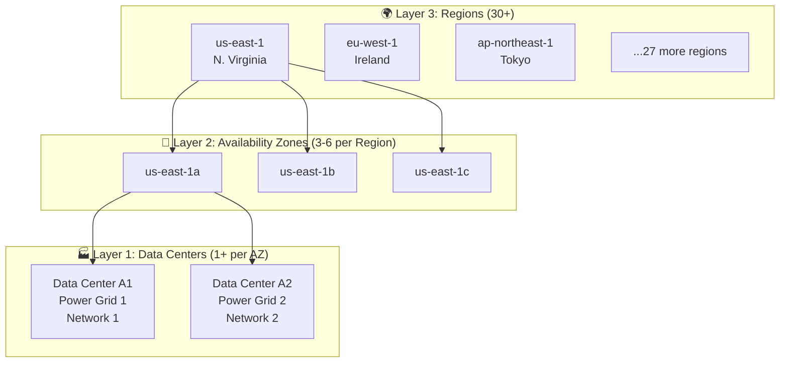
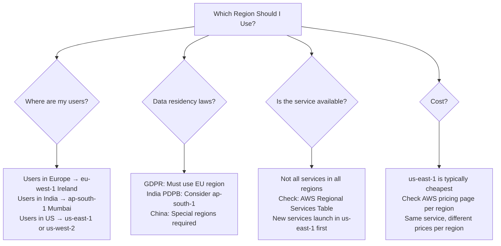
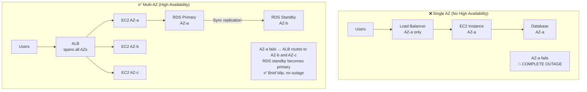
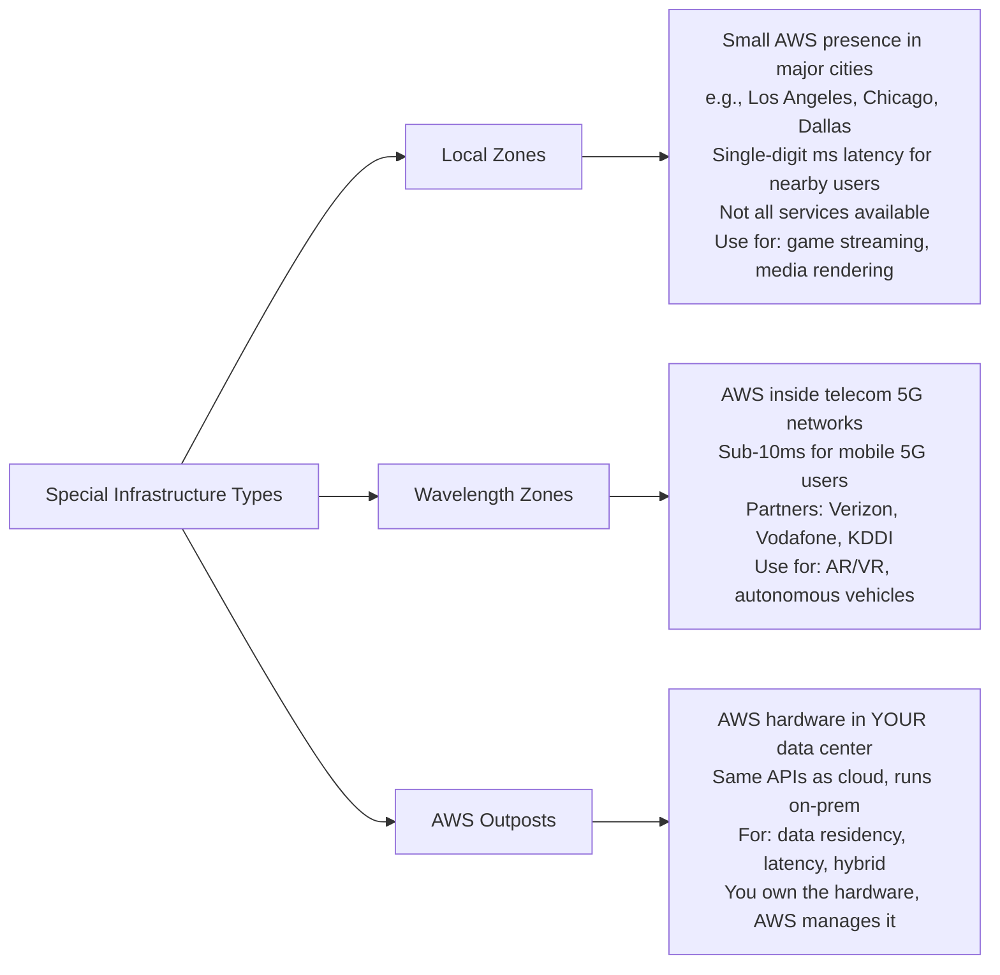
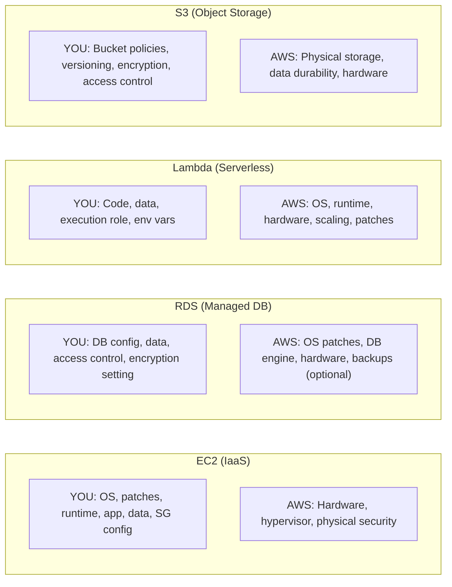

# Stage 02 — AWS Global Infrastructure

> How AWS spans the entire globe — and why understanding this unlocks every architectural decision you'll ever make.

## 1. Core Intuition

Imagine you're building a food delivery app. You have users in New York, London, and Tokyo. If your server is only in New York:

- New York users get food in 5ms ⚡
- London users wait 150ms 😐
- Tokyo users wait 250ms 😩

What if your server crashes at 2am? Everyone is down.

AWS solves both problems with its **global infrastructure**: data centers spread across the world, organized so that failure in one location doesn't take down the whole system.

## 2. The Three-Layer Infrastructure



## 3. Story-Based Analogy — The City Network

```
Think of AWS like a network of cities (Regions) around the world.

🌍 Region = A City (e.g., New York, London, Tokyo)
   Each city is completely self-sufficient.
   A storm in New York doesn't affect London.

🏘️ Availability Zone = A Neighborhood in the city
   New York has: Manhattan (AZ-a), Brooklyn (AZ-b), Queens (AZ-c)
   Each neighborhood has its OWN power grid, OWN water supply.
   If Brooklyn floods, Manhattan and Queens still work.
   The neighborhoods are close enough for fast travel (low latency),
   but far enough to be isolated from each other's disasters.

🏪 Data Center = A Building in the neighborhood
   Multiple buildings per neighborhood.

🛣️ AWS Backbone Network = The highway system between cities
   Private, high-speed, fiber-optic highways.
   No public internet — dedicated AWS lines.

📡 Edge Locations = Small delivery depots in hundreds of cities
   Not full data centers. Just cache-servers.
   Purpose: deliver content to users FAST from a nearby location.
```

## 4. AWS Regions

### What Is a Region?

A **Region** is an independent geographic area where AWS has built a cluster of data centers. Each region is completely isolated from others.

```
Current AWS Regions (2024–2025):

🇺🇸 United States:
  us-east-1     N. Virginia    ← Most services, cheapest, oldest
  us-east-2     Ohio
  us-west-1     N. California
  us-west-2     Oregon

🇪🇺 Europe:
  eu-west-1     Ireland
  eu-west-2     London
  eu-west-3     Paris
  eu-central-1  Frankfurt
  eu-north-1    Stockholm
  eu-south-1    Milan

🌏 Asia Pacific:
  ap-south-1       Mumbai
  ap-southeast-1   Singapore
  ap-southeast-2   Sydney
  ap-northeast-1   Tokyo
  ap-northeast-2   Seoul
  ap-northeast-3   Osaka

🌎 Other:
  sa-east-1     São Paulo
  ca-central-1  Canada (Central)
  me-south-1    Bahrain
  me-central-1  UAE
  af-south-1    Cape Town
  ap-east-1     Hong Kong
  il-central-1  Israel (new 2023)
  mx-central-1  Mexico (new 2024)
```

### How to Choose a Region



**Console Tip:** In the AWS Console, you'll see a region selector in the **top-right corner**. Always check which region you're in before launching resources!

```
Top-right of AWS Console:
[ Ohio ▼ ]   ← This is your current region
              ← Click to switch regions
```

## 5. Availability Zones (AZs)

### What Is an AZ?

An AZ is one or more **physically separate data centers** within a region. They're designed so that a fire, flood, power outage, or earthquake that hits one AZ doesn't affect the others.

```
Region: us-east-1 (N. Virginia)
━━━━━━━━━━━━━━━━━━━━━━━━━━━━━━━━━━━━━━━━━━━━━━━
    AZ: us-east-1a          AZ: us-east-1b         AZ: us-east-1c
  ┌──────────────────┐    ┌──────────────────┐    ┌──────────────────┐
  │ Data Centers A   │    │ Data Centers B   │    │ Data Centers C   │
  │                  │    │                  │    │                  │
  │ Power: Grid 1    │    │ Power: Grid 2    │    │ Power: Grid 3    │
  │ Network: Fiber A │    │ Network: Fiber B │    │ Network: Fiber C │
  │ Cooling: System1 │    │ Cooling: System2 │    │ Cooling: System3 │
  └────────┬─────────┘    └────────┬─────────┘    └────────┬─────────┘
           │                       │                       │
           └───────────────────────┴───────────────────────┘
                     Low-latency private fiber
                     (< 1ms latency between AZs)
━━━━━━━━━━━━━━━━━━━━━━━━━━━━━━━━━━━━━━━━━━━━━━━
```

### Why Multiple AZs Matter



**Rule:** Always deploy across **at least 2 AZs** for any production workload.

### AZ Naming

The same letter doesn't mean the same physical location across accounts. AWS randomizes AZ mapping per account:

```
Account A:  us-east-1a = Physical zone 4
Account B:  us-east-1a = Physical zone 7

This prevents everyone from choosing "AZ-a" and overloading one zone.
Use the AZ ID (use1-az4, use1-az6) for coordination across accounts.
```

## 6. Edge Locations & CloudFront Network

### What Are Edge Locations?

```
Without Edge Location:
━━━━━━━━━━━━━━━━━━━━━
User in Mumbai → Request → Server in us-east-1 (Virginia)
                            ≈ 200ms round trip (crossing oceans)

With CloudFront Edge Location:
━━━━━━━━━━━━━━━━━━━━━━━━━━━━━━
User in Mumbai → Request → Edge Location in Mumbai
                            ≈ 5ms (same city!)

How it works:
  1. User requests a video from Netflix (on CloudFront)
  2. CloudFront checks if video is cached at Mumbai edge
  3. YES → Serve from Mumbai edge. 5ms latency. ✅
  4. NO  → Fetch from origin (Virginia), cache at Mumbai.
           Next user gets it from Mumbai. 5ms. ✅
```

```
AWS Edge Infrastructure (2024):
  400+ Edge Locations
  13 Regional Edge Caches (between origin and edge)

Countries with edge locations: 90+ countries
All major cities: New York, London, Tokyo, Mumbai, Singapore,
                  Sydney, Frankfurt, São Paulo, Toronto, Seoul...
```

## 7. Global Services vs Regional Services

Not all AWS services exist per region. Some are truly global:

```
🌍 Global Services (no region selection needed):
  IAM               Users, roles, policies — one global identity
  Route 53          DNS — global by nature
  CloudFront        CDN — uses edge locations worldwide
  WAF (when with CloudFront) → global
  AWS Organizations → global account management

🏢 Regional Services (choose your region):
  EC2               Instances in one region
  S3                Buckets in one region (but globally unique names)
  RDS               Database in one AZ or multi-AZ within one region
  Lambda            Functions per region
  VPC               Virtual network per region
  ECS/EKS           Container clusters per region
  DynamoDB          Tables per region (Global Tables = cross-region)

In the AWS Console:
  • Global services: no region dropdown shown (or shows "Global")
  • Regional services: always check the region dropdown top-right
```

## 8. Local Zones, Wavelength & Outposts

For special ultra-low latency use cases:



## 9. The Shared Responsibility Model

This is one of the most important concepts in all of AWS. Understand it deeply.

```
┌─────────────────────────────────────────────────────────────┐
│              SHARED RESPONSIBILITY MODEL                    │
├─────────────────────────────────────────────────────────────┤
│                                                             │
│  YOU (Customer) are responsible for:                       │
│  ┌────────────────────────────────────────────────────┐    │
│  │ • Your application code and logic                 │    │
│  │ • Your data (encrypt it? back it up?)             │    │
│  │ • IAM users, roles, and policies                  │    │
│  │ • OS patches on EC2 instances                     │    │
│  │ • Security Group and NACL configuration           │    │
│  │ • Enabling encryption on EBS/S3/RDS               │    │
│  │ • Client-side data encryption                     │    │
│  └────────────────────────────────────────────────────┘    │
│                                                             │
│  AWS is responsible for:                                   │
│  ┌────────────────────────────────────────────────────┐    │
│  │ • Physical data center security (guards, locks)   │    │
│  │ • Physical hardware (servers, routers, switches)  │    │
│  │ • Global network infrastructure                   │    │
│  │ • Hypervisor and virtualization layer             │    │
│  │ • Managed service software (e.g., RDS DB engine)  │    │
│  │ • Compliance certifications for physical infra    │    │
│  └────────────────────────────────────────────────────┘    │
└─────────────────────────────────────────────────────────────┘
```

### How It Changes by Service Type



**Memory trick:** The more managed the service → AWS owns more → you own less (but still own your DATA).

## 10. High Availability vs Fault Tolerance vs Disaster Recovery

```
High Availability (HA):
  Definition: System remains UP even when individual components fail.
  How: Multi-AZ deployment, load balancing, health checks
  RTO: Minutes (brief interruption during failover)
  Cost: Moderate (2-3x the resources)
  Example: RDS Multi-AZ — if primary AZ fails, standby
           promotes to primary in ~60 seconds

Fault Tolerance:
  Definition: System continues with ZERO interruption.
  How: Active-active redundancy in all components
  RTO: ~0 seconds
  Cost: High (full duplicate capacity)
  Example: Active-active multi-AZ with no failover needed.
           Both instances serve traffic simultaneously.

Disaster Recovery (DR):
  Definition: Recovery from catastrophic failure (region goes down).
  Strategies (from cheapest/slowest to most expensive/fastest):

  ┌──────────────────┬──────────┬──────────┬───────────────────────┐
  │ Strategy         │ RTO      │ RPO      │ Cost                  │
  ├──────────────────┼──────────┼──────────┼───────────────────────┤
  │ Backup & Restore │ Hours    │ Hours    │ $ (cheapest)          │
  │ Pilot Light      │ 10 min   │ Minutes  │ $$ (minimal replica)  │
  │ Warm Standby     │ Minutes  │ Seconds  │ $$$ (scaled-down copy)│
  │ Active-Active    │ Seconds  │ ~0       │ $$$$ (full duplicate) │
  └──────────────────┴──────────┴──────────┴───────────────────────┘

RTO = Recovery Time Objective (how long to recover)
RPO = Recovery Point Objective (how much data you can lose)
```

## 11. Console Walkthrough — Exploring Regions

```
🖥️ AWS Console Experience:

1. Log into AWS Console at console.aws.amazon.com

2. Look at the TOP-RIGHT corner of the screen.
   You'll see something like: [N. Virginia ▼] or [us-east-1]
   This is your currently selected region.

3. Click the region dropdown.
   You'll see ALL available regions listed.
   Switch to "ap-south-1 (Mumbai)" and notice that any EC2
   instances you see are now showing Mumbai instances.

4. Try going to: EC2 → Instances
   You'll see "No instances in this region" (unless you have one in Mumbai).
   Switch back to us-east-1 and your instances appear again.

⚠️ This is the #1 beginner mistake: "Where did my EC2 go?!"
   Answer: You switched regions. Switch back.

5. Some services don't change with region:
   Go to IAM → No region dropdown shown at all.
   IAM is global — same users across all regions.
```

## 12. Common Mistakes

```
❌ Not checking which region you're in
   → Launched EC2 in eu-west-1 by mistake, can't find it in us-east-1
   ✅ Always verify the region dropdown before launching resources

❌ Assuming Multi-AZ is the same as Multi-Region
   → Multi-AZ protects against AZ failure (data center outage)
   → Multi-Region protects against full region failure
   → They solve different problems at different cost points

❌ Using edge locations as compute (they're not)
   → Edge locations only cache content (CloudFront)
   → Lambda@Edge and CloudFront Functions can run logic there,
      but they're not full compute environments

❌ Ignoring shared responsibility
   → "AWS is secure, so I don't need to worry about security"
   → AWS secures the hardware. YOU must secure your code, data, access.

❌ Deploying everything in one region without a DR plan
   → What happens if us-east-1 has a major outage?
   → For mission-critical apps: plan for cross-region failover
```

## 13. Interview Perspective

**Q: What is the difference between a Region and an Availability Zone?**
A Region is a physical geographic area containing multiple AZs (e.g., us-east-1 = Northern Virginia). An AZ is an isolated data center cluster within that region with independent power, cooling, and networking. Regions are for geographic isolation and compliance. AZs are for high availability within a region.

**Q: If you deploy your app in a single AZ and that AZ fails, what happens?**
Your application goes down. This is why you should always deploy across at least 2 AZs using Load Balancers + Auto Scaling Groups, or Multi-AZ RDS. Single-AZ is never appropriate for production.

**Q: What is the difference between high availability and fault tolerance?**
High availability (HA) means the system stays UP even during component failures, but there may be a brief failover period (seconds to minutes). Fault tolerance means zero interruption — the system continues perfectly even as components fail. Fault tolerance requires more redundancy and costs more (e.g., active-active setup).

**Q: What are edge locations used for?**
Edge locations are part of CloudFront's CDN network (~400 locations globally). They cache static content close to users to reduce latency. They also run Route 53 DNS and can run Lambda@Edge and CloudFront Functions for edge compute. They are NOT full AWS regions — they don't run EC2 or most AWS services.

## 14. Mini Exercise

```
✍️ Exercise 1: Region Exploration
   1. Log into AWS Console
   2. Check top-right: what region are you in?
   3. Switch to 5 different regions
   4. Note which services look different per region
   5. Try: ap-southeast-1 (Singapore) — are some services missing vs us-east-1?

✍️ Exercise 2: Latency Test
   1. Go to: cloudpingtest.com
   2. Find the 3 AWS regions with lowest ping from your location
   3. These are your best regions for user-facing apps

✍️ Exercise 3: AZ Exploration
   1. Go to EC2 → Instances → Launch Instance
   2. Look at the "Subnet" or "AZ" dropdown
   3. How many AZs are available in us-east-1?
   4. Cancel — don't actually launch

✍️ Exercise 4: Shared Responsibility Reflection
   For each scenario, decide: AWS responsibility or Customer responsibility?
   a) An EC2 instance's OS has an unpatched vulnerability
   b) AWS's physical data center gets broken into
   c) An S3 bucket is publicly accessible with sensitive data
   d) A DynamoDB table is accidentally deleted
   e) The RDS database engine has a security CVE
```

---

**[🏠 Back to README](../README.md)**

**Prev:** [← Cloud Foundations](../01_cloud_foundations/theory.md) &nbsp;|&nbsp; **Next:** [EC2 →](../03_compute/ec2.md)

**Related Topics:** [Cloud Foundations](../01_cloud_foundations/theory.md) · [VPC Networking](../05_networking/vpc.md) · [Route 53 & CloudFront](../05_networking/route53_cloudfront.md) · [IAM](../06_security/iam.md)
