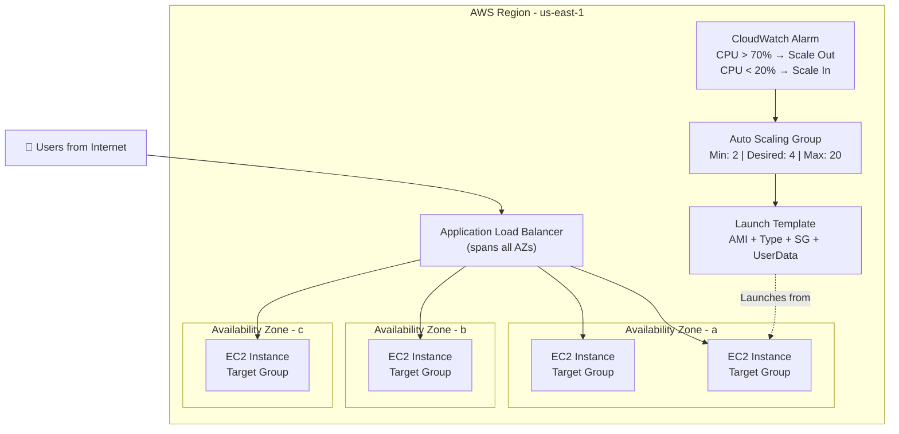
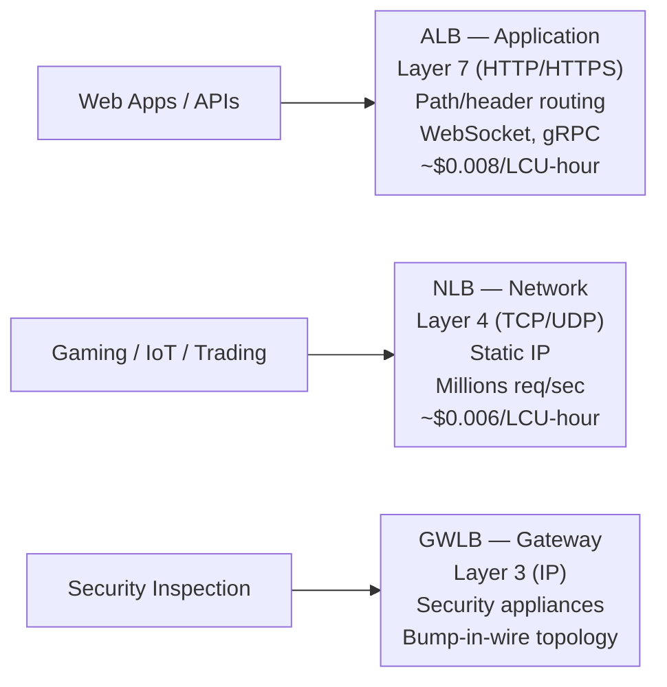
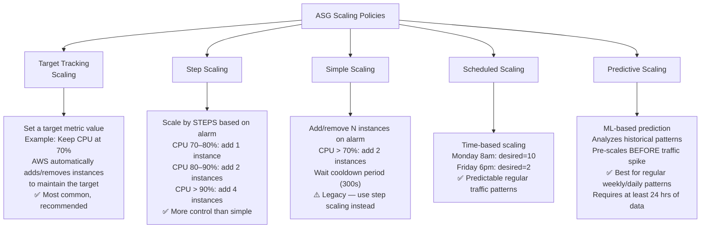

# Stage 03b — Auto Scaling & Load Balancing

> How AWS automatically adjusts your server capacity and distributes traffic — the backbone of any scalable, highly available application.

## 1. Core Intuition

Imagine you run a pizza restaurant. On a quiet Tuesday, you need 2 chefs. On Super Bowl Sunday, you need 20 chefs. If you hire 20 chefs for every day, you're wasting money. If you hire 2, Super Bowl Sunday is a disaster.

**Auto Scaling** = Automatically hiring and firing chefs based on how busy the restaurant is.

**Load Balancing** = The front-of-house manager who distributes customers across all available chefs, so none of them gets overwhelmed while others stand idle.

Together, they give you: **scalability** (handle any load) + **high availability** (no single point of failure).

## 2. The Problem They Solve

```
Without Auto Scaling + Load Balancing:
━━━━━━━━━━━━━━━━━━━━━━━━━━━━━━━━━━━━━
• One EC2 instance handles all traffic
• Traffic spike → instance overloaded → site crashes
• One AZ → AZ failure → complete outage
• Manual scaling → slow, error-prone, expensive

With Auto Scaling + Load Balancing:
━━━━━━━━━━━━━━━━━━━━━━━━━━━━━━━━━━━
• Traffic distributed across multiple instances
• Spike → more instances launch automatically in 2 min
• Quiet time → extra instances terminate, save money
• AZ failure → ALB routes to other AZs automatically
• Zero manual intervention needed
```

## 3. Architecture Overview



## 4. Load Balancers — Three Types

### Application Load Balancer (ALB) — Layer 7

```
ALB understands HTTP/HTTPS. It can route based on:
  • URL path: /api/* → backend servers, /images/* → S3
  • HTTP headers: X-Version: v2 → new backend
  • Query strings: ?env=beta → beta instances
  • HTTP method: POST → write service, GET → read service
  • Host header: api.example.com → API service, app.example.com → web

Best for:
  ✅ Web applications and REST APIs
  ✅ Microservices routing (one ALB, many services)
  ✅ WebSocket support
  ✅ gRPC support
  ✅ User authentication with Cognito or OIDC

Console: EC2 → Load Balancers → Create → Application Load Balancer
```

### Network Load Balancer (NLB) — Layer 4

```
NLB operates at TCP/UDP level. Ultra-high performance.

Key capabilities:
  • Millions of requests per second
  • Sub-millisecond latency
  • Static IP per AZ (useful for whitelisting)
  • Preserves client IP address
  • Handles TCP, UDP, TLS

Best for:
  ✅ Gaming servers (UDP)
  ✅ IoT devices
  ✅ Real-time trading systems
  ✅ When you need a static IP
  ✅ Very high throughput, low latency

Console: EC2 → Load Balancers → Create → Network Load Balancer
```

### Gateway Load Balancer (GWLB) — Layer 3

```
New service for deploying virtual network appliances:
  • 3rd party firewalls (Palo Alto, Fortinet)
  • Intrusion detection systems
  • Deep packet inspection

Best for:
  ✅ Centralized network security inspection
  ✅ Enterprise security appliance deployment
```

### Comparison



## 5. ALB Deep Dive — How It Works

### Components

```
ALB
├── Listeners
│   ├── HTTP :80  → Redirect to HTTPS
│   └── HTTPS :443 → Rules → Target Groups
│
├── Rules (evaluated top-to-bottom)
│   ├── Rule 1: Path = /api/*   → Target Group: API-Servers
│   ├── Rule 2: Path = /admin/* → Target Group: Admin-Servers
│   └── Default: Forward to    → Target Group: Web-Servers
│
└── Target Groups
    ├── Web-Servers: [EC2-1, EC2-2, EC2-3]  ← round-robin distribution
    ├── API-Servers: [EC2-4, EC2-5]
    └── Admin-Servers: [EC2-6]
```

### Health Checks

```
ALB continuously checks: "Is each instance healthy?"

Health Check Config:
  Protocol: HTTP
  Path: /health  ← Your app must return 200 OK on this path
  Interval: 30 seconds
  Healthy threshold: 2 (2 consecutive passes = healthy)
  Unhealthy threshold: 3 (3 consecutive fails = unhealthy)

If instance fails health check:
  → ALB stops sending it traffic
  → Auto Scaling Group replaces it with a new instance
  → Users never see the failure
```

### Sticky Sessions

```
Normal behavior: Each request goes to ANY healthy instance
Sticky Sessions: Same user ALWAYS goes to same instance

Use for:
  ✅ Legacy apps that store session data in server memory
  ❌ Avoid for modern apps — store sessions in ElastiCache Redis instead

Console: Target Group → Edit Attributes → Stickiness
Types:
  LB-generated cookie (AWSALB): ALB manages the cookie
  Application cookie: Your app's own session cookie
```

## 6. Auto Scaling Groups (ASG)

### What Is an ASG?

```
Auto Scaling Group = A fleet manager for your EC2 instances

You define:
  Minimum capacity: 2   ← Never drop below this
  Desired capacity: 4   ← Target number of instances
  Maximum capacity: 20  ← Never exceed this

  Launch Template: which AMI, instance type, SG to use
  AZs: us-east-1a, us-east-1b, us-east-1c (spread evenly)
  ALB Target Group: register new instances here automatically

The ASG automatically:
  ✅ Launches instances when needed
  ✅ Terminates instances when not needed
  ✅ Replaces unhealthy instances
  ✅ Distributes instances across AZs
  ✅ Registers/deregisters instances with ALB
```

### Scaling Policies



### How Scale-Out Works (Step by Step)

```
1. Your web app gets a sudden traffic spike
   CPU goes from 40% → 85%

2. CloudWatch detects CPU alarm threshold exceeded
   Alarm: "CPUUtilization > 70% for 2 consecutive minutes"

3. CloudWatch fires alarm → ASG triggered

4. ASG checks: desired capacity = 4, max = 20 → can add more

5. ASG selects the AZ with fewest instances (for balance)

6. ASG launches new EC2 from Launch Template:
   • Instance boots
   • User Data script runs (install deps, start app)
   • Takes ~2-3 minutes for a fresh instance

7. New instance registers with ALB Target Group

8. ALB health check passes (2 consecutive 200 OK)

9. ALB starts routing traffic to new instance

10. Load distributed → CPU drops back below 70%

11. Alarm resets

12. Later: traffic drops → scale-in → instance terminated
    (but connections drain first — connection draining, 30s default)
```

### Instance Termination Policy

```
When scaling IN (removing instances), which one dies first?

Default Policy Order:
1. AZ with the most instances (for balance)
2. In that AZ: instance with the oldest launch configuration
3. Tie-break: closest to billing hour

This ensures:
  ✅ AZs stay balanced
  ✅ Older (potentially outdated) instances replaced first
```

## 7. Launch Templates (vs Launch Configurations)

```
Always use Launch Templates — Launch Configurations are legacy.

Launch Template lets you define:
  ✅ AMI
  ✅ Instance type (can specify multiple types)
  ✅ Key pair
  ✅ Security groups
  ✅ User data
  ✅ IAM instance profile (role)
  ✅ EBS volumes
  ✅ Network interfaces
  ✅ Tags

Versions:
  v1: initial setup
  v2: updated with new AMI or user data
  Set default version → ASG uses it for new launches

Mixed Instances Policy:
  ASG can use MULTIPLE instance types for cost optimization:
  70% On-Demand m5.xlarge (reserved)
  30% Spot m5.xlarge, c5.xlarge, m4.xlarge (cheapest available)
```

## 8. Console Walkthrough — Create ALB + ASG

```
Step 1: Create a Launch Template
━━━━━━━━━━━━━━━━━━━━━━━━━━━━━━━
EC2 → Launch Templates → Create launch template

  Name: web-server-template
  AMI: Amazon Linux 2023 (or your custom Golden AMI)
  Instance type: t3.medium
  Key pair: your existing key pair
  Security group: web-sg (allow HTTP 80 from ALB security group)
  IAM instance profile: ec2-web-role (if your app needs AWS APIs)
  User data: your bootstrap script

━━━━━━━━━━━━━━━━━━━━━━━━━━━━━━━━━━━━━━━━━━━━━━━━━

Step 2: Create Target Group
━━━━━━━━━━━━━━━━━━━━━━━━━━━
EC2 → Target Groups → Create target group

  Target type: Instances
  Name: web-servers-tg
  Protocol: HTTP, Port: 80
  VPC: your VPC
  Health check:
    Protocol: HTTP
    Path: /health
    Healthy threshold: 2
    Interval: 30 seconds

━━━━━━━━━━━━━━━━━━━━━━━━━━━━━━━━━━━━━━━━━━━━━━━━━

Step 3: Create Application Load Balancer
━━━━━━━━━━━━━━━━━━━━━━━━━━━━━━━━━━━━━━━━
EC2 → Load Balancers → Create → Application Load Balancer

  Name: web-alb
  Scheme: Internet-facing
  IP type: IPv4
  Network mapping: Select all 3 AZs + public subnets
  Security group: alb-sg (allow HTTP/HTTPS from internet)
  Listener: HTTP :80 → Forward to web-servers-tg

━━━━━━━━━━━━━━━━━━━━━━━━━━━━━━━━━━━━━━━━━━━━━━━━━

Step 4: Create Auto Scaling Group
━━━━━━━━━━━━━━━━━━━━━━━━━━━━━━━━━
EC2 → Auto Scaling Groups → Create

  Name: web-asg
  Launch template: web-server-template (latest version)
  Network: VPC + all 3 AZs (public subnets)
  Load balancing: Attach to existing ALB → web-servers-tg
  Health check:
    EC2 health check: ✅
    ELB health check: ✅ (use ALB health checks too)
  Capacity:
    Minimum: 2
    Desired: 2
    Maximum: 10
  Scaling policies:
    Target tracking → Average CPU utilization → 70%
  Notifications: (optional) email on scale events
```

## 9. Connection Draining / Deregistration Delay

```
Problem:
  User starts a file upload to EC2-instance-1
  ASG decides to terminate EC2-instance-1 (scale in)
  Upload connection is cut → User gets error

Solution: Connection Draining (Deregistration Delay)

When instance is marked for termination:
  1. ALB STOPS sending NEW requests to this instance
  2. ALB WAITS for existing connections to finish
  3. Default wait: 300 seconds (5 minutes)
  4. After wait: instance terminates

Configure in Target Group:
  EC2 → Target Groups → Your TG → Attributes
  Deregistration delay: 30 (for fast-response apps)
                         300 (default — for longer requests)
                         0 (if you want immediate termination)
```

## 10. HTTPS / SSL on ALB

```
Production apps MUST use HTTPS. Here's how:

Step 1: Get an SSL certificate
  Option A: AWS Certificate Manager (ACM) — FREE for ALB/CloudFront
    Console: Certificate Manager → Request certificate
    Add domains: example.com, *.example.com
    Validation: DNS (add CNAME record) → auto-renewal

  Option B: Import your own certificate (paid/self-signed)

Step 2: Add HTTPS listener to ALB
  EC2 → Load Balancers → Your ALB → Listeners
  Add listener → HTTPS :443
  Certificate: Select from ACM
  Default action: Forward to your target group

Step 3: Redirect HTTP to HTTPS
  HTTP :80 listener → Default action: Redirect to HTTPS :443
  Users who type http:// → auto-redirected to https://

Security Policy: ELBSecurityPolicy-TLS13-1-2-2021-06
  (Enables TLS 1.2 + 1.3, disables old vulnerable TLS versions)
```

## 11. Trade-offs and Limitations

| Feature | Trade-off |
|---------|-----------|
| Auto Scaling elasticity | Cold start time (2–5 min) — use pre-warm or warm pools |
| ALB path routing | Adds ~1ms per request latency |
| Target Tracking | May over-scale slightly (conservative) |
| Connection Draining | Delays instance termination (could be slow for scale-in) |
| ASG across AZs | Traffic is distributed — if AZ traffic is uneven, some AZs may be hot |

## 12. Common Mistakes

```
❌ Setting minimum capacity to 0
   → Application goes completely down during scale-in
   ✅ Minimum should be at least 2 (across 2+ AZs)

❌ Not waiting for health checks before deleting old instances
   → New instances not ready, traffic drops
   ✅ ASG waits for ALB health check pass automatically — but ensure
      your app starts up fast (or increase health check thresholds)

❌ Using the same security group for ALB and EC2
   → Defeats the purpose of security group separation
   ✅ ALB-SG: allow HTTP/HTTPS from internet
      EC2-SG: allow HTTP only from ALB-SG (not from internet directly)

❌ Not enabling ELB health checks on ASG
   → ASG only checks EC2 status (server on/off) not application health
   ✅ Enable both EC2 AND ELB health checks in ASG

❌ Using Launch Configurations (deprecated)
   ✅ Always use Launch Templates — more features, still actively developed
```

## 13. Interview Perspective

**Q: What is the difference between an ALB and an NLB?**
ALB operates at Layer 7 (HTTP/HTTPS) and can route based on URL path, headers, query strings. It's for web apps and REST APIs. NLB operates at Layer 4 (TCP/UDP), handles millions of requests/second with sub-ms latency, and provides a static IP. Use ALB for web apps; NLB for gaming, IoT, or when a static IP is required.

**Q: How does Auto Scaling handle an AZ failure?**
When an AZ fails, the instances in that AZ fail their health checks. The ALB stops routing to them. The ASG sees it's below minimum/desired capacity and launches replacement instances in the remaining healthy AZs. This is why you set ASG to span multiple AZs.

**Q: What is connection draining?**
Connection draining (called Deregistration Delay in ALB target groups) ensures that when an instance is being terminated, the load balancer stops sending it new requests but waits for in-flight requests to complete (default 300 seconds). This prevents users from getting mid-request errors during scale-in events.

**Q: What is the difference between target tracking and step scaling?**
Target tracking: you set a target value for a metric (e.g., CPU = 70%) and AWS automatically adjusts capacity to maintain it. Simplest to configure, AWS manages the math. Step scaling: you define explicit steps — if CPU > 70% add 1, if > 85% add 3, if > 95% add 5. More granular control but more configuration.

## 14. Mini Exercise

```
✍️ Hands-On Exercise:

1. Create a Launch Template with:
   • AMI: Amazon Linux 2023
   • Type: t3.micro
   • User data: Install nginx, write index.html showing instance ID

2. Create an ALB:
   • Internet-facing
   • Span 2+ AZs
   • Target group with HTTP health check on /

3. Create an Auto Scaling Group:
   • Min: 2, Desired: 2, Max: 5
   • Attach to your ALB target group
   • Target tracking: CPU 70%
   • Span at least 2 AZs

4. Verify:
   • Wait for 2 instances to pass health checks
   • Visit ALB DNS name in browser (EC2 → Load Balancers → DNS name)
   • Refresh multiple times — see different Instance IDs (round robin!)

5. Simulate scale-out:
   • SSH into one instance
   • Run: stress --cpu 2 --timeout 300
   (Install: sudo dnf install stress)
   • Watch ASG launch a new instance in the console

6. Clean up:
   • Delete ASG (instances terminate automatically)
   • Delete ALB
   • Delete Target Group
   • Delete Launch Template
```

---

**[🏠 Back to README](../README.md)**

**Prev:** [← EC2](../03_compute/ec2.md) &nbsp;|&nbsp; **Next:** [Elastic Beanstalk →](../03_compute/elastic_beanstalk.md)

**Related Topics:** [EC2](../03_compute/ec2.md) · [CloudWatch & Observability](../08_monitoring/cloudwatch.md) · [ECS](../10_containers/ecs.md) · [High Availability](../14_architecture/high_availability.md)
