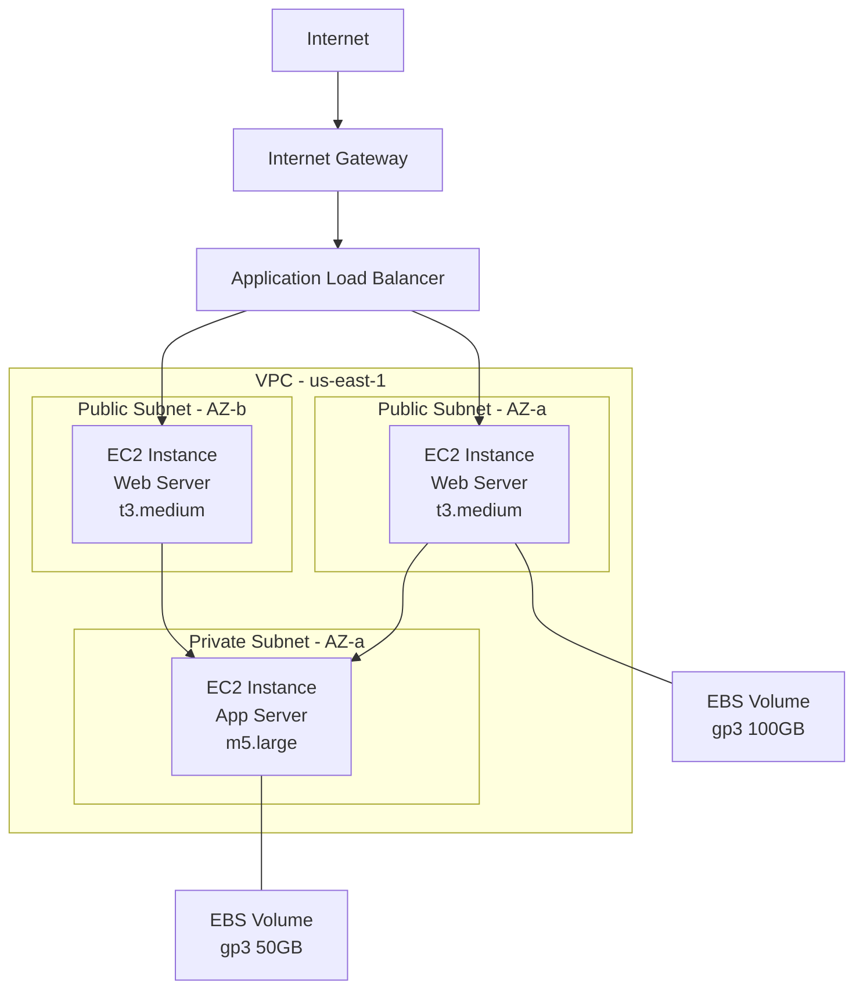
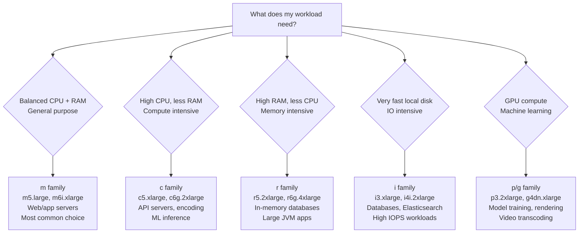
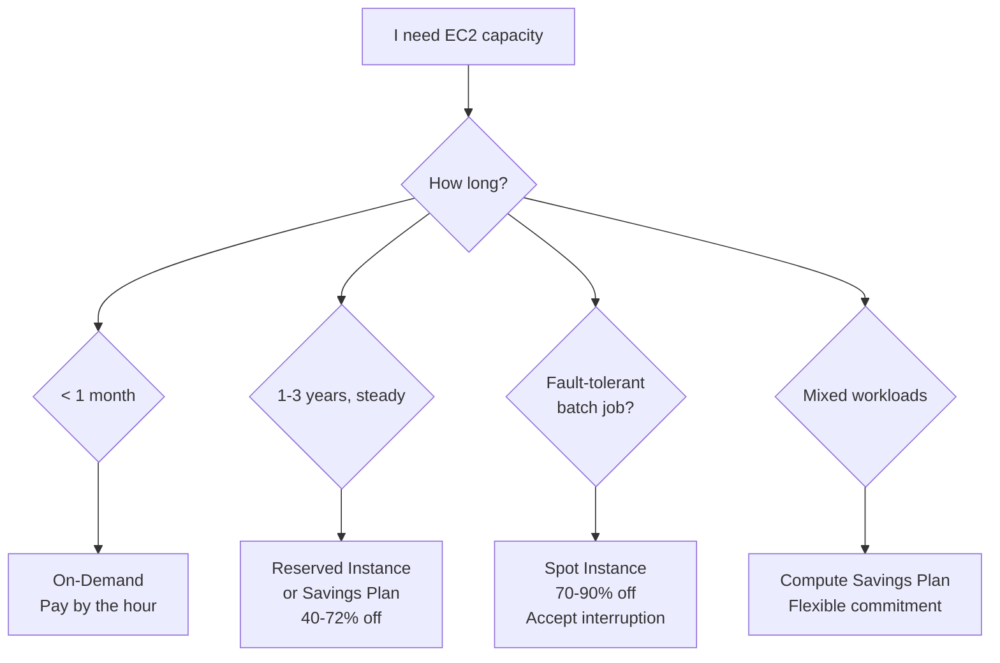
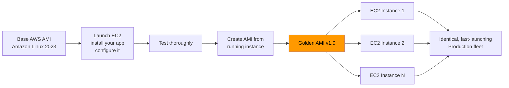
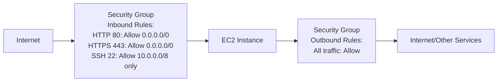
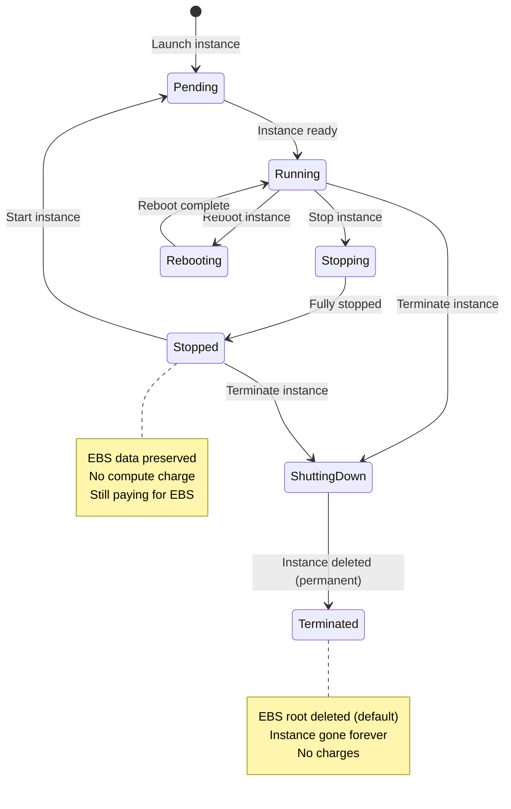

# Stage 03a — EC2: Elastic Compute Cloud

> Your first virtual machine in the cloud. The backbone of AWS compute.

## 1. Core Intuition

Before AWS, running an application meant buying a physical server, setting it up in a data center, and hoping it had enough capacity. EC2 (Elastic Compute Cloud) replaces all of that with a **virtual machine you can launch in 60 seconds**.

EC2 is the **most fundamental AWS compute service**. Even many "managed" AWS services (like RDS, EMR, Elastic Beanstalk) run EC2 underneath — AWS just manages it for you.

## 2. The Problem EC2 Solves

```
Traditional Server Problem:
━━━━━━━━━━━━━━━━━━━━━━━━━━
• Buy hardware: 6-8 weeks wait
• Fixed capacity: either too much or too little
• Geographic limits: your server is in ONE place
• Maintenance: your team patches it, replaces disks
• Wasted money: running at 10% capacity most of the time

EC2 Solution:
━━━━━━━━━━━━━
• Launch in 60 seconds
• Change capacity anytime (stop → resize → start)
• Available in 30+ regions worldwide
• AWS maintains hardware, hypervisor, physical security
• Pay per second — pay nothing when it's off
```

## 3. Story-Based Analogy — The Rented Factory

```
🏭 Think of EC2 as renting a factory:

Your Factory Choices:
━━━━━━━━━━━━━━━━━━━━
AMI         = The blueprint/design for your factory
              (what OS, what software is pre-installed)

Instance Type = The factory size
              t3.micro  = A small workshop (2 vCPU, 1GB RAM)
              m5.xlarge = A medium factory (4 vCPU, 16GB RAM)
              c5.4xlarge = A large specialized compute factory

Key Pair    = Your factory door key (to SSH in)

Security Group = The security guard at the gate
              Who can enter? (inbound rules)
              Who can exit? (outbound rules)

EBS Volume  = The warehouse attached to the factory
              (persistent storage that survives power outage)

Instance Store = Workbench inside the factory
              (super-fast, but everything disappears at night)

Elastic IP  = The factory's permanent address
              (even if you rebuild the factory, same address)

Pricing Models:
━━━━━━━━━━━━━━━
On-Demand  = Rent daily (no commitment, most expensive)
Reserved   = 1-year lease (commit upfront, up to 72% off)
Spot       = Rent idle factories at auction (cheapest, can be taken back)
```

## 4. Visual Architecture



## 5. Instance Types — Choosing the Right Size

### Naming Convention

```
Instance name:  c6g.2xlarge
                │││ └── Size
                ││└──── Generation (6 = newer, better value)
                │└───── Modifier (g = Graviton/ARM processor)
                └────── Family (c = compute optimized)

Sizes from smallest to largest:
nano < micro < small < medium < large < xlarge < 2xlarge < 4xlarge
< 8xlarge < 12xlarge < 16xlarge < 24xlarge < 32xlarge < 48xlarge
```

### Family Guide (Which Family to Choose)



### Special: Burstable Instances (t family)

```
t3.micro, t3.small, t3.medium, t4g.small...

How T instances work:
━━━━━━━━━━━━━━━━━━━━
• They earn CPU credits over time when idle
• Credits are spent during CPU spikes
• Perfect for variable workloads

Example: A blog running on t3.small
  • Idle most of time: earns credits
  • Someone posts a viral article → CPU spikes → uses credits
  • Returns to idle → earns credits again

Standard mode: Out of credits = throttled to baseline (20-30% CPU)
Unlimited mode: Out of credits = can burst, charged extra for burst time

Use t instances for:
  ✅ Dev/test environments
  ✅ Low-traffic websites
  ✅ Microservices with low average CPU

Avoid for:
  ❌ Sustained high CPU workloads (use c or m family)
```

### Graviton (ARM) — Cost Optimization

```
Graviton (AWS-designed ARM chip) vs Intel/AMD (x86):

Performance: Equal or better on most workloads
Cost savings: 20-40% cheaper for same performance

Naming:
  c6g, m6g, r6g, t4g = Graviton 2 (2020)
  c7g, m7g, r7g       = Graviton 3 (2023) ← Better, use this

Use Graviton when:
  ✅ Linux workloads (99% of cloud apps)
  ✅ Python, Java, Node.js, Go, Rust (all ARM-compatible)
  ✅ Docker containers (multi-arch images)
  ✅ Databases (MySQL, PostgreSQL, Redis)

Skip Graviton when:
  ❌ Windows Server (limited ARM support)
  ❌ Legacy x86-only software
  ❌ Specific CPU instruction set dependencies
```

## 6. EC2 Pricing Deep Dive

### Cost Comparison for m5.xlarge (us-east-1)

```
Pricing Model    │ Hourly   │ Monthly  │ Annually │ Savings
─────────────────┼──────────┼──────────┼──────────┼────────
On-Demand        │ $0.192   │ $140     │ $1,682   │ —
Reserved 1yr (PU)│ $0.120   │ $88      │ $1,051   │ 37%
Reserved 3yr (PU)│ $0.077   │ $56      │ $675     │ 60%
Spot (average)   │ ~$0.058  │ ~$42     │ ~$508    │ ~70%
Graviton (m6g)   │ $0.154   │ $112     │ $1,350   │ 20%

PU = Partial Upfront
```

### Pricing Decision Flowchart



## 7. AMI — Amazon Machine Image

### What Is an AMI?

```
AMI = A frozen snapshot of a server's state

It contains:
  • Root volume snapshot (OS + installed software)
  • Architecture type (x86_64 or arm64)
  • Block device mappings (which volumes to attach at launch)
  • Launch permissions (public/private/account-specific)

Think of it as:
  → A complete blueprint for a factory setup
  → Launch 50 identical servers from the same blueprint
  → All identical, all ready to run your app immediately
```

### Types of AMIs

```
1. AWS-Provided AMIs (most common starting point)
   • Amazon Linux 2023 (free, optimized for AWS)
   • Amazon Linux 2 (older, still widely used)
   • Ubuntu 22.04 LTS (popular, familiar)
   • Windows Server 2022 (Microsoft license cost added)
   • Red Hat Enterprise Linux, SUSE, Debian

   Console: EC2 → Launch Instance → Choose from Quick Start list

2. AWS Marketplace AMIs
   • Third-party software pre-installed
   • Examples: Bitnami WordPress, NGINX Plus, Kali Linux
   • May have hourly software licensing cost on top of EC2 cost

3. Community AMIs
   • Shared by other AWS users
   • Use with caution — verify source

4. Your Custom AMIs (Golden AMIs)
   • Build once, deploy many times
   • Best for production: pre-bake your dependencies
```

### Golden AMI Pattern (Production Best Practice)



**Console Path:** EC2 → Instances → Select Instance → Actions → Image and templates → Create image

## 8. Storage: EBS Volumes

```
EBS = Elastic Block Store
= A network-attached "hard drive" for your EC2 instance

Analogies:
  EBS = USB hard drive plugged in over a fast network
  Instance Store = Drive physically inside the computer (but temporary)

Key Properties:
  ✅ Persists after instance stop/start
  ✅ Snapshots to S3 for backup/recovery
  ✅ Can be detached and re-attached to another EC2
  ✅ Encryption at rest with KMS
  ❌ Lives in ONE AZ (can't move directly to another AZ)
  ❌ Attached to ONE instance at a time (except io2 multi-attach)
```

### EBS Volume Types

```
gp3 (General Purpose SSD) — USE THIS BY DEFAULT
━━━━━━━━━━━━━━━━━━━━━━━━━━━━━━━━━━━━━━━━━━━━━━━
IOPS:       3,000 baseline → up to 16,000 (set independently!)
Throughput: 125 MB/s baseline → up to 1,000 MB/s
Cost:       ~$0.08/GB-month
Best for:   Root volumes, web servers, most databases
Console:    Select "gp3" when adding storage

io2 Block Express (High Performance SSD)
━━━━━━━━━━━━━━━━━━━━━━━━━━━━━━━━━━━━━━━
IOPS:       up to 256,000 IOPS
Latency:    sub-millisecond consistent
Cost:       $0.125/GB-month + $0.065 per provisioned IOPS
Best for:   SAP HANA, Oracle DB, mission-critical databases

st1 (Throughput HDD)
━━━━━━━━━━━━━━━━━━━━
Throughput: up to 500 MB/s
Cost:       $0.045/GB-month (cheaper)
Best for:   Sequential reads: log processing, ETL, Kafka

sc1 (Cold HDD)
━━━━━━━━━━━━━━
Throughput: up to 250 MB/s
Cost:       $0.015/GB-month (cheapest)
Best for:   Archives, infrequently accessed data
```


## 9. Security Groups — The Instance Firewall

### How Security Groups Work



```
Security Group Key Facts:
━━━━━━━━━━━━━━━━━━━━━━━━
✅ STATEFUL: Allow inbound = response automatically allowed outbound
✅ ALLOW rules only (no DENY — use NACLs for subnet-level deny)
✅ Multiple SGs can be attached to one instance
✅ SG rules can reference OTHER security groups (not just IPs)
✅ Changes take effect immediately (no restart needed)
❌ Default: ALL inbound DENIED, ALL outbound ALLOWED

Console: EC2 → Security Groups → Create Security Group
```

### Referencing Security Groups (Production Pattern)

```
Instead of hard-coding IP addresses (which change in auto-scaling):

App Server SG:
  Allow TCP 5432 from  [DB-Security-Group]   ← reference by SG name
                       ↑ Only EC2s IN this SG can connect to DB

DB Security Group:
  Applied to: RDS database
  Allow TCP 5432 from  [App-Security-Group]   ← only app servers

This is dynamic! New app servers launched in auto-scaling
automatically get access to DB because they're in App-Security-Group.
No need to update IPs.
```

## 10. User Data — Bootstrap Scripts

### What Is User Data?

```
User Data = A script that runs ONCE when an EC2 instance first boots

Use it to:
  • Install software (nginx, Python, Node.js, Java)
  • Download your application code from S3
  • Configure the server
  • Register with monitoring agents

Important rules:
  • Runs as ROOT user
  • Runs only on FIRST boot (not on restart)
  • Output logged to: /var/log/cloud-init-output.log
  • Must start with: #!/bin/bash (or cloud-config YAML)
```

### User Data Examples

```bash
#!/bin/bash
# Amazon Linux 2023 — Install and start a web server

# Update all packages
dnf update -y

# Install nginx
dnf install -y nginx

# Start nginx and enable on boot
systemctl start nginx
systemctl enable nginx

# Write a custom index page
INSTANCE_ID=$(curl -s http://169.254.169.254/latest/meta-data/instance-id)
AZ=$(curl -s http://169.254.169.254/latest/meta-data/placement/availability-zone)

cat > /usr/share/nginx/html/index.html << EOF
<h1>Hello from AWS EC2!</h1>
<p>Instance ID: ${INSTANCE_ID}</p>
<p>Availability Zone: ${AZ}</p>
EOF

# Download and run your application
aws s3 cp s3://my-deployment-bucket/myapp.tar.gz /opt/
tar -xzf /opt/myapp.tar.gz -C /opt/myapp/
cd /opt/myapp && ./start.sh
```

**Console Path:** EC2 → Launch Instance → Advanced Details → User data (scroll to bottom)

## 11. Instance Metadata Service

From inside ANY EC2 instance, you can ask "who am I?":

```bash
# First: get a security token (IMDSv2 — the secure way)
TOKEN=$(curl -sX PUT "http://169.254.169.254/latest/api/token" \
  -H "X-aws-ec2-metadata-token-ttl-seconds: 21600")

# Get instance ID
curl -sH "X-aws-ec2-metadata-token: $TOKEN" \
  http://169.254.169.254/latest/meta-data/instance-id
# Output: i-1234567890abcdef0

# Get current AZ
curl -sH "X-aws-ec2-metadata-token: $TOKEN" \
  http://169.254.169.254/latest/meta-data/placement/availability-zone
# Output: us-east-1b

# Get instance type
curl -sH "X-aws-ec2-metadata-token: $TOKEN" \
  http://169.254.169.254/latest/meta-data/instance-type
# Output: t3.medium

# Get IAM role credentials (auto-rotated temporary credentials)
curl -sH "X-aws-ec2-metadata-token: $TOKEN" \
  http://169.254.169.254/latest/meta-data/iam/security-credentials/MyRoleName
# Output: { "AccessKeyId": "ASIA...", "Expiration": "..." }
```

This is how applications running on EC2 access AWS services without hardcoded credentials!

## 12. Launch an EC2 Instance — Console Walkthrough

```
Step-by-Step: Launch Your First EC2 Instance

Navigate to: AWS Console → Services → EC2 → Instances → Launch instances

━━━━━━━━━━━━━━━━━━━━━━━━━━━━━━━━━━━━━━━━━━━━━━━━━━━━━

Step 1: Name and Tags
  Name: "my-first-server"
  (This shows in your instance list)

━━━━━━━━━━━━━━━━━━━━━━━━━━━━━━━━━━━━━━━━━━━━━━━━━━━━━

Step 2: Application and OS Images (AMI)
  Choose: Amazon Linux 2023 AMI (Free tier eligible)
  Architecture: 64-bit (x86)
  ↑ This is your factory blueprint

━━━━━━━━━━━━━━━━━━━━━━━━━━━━━━━━━━━━━━━━━━━━━━━━━━━━━

Step 3: Instance Type
  Choose: t3.micro (Free tier eligible)
  → 2 vCPU, 1 GB RAM
  → Good for learning and dev

━━━━━━━━━━━━━━━━━━━━━━━━━━━━━━━━━━━━━━━━━━━━━━━━━━━━━

Step 4: Key Pair (login)
  → Click "Create new key pair"
  → Name: "my-aws-key"
  → Type: RSA
  → Format: .pem (for Mac/Linux) or .ppk (for PuTTY on Windows)
  → Download the .pem file! Save it somewhere safe.
  ⚠️ This is the ONLY time you can download this key.

━━━━━━━━━━━━━━━━━━━━━━━━━━━━━━━━━━━━━━━━━━━━━━━━━━━━━

Step 5: Network Settings
  VPC: default (for now)
  Subnet: No preference (or choose a specific AZ)
  Auto-assign public IP: Enable

  Security Group:
  → Create security group
  → Add rules:
     • SSH (port 22) from: My IP   ← only your IP can SSH in
     • HTTP (port 80) from: Anywhere  ← everyone can browse

━━━━━━━━━━━━━━━━━━━━━━━━━━━━━━━━━━━━━━━━━━━━━━━━━━━━━

Step 6: Configure Storage
  Root volume: 8 GB gp3 (free tier: up to 30 GB)
  Delete on termination: Yes (for learning; No for production data)

━━━━━━━━━━━━━━━━━━━━━━━━━━━━━━━━━━━━━━━━━━━━━━━━━━━━━

Step 7: Advanced Details (Optional)
  User data: Paste a bootstrap script here

━━━━━━━━━━━━━━━━━━━━━━━━━━━━━━━━━━━━━━━━━━━━━━━━━━━━━

Step 8: Summary
  Review your config. Click "Launch instance"

━━━━━━━━━━━━━━━━━━━━━━━━━━━━━━━━━━━━━━━━━━━━━━━━━━━━━

Connecting to Your Instance:
  # Mac/Linux terminal:
  chmod 400 my-aws-key.pem
  ssh -i my-aws-key.pem ec2-user@<PUBLIC-IP>

  # The public IP shows in EC2 → Instances → your instance → Public IPv4
```

## 13. EC2 States & Lifecycle



## 14. Trade-offs and Limitations

| Feature | Trade-off |
|---------|-----------|
| On-Demand flexibility | Highest cost per hour |
| Spot deep discount (90% off) | 2-min interrupt warning — not for stateful production |
| EBS persistence | AZ-bound — copy snapshot to move to another AZ |
| Instance Store speed | All data lost on stop/terminate |
| Security Group allow-only rules | Cannot deny specific IPs — use NACLs at subnet level |
| AMI is region-specific | Must copy AMI to use in another region |

## 15. Cost Optimization

```
✅ Right-size your instances
   CloudWatch metrics → is CPU always < 10%? → downsize
   AWS Compute Optimizer → free recommendations

✅ Use Graviton (c7g, m7g, t4g) for Linux workloads
   20-40% better price/performance

✅ Reserved Instances for steady-state (24/7) workloads
   1-year RI saves ~40%, 3-year RI saves ~60%

✅ Spot Instances for fault-tolerant batch jobs
   ML training, data processing, rendering → 70-90% off

✅ Savings Plans for mixed flexibility
   Compute Savings Plan: any instance family/size/region

✅ Stop non-production instances nights and weekends
   Instance Scheduler tool from AWS
   60-70% savings on dev environments

✅ Use gp3 instead of gp2 EBS volumes
   Same or better performance, ~20% cheaper
   Console: Volumes → Modify → Change to gp3

✅ Delete unattached EBS volumes
   EC2 → Volumes → filter by "Available" state → delete orphans
```

## 16. Security Considerations

```
✅ Never open SSH (port 22) to 0.0.0.0/0 (the whole internet)
   → Use: My IP only, or AWS Systems Manager Session Manager (no SSH needed!)

✅ Use IAM Roles for EC2 — never hardcode access keys
   → EC2 → Actions → Security → Modify IAM role

✅ Enable EBS encryption for all volumes
   → Account-level setting: EC2 → Settings → EBS encryption
   → Enable: "Always encrypt new EBS volumes" (one-time account setting)

✅ Use IMDSv2 (metadata service v2) — enforces token
   → Prevents SSRF attacks that steal EC2 credentials
   → EC2 → Launch → Advanced → Metadata version → IMDSv2 only

✅ Use security groups, not just NACLs
   → SGs are your primary firewall for each instance

✅ Keep OS patched
   → Amazon Linux 2023: dnf update -y (run on schedule)
   → AWS Systems Manager Patch Manager automates this
```

## 17. Common Mistakes

```
❌ Using a single EC2 instance in one AZ for production
   ✅ Use Auto Scaling Group + ALB across multiple AZs

❌ Opening port 22 (SSH) to 0.0.0.0/0
   ✅ Restrict to your IP or use SSM Session Manager (no port 22 needed)

❌ Hardcoding AWS credentials in application code
   ✅ Use EC2 Instance Roles (IAM Role attached to EC2)

❌ Using gp2 EBS volumes (legacy)
   ✅ Switch to gp3 — independent IOPS/throughput configuration, ~20% cheaper

❌ Leaving dev/test instances running 24/7
   ✅ Use AWS Instance Scheduler or stop instances when not in use

❌ Choosing instance type by random guessing
   ✅ Use AWS Compute Optimizer — it analyzes your usage and recommends right size
```

## 18. Interview Perspective

**Q: What is the difference between stopping and terminating an EC2 instance?**
Stopping shuts down the instance. EBS data is preserved. No compute charge, but EBS is still billed. The instance can be restarted with the same instance ID and private IP. Terminating permanently deletes the instance. By default, the root EBS volume is deleted. The instance ID cannot be reused. Instance store data is gone in both cases.

**Q: When would you use Spot instances?**
Spot instances are for fault-tolerant, stateless, or checkpointed workloads that can withstand interruption: ML model training (save checkpoints), batch data processing, video rendering, CI/CD build agents. Not for databases, web servers, or anything requiring state persistence.

**Q: What is a Security Group and how does it differ from a NACL?**
Security Group: stateful, instance-level, allow rules only, multiple can attach per instance, evaluated when traffic reaches the instance, auto-allows return traffic. NACL: stateless, subnet-level, supports allow AND deny rules, rules evaluated by number order, separate inbound/outbound rules required for return traffic.

**Q: What is an AMI?**
An AMI (Amazon Machine Image) is a template that defines the OS, installed software, and configuration for launching EC2 instances. You can use AWS-provided AMIs (Amazon Linux, Ubuntu, Windows), Marketplace AMIs (pre-configured software), or custom AMIs (baked from your own running instance). Custom AMIs enable the Golden AMI pattern — build once, deploy consistently at scale.

## 19. Mini Exercise

```
✍️ Hands-On Exercise:

1. Launch an EC2 instance:
   • AMI: Amazon Linux 2023 (Free tier)
   • Type: t3.micro
   • Key pair: Create new, download .pem
   • SG: Allow SSH from your IP only, HTTP from anywhere
   • User data (paste this):
     #!/bin/bash
     dnf install -y nginx
     systemctl start nginx
     echo "<h1>My First EC2: $(hostname)</h1>" > /usr/share/nginx/html/index.html

2. After launch (~60 seconds):
   • Copy the Public IPv4 from EC2 console
   • Open browser: http://<YOUR-IP> → should see your page
   • SSH in: ssh -i my-aws-key.pem ec2-user@<YOUR-IP>
   • Check logs: sudo cat /var/log/cloud-init-output.log

3. Experiment:
   • Stop the instance. Note: public IP changes on restart.
   • Start it again. New public IP.
   • Create a snapshot of the EBS volume.
   • Create an AMI from the running instance.

4. Launch a second instance from YOUR AMI:
   • EC2 → AMIs → Your AMI → Launch
   • No user data needed — nginx already installed!
   • Open browser → immediately see your page

5. Clean up (IMPORTANT - avoid charges):
   • Terminate BOTH instances
   • Delete the AMI
   • Delete the EBS snapshots
   • Delete unattached EBS volumes
```

---

**[🏠 Back to README](../README.md)**

**Prev:** [← Global Infrastructure](../02_global_infrastructure/theory.md) &nbsp;|&nbsp; **Next:** [Auto Scaling & Load Balancing →](../03_compute/auto_scaling.md)

**Related Topics:** [Auto Scaling & Load Balancing](../03_compute/auto_scaling.md) · [VPC Networking](../05_networking/vpc.md) · [IAM](../06_security/iam.md) · [EBS & EFS](../04_storage/ebs_efs.md)
