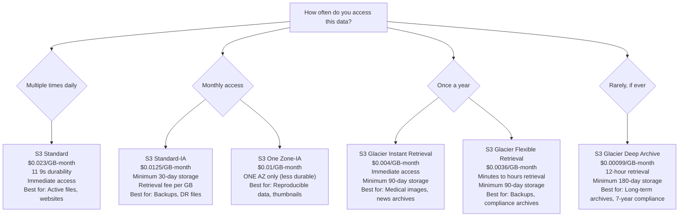

# Stage 04a — S3: Simple Storage Service

> The unlimited object storage that powers everything from static websites to data lakes to Netflix backups.

## 1. Core Intuition

Imagine an infinite filing cabinet that:
- Never fills up (11 9s durability = 99.999999999% durability)
- Can be accessed from anywhere on earth
- Stores files of any size (up to 5 TB each)
- Costs almost nothing per GB
- Has automatic backups built in

**S3 (Simple Storage Service)** is exactly this — an infinitely scalable object store. You upload files. AWS stores them across multiple data centers. You access them via a URL or API.

S3 is the foundation for half of AWS's ecosystem: CloudFront CDN uses S3 as an origin, Lambda reads events from S3, Athena queries data in S3, EMR processes S3 data, etc.

## 2. The Problem S3 Solves

```
Traditional Storage Problems:
━━━━━━━━━━━━━━━━━━━━━━━━━━━━
• Running out of disk space
• Hard drives fail (data loss)
• Can't serve files to users globally at speed
• Expensive disaster recovery setup
• Complex backup systems

S3 Solutions:
━━━━━━━━━━━━━
• Virtually unlimited storage
• 11 9s durability (AWS replicates across 3+ AZs)
• CloudFront CDN integration = global fast delivery
• Versioning for data protection
• Lifecycle policies auto-move data to cheaper tiers
• Pay only for what you actually store ($/GB/month)
```

## 3. Story-Based Analogy — The Infinite Post Office

```
🏤 S3 = An infinite post office with unlimited PO Boxes

Bucket = A PO Box address (globally unique name)
         "s3://company-user-uploads"
         "s3://my-website-assets"

Object = A letter/package stored in that PO Box
         "s3://company-uploads/photos/user123/profile.jpg"
         "s3://my-website/css/styles.css"

Object Key = The full path/name of the object
         "photos/user123/profile.jpg"
         (S3 is flat — there are no real folders, just key names)

Access Control = Who has a key to this PO Box?
         Public: Anyone can read
         Private: Only specific IAM users/roles
         Presigned URL: Temporary key for one specific package

Storage Classes = Different PO Box types with different speeds/costs
         Standard: Next-day delivery, most expensive
         Standard-IA: 2-week delivery, cheaper
         Glacier: 3-month archive vault, much cheaper
```

## 4. Core Concepts

### Buckets

```
S3 Bucket = A container for objects

Rules:
  • Name must be GLOBALLY unique across ALL AWS customers
  • Name: 3-63 lowercase alphanumeric + hyphens
  • Tied to a specific region (data stays there unless you replicate)
  • No nesting: you don't put buckets inside buckets

Good bucket name examples:
  company-name-user-uploads
  my-app-prod-backups-2024
  acme-corp-static-assets

Bad examples:
  MY_BUCKET          ← uppercase, underscores not allowed
  my-bucket          ← too generic, probably already taken
  mybucket.example   ← dots cause SSL certificate issues
```

### Objects

```
Object = A file stored in S3

Object components:
  Key:      The "path" = "images/profile/user123.jpg"
  Value:    The actual data (any bytes — image, video, JSON, zip)
  Metadata: Key-value pairs about the object
            Content-Type: image/jpeg
            Cache-Control: max-age=3600
            x-amz-custom-tag: version=1.2.3
  Version ID: If versioning enabled, each version has a unique ID
  Tags:     For cost allocation, access control, lifecycle

Object Size Limits:
  • Maximum size: 5 TB
  • Console upload max: 160 GB
  • Multipart upload: Required for files > 100 MB (recommended)
  • Minimum part size for multipart: 5 MB

Access URL format:
  https://bucket-name.s3.region.amazonaws.com/object-key
  https://my-bucket.s3.us-east-1.amazonaws.com/images/photo.jpg
```

## 5. S3 Storage Classes — The Cost Optimizer



### S3 Intelligent-Tiering

```
S3 Intelligent-Tiering = Let AWS automatically choose the cheapest tier

How it works:
  • AWS monitors each object's access patterns
  • Objects not accessed for 30 days → moves to IA tier (cheaper)
  • Objects not accessed for 90 days → moves to Archive tier
  • Access the object → moved back to Standard immediately

Cost: Small monitoring fee per object ($0.0025/1,000 objects/month)
Good for: Unpredictable access patterns, large datasets

Console: Set storage class when uploading, or in bucket lifecycle rules
```

## 6. S3 Security

### Access Control Hierarchy

```
1. Block Public Access (Account-level + Bucket-level)
   Overrides ALL other permissions if enabled.
   Enable for ALL buckets unless you explicitly need public access.

   Console: S3 → Bucket → Permissions → Block public access
   ✅ Block all public access: ON (default, recommended)

2. Bucket Policies (Resource-based policies)
   JSON policies attached to the bucket.
   Control who (ANY AWS account, public, specific roles) can do what.

3. ACLs (Legacy — avoid for new buckets)
   Object-level and bucket-level ACLs.
   Overly complex, mostly superseded by bucket policies.

4. IAM Policies (Identity-based)
   What your IAM users/roles can do to S3.
```

### Bucket Policy Examples

```json
// Allow public READ access (for static website)
{
  "Statement": [{
    "Effect": "Allow",
    "Principal": "*",
    "Action": "s3:GetObject",
    "Resource": "arn:aws:s3:::my-website-bucket/*"
  }]
}
```

```json
// Allow only a specific IAM role to read objects
{
  "Statement": [{
    "Effect": "Allow",
    "Principal": {
      "AWS": "arn:aws:iam::123456789012:role/MyLambdaRole"
    },
    "Action": ["s3:GetObject", "s3:PutObject"],
    "Resource": "arn:aws:s3:::my-data-bucket/*"
  }]
}
```

```json
// Deny access from any IP outside your office
{
  "Statement": [{
    "Effect": "Deny",
    "Principal": "*",
    "Action": "s3:*",
    "Resource": ["arn:aws:s3:::my-private-bucket", "arn:aws:s3:::my-private-bucket/*"],
    "Condition": {
      "NotIpAddress": {
        "aws:SourceIp": "203.0.113.0/24"
      }
    }
  }]
}
```

### Pre-signed URLs

```
Problem: You want to let a specific user upload/download a file
         temporarily, without making the bucket public.

Solution: Pre-signed URLs

How it works:
  • Your backend generates a URL with a signature and expiry
  • User uses that URL to upload/download directly to/from S3
  • URL expires (e.g., 15 minutes)
  • No S3 credentials needed by the user

Use cases:
  ✅ Profile picture uploads (user uploads directly to S3)
  ✅ Downloading invoices (signed URL expires after 10 min)
  ✅ Sharing files temporarily

Python example:
import boto3
s3 = boto3.client('s3')
url = s3.generate_presigned_url(
    'get_object',
    Params={'Bucket': 'my-bucket', 'Key': 'invoice.pdf'},
    ExpiresIn=900  # 15 minutes
)
```

## 7. Versioning

```
Versioning = Keep every version of every object

Without versioning:
  Upload photo.jpg v1
  Upload photo.jpg v2 → v1 is GONE FOREVER
  Delete photo.jpg → GONE FOREVER

With versioning:
  Upload photo.jpg v1 → Version ID: abc123
  Upload photo.jpg v2 → Version ID: def456 (v1 still exists!)
  Delete photo.jpg → Creates a "delete marker" (both versions still exist!)
  Restore v1 → Delete the delete marker → v1 is back

Cost: You pay for ALL versions. Add lifecycle rules to delete old ones.

Console: S3 → Bucket → Properties → Bucket Versioning → Enable

Once enabled, versioning cannot be disabled (only suspended).
```

## 8. Lifecycle Policies

Automatically move or delete objects over time:

```
Lifecycle Policy Example:
━━━━━━━━━━━━━━━━━━━━━━━━

User uploads photos to Standard storage ($0.023/GB)

After 30 days → Move to Standard-IA ($0.0125/GB)
After 90 days → Move to Glacier Flexible ($0.0036/GB)
After 365 days → Delete permanently

Cost comparison for 1TB of data stored for 1 year:
  No lifecycle: 1TB × $0.023 × 12 = $276
  With lifecycle: Much cheaper automatically

Console: S3 → Bucket → Management → Lifecycle rules → Create rule

Lifecycle Rule Example:
  Rule name: archive-old-uploads
  Scope: Prefix "uploads/"
  Transitions:
    30 days → Standard-IA
    90 days → Glacier Flexible Retrieval
  Expiration:
    365 days → Delete
```

## 9. Static Website Hosting

Host a static website (HTML, CSS, JS) on S3 — no servers needed:

```
Setup:
1. Create bucket (name = your domain, e.g., mywebsite.com)
2. Upload your HTML/CSS/JS files
3. Enable Static website hosting:
   S3 → Bucket → Properties → Static website hosting
   Index document: index.html
   Error document: error.html

4. Update bucket policy to allow public read:
   (Disable "Block Public Access" first)
   Add bucket policy for s3:GetObject → Principal: *

5. Your website URL:
   http://my-bucket.s3-website-us-east-1.amazonaws.com

For custom domain + HTTPS:
   → Use CloudFront in front of S3
   → CloudFront provides SSL + custom domain
   → Much faster (400+ edge locations)
```

## 10. Cross-Region Replication (CRR) & Same-Region Replication (SRR)

```
CRR (Cross-Region Replication):
  Source Bucket (us-east-1) → Automatically copies to → Destination (ap-south-1)

  Use cases:
  ✅ Compliance: Store copies in multiple regions
  ✅ Disaster recovery: if us-east-1 fails, ap-south-1 has copy
  ✅ Latency: serve users from closest region
  ✅ Different account: send copies to a partner account

SRR (Same-Region Replication):
  Source Bucket → Copies to → Another bucket in same region

  Use cases:
  ✅ Log aggregation: multiple buckets → central logs bucket
  ✅ Dev/Prod environments: prod data → dev bucket (sanitized)
  ✅ Compliance: separate account for audit copies

Requirements:
  • Versioning must be enabled on both buckets
  • IAM role to read source and write destination
  • Replication rules define: what prefix, what storage class

Console: S3 → Bucket → Management → Replication rules
```

## 11. S3 Event Notifications

```
S3 can trigger actions when objects are created/deleted:

Supported destinations:
  → SNS topic (fan-out to many subscribers)
  → SQS queue (process events asynchronously)
  → Lambda function (process immediately)
  → EventBridge (route to many services)

Examples:
  Photo uploaded → Lambda function → generate thumbnails
  CSV uploaded  → Lambda function → parse and load to database
  Log archived  → SQS queue → process and analyze
  File deleted  → SNS → notify team via email

Console: S3 → Bucket → Properties → Event notifications → Create

Event types:
  s3:ObjectCreated:*
  s3:ObjectCreated:Put
  s3:ObjectCreated:Copy
  s3:ObjectRemoved:*
  s3:Replication:*
```

## 12. Encryption

```
Encryption at Rest (data stored encrypted):
━━━━━━━━━━━━━━━━━━━━━━━━━━━━━━━━━━━━━━━━━
SSE-S3 (Server-Side Encryption with S3 keys)
  AWS manages the keys
  AES-256
  FREE, enabled by default on all new buckets (2023+)
  Console: Bucket → Properties → Default encryption → SSE-S3

SSE-KMS (Server-Side Encryption with KMS keys)
  You manage keys in AWS KMS
  Can audit key usage in CloudTrail
  Extra cost: KMS API calls
  Best for: compliance-heavy environments
  Console: Bucket → Properties → Default encryption → SSE-KMS

SSE-C (Customer-Provided Keys)
  YOU provide the key with every request
  AWS encrypts/decrypts but doesn't store your key
  Most control, most operational burden

Encryption in Transit:
━━━━━━━━━━━━━━━━━━━━━━
All S3 requests use HTTPS by default
Enforce HTTPS-only via bucket policy:
  Condition: "aws:SecureTransport": "false" → Deny
```

## 13. Console Walkthrough — Create a Bucket and Upload Files

```
Step 1: Create a Bucket
━━━━━━━━━━━━━━━━━━━━━━━
Go to: AWS Console → S3 → Create bucket

  Bucket name: yourname-learning-2024  (must be globally unique)
  Region: us-east-1
  Object Ownership: ACLs disabled (recommended)
  Block Public Access: KEEP ALL BLOCKED (default)
  Versioning: Enable (recommended for learning)
  Encryption: SSE-S3 (default, free)
  Click: Create bucket

━━━━━━━━━━━━━━━━━━━━━━━━━━━━━━━━━━━━━━━━━━━━━━━━━━━━━━━━━━━━━━

Step 2: Upload a File
━━━━━━━━━━━━━━━━━━━━━
Click your bucket name → Upload → Add files
  Select a file (image, text, anything)
  Storage class: Standard (leave default)
  Click: Upload

Step 3: View the Object
━━━━━━━━━━━━━━━━━━━━━━━
Click the uploaded file.
  You'll see:
  • Object URL (not publicly accessible yet)
  • Metadata (size, type, last modified)
  • Storage class
  • Encryption status

Try opening the URL in browser → Access Denied (bucket is private)

Step 4: Generate a Pre-signed URL
━━━━━━━━━━━━━━━━━━━━━━━━━━━━━━━━━
Object → Actions → Share with a presigned URL
  Expiration: 5 minutes
  → Copy the URL → Open in browser → You can download!
  → Wait 5 min → Try again → URL expired!
```

## 14. Trade-offs and Limitations

| Feature | Trade-off |
|---------|-----------|
| Infinite scalability | Eventual consistency for overwrite PUTs (now strongly consistent!) |
| 11 9s durability | Not a substitute for versioning (still need it for accidental deletes) |
| Cheap storage | Retrieval fees for Glacier and IA tiers |
| Global unique names | Common names already taken |
| Object max 5 TB | Database-like queries need Athena on top |

## 15. Common Mistakes

```
❌ Accidentally making a bucket public with sensitive data
   ✅ Keep Block Public Access ON for all private buckets.
      Use IAM roles/policies for access, not bucket ACLs.

❌ Not enabling versioning on important buckets
   → Accidentally deleted critical file → gone forever
   ✅ Enable versioning for important data + lifecycle policy
      to delete old versions after 90 days

❌ Forgetting data transfer costs
   → Reading 1 TB/month from S3 to non-AWS: $90 in data transfer
   ✅ Use CloudFront in front of S3 — CloudFront → S3 is free transfer

❌ Using S3 as a database
   → Can't query efficiently, no transactions
   ✅ Use S3 for raw file storage; DynamoDB/RDS for structured data.
      Use Athena to query S3 data with SQL.

❌ Using Standard storage for archived data
   → Paying $0.023/GB for data accessed once a year
   ✅ Set up lifecycle policies to auto-archive
```

## 16. Interview Perspective

**Q: What is S3 durability vs availability?**
Durability (11 nines = 99.999999999%) means objects are not lost — AWS replicates across 3+ AZs. Availability (99.99% for Standard) means the service is accessible — you can read and write. High durability doesn't mean high availability — if the S3 service has a regional outage (rare), you can't access data even though it's not lost.

**Q: What is the difference between S3 Standard and S3 Standard-IA?**
Standard is for frequently accessed data. Standard-IA (Infrequent Access) is cheaper per GB stored ($0.0125 vs $0.023/GB-month) but charges a retrieval fee per GB accessed. Use Standard for data accessed more than monthly; Standard-IA for backup files accessed rarely.

**Q: How would you share an S3 file with an external user temporarily?**
Generate a pre-signed URL. It's a time-limited URL signed with your credentials. The user can access the object without having AWS credentials, but only until the URL expires (up to 7 days for IAM roles). Your backend generates it and passes it to the user.

**Q: What is S3 Cross-Region Replication?**
CRR automatically copies new objects from a source bucket to a destination bucket in a different region. Requires versioning on both buckets. Used for disaster recovery, compliance (data in multiple regions), and serving users from closer regions. It replicates new objects after enabling — not existing objects (use S3 Batch Operations for those).

## 17. Mini Exercise

```
✍️ Hands-On:

1. Create 2 buckets:
   a) yourname-public-website (will host a website)
   b) yourname-private-data (strictly private)

2. Private bucket exercises:
   • Upload 3 files of different types
   • Enable versioning
   • Upload same filename twice → see version IDs
   • Generate presigned URLs for one file (5 min expiry)
   • Set up lifecycle rule:
     30 days → Standard-IA
     90 days → Glacier

3. Public website bucket:
   • Create simple HTML: <h1>My S3 Website!</h1>
   • Disable Block Public Access
   • Enable static website hosting
   • Add bucket policy for public read
   • Visit the S3 website URL in browser

4. Test event notifications:
   • Set up: Object created → Send to SQS (create queue first)
   • Upload a file → Check SQS for the notification message

5. Clean up:
   • Empty both buckets (versioned objects need special deletion)
   • Delete both buckets
```

---

**[🏠 Back to README](../README.md)**

**Prev:** [← Elastic Beanstalk](../03_compute/elastic_beanstalk.md) &nbsp;|&nbsp; **Next:** [EBS & EFS →](../04_storage/ebs_efs.md)

**Related Topics:** [Route 53 & CloudFront](../05_networking/route53_cloudfront.md) · [IAM](../06_security/iam.md) · [EBS & EFS](../04_storage/ebs_efs.md) · [Athena, Glue & Redshift](../12_data_analytics/athena_glue_redshift.md)
