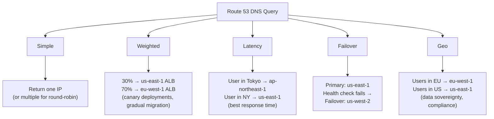
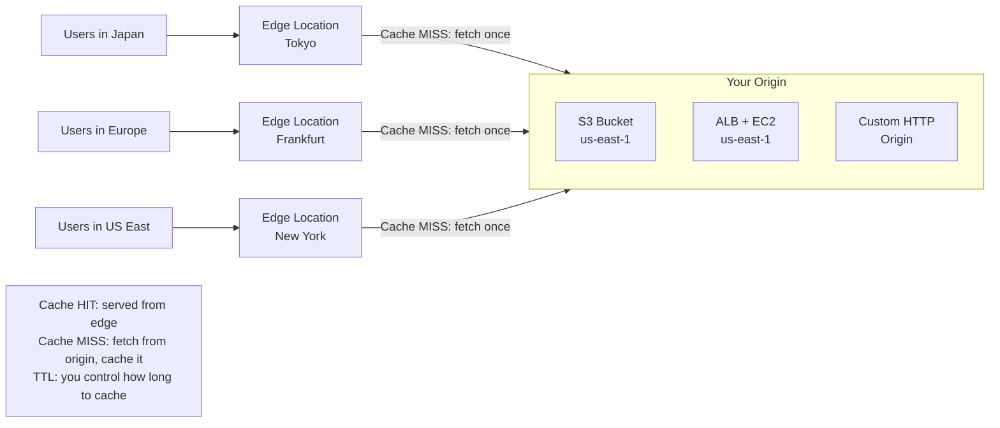
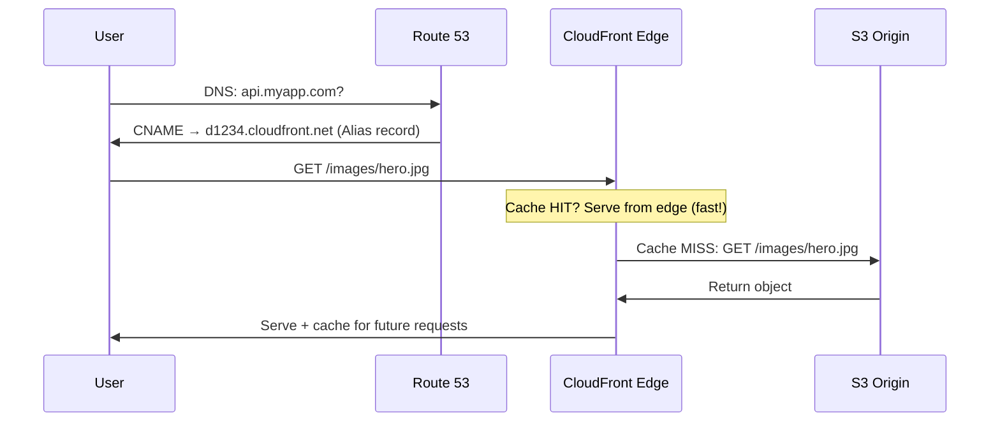

# Stage 05b — Route 53 & CloudFront

> Route 53 is AWS's global DNS — route users to the right server. CloudFront is AWS's CDN — serve content from the edge, milliseconds from every user.

---

## 1. Route 53 — DNS That Does More

### Core Intuition

When you type `www.amazon.com`, your browser asks: "What IP address is this?" DNS (Domain Name System) answers. Route 53 is AWS's DNS service — but it's also a **traffic routing engine** and **health check monitor**.

```
Traditional DNS:   domain → one IP address. Done.
Route 53:          domain → intelligently route to:
                     • Nearest region (latency routing)
                     • Healthy server only (failover routing)
                     • Multiple IPs for load distribution (weighted routing)
                     • Based on user's country (geolocation routing)
```

---

## 2. Route 53 Record Types

```
A Record:      domain → IPv4 address
               example.com → 54.239.28.85

AAAA Record:   domain → IPv6 address

CNAME:         domain → another domain name
               www.example.com → example.com
               Cannot use on root domain (apex)!

Alias Record:  AWS-specific — like CNAME but works on root domain
               example.com → myalb-123.us-east-1.elb.amazonaws.com
               Free (no charge for queries)
               Use for: ALB, CloudFront, S3 website, API Gateway

MX Record:     mail routing (email servers)
TXT Record:    text data (domain verification, SPF, DKIM)
NS Record:     nameserver records (auto-created by Route 53)
```

**Alias vs CNAME:**
```
CNAME:   Can't use at apex (example.com) — only subdomains
         Each DNS lookup costs money
         Points to any hostname

Alias:   Works at apex (example.com) AND subdomains
         Free queries
         Points to AWS resources only (ALB, CloudFront, S3, etc.)
         → Always prefer Alias for AWS resources
```

---

## 3. Routing Policies



```
Simple:      One record → one or more IPs. No health checks.
             Use for: single-server setups, static sites.

Weighted:    Split traffic by percentage. Adds up to 100.
             Use for: A/B testing, blue/green deployments, gradual migration.

Latency:     Route to region with lowest latency for the user.
             Use for: global apps where speed matters.

Failover:    Active/passive. Primary gets traffic; failover only if primary unhealthy.
             Use for: disaster recovery.

Geolocation: Route based on user's country/continent.
             Use for: compliance (EU data must stay in EU), localization.

Geoproximity: Route based on geographic distance + bias.
             Use for: fine-grained geographic control.

Multi-value: Return up to 8 healthy records. Client picks one.
             Use for: simple load distribution with health checks.
```

---

## 4. Health Checks

```
Route 53 Health Checks:
  HTTP/HTTPS/TCP checks to any endpoint
  15 global health checkers check every 30s (or 10s for fast)
  If > 18% checkers report unhealthy → Route 53 considers it unhealthy

Types:
  Endpoint health check:  HTTP GET to /health → expect 2xx
  Calculated health check: combine multiple health checks (AND/OR logic)
  CloudWatch alarm:       if metric breaches alarm → unhealthy

Failover pattern:
  Primary record + health check → if fails → Route 53 stops returning it
  Failover record → used when primary is unhealthy
  Recovery is automatic when primary recovers
```

---

## 5. CloudFront — Content Delivery Network

### Core Intuition

Your S3 bucket is in `us-east-1`. A user in Tokyo requests your 5MB image. Without CloudFront: request travels from Tokyo → Virginia → back → 200ms+ latency.

With CloudFront: that image is **cached at an edge location in Tokyo**. Request travels 2ms to the Tokyo edge → served from cache → user gets it in 5ms.

```
CloudFront = 450+ Edge Locations worldwide
             Cache your content close to every user
             Also protects your origin from traffic spikes
```

---

## 6. CloudFront Architecture



---

## 7. CloudFront Configuration

```
Distribution settings:
  Origin Domain:   your S3 bucket / ALB / custom HTTP endpoint
  Protocol:        HTTPS only (redirect HTTP → HTTPS)
  Cache Policy:    what to cache, TTL settings
  Price Class:     All edge locations / US+EU only (cheaper)

Cache Behavior:
  Path Pattern:    /images/* → cache for 1 day
                   /api/*    → don't cache (dynamic content)
                   /*.html   → cache for 5 min

  Allowed Methods: GET, HEAD (for static)
                   GET, HEAD, POST, PUT, DELETE (for API proxy)

TTL (Time to Live):
  Default: 86400s (1 day)
  Min: 0 (never cache)
  Max: 31536000s (1 year)
  Override with Cache-Control header from origin

Invalidation:
  Force CloudFront to remove cached content:
  aws cloudfront create-invalidation \
    --distribution-id E1234567890 \
    --paths "/images/*" "/*.html"
  Cost: first 1,000 paths/month free, then $0.005 per path
```

---

## 8. S3 + CloudFront (Static Website Pattern)

```
Architecture:
  S3 bucket (private) → CloudFront → Users

  DO NOT make S3 public! Use Origin Access Control (OAC):

S3 Bucket Policy (allow only CloudFront):
{
  "Statement": [{
    "Effect": "Allow",
    "Principal": {
      "Service": "cloudfront.amazonaws.com"
    },
    "Action": "s3:GetObject",
    "Resource": "arn:aws:s3:::my-bucket/*",
    "Condition": {
      "StringEquals": {
        "AWS:SourceArn": "arn:aws:cloudfront::123456789:distribution/E1234"
      }
    }
  }]
}

Benefits:
  ✅ S3 bucket stays private
  ✅ Content served from edge (fast)
  ✅ DDoS protection via CloudFront Shield
  ✅ HTTPS automatically
  ✅ Custom domain (CNAME or Alias in Route 53)
```

---

## 9. CloudFront Security Features

```
HTTPS + SSL/TLS:
  Free SSL cert from ACM (us-east-1 region only for CloudFront!)
  Custom domain: create cert in ACM us-east-1 → attach to distribution

Geo Restriction:
  Whitelist: only allow specific countries
  Blacklist: block specific countries
  Use for: content licensing, compliance

AWS WAF Integration:
  Attach WAF Web ACL to CloudFront distribution
  Block bad IPs, SQL injection, XSS globally at the edge
  Rules execute before request reaches your origin

Signed URLs / Signed Cookies:
  Restrict access to private content
  Signed URL: one file, one user
  Signed Cookie: multiple files, authenticated user
  Use for: paid video streaming, premium downloads

Field-Level Encryption:
  Encrypt specific POST fields (credit card) at the edge
  Only your backend with the private key can decrypt
```

---

## 10. Route 53 + CloudFront Together



---

## 11. Console Walkthrough

```
Create CloudFront Distribution:
━━━━━━━━━━━━━━━━━━━━━━━━━━━━━━
CloudFront → Create distribution

Origin:
  Origin domain: my-bucket.s3.us-east-1.amazonaws.com
  Origin access: Origin access control (OAC) — create new OAC
  Click "Copy policy" → paste into S3 bucket policy

Default cache behavior:
  Viewer protocol policy: Redirect HTTP to HTTPS
  Allowed HTTP methods: GET, HEAD
  Cache policy: CachingOptimized (for S3 static content)

Settings:
  Price class: Use all edge locations
  Alternate domain name: www.myapp.com
  Custom SSL certificate: select your ACM cert (must be in us-east-1!)
  Default root object: index.html

Create distribution (deploys in ~5-10 min)

Add Route 53 record:
  Route 53 → Hosted zone → Create record
  Record name: www
  Record type: A
  Alias: Yes → CloudFront distribution → select your distribution
  Create record
```

---

## 12. Interview Perspective

**Q: What is the difference between CloudFront and a CDN like Akamai?**
CloudFront is AWS's native CDN with 450+ edge locations. It's deeply integrated with S3, ALB, EC2, WAF, Lambda@Edge, and ACM for free SSL. Like any CDN, it caches content at edge locations near users. Compared to third-party CDNs, CloudFront's advantage is native AWS integration — no separate credentials, single billing, and features like S3 Origin Access Control and Lambda@Edge.

**Q: When would you use Route 53 latency routing vs geolocation routing?**
Latency routing routes users to the AWS region that gives the lowest latency — this is based on measured network performance, not geography. A user in Chile might get lower latency to us-east-1 than sa-east-1. Geolocation routing routes based on the user's country/continent regardless of latency — use this for compliance (EU users must hit EU servers), content localization, or licensing restrictions.

**Q: What is an Alias record and why use it instead of CNAME?**
An Alias record is AWS-specific and can be used at the zone apex (root domain like example.com) while CNAME cannot. Alias records resolve within Route 53 without an extra DNS lookup, are free to query, and work with AWS resources (ALB, CloudFront, S3). Always use Alias when pointing to AWS resources.

---

**[🏠 Back to README](../README.md)**

**Prev:** [← VPC Networking](../05_networking/vpc.md) &nbsp;|&nbsp; **Next:** [IAM →](../06_security/iam.md)

**Related Topics:** [VPC Networking](../05_networking/vpc.md) · [S3 Object Storage](../04_storage/s3.md) · [WAF, Shield & GuardDuty](../06_security/waf_shield_guardduty.md) · [High Availability](../14_architecture/high_availability.md)
