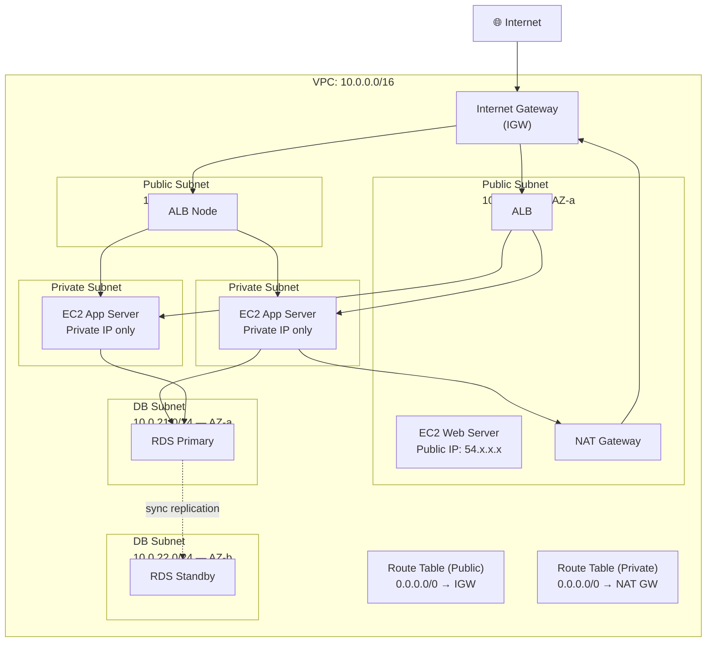
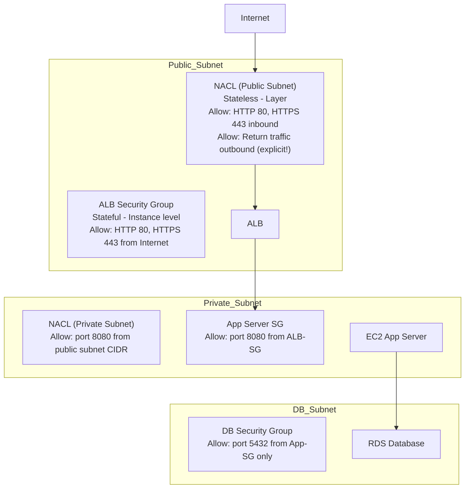

# Stage 05 — VPC: Virtual Private Cloud

> Your private network in the cloud. Understanding VPC is the key to AWS networking, security, and architecture.

## 1. Core Intuition

When you launch resources in AWS, they need to communicate with each other and with the outside world — but in a controlled, secure way. You wouldn't want your production database accessible directly from the internet.

**VPC (Virtual Private Cloud)** = Your own isolated private network in the AWS cloud. You control:
- What IP ranges to use
- Which subnets are public (internet-facing) vs private (internal only)
- What traffic flows in, out, and between subnets
- Routing tables that define how traffic moves

## 2. Story-Based Analogy — The Office Building

```
VPC = Your office building floor plan

VPC itself = The entire building (isolated from other tenants)
CIDR block = The set of room numbers available (10.0.0.0/16)

Subnets = Floors or rooms in the building
  Public Subnet  = Reception area (visitors can come and go)
  Private Subnet = Internal offices (only employees, no visitors)
  DB Subnet      = Secure vault room (only specific staff)

Internet Gateway = The building's main entrance/exit door
                   Connects the building to the outside world

NAT Gateway = A one-way mirror at the back exit
              Internal staff can call out (get software updates)
              But no one outside can initiate contact inside

Route Tables = The hallway signs
              "To get to floor 3 → take elevator B"
              "To get to internet → use main entrance"

Security Groups = Badge readers on each room door
NACLs          = Security desk at each floor entrance
```

## 3. Full VPC Architecture



## 4. CIDR — IP Address Planning

### What Is CIDR?

```
CIDR = Classless Inter-Domain Routing
     = A way to define a range of IP addresses

Format: IP_address/prefix_length
Example: 10.0.0.0/16

The prefix (/16, /24, etc.) tells you how many addresses are in the range.

Formula: Number of addresses = 2^(32 - prefix)

/16 = 2^16 = 65,536 addresses  (large VPC: 10.0.0.0 → 10.0.255.255)
/24 = 2^8  = 256 addresses     (typical subnet: 10.0.1.0 → 10.0.1.255)
/28 = 2^4  = 16 addresses      (small subnet)
/32 = 2^0  = 1 address         (single IP)

AWS reserves 5 IPs per subnet:
  10.0.1.0   = Network address
  10.0.1.1   = VPC router
  10.0.1.2   = DNS server
  10.0.1.3   = Reserved by AWS
  10.0.1.255 = Broadcast

So /24 = 256 - 5 = 251 usable IPs
```

### VPC CIDR Planning

```
Recommended VPC CIDR ranges (private, non-routable on internet):
  10.0.0.0/8        → 16M addresses (class A)
  172.16.0.0/12     → 1M addresses  (class B)
  192.168.0.0/16    → 65K addresses (class C)

For a typical AWS VPC:
  /16 = large company or microservices
  /20 = medium workload
  /24 = small workload

⚠️ Choose wisely! VPC CIDR cannot be changed after creation.
   If you need to connect VPCs (peering), ranges must NOT overlap.

Multi-account example:
  VPC A (production): 10.0.0.0/16
  VPC B (staging):    10.1.0.0/16
  VPC C (dev):        10.2.0.0/16
  No overlap → all can be peered
```

## 5. Subnets

### Public vs Private Subnets

```
Public Subnet:
━━━━━━━━━━━━━━
• Resources get a public IP (optional)
• Route table has: 0.0.0.0/0 → Internet Gateway
• Traffic CAN reach the internet directly
• Examples: ALB, NAT Gateway, Bastion Host (jump server)

Private Subnet:
━━━━━━━━━━━━━━
• Resources get ONLY private IP (no direct internet exposure)
• Route table has: 0.0.0.0/0 → NAT Gateway
  (traffic goes out through NAT, but nothing comes in directly)
• Examples: App servers, databases, internal microservices

DB Subnet (variant of private):
━━━━━━━━━━━━━━━━━━━━━━━━━━━━━━━
• No internet access at all (not even via NAT)
• Only accessible from app servers in private subnet
• Extra secure for databases
```

### Subnet Naming Convention (Best Practice)

```
Subnet layout for us-east-1 (3 AZs):

Public:
  public-1a: 10.0.1.0/24   (AZ: us-east-1a)
  public-1b: 10.0.2.0/24   (AZ: us-east-1b)
  public-1c: 10.0.3.0/24   (AZ: us-east-1c)

Private (Application):
  private-1a: 10.0.11.0/24  (AZ: us-east-1a)
  private-1b: 10.0.12.0/24  (AZ: us-east-1b)
  private-1c: 10.0.13.0/24  (AZ: us-east-1c)

Private (Database):
  db-1a: 10.0.21.0/24  (AZ: us-east-1a)
  db-1b: 10.0.22.0/24  (AZ: us-east-1b)
  db-1c: 10.0.23.0/24  (AZ: us-east-1c)
```

## 6. Internet Gateway (IGW)

```
Internet Gateway = The door from your VPC to the internet

Properties:
  • Horizontally scaled — no bandwidth limits
  • Highly available by default (no redundancy needed)
  • One IGW per VPC
  • Performs NAT for public EC2 instances
    (translates private IPs ↔ public IPs)

Without IGW:
  Your VPC is completely isolated. No internet access at all.

With IGW + Public Subnet Route:
  Resources in public subnet with public IP can reach internet.

Console: VPC → Internet Gateways → Create → Attach to VPC
```

## 7. NAT Gateway

```
NAT Gateway = Allows private resources to reach the internet
              WITHOUT being directly accessible from the internet

The problem it solves:
  App server in private subnet needs to:
  • Download updates from apt/yum
  • Call external APIs (payment gateway, etc.)
  • Download code from GitHub

  But you DON'T want the app server directly exposed to internet.

Solution: NAT Gateway
  Private EC2 → NAT Gateway (in public subnet) → IGW → Internet
  Response: Internet → IGW → NAT Gateway → Private EC2

  The internet only sees the NAT Gateway's IP, not the private EC2.

NAT Gateway properties:
  • Deployed in a PUBLIC subnet
  • Gets an Elastic IP (static public IP)
  • Managed by AWS (no maintenance)
  • Charged per hour + per GB processed
  • For HA: deploy one NAT GW per AZ (don't share across AZs)

Cost:
  ~$0.045/hour per NAT Gateway + $0.045/GB processed
  ≈ $32/month minimum per NAT Gateway

Alternative: NAT Instance (old, EC2-based) — avoid, use managed NAT GW
```

### Route Tables

```
Route tables = GPS navigation for your subnet traffic

Each subnet has ONE route table (or inherits the main one).

Public Subnet Route Table:
  Destination    Target
  10.0.0.0/16   local        ← all VPC traffic goes locally
  0.0.0.0/0     igw-xxxxxxx  ← everything else → internet

Private Subnet Route Table:
  Destination    Target
  10.0.0.0/16   local        ← all VPC traffic goes locally
  0.0.0.0/0     nat-xxxxxxx  ← everything else → NAT gateway

DB Subnet Route Table (no internet):
  Destination    Target
  10.0.0.0/16   local        ← only VPC-internal traffic
  (no 0.0.0.0/0 entry = no internet at all)

Console: VPC → Route Tables → Edit routes
```

## 8. Security Groups vs NACLs



```
Security Groups (SGs):
━━━━━━━━━━━━━━━━━━━━━
Level:    Instance (attached to EC2, RDS, Lambda, etc.)
State:    STATEFUL (return traffic automatically allowed)
Rules:    ALLOW only (no deny rules possible)
Multiple: Yes, can attach multiple SGs to one instance
Default:  All inbound DENIED, all outbound ALLOWED

Network ACLs (NACLs):
━━━━━━━━━━━━━━━━━━━━━
Level:    Subnet (applies to ALL resources in subnet)
State:    STATELESS (must explicitly allow return traffic!)
Rules:    ALLOW and DENY (support explicit deny)
Multiple: One NACL per subnet
Default:  Allow all inbound and outbound (default VPC NACL)
Rule Order: Evaluated by rule number, lowest first (100, 200, etc.)
           First MATCH wins (stop processing)

When to use NACLs:
  ✅ Block a specific IP/range at subnet level
  ✅ Add defense-in-depth layer below SGs
  ✅ Deny access to entire subnet from specific CIDR

When to use Security Groups:
  ✅ Primary firewall (most configurations use only SGs)
  ✅ Port-level control per instance
  ✅ Reference other SGs (clean microservices access control)
```

## 9. VPC Peering

```
VPC Peering = Connect two VPCs as if they were on the same network

Use cases:
  • Connect prod VPC to shared services VPC
  • Connect VPCs across AWS accounts
  • Connect VPCs in different regions (Inter-Region Peering)

Properties:
  • NOT transitive: A↔B and B↔C doesn't mean A↔C
  • No overlapping CIDR blocks allowed
  • Each side must accept the peering request
  • Route tables must be updated on BOTH sides

Example:
  VPC-A (10.0.0.0/16) ←→ VPC-B (10.1.0.0/16)

  VPC-A Route Table: add  10.1.0.0/16 → pcx-123abc
  VPC-B Route Table: add  10.0.0.0/16 → pcx-123abc

Non-transitive problem:
  VPC-A peered with VPC-B
  VPC-B peered with VPC-C
  VPC-A CANNOT reach VPC-C through VPC-B

Solution: VPC Transit Gateway (hub-and-spoke, handles transitive routing)
```

## 10. VPC Endpoints (Private Connectivity to AWS Services)

```
Problem:
  EC2 in private subnet needs to access S3.
  Without VPC Endpoint: traffic goes Private → NAT → Internet → S3
  This costs money (NAT gateway data processing) and uses internet.

Solution: VPC Endpoint
  Direct private connection from VPC to S3/DynamoDB/etc.
  Traffic never leaves Amazon's private network.

Types:
━━━━━━━━━━━━━━━━━━━━━━━━━━━━━━━━━━━━━━━━━━━━━━━━━━━━━━━━━━━━━

Gateway Endpoint (free):
  Supports: S3 and DynamoDB ONLY
  Update route table: add S3 prefix → vpce-endpoint
  Console: VPC → Endpoints → Create → Type: Gateway → Service: S3

Interface Endpoint (costs ~$0.01/hr per AZ):
  Supports: Most AWS services (SSM, Secrets Manager, API GW, ECR, etc.)
  Creates an ENI (Elastic Network Interface) with private IP in your subnet
  Use when: EC2 needs to call AWS APIs without internet (air-gapped setups)

PrivateLink:
  Same as Interface Endpoint, but for exposing your OWN services privately
  to other VPCs or customers.
```

## 11. AWS Direct Connect & VPN

```
AWS Site-to-Site VPN:
━━━━━━━━━━━━━━━━━━━━━
Encrypted tunnel: Your data center → Internet → AWS VPC
  • Fast to set up (hours)
  • Goes over public internet (encrypted)
  • Limited bandwidth (~1.25 Gbps per tunnel)
  • Two tunnels for redundancy
  • Use for: quick connectivity, backup for Direct Connect

AWS Direct Connect:
━━━━━━━━━━━━━━━━━━━
Dedicated private fiber: Your data center → AWS
  • NOT over internet (private fiber connection)
  • Up to 100 Gbps bandwidth
  • Consistent latency (no internet variability)
  • Takes weeks to set up (physical fiber provisioning)
  • Use for: high bandwidth, low latency, hybrid cloud, large data transfers
  • Cost: port fees + data transfer fees

Hybrid Setup (recommended):
  Direct Connect as primary
  Site-to-Site VPN as failover backup
```

## 12. Transit Gateway

```
Problem: 10 VPCs + 5 on-premise data centers.
         With peering: need 10×9/2 = 45 peering connections.
         With Direct Connect: 5 Direct Connect connections.

Solution: AWS Transit Gateway

Transit Gateway = Hub-and-spoke router
  All VPCs and on-premise networks connect to TGW.
  TGW routes traffic between them.

  10 VPCs + 5 on-premise → each connect to ONE Transit Gateway
  TGW handles all routing (including transitive routing!)

  Supports:
  ✅ VPC attachments
  ✅ Direct Connect attachments
  ✅ VPN attachments
  ✅ Peering to other Transit Gateways (inter-region)
  ✅ Multicast
  ✅ Route tables per attachment (isolate environments)
```

## 13. Console Walkthrough — Create a Custom VPC

```
Step 1: Create VPC
━━━━━━━━━━━━━━━━━━
Console: VPC → Your VPCs → Create VPC

  Option: VPC and more (let AWS create subnets too)
    - Or manually: VPC only, then add subnets manually

  Name: my-production-vpc
  IPv4 CIDR: 10.0.0.0/16
  Tenancy: Default (shared hardware)
  Click: Create VPC

━━━━━━━━━━━━━━━━━━━━━━━━━━━━━━━━━━━━━━━━━━━━━━━━━━━━━━━━

Step 2: Create Subnets
━━━━━━━━━━━━━━━━━━━━━━
VPC → Subnets → Create subnet

  Create public-1a:
    VPC: my-production-vpc
    Subnet name: public-1a
    Availability Zone: us-east-1a
    IPv4 CIDR: 10.0.1.0/24

  Repeat for public-1b (10.0.2.0/24, AZ: us-east-1b)
  Repeat for private-1a (10.0.11.0/24, AZ: us-east-1a)
  Repeat for private-1b (10.0.12.0/24, AZ: us-east-1b)

━━━━━━━━━━━━━━━━━━━━━━━━━━━━━━━━━━━━━━━━━━━━━━━━━━━━━━━━

Step 3: Create and Attach Internet Gateway
━━━━━━━━━━━━━━━━━━━━━━━━━━━━━━━━━━━━━━━━━━
VPC → Internet Gateways → Create internet gateway
  Name: my-production-igw
  Create → Actions → Attach to VPC → my-production-vpc

━━━━━━━━━━━━━━━━━━━━━━━━━━━━━━━━━━━━━━━━━━━━━━━━━━━━━━━━

Step 4: Create Route Tables
━━━━━━━━━━━━━━━━━━━━━━━━━━━
Public Route Table:
  VPC → Route Tables → Create route table
    Name: public-rt
    VPC: my-production-vpc
  Edit routes → Add route:
    Destination: 0.0.0.0/0
    Target: Internet Gateway → my-production-igw
  Subnet associations → Associate public-1a and public-1b

Private Route Table:
  Create: private-rt (we'll add NAT Gateway later)
  Subnet associations → Associate private-1a and private-1b

━━━━━━━━━━━━━━━━━━━━━━━━━━━━━━━━━━━━━━━━━━━━━━━━━━━━━━━━

Step 5: Create NAT Gateway
━━━━━━━━━━━━━━━━━━━━━━━━━━
VPC → NAT Gateways → Create
  Name: nat-gateway-1a
  Subnet: public-1a  ← MUST be in public subnet!
  Connectivity type: Public
  Elastic IP allocation ID: Allocate Elastic IP

After creation (takes ~2 min):
  Update private-rt:
    Route: 0.0.0.0/0 → nat-gateway-1a

━━━━━━━━━━━━━━━━━━━━━━━━━━━━━━━━━━━━━━━━━━━━━━━━━━━━━━━━

Now you have a production-grade VPC with:
  ✅ Public subnets for ALB, NAT Gateway
  ✅ Private subnets for application servers
  ✅ Internet Gateway for public access
  ✅ NAT Gateway for private outbound access
```

## 14. Common Mistakes

```
❌ Using the default VPC for production
   → Default VPC has all subnets public — dangerous for databases
   ✅ Create custom VPC with proper subnet tiers

❌ Deploying NAT Gateway in a PRIVATE subnet
   → NAT Gateway must be in a PUBLIC subnet (needs IGW access)
   ✅ NAT Gateway always goes in public subnet

❌ Overlapping CIDR blocks when planning multi-VPC setup
   → Can't peer VPCs with overlapping IPs
   ✅ Plan CIDR blocks upfront for all VPCs (10.0/16, 10.1/16, 10.2/16...)

❌ One NAT Gateway shared across AZs
   → If NAT GW's AZ fails, private subnets in other AZs lose internet
   ✅ Deploy one NAT Gateway per AZ (update each AZ's route table)

❌ Not using VPC Endpoints for S3/DynamoDB
   → Paying NAT Gateway fees + slow internet path for AWS service calls
   ✅ Create Gateway Endpoints for S3 and DynamoDB (free!)
```

## 15. Interview Perspective

**Q: What is the difference between a public and private subnet?**
A public subnet's route table has a route to an Internet Gateway (0.0.0.0/0 → igw). Resources in a public subnet can have public IPs and communicate with the internet. A private subnet has no route to the IGW. Resources only have private IPs. They can access the internet through a NAT Gateway but cannot be reached from the internet.

**Q: What is a NAT Gateway and where does it go?**
A NAT Gateway allows resources in private subnets to initiate outbound connections to the internet (e.g., download packages, call APIs) without exposing them to inbound connections. It must be placed in a PUBLIC subnet. Traffic flows: private EC2 → NAT GW → IGW → internet. The internet only sees the NAT GW's IP.

**Q: What is the difference between Security Groups and NACLs?**
Security Groups are stateful, instance-level, allow-only firewalls. NACLs are stateless, subnet-level, support allow AND deny. Stateless means you must explicitly allow return traffic in NACLs. Use Security Groups as the primary firewall; NACLs for subnet-level deny rules (e.g., blocking a specific CIDR range).

**Q: What is VPC peering and what are its limitations?**
VPC peering creates a direct private connection between two VPCs. Limitations: (1) Non-transitive — A↔B and B↔C doesn't give A→C access; (2) No overlapping CIDR blocks; (3) Must update route tables on both sides. Use Transit Gateway instead when you have many VPCs to connect (hub-and-spoke model, supports transitive routing).

## 16. Mini Exercise

```
✍️ Hands-On: Build a Production VPC

1. Create a custom VPC: 10.0.0.0/16

2. Create 6 subnets (2 per tier, 2 AZs):
   public-1a   10.0.1.0/24    AZ: us-east-1a
   public-1b   10.0.2.0/24    AZ: us-east-1b
   private-1a  10.0.11.0/24   AZ: us-east-1a
   private-1b  10.0.12.0/24   AZ: us-east-1b
   db-1a       10.0.21.0/24   AZ: us-east-1a
   db-1b       10.0.22.0/24   AZ: us-east-1b

3. Create and attach an Internet Gateway

4. Create route tables:
   public-rt: 0.0.0.0/0 → IGW → associate with public-1a, public-1b
   private-rt: (add NAT later)
   db-rt: no internet route → associate with db-1a, db-1b

5. Create a NAT Gateway in public-1a subnet
   Update private-rt: 0.0.0.0/0 → NAT Gateway

6. Launch test instances:
   EC2 in public-1a → can ping internet (ping 8.8.8.8)
   EC2 in private-1a (no public IP) → can curl https://google.com via NAT
   EC2 in db-1a → cannot reach internet at all

7. Create a VPC Gateway Endpoint for S3:
   VPC → Endpoints → Create → S3 → Gateway type
   Associate with private route table
   Test: from private EC2: aws s3 ls → works (no internet needed!)

Cost note: NAT Gateway charges ~$0.045/hr. Delete after practice.
```

---

**[🏠 Back to README](../README.md)**

**Prev:** [← EBS & EFS](../04_storage/ebs_efs.md) &nbsp;|&nbsp; **Next:** [Route 53 & CloudFront →](../05_networking/route53_cloudfront.md)

**Related Topics:** [Route 53 & CloudFront](../05_networking/route53_cloudfront.md) · [IAM](../06_security/iam.md) · [EC2](../03_compute/ec2.md) · [CloudFormation](../09_iac/cloudformation.md)

---

## 📝 Practice Questions

- 📝 [Q8 · security-groups](../aws_practice_questions_100.md#q8--normal--security-groups)
- 📝 [Q9 · nacl-vs-sg](../aws_practice_questions_100.md#q9--thinking--nacl-vs-sg)
- 📝 [Q16 · vpc-basics](../aws_practice_questions_100.md#q16--normal--vpc-basics)
- 📝 [Q17 · internet-gateway](../aws_practice_questions_100.md#q17--normal--internet-gateway)
- 📝 [Q18 · nat-gateway](../aws_practice_questions_100.md#q18--thinking--nat-gateway)
- 📝 [Q34 · vpc-peering](../aws_practice_questions_100.md#q34--normal--vpc-peering)
- 📝 [Q35 · vpc-endpoints](../aws_practice_questions_100.md#q35--normal--vpc-endpoints)
- 📝 [Q36 · transit-gateway](../aws_practice_questions_100.md#q36--normal--transit-gateway)
- 📝 [Q76 · explain-vpc-junior](../aws_practice_questions_100.md#q76--interview--explain-vpc-junior)
- 📝 [Q91 · predict-sg-traffic](../aws_practice_questions_100.md#q91--logical--predict-sg-traffic)
- 📝 [Q95 · debug-vpc-connectivity](../aws_practice_questions_100.md#q95--debug--debug-vpc-connectivity)

