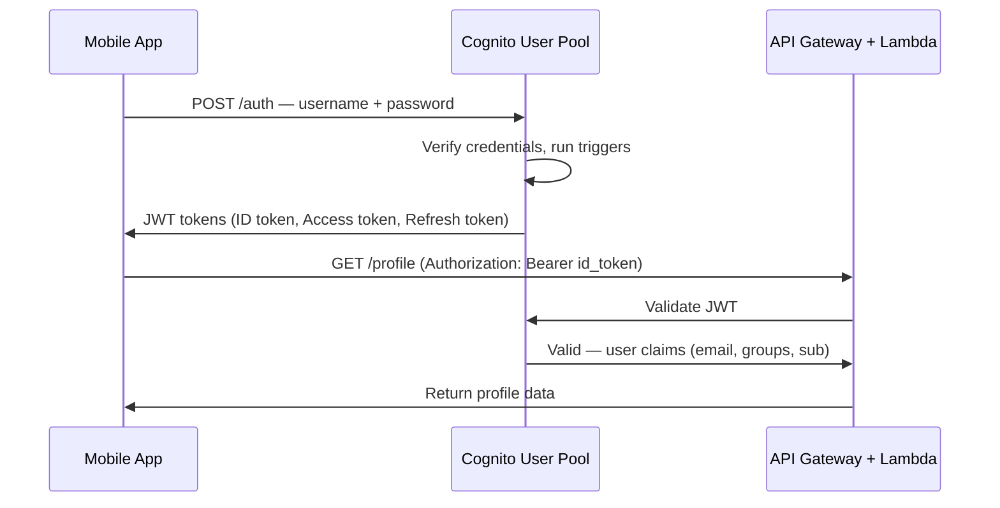

# Stage 06d — Cognito: User Authentication & Authorization

> Add sign-up, sign-in, and access control to your web and mobile apps in minutes — without building auth infrastructure.

---

## 1. Core Intuition

Building authentication from scratch means: user registration, password hashing, forgot password flows, email verification, MFA, OAuth integrations, session management, token refresh... That's months of work and security risk.

**Amazon Cognito** handles all of this for you. Two components:

```
User Pools:    WHO are you? (authentication)
               Sign up, sign in, MFA, social login, JWT tokens

Identity Pools: WHAT can you access? (authorization)
                Trade a JWT for temporary AWS credentials
                (access S3, DynamoDB, API Gateway directly from browser)
```

---

## 2. User Pools — Authentication



---

## 3. JWT Tokens from Cognito

```
Cognito returns 3 tokens:

ID Token:
  Contains user info: email, name, phone, custom attributes
  Use to identify the user (who is logged in)
  Claims: sub (user ID), email, cognito:groups, custom:tier

Access Token:
  Used to access Cognito APIs (change password, update profile)
  Contains: user pool permissions, OAuth scopes

Refresh Token:
  Long-lived (30 days by default)
  Use to get new ID + Access tokens without re-login
  Store securely — if stolen, attacker can get fresh tokens

Token validity (configurable):
  ID token:      1 hour
  Access token:  1 hour
  Refresh token: 30 days
```

---

## 4. User Pool Features

```
Authentication flows:
  Username + password (standard)
  Magic link / OTP via email
  Social login (Google, Facebook, Apple, Amazon)
  SAML 2.0 (enterprise SSO — Okta, Azure AD, Ping)
  OpenID Connect (any OIDC provider)

Multi-Factor Authentication (MFA):
  Optional: users can enable
  Required: enforce for all users
  Methods: TOTP (Google Authenticator), SMS
  Adaptive MFA: only require MFA for suspicious logins

User attributes:
  Standard: email, phone, name, address, birthdate
  Custom: tier, companyId, subscriptionLevel (prefix: custom:)
  Required attributes defined at pool creation (can't change later!)

Lambda triggers (customize the auth flow):
  Pre sign-up:         validate/reject registrations
  Post confirmation:   send welcome email, create profile in DynamoDB
  Pre token generation: add custom claims to JWT
  Custom authentication: implement passwordless auth
  Pre authentication:  check if user is blocked, log attempts
```

---

## 5. User Groups & Role Mapping

```
User Pool Groups:
  Create groups: admin, premium, free
  Assign users to groups
  Groups appear in JWT: "cognito:groups": ["premium", "admin"]

API Gateway reads groups:
  Lambda: event.requestContext.authorizer.claims['cognito:groups']
  Contains: ["premium"]
  Apply business logic based on group membership

Example:
def handler(event, context):
    claims = event['requestContext']['authorizer']['claims']
    user_id = claims['sub']
    groups = claims.get('cognito:groups', [])

    if 'admin' in groups:
        return get_all_users()   # admins see everything
    else:
        return get_own_profile(user_id)   # users see own data
```

---

## 6. Social Login (Federated Identity)

```
Support Google/Facebook/Apple login:

Step 1: Configure identity provider
  Cognito → User Pools → Sign-in experience → Federated identity providers
  Add: Google
    Google Client ID:     (from Google Cloud Console)
    Google Client Secret: (from Google Cloud Console)
    Authorized scopes: email profile openid

Step 2: Configure app client
  User Pool → App integration → App clients
  Enable Cognito Hosted UI (provides login page)
  Callback URLs: https://myapp.com/callback

Step 3: User flow
  User clicks "Login with Google"
  → Redirect to Cognito Hosted UI
  → Redirect to Google
  → User approves
  → Google sends code to Cognito
  → Cognito creates/finds user in User Pool
  → Returns JWT to your app callback URL
  → App stores tokens — same JWT regardless of login method!
```

---

## 7. Identity Pools — AWS Credentials

```
Problem: Your mobile app needs to upload files directly to S3.
         You can't put AWS credentials in the mobile app!
         What if the app is decompiled? Credentials stolen!

Solution: Identity Pools
  1. User logs in → gets Cognito JWT (from User Pool)
  2. App sends JWT to Identity Pool
  3. Identity Pool validates JWT + maps to IAM role
  4. STS issues TEMPORARY credentials (15 min - 12 hours)
  5. App uses temp credentials to access S3 directly
  6. If credentials leak → expire quickly, can't be refreshed

Role mapping:
  Authenticated users → IAM Role with S3 PutObject on user's folder
  Unauthenticated (guests) → IAM Role with read-only S3 access
```

```python
# Mobile app: get temp credentials via Identity Pool
import boto3

# Step 1: Get ID token from User Pool login (via Amplify/SDK)
id_token = "eyJhbGciOiJSUzI1NiI..."  # from Cognito User Pool

# Step 2: Exchange for AWS credentials via Identity Pool
cognito_identity = boto3.client('cognito-identity', region_name='us-east-1')

# Get identity ID
identity_response = cognito_identity.get_id(
    AccountId='123456789012',
    IdentityPoolId='us-east-1:abc123-def456',
    Logins={
        'cognito-idp.us-east-1.amazonaws.com/us-east-1_POOL_ID': id_token
    }
)
identity_id = identity_response['IdentityId']

# Get temporary AWS credentials
creds_response = cognito_identity.get_credentials_for_identity(
    IdentityId=identity_id,
    Logins={
        'cognito-idp.us-east-1.amazonaws.com/us-east-1_POOL_ID': id_token
    }
)
creds = creds_response['Credentials']

# Step 3: Use temp credentials to access S3
s3 = boto3.client('s3',
    aws_access_key_id=creds['AccessKeyId'],
    aws_secret_access_key=creds['SecretKey'],
    aws_session_token=creds['SessionToken']
)
s3.upload_file('photo.jpg', 'my-bucket', f'users/{user_id}/photo.jpg')
```

---

## 8. Cognito + API Gateway

```
Integration options:

1. Cognito User Pool Authorizer (easiest):
   API Gateway validates JWT automatically
   No Lambda needed for auth!
   Console: API Gateway → Authorizers → Create → Cognito
     User Pool: select your pool
     Token source: Authorization header

2. Lambda Authorizer (custom):
   Your Lambda receives the token
   Validates it (any logic)
   Returns IAM policy: Allow or Deny
   Use when: custom token format, additional DB lookup needed

3. IAM Authorization:
   Signed AWS requests (SigV4)
   Use with Identity Pool credentials
   Use for: machine-to-machine, mobile app accessing API directly
```

---

## 9. AWS Amplify (Frontend Integration)

```javascript
// React app — full auth with Amplify + Cognito

import { Amplify } from 'aws-amplify';
import { signIn, signUp, signOut, getCurrentUser } from 'aws-amplify/auth';

Amplify.configure({
  Auth: {
    Cognito: {
      userPoolId: 'us-east-1_XXXXXXX',
      userPoolClientId: 'abc123clientid',
      identityPoolId: 'us-east-1:abc123-pool-id',
      loginWith: {
        oauth: {
          domain: 'myapp.auth.us-east-1.amazoncognito.com',
          scopes: ['email', 'profile', 'openid'],
          redirectSignIn: ['https://myapp.com/callback'],
          redirectSignOut: ['https://myapp.com/logout'],
          responseType: 'code',
        },
      },
    },
  },
});

// Sign up
await signUp({
  username: 'user@example.com',
  password: 'SecurePass123!',
  options: {
    userAttributes: { email: 'user@example.com', name: 'Alice' }
  }
});

// Sign in
const { isSignedIn } = await signIn({
  username: 'user@example.com',
  password: 'SecurePass123!'
});

// Get current user
const { username, userId } = await getCurrentUser();

// Get JWT for API calls
import { fetchAuthSession } from 'aws-amplify/auth';
const session = await fetchAuthSession();
const idToken = session.tokens?.idToken?.toString();

// Call API with token
const response = await fetch('https://api.myapp.com/profile', {
  headers: { Authorization: `Bearer ${idToken}` }
});
```

---

## 10. Console Walkthrough

```
Create User Pool:
━━━━━━━━━━━━━━━━
Cognito → User pools → Create user pool

Step 1: Authentication providers
  Cognito user pool (built-in)
  ✅ Also add: Google (paste client ID + secret)

Step 2: Sign-in experience
  Sign-in options: Email (recommended)
  ✅ Enable user name aliases

Step 3: Security requirements
  Password: min 8 chars, requires uppercase, numbers, symbols
  MFA: Optional (recommend "Optional — users can enable")
  User account recovery: Email only

Step 4: Sign-up experience
  Required attributes: email, name
  Custom attributes: custom:tier (String)

Step 5: Message delivery
  Email provider: Cognito (free up to 50/day) or SES (production)

Step 6: App integration
  Domain: myapp.auth.us-east-1.amazoncognito.com (Cognito prefix)
  App client name: myapp-web
  Callback URL: https://myapp.com/callback
  Sign-out URL: https://myapp.com/logout

Step 7: Review → Create

Test:
  User Pool → Users → Create user → verify email
  App clients → View Hosted UI → test login flow
```

---

## 11. Interview Perspective

**Q: What is the difference between Cognito User Pools and Identity Pools?**
User Pools handle authentication — sign up, sign in, MFA, social login. They issue JWTs. Identity Pools handle authorization to AWS services — they exchange a JWT (from User Pool or any OIDC provider) for temporary IAM credentials via STS. Use User Pools to protect your API; use Identity Pools when your mobile app needs to access AWS services (S3, DynamoDB) directly.

**Q: How does Cognito integrate with API Gateway?**
Create a Cognito User Pool Authorizer in API Gateway — point it at your User Pool. API Gateway automatically validates the JWT in the Authorization header: checks signature, expiry, and issuer. If valid, the request proceeds and Lambda receives the user's claims in the event. No custom Lambda needed for auth. For custom token formats or additional validation logic, use a Lambda Authorizer instead.

**Q: How would you handle authorization (what users can do) with Cognito?**
Cognito handles authentication (who you are) but authorization logic belongs in your application. Common approaches: (1) Cognito Groups — assign users to groups (admin, premium), read `cognito:groups` claim in Lambda and apply business rules. (2) Custom claims — add user tier/permissions as custom claims in a Pre Token Generation Lambda trigger. (3) Database lookup — use the `sub` (user ID) from the JWT to look up the user's permissions in DynamoDB on each request.

---

**[🏠 Back to README](../README.md)**

**Prev:** [← KMS & Encryption](../06_security/kms.md) &nbsp;|&nbsp; **Next:** [WAF, Shield & GuardDuty →](../06_security/waf_shield_guardduty.md)

**Related Topics:** [IAM](../06_security/iam.md) · [API Gateway](../11_serverless/api_gateway.md) · [Lambda](../11_serverless/lambda.md) · [KMS & Encryption](../06_security/kms.md)
