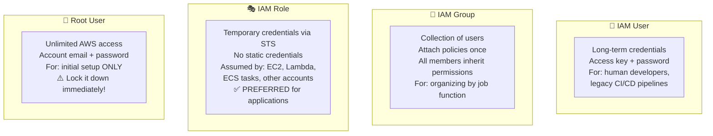
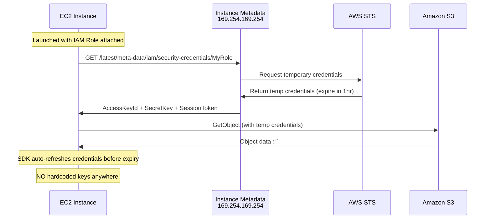

# Stage 06a — IAM: Identity & Access Management

> The security backbone of every AWS account. Master this to protect everything you build.

## 1. Core Intuition

Your AWS account is like a large office building with rooms full of valuable assets — servers, databases, files. Before anyone or anything can access a room, IAM asks three questions:

1. **Who are you?** (Authentication — prove your identity)
2. **What are you allowed to do?** (Authorization — check your permissions)
3. **Under what conditions?** (Conditions — IP address, MFA, time)

IAM answers all three for every API call made to AWS.

## 2. The Four IAM Identities



## 3. IAM Policies — The Permission Blueprint

```json
// Policy anatomy:
{
  "Version": "2012-10-17",
  "Statement": [
    {
      "Sid": "AllowS3BucketAccess",          // Statement ID (optional label)
      "Effect": "Allow",                      // Allow OR Deny
      "Action": [                             // Which API actions
        "s3:GetObject",
        "s3:PutObject",
        "s3:ListBucket"
      ],
      "Resource": [                           // Which resources
        "arn:aws:s3:::my-company-data",
        "arn:aws:s3:::my-company-data/*"
      ],
      "Condition": {                          // When (optional)
        "StringEquals": {
          "aws:RequestedRegion": "us-east-1"
        },
        "Bool": {
          "aws:MultiFactorAuthPresent": "true"
        }
      }
    }
  ]
}
```

### Policy Evaluation Logic

```
EVERY API call goes through this check:

                    ┌──────────────────────────┐
                    │  Is there an EXPLICIT     │
                    │  DENY anywhere?          │
                    └──────────┬───────────────┘
                  YES          │         NO
                   ↓           │          ↓
              ┌────────┐       │   ┌──────────────────────┐
              │ DENIED │       │   │  Is there an EXPLICIT │
              └────────┘       │   │  ALLOW anywhere?      │
                               │   └──────────┬────────────┘
                               │           YES│      NO
                               │             ↓        ↓
                               │       ┌─────────┐ ┌────────┐
                               │       │ ALLOWED │ │ DENIED │
                               │       └─────────┘ └────────┘
                               │                   (implicit deny)

REMEMBER: DENY always wins, and DEFAULT is DENY (if no ALLOW exists)
```

## 4. IAM Roles — The Right Way for Applications

### How an EC2 Instance Gets AWS Credentials



### Common Role Use Cases

```
EC2 → S3 access:
  Role trusted by: ec2.amazonaws.com
  Policy: s3:GetObject on specific bucket

Lambda → DynamoDB:
  Role trusted by: lambda.amazonaws.com
  Policy: dynamodb:GetItem, PutItem on specific table

ECS Task → Secrets Manager:
  Role trusted by: ecs-tasks.amazonaws.com (task role)
  Policy: secretsmanager:GetSecretValue

Cross-account access:
  Account A role trusted by: Account B (or specific role in B)
  Account B user assumes Account A role → gets temp creds for A

GitHub Actions → AWS (OIDC):
  Role trusted by: token.actions.githubusercontent.com
  Condition: repository matches "my-org/my-repo"
  → No stored AWS credentials in GitHub secrets!
```

## 5. AWS Organizations & Multi-Account

```
Production Setup for Large Companies:

Management Account (BILLING + GOVERNANCE ONLY)
├── OU: Production
│   ├── Account: prod-us (US production workloads)
│   ├── Account: prod-eu (EU workloads, GDPR compliant)
│   └── Account: prod-data (data lake, analytics)
├── OU: Development
│   ├── Account: dev-team-a
│   └── Account: dev-team-b
└── OU: Shared Services
    ├── Account: security (GuardDuty master, CloudTrail central)
    ├── Account: networking (Transit Gateway, Direct Connect)
    └── Account: tooling (CodePipeline, artifact repos)

Benefits:
  💰 Consolidated billing with volume discounts
  🔐 Blast radius isolation (dev mistake ≠ prod impact)
  📋 SCPs to enforce compliance policies
  📊 Cost visibility per team/environment
```

### Service Control Policies (SCPs)

```json
// SCP: Deny launching EC2 outside approved regions
{
  "Effect": "Deny",
  "Action": [
    "ec2:RunInstances",
    "ec2:CreateVpc"
  ],
  "Resource": "*",
  "Condition": {
    "StringNotEquals": {
      "aws:RequestedRegion": [
        "us-east-1",
        "us-west-2",
        "eu-west-1"
      ]
    }
  }
}
```

```json
// SCP: Deny root account actions (except specific ones)
{
  "Effect": "Deny",
  "Action": "*",
  "Resource": "*",
  "Condition": {
    "StringLike": {
      "aws:PrincipalArn": "arn:aws:iam::*:root"
    }
  }
}
```

## 6. AWS IAM Identity Center (SSO)

```
Problem: 10 AWS accounts. 50 developers.
         Each account needs separate IAM users?
         That's 500 users to manage. Nightmare.

Solution: IAM Identity Center (formerly AWS SSO)

Single login portal → access ALL your AWS accounts with ONE identity.

Setup:
  1. Connect to your identity provider:
     • Microsoft Active Directory (on-prem or AWS Managed AD)
     • Okta, OneLogin, Azure AD
     • Built-in IAM Identity Center store

  2. Define Permission Sets (IAM policies):
     • DeveloperAccess (EC2, S3, RDS read + Lambda)
     • AdminAccess (full access)
     • ReadOnlyAccess (view only)

  3. Assign Permission Sets to accounts:
     Engineering group → dev account → DeveloperAccess
     DevOps team → prod account → AdminAccess

  4. Users log in to SSO portal →
     See all accounts they have access to → Click → Use

Benefits:
  ✅ One identity for all accounts
  ✅ MFA enforced once
  ✅ Access automatically removed when HR terminates employee
  ✅ Temporary credentials (no static keys)
  ✅ Audit trail in CloudTrail

Console: IAM Identity Center → Enable → Configure identity source
```

## 7. Security Best Practices

```
Account Security Checklist:
━━━━━━━━━━━━━━━━━━━━━━━━━━━
✅ Enable MFA on root account (virtual or hardware)
✅ Remove root access keys (they shouldn't exist)
✅ Never use root for daily operations
✅ Set strong password policy (12+ chars, MFA required)
✅ Enable IAM Access Analyzer (find external access)
✅ Set up billing alarms ($10, $50, $100)

User Best Practices:
━━━━━━━━━━━━━━━━━━━━
✅ One IAM user per human (no shared accounts)
✅ MFA for all users
✅ Use IAM Identity Center instead of IAM users where possible
✅ Rotate access keys every 90 days
✅ Delete unused users and access keys immediately

Application Best Practices:
━━━━━━━━━━━━━━━━━━━━━━━━━━━
✅ Always use Roles for applications (EC2, Lambda, ECS)
✅ NEVER hardcode credentials (use roles or Secrets Manager)
✅ Principle of Least Privilege (minimal permissions)
✅ Use resource-level permissions (specific ARN, not *)
✅ Use Conditions in policies (MFA required, region restriction)
✅ Enable CloudTrail to log all IAM API calls
✅ Use IAM Access Analyzer to review permissions
```

## 8. Console Walkthrough

```
Exercise: Set up a secure IAM structure

1. Enable MFA on root:
   AWS Console → Top right → Account name → Security credentials
   Multi-factor authentication → Activate MFA
   Virtual MFA → Scan QR code with Google Authenticator app
   Enter 2 consecutive codes → Assign MFA

2. Create IAM Admin User (for daily use):
   IAM → Users → Create user
     Username: admin-user
     ✅ Provide user access to the AWS Management Console
     Custom password: (strong password)
     Next → Attach policies directly
     Select: AdministratorAccess
     Create user
   SAVE the console login URL + credentials

3. Create a Dev Group:
   IAM → User groups → Create group
     Name: Developers
     Attach policies: AmazonEC2FullAccess, AmazonS3FullAccess
   Add your admin-user to the Developers group

4. Create an Application Role:
   IAM → Roles → Create role
     Trusted entity: AWS service → EC2
     Permissions: AmazonS3ReadOnlyAccess
     Name: EC2-S3-ReadOnly-Role
   Launch an EC2 instance with this role attached
   SSH in → aws s3 ls → works without access keys!

5. Enable MFA on admin-user:
   IAM → Users → admin-user → Security credentials
   Assign MFA device

6. Enforce MFA in policy (optional advanced step):
   Create custom policy that denies all actions EXCEPT
   managing MFA devices, unless MFA is present
   Attach to all users
```

## 9. Interview Perspective

**Q: What is the difference between an IAM Role and an IAM User?**
User: permanent long-term credentials (access key + password). For humans or legacy CI/CD. Role: no permanent credentials. Generates temporary STS credentials when assumed. For applications, EC2, Lambda, ECS tasks, cross-account access. Always prefer Roles for applications — credentials rotate automatically and are never hardcoded.

**Q: How does an EC2 instance access S3 securely without hardcoded credentials?**
Attach an IAM Role with the required S3 policy as an EC2 Instance Profile. The AWS SDK inside the EC2 instance automatically fetches temporary credentials from the instance metadata service (http://169.254.169.254/latest/meta-data/iam/security-credentials/RoleName). Credentials auto-rotate before expiry. No hardcoded keys anywhere.

**Q: What is an SCP and what can it do?**
A Service Control Policy is attached at the AWS Organization OU or account level. It defines the MAXIMUM permissions any principal in that account can have. It doesn't grant permissions — it only restricts. Even an AdministratorAccess IAM policy cannot override an SCP denial. Used to enforce guardrails across all accounts in an organization.

**Q: What is IAM Identity Center?**
AWS's SSO service. It provides a single login portal for accessing multiple AWS accounts and applications. Integrates with corporate identity providers (Active Directory, Okta, Azure AD). Assigns Permission Sets (collections of IAM policies) to users/groups per account. Eliminates the need for IAM users in each account. All access uses temporary credentials.

---

**[🏠 Back to README](../README.md)**

**Prev:** [← Route 53 & CloudFront](../05_networking/route53_cloudfront.md) &nbsp;|&nbsp; **Next:** [KMS & Encryption →](../06_security/kms.md)

**Related Topics:** [KMS & Encryption](../06_security/kms.md) · [Cognito](../06_security/cognito.md) · [WAF, Shield & GuardDuty](../06_security/waf_shield_guardduty.md) · [VPC Networking](../05_networking/vpc.md)

---

## 📝 Practice Questions

- 📝 [Q13 · iam-basics](../aws_practice_questions_100.md#q13--normal--iam-basics)
- 📝 [Q14 · iam-policies](../aws_practice_questions_100.md#q14--thinking--iam-policies)
- 📝 [Q15 · iam-least-privilege](../aws_practice_questions_100.md#q15--interview--iam-least-privilege)
- 📝 [Q33 · iam-roles-ec2](../aws_practice_questions_100.md#q33--interview--iam-roles-ec2)
- 📝 [Q38 · security-iam-advanced](../aws_practice_questions_100.md#q38--normal--security-iam-advanced)
- 📝 [Q61 · iam-conditions](../aws_practice_questions_100.md#q61--normal--iam-conditions)
- 📝 [Q78 · explain-iam-roles](../aws_practice_questions_100.md#q78--interview--explain-iam-roles)
- 📝 [Q82 · scenario-data-breach](../aws_practice_questions_100.md#q82--design--scenario-data-breach)
- 📝 [Q94 · debug-iam-access-denied](../aws_practice_questions_100.md#q94--debug--debug-iam-access-denied)

