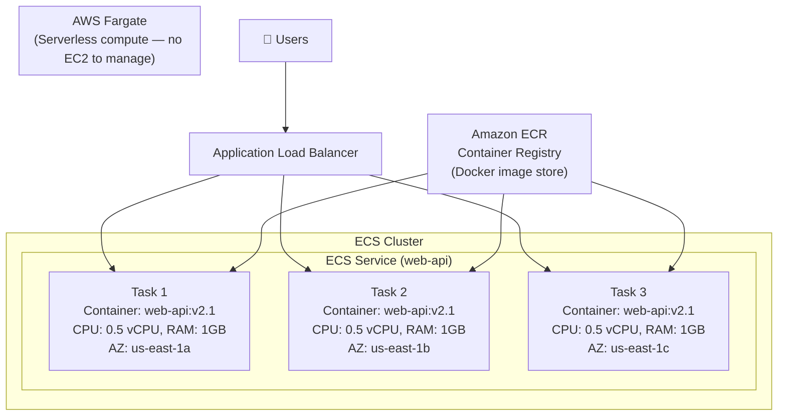

# Stage 10b — ECS: Elastic Container Service

> Run Docker containers on AWS without managing Kubernetes. The simpler path to containerized workloads.

## 1. Core Intuition

You've containerized your application with Docker. Now you need to run it in production: multiple copies, auto-restart on failure, rolling deploys, load balancing.

**ECS (Elastic Container Service)** is AWS's container orchestration platform. You describe what container to run, how much CPU/memory it needs, and how many copies — ECS handles scheduling, health monitoring, scaling, and deployment.

## 2. Story-Based Analogy — The Shipping Port

```
🚢 Docker Container = A standardized shipping container
   Your app + all its dependencies, packaged in a box.
   Runs the same everywhere.

🏗️ ECS = The port authority that manages the containers

ECR = The container warehouse (where you store your images)
Task Definition = The label on the container
                  (what image, how much CPU/RAM, env vars, ports)

Task = One running instance of your container
       (a single container on one "ship")

Service = The fleet manager
          "I need 5 copies of this task running at all times"
          "If one dies, launch a new one"
          "Roll out new version gradually"

Cluster = The entire port / collection of ships

Fargate = A fully automated port (no ships to manage)
EC2 Launch Type = You provide your own ships (EC2 instances)
                  More control, more work
```

## 3. ECS Architecture



## 4. Task Definitions

A Task Definition is a JSON blueprint for your container:

```json
{
  "family": "web-api",
  "networkMode": "awsvpc",
  "requiresCompatibilities": ["FARGATE"],
  "cpu": "512",
  "memory": "1024",
  "executionRoleArn": "arn:aws:iam::123456789012:role/ecsTaskExecutionRole",
  "taskRoleArn": "arn:aws:iam::123456789012:role/web-api-task-role",
  "containerDefinitions": [
    {
      "name": "web-api",
      "image": "123456789012.dkr.ecr.us-east-1.amazonaws.com/web-api:v2.1",
      "portMappings": [
        {
          "containerPort": 8080,
          "protocol": "tcp"
        }
      ],
      "environment": [
        { "name": "NODE_ENV", "value": "production" }
      ],
      "secrets": [
        {
          "name": "DB_PASSWORD",
          "valueFrom": "arn:aws:secretsmanager:us-east-1:123456789012:secret:db-password"
        }
      ],
      "logConfiguration": {
        "logDriver": "awslogs",
        "options": {
          "awslogs-group": "/ecs/web-api",
          "awslogs-region": "us-east-1",
          "awslogs-stream-prefix": "web-api"
        }
      },
      "healthCheck": {
        "command": ["CMD-SHELL", "curl -f http://localhost:8080/health || exit 1"],
        "interval": 30,
        "timeout": 5,
        "retries": 3
      }
    }
  ]
}
```

## 5. Fargate vs EC2 Launch Type

```
Fargate (Serverless):
━━━━━━━━━━━━━━━━━━━━━
✅ No EC2 instances to provision or manage
✅ Pay per task (CPU + Memory × seconds running)
✅ Automatic security patching of underlying OS
✅ Strong isolation (each task gets its own microVM)
✅ Scales instantly from 0 to 1,000 tasks
❌ More expensive per unit than equivalent EC2
❌ Limited to: 16 vCPU, 120GB RAM per task
❌ No access to underlying host

Best for:
  • Small/medium workloads
  • Variable traffic
  • Teams that want to minimize ops overhead
  • Microservices
  • Short-lived batch jobs

EC2 Launch Type:
━━━━━━━━━━━━━━━━
✅ Full control over EC2 instances
✅ Cheaper at scale (pack many tasks on one instance)
✅ Can use GPU instances (ML workloads)
✅ Use Reserved Instances for base capacity
✅ No task size limits
❌ You manage EC2 fleet (patching, scaling, AMIs)
❌ More operational overhead

Best for:
  • High-volume steady-state workloads
  • GPU workloads
  • When you need EC2-level customization
  • Cost-optimized large-scale deployments
```

## 6. ECS Service — Deployment Strategies

```
Rolling Update (default):
  Old tasks replaced gradually with new ones
  Minimum healthy: 100% → max: 200%
  (briefly runs old + new simultaneously)
  Console: Service → Update → Deployment configuration

Blue/Green via CodeDeploy:
  Green environment created alongside Blue
  Traffic shifted gradually: 10% → 50% → 100%
  Rollback: shift 100% back to Blue instantly
  Best for: zero-downtime production deploys

Circuit breaker:
  If new deployment fails health checks repeatedly
  ECS automatically rolls back to previous version
  Enable: Service → Deployment circuit breaker → Enable
```

## 7. Amazon ECR — Container Registry

```
ECR = AWS-managed Docker registry

Features:
  ✅ Private registries per AWS account/region
  ✅ Integrated IAM authentication (no Docker Hub login)
  ✅ Image vulnerability scanning (powered by Clair)
  ✅ Lifecycle policies (delete old images automatically)
  ✅ Replication to other regions
  ✅ Free for data transfer to ECS/EKS in same region

Push an image to ECR:
  # 1. Login to ECR
  aws ecr get-login-password --region us-east-1 | \
    docker login --username AWS \
    --password-stdin 123456789012.dkr.ecr.us-east-1.amazonaws.com

  # 2. Build and tag your image
  docker build -t web-api .
  docker tag web-api:latest \
    123456789012.dkr.ecr.us-east-1.amazonaws.com/web-api:v2.1

  # 3. Push to ECR
  docker push 123456789012.dkr.ecr.us-east-1.amazonaws.com/web-api:v2.1

  # View in Console: ECR → Repositories → web-api → Images
```

## 8. Console Walkthrough — Deploy a Container App

```
Step 1: Create ECR Repository
━━━━━━━━━━━━━━━━━━━━━━━━━━━━━━
Console: ECR → Create repository
  Visibility: Private
  Name: my-web-app
  Scan on push: Enable

Push your Docker image (follow the "View push commands" button)

━━━━━━━━━━━━━━━━━━━━━━━━━━━━━━━━━━━━━━━━━━━━━━━━━━━━━━━━━━━━━━

Step 2: Create ECS Cluster
━━━━━━━━━━━━━━━━━━━━━━━━━━
Console: ECS → Clusters → Create cluster
  Cluster name: production-cluster
  Infrastructure: AWS Fargate (serverless) ← simplest

━━━━━━━━━━━━━━━━━━━━━━━━━━━━━━━━━━━━━━━━━━━━━━━━━━━━━━━━━━━━━━

Step 3: Create Task Definition
━━━━━━━━━━━━━━━━━━━━━━━━━━━━━━
Console: ECS → Task definitions → Create new

  Task definition family: my-web-app
  Infrastructure: Fargate
  CPU: 0.5 vCPU
  Memory: 1 GB

  Container 1:
    Name: my-web-app
    Image URI: [your ECR image URI]
    Port mappings: 8080 TCP
    Log collection: Amazon CloudWatch Logs (auto-creates log group)

  Task execution role: ecsTaskExecutionRole (create if not exists)

━━━━━━━━━━━━━━━━━━━━━━━━━━━━━━━━━━━━━━━━━━━━━━━━━━━━━━━━━━━━━━

Step 4: Create ECS Service
━━━━━━━━━━━━━━━━━━━━━━━━━━
Console: ECS → Cluster → Create service

  Launch type: Fargate
  Task definition: my-web-app (latest)
  Service name: web-app-service
  Desired tasks: 2

  Networking:
    VPC: your VPC
    Subnets: private subnets (2 AZs)
    Security group: allow port 8080 from ALB security group
    Public IP: Disabled (private, ALB handles public traffic)

  Load balancing:
    Load balancer type: Application Load Balancer
    Load balancer: create new or use existing
    Target group: create new (port 8080)
    Health check path: /health

━━━━━━━━━━━━━━━━━━━━━━━━━━━━━━━━━━━━━━━━━━━━━━━━━━━━━━━━━━━━━━

After creation:
  Watch 2 tasks start in Cluster → Tasks tab
  ALB DNS name → opens your app in browser!

To deploy a new version:
  Push new image to ECR with new tag
  ECS → Service → Update → Update task definition to new version
  ECS rolls out new tasks, removes old ones
```

## 9. Interview Perspective

**Q: What is the difference between ECS and EKS?**
ECS is AWS-native, simpler to set up and operate, uses Task Definitions, tightly integrated with AWS services. EKS is managed Kubernetes — full K8s compatibility, works with any K8s tooling (Helm, ArgoCD, etc.), more complex to operate, better for teams already invested in Kubernetes. ECS is the better choice unless your team has K8s expertise or you need K8s-specific features.

**Q: What is Fargate and when would you use it?**
Fargate is serverless compute for ECS/EKS. You don't provision or manage EC2 instances — just define CPU and memory per task. AWS handles the underlying hosts. Use Fargate when: you want minimal ops overhead, variable workloads, strong task isolation, or you're just starting with containers. Use EC2 launch type when: high volume steady workloads (cheaper), GPU tasks, or you need EC2-level customization.

**Q: How does an ECS task access AWS services (like S3 or DynamoDB)?**
Attach an IAM Task Role to the Task Definition. The ECS agent injects temporary credentials into the task's metadata endpoint. The SDK inside the container automatically fetches these credentials. This is separate from the Task Execution Role (which ECS uses to pull images from ECR and write logs to CloudWatch).

---

**[🏠 Back to README](../README.md)**

**Prev:** [← CDK & Terraform](../09_iac/cdk_terraform.md) &nbsp;|&nbsp; **Next:** [EKS →](../10_containers/eks.md)

**Related Topics:** [EKS](../10_containers/eks.md) · [Lambda](../11_serverless/lambda.md) · [CloudWatch & Observability](../08_monitoring/cloudwatch.md) · [CI/CD Pipeline](../13_devops_cicd/cicd_pipeline.md)
