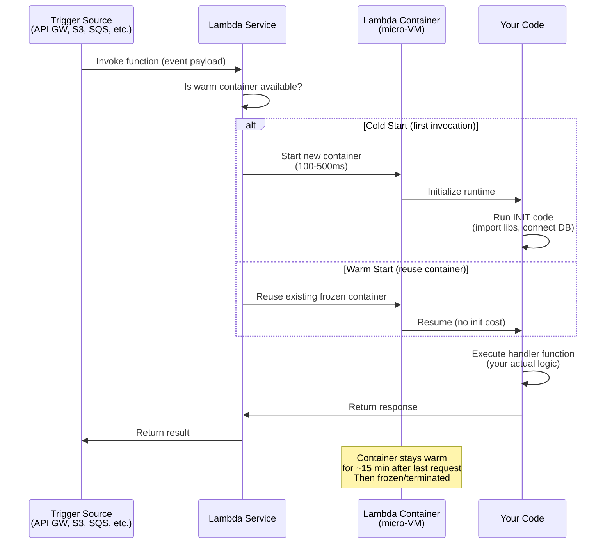
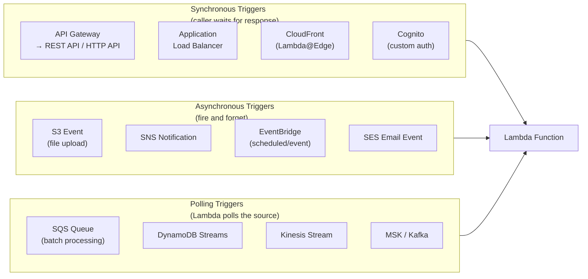

# Stage 11a — Lambda: Serverless Compute

> Run code without managing servers. Pay only when your code runs. Scale from 0 to 10,000 executions in seconds.

## 1. Core Intuition

Traditional server model:
- Server runs 24/7
- You pay for 24 hours even if requests only come for 2 hours
- You must scale manually or configure auto-scaling

**Lambda model:**
- Upload your code
- AWS runs it when triggered
- Pay only for the milliseconds your code runs
- Scale from 0 to 10,000 concurrent executions automatically

Lambda is the heart of **serverless architecture** on AWS.

## 2. Story-Based Analogy — The On-Call Doctor

```
Traditional server = A doctor who sits in the office all day
  Paid for 8 hours, sees patients for only 2 hours.
  Available immediately but costly when idle.

Lambda = An on-call doctor
  Home relaxing (no cost). Phone rings (event trigger).
  Drives to hospital (cold start: 100–500ms first call).
  Treats patient (executes your code: milliseconds to minutes).
  Drives home (Lambda function ends, container freezes).

Multiple patients at once:
  Traditional server = doctor can only see 1 patient at a time.
  Lambda = 1,000 doctors, one per patient, all at the same time.

You're billed ONLY for the doctor's active treatment time.
Not for waiting at home.
```

## 3. How Lambda Works



## 4. Lambda Configuration

### Supported Runtimes (2024)

```
Languages:
  Python    3.12, 3.11, 3.10, 3.9
  Node.js   20.x, 18.x
  Java      21, 17, 11, 8 (Corretto)
  .NET      8.0, 6.0
  Ruby      3.3, 3.2
  Go        1.x (provided.al2023)
  Rust      (provided.al2023 custom runtime)
  Custom Runtime  → bring any language!

Container Images:
  Package as Docker image (up to 10 GB)
  Push to Amazon ECR, reference in Lambda
  Use for: large ML models, complex dependencies
```

### Key Configuration Parameters

```
Memory: 128 MB – 10,240 MB (10 GB)
  → Memory also determines CPU allocation
  → More memory = more vCPU proportionally
  → 1,769 MB = ~1 vCPU

Timeout: 1 second – 15 minutes (900 seconds)
  Default: 3 seconds
  Set based on your function's expected duration

Concurrency:
  Default account limit: 1,000 concurrent executions
  Reserved Concurrency: guarantee N invocations for this function
  Provisioned Concurrency: keep N warm containers ready (eliminate cold starts)

Ephemeral Storage (/tmp):
  Default: 512 MB
  Maximum: 10,240 MB (10 GB)
  Used for temp files during execution. Cleared after function ends.

Environment Variables:
  Key-value pairs available in your code
  Best practice: store secrets in Secrets Manager, reference via env var
```

## 5. Event Triggers

Lambda functions are **event-driven** — something triggers them:



### Trigger Examples

```
S3 → Lambda:
  A user uploads a profile photo to S3
  S3 triggers Lambda with file info
  Lambda resizes the image, saves thumbnail back to S3

API Gateway → Lambda:
  User calls POST /api/users
  API Gateway invokes Lambda synchronously
  Lambda reads body, writes to DynamoDB, returns 201

SQS → Lambda:
  Order service puts orders in SQS queue
  Lambda polls queue in batches of 10
  Lambda processes each order, sends confirmation email
  Lambda deletes message from queue (success)
  On failure → message returns to queue or goes to DLQ

EventBridge (scheduled):
  Every Sunday at 2am → EventBridge → Lambda
  Lambda cleans up expired sessions from DynamoDB
  (Cron job replacement — no EC2 needed!)

DynamoDB Streams → Lambda:
  Every DynamoDB table change triggers Lambda
  Lambda syncs change to Elasticsearch for search
  (Change Data Capture pattern)
```

## 6. Lambda Function Anatomy

```python
import json
import boto3

# INIT PHASE - runs once per container lifecycle
# (not per invocation — expensive things go here)
dynamodb = boto3.resource('dynamodb')
table = dynamodb.Table('Users')  # Connection reused across invocations

def lambda_handler(event, context):
    """
    HANDLER PHASE - runs on every invocation

    event: the triggering data (API GW request, S3 event, etc.)
    context: Lambda runtime info (function name, memory, time remaining)
    """

    # Parse the incoming request
    body = json.loads(event.get('body', '{}'))
    user_id = body.get('userId')

    if not user_id:
        return {
            'statusCode': 400,
            'body': json.dumps({'error': 'userId required'})
        }

    # Business logic
    try:
        response = table.get_item(Key={'userId': user_id})
        user = response.get('Item')

        if not user:
            return {
                'statusCode': 404,
                'body': json.dumps({'error': 'User not found'})
            }

        return {
            'statusCode': 200,
            'headers': {'Content-Type': 'application/json'},
            'body': json.dumps(user)
        }
    except Exception as e:
        print(f"Error: {e}")  # Logged to CloudWatch automatically
        return {
            'statusCode': 500,
            'body': json.dumps({'error': 'Internal server error'})
        }
```

```javascript
// Node.js Lambda
const { DynamoDBClient, GetItemCommand } = require('@aws-sdk/client-dynamodb');

// INIT PHASE (runs once per container)
const client = new DynamoDBClient({ region: 'us-east-1' });

// HANDLER (runs per invocation)
exports.handler = async (event) => {
    const userId = event.pathParameters?.userId;

    const command = new GetItemCommand({
        TableName: 'Users',
        Key: { userId: { S: userId } }
    });

    const result = await client.send(command);

    return {
        statusCode: 200,
        body: JSON.stringify(result.Item)
    };
};
```

## 7. Cold Starts — The Main Trade-off

```
Cold Start = The delay when Lambda starts a new container

Timeline:
  0ms:   Request arrives
  50ms:  AWS starts new container (microVM)
  100ms: Runtime downloads and starts (Python/Node: faster, Java: slower)
  200ms: Your INIT code runs (imports, connections)
  500ms: Your handler function runs
  ——————
  Total: ~500ms cold start delay (Python/Node), ~2s (Java)

Subsequent requests (warm):
  0ms:  Request arrives
  0ms:  Existing container reused
  1ms:  Handler runs directly
  Total: ~1ms (warm)

How to minimize cold starts:
━━━━━━━━━━━━━━━━━━━━━━━━━━━
1. Provisioned Concurrency:
   Keep N containers pre-warmed and ready
   Cost: ~$0.015/GB-hour for provisioned + normal invocation cost
   Best for: production APIs where latency matters

2. Choose faster runtimes:
   Python/Node.js: fastest cold starts (~100ms)
   Java: slowest (~2-3s) → use GraalVM native compilation to speed up

3. Keep packages small:
   Fewer imports = faster initialization
   Use Lambda Layers for shared dependencies

4. Keep connection pool in INIT phase:
   Initialize database connections once, reuse across invocations
   Don't open new connections inside the handler
```

## 8. Lambda Layers

```
Problem:
  Every Lambda function needs numpy, pandas, boto3 extensions.
  Including them in each function package = slow deploys, large packages.

Solution: Lambda Layers
  Package libraries ONCE as a Layer.
  Multiple functions reference the same Layer.
  Layer is cached on the Lambda infrastructure.

                 pandas-layer (50MB)
                      │
         ┌────────────┼────────────┐
         │            │            │
    Function A    Function B   Function C
    (1MB code)    (2MB code)   (1.5MB code)
    all share the same pandas layer

Layer limits:
  Up to 5 layers per function
  Total unzipped: 250MB (including function code)

Create a layer:
  Console: Lambda → Layers → Create layer
  Or: ZIP your library → upload to S3 → create layer from S3

Use cases:
  ✅ Shared libraries (pandas, numpy, sqlalchemy)
  ✅ Common utility code across team functions
  ✅ Lambda extensions (monitoring agents, secrets providers)
  ✅ Runtime binaries (ffmpeg, chrome-headless)
```

## 9. Lambda Concurrency & Throttling

```
Concurrency = how many requests run simultaneously

Account default: 1,000 concurrent Lambda executions (soft limit)
Burst limit: 500–3,000 (region-dependent, per-minute limit for new concurrency)

Types:
━━━━━━━━━━━━━━━━━━━━━━━━━━━━━━━━━━━━━━━━━━━━━━━━

Unreserved Concurrency:
  All functions share the 1,000 pool
  One spiky function can starve others

Reserved Concurrency:
  Set aside X executions for THIS function only
  Other functions can't use this capacity
  Also acts as a MAX cap (throttle function beyond X)
  Use for: critical functions that need guaranteed capacity
           OR limiting noisy functions

Provisioned Concurrency:
  Pre-warm X containers NOW, always ready
  Eliminates cold starts
  Costs extra even when idle
  Use for: customer-facing APIs with strict latency requirements

Throttling:
  When concurrency limit hit → Lambda returns 429 error
  API Gateway: returns 429 to client
  SQS trigger: message stays in queue and retried
  Async events: retried twice with 1 min, 2 min delays
  → Then goes to Dead Letter Queue (DLQ) if configured
```

## 10. Lambda Pricing

```
Lambda pricing has two components:

1. Invocations:
   First 1 million requests/month: FREE
   After: $0.20 per 1 million requests

2. Duration (GB-seconds):
   First 400,000 GB-seconds/month: FREE
   After: $0.0000166667 per GB-second

   GB-second = (memory in GB) × (duration in seconds)
   512MB × 1 second = 0.5 GB-seconds
   1GB × 0.5 second = 0.5 GB-seconds

Example cost calculation:
  Function: 1M invocations/month, 200ms each, 512MB memory
  Duration: 1M × 0.2s × 0.5GB = 100,000 GB-seconds
  Cost: 100,000 × $0.0000166667 = $1.67/month
  Invocations: $0.20 (after 1M free)
  Total: ~$1.87/month

Compare: EC2 t3.micro = ~$8/month (running 24/7)

Lambda wins for sporadic or low-volume workloads.
EC2 wins for sustained high-throughput workloads.
```

## 11. Console Walkthrough — Create Your First Lambda

```
Step 1: Create Function
━━━━━━━━━━━━━━━━━━━━━━━
Console: Lambda → Functions → Create function

  Author from scratch
  Function name: hello-world-lambda
  Runtime: Python 3.12
  Architecture: x86_64 (or arm64 for Graviton — cheaper, slightly faster)
  Execution role:
    Create new role with basic Lambda permissions
    → This creates a role that can write logs to CloudWatch

━━━━━━━━━━━━━━━━━━━━━━━━━━━━━━━━━━━━━━━━━━━━━━━━━━━━━━━━━━━━━━

Step 2: Write Your Code (Inline Editor)
━━━━━━━━━━━━━━━━━━━━━━━━━━━━━━━━━━━━━━━
In the code editor, replace with:

import json

def lambda_handler(event, context):
    name = event.get('name', 'World')
    return {
        'statusCode': 200,
        'body': json.dumps({
            'message': f'Hello, {name}!',
            'input': event
        })
    }

Click: Deploy

━━━━━━━━━━━━━━━━━━━━━━━━━━━━━━━━━━━━━━━━━━━━━━━━━━━━━━━━━━━━━━

Step 3: Test Your Function
━━━━━━━━━━━━━━━━━━━━━━━━━━
Click: Test → Create new test event
  Event name: test-event
  Event JSON:
  {
    "name": "AWS Learner"
  }
Click: Test

You'll see:
  Status: Succeeded
  Response: {"statusCode": 200, "body": "\"Hello, AWS Learner!\""}
  Duration: Xms (first call = cold start)
  Logs: (click "View logs" to see CloudWatch output)

━━━━━━━━━━━━━━━━━━━━━━━━━━━━━━━━━━━━━━━━━━━━━━━━━━━━━━━━━━━━━━

Step 4: Add an API Gateway Trigger
━━━━━━━━━━━━━━━━━━━━━━━━━━━━━━━━━━
Function → + Add trigger → API Gateway
  Create a new API → HTTP API → Security: Open

Copy the API Endpoint URL.
Visit in browser: https://xxxxx.execute-api.us-east-1.amazonaws.com/
  → Returns your JSON response!

━━━━━━━━━━━━━━━━━━━━━━━━━━━━━━━━━━━━━━━━━━━━━━━━━━━━━━━━━━━━━━

Step 5: Add Environment Variables
━━━━━━━━━━━━━━━━━━━━━━━━━━━━━━━━━━
Configuration → Environment variables → Edit → Add
  Key: GREETING_TEXT   Value: "Welcome to Serverless!"

Access in code:
  import os
  greeting = os.environ['GREETING_TEXT']
```

## 12. Lambda@Edge & CloudFront Functions

```
Lambda@Edge:
  Run Lambda at CloudFront edge locations (400+ locations)
  Triggered on:
    Viewer request  → when user hits CloudFront
    Viewer response → before response returned to user
    Origin request  → before CloudFront calls your origin
    Origin response → before CloudFront caches origin response

  Use cases:
    ✅ A/B testing (rewrite URLs based on cookie)
    ✅ Authentication at edge (check JWT before origin)
    ✅ Dynamic redirects
    ✅ Modify headers globally

  Limits:
    Max 5s for viewer events, 30s for origin events
    128MB memory maximum
    Cannot use env variables (use CloudFront Functions for simple logic)

CloudFront Functions (newer, cheaper, faster):
  Runs in <1ms (ultra-lightweight)
  Use for: URL rewrites, header manipulation, token validation
  Up to 10M executions/s at ~$0.10/million (much cheaper than Lambda@Edge)
```

## 13. Common Mistakes

```
❌ Opening new database connections inside the handler
   → Each invocation creates a new connection → DB connection exhaustion
   ✅ Initialize connections in INIT phase (outside handler)
      Or use RDS Proxy to manage connections

❌ Packaging dependencies in every function
   → Large deployment packages → slow cold starts
   ✅ Use Lambda Layers for shared libraries

❌ Setting timeout too low
   → Function times out on slightly slow days
   ✅ Profile your function under load. Set timeout to 3x average duration.

❌ Not configuring a Dead Letter Queue (DLQ)
   → Async failures silently lost
   ✅ Configure DLQ (SQS or SNS) for async invocations
      Monitor it with CloudWatch alarms

❌ Storing temporary data in /tmp between invocations
   → /tmp is NOT cleared between warm invocations
      (can cause issues if another invocation reads stale data)
   ✅ Use /tmp only for data needed within a single invocation.
      Or explicitly clean up at end of handler.

❌ Ignoring cold starts for customer-facing APIs
   ✅ Use Provisioned Concurrency for APIs where <200ms matters
```

## 14. Interview Perspective

**Q: What is a Lambda cold start and how do you minimize it?**
A cold start occurs when Lambda needs to start a new container to handle a request. It involves downloading the code, starting the runtime, and running initialization code. This adds 100ms–3s latency. Minimize with: (1) Provisioned Concurrency for critical functions, (2) Use Python/Node.js instead of Java, (3) Keep packages small, (4) Move expensive operations to INIT phase (outside the handler), (5) Use Lambda SnapStart for Java.

**Q: What is the difference between reserved and provisioned concurrency?**
Reserved concurrency: Allocates a maximum number of concurrent executions for a function. It guarantees that other functions can't take capacity away AND caps the function at that limit. No warm containers pre-created. Provisioned concurrency: Pre-warms a specific number of containers and keeps them ready. Eliminates cold starts entirely for those containers. More expensive.

**Q: How does Lambda handle SQS events and what happens on failure?**
Lambda polls SQS using an Event Source Mapping. It retrieves batches of messages (configurable batch size) and invokes your function with the batch. If the function succeeds, Lambda deletes the messages. If it fails, the messages return to the queue after the visibility timeout expires and are retried. After the maximum retries, they go to the Dead Letter Queue (if configured).

## 15. Mini Exercise

```
✍️ Hands-On: Build a Serverless API

1. Create Lambda function: image-resizer (Python)
   - Triggered by S3 PUT event
   - Reads the uploaded image from S3
   - Resizes to 200x200 thumbnail
   - Saves thumbnail to a different S3 bucket
   (Use Pillow library via Lambda Layer or container image)

2. Create a CRUD API:
   - Lambda function: user-api
   - Runtime: Python 3.12
   - DynamoDB table: Users (partition key: userId)
   - API Gateway HTTP API → Lambda
   - Test endpoints:
     GET /users/{id} → fetch user
     POST /users → create user

3. Add environment variables:
   TABLE_NAME = Users
   REGION = us-east-1

4. Add error handling and Dead Letter Queue:
   - Create SQS queue: lambda-dlq
   - Lambda → Configuration → Asynchronous invocation
   - Set DLQ to your SQS queue
   - Manually send a bad event and check DLQ

5. Check CloudWatch Logs:
   Lambda → Monitor → View logs in CloudWatch
   See every invocation, error, duration, memory used
```

---

**[🏠 Back to README](../README.md)**

**Prev:** [← EKS](../10_containers/eks.md) &nbsp;|&nbsp; **Next:** [API Gateway →](../11_serverless/api_gateway.md)

**Related Topics:** [API Gateway](../11_serverless/api_gateway.md) · [SQS, SNS & EventBridge](../11_serverless/sqs_sns_eventbridge.md) · [Step Functions](../11_serverless/step_functions.md) · [DynamoDB](../07_databases/dynamodb.md)

---

## 📝 Practice Questions

- 📝 [Q22 · lambda-basics](../aws_practice_questions_100.md#q22--normal--lambda-basics)
- 📝 [Q23 · lambda-limits](../aws_practice_questions_100.md#q23--normal--lambda-limits)
- 📝 [Q24 · lambda-cold-start](../aws_practice_questions_100.md#q24--thinking--lambda-cold-start)
- 📝 [Q69 · lambda-layers](../aws_practice_questions_100.md#q69--thinking--lambda-layers)
- 📝 [Q70 · lambda-concurrency](../aws_practice_questions_100.md#q70--thinking--lambda-concurrency)
- 📝 [Q80 · explain-lambda-cold-start](../aws_practice_questions_100.md#q80--interview--explain-lambda-cold-start)
- 📝 [Q83 · scenario-lambda-timeout](../aws_practice_questions_100.md#q83--design--scenario-lambda-timeout)
- 📝 [Q93 · predict-lambda-timeout](../aws_practice_questions_100.md#q93--logical--predict-lambda-timeout)
- 📝 [Q96 · debug-lambda-environment](../aws_practice_questions_100.md#q96--debug--debug-lambda-environment)
- 📝 [Q100 · edge-case-lambda-concurrency](../aws_practice_questions_100.md#q100--critical--edge-case-lambda-concurrency)

