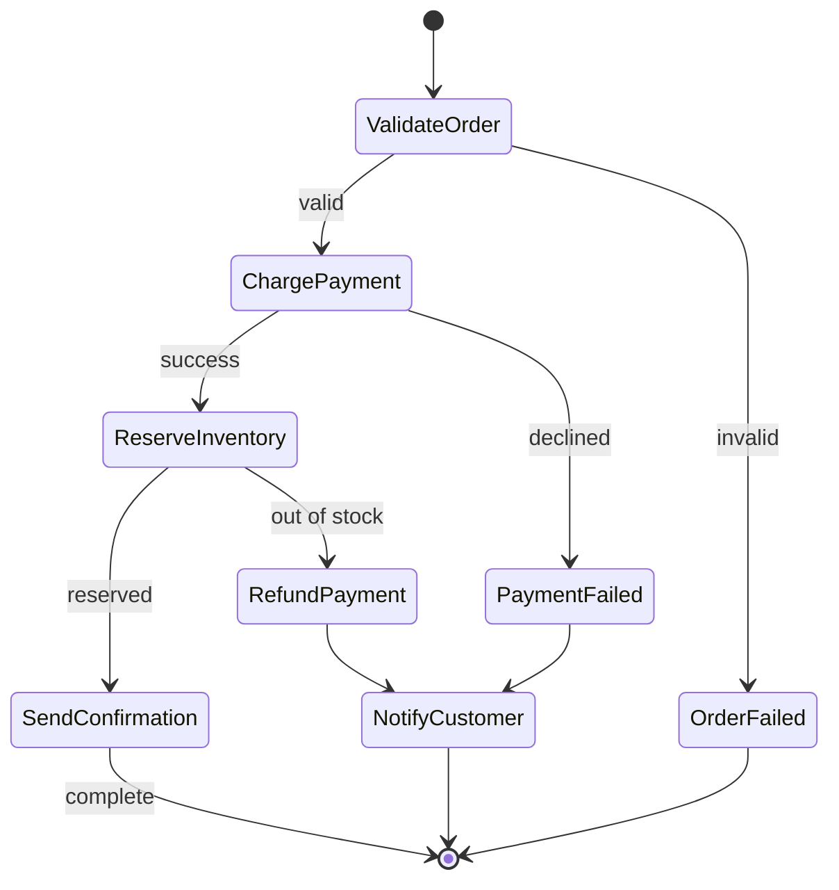

# Stage 11d — Step Functions: Serverless Workflows

> Orchestrate multi-step processes as visual state machines — without writing the glue code, retries, or error handling yourself.

---

## 1. Core Intuition

Imagine you need to process an order:
1. Validate the order
2. Charge the payment
3. Reserve inventory
4. Send confirmation email
5. If payment fails → refund any reserved inventory → notify customer

Writing this in a single Lambda = spaghetti code with `try/except` everywhere, manual retry loops, and state passing between steps.

**Step Functions** = Define this workflow as a **state machine** (a visual flow diagram that AWS executes). Each step is a state, transitions are arrows, and AWS handles the retries, error handling, and state passing for you.

---

## 2. State Machine Concepts

```
State Machine = A workflow defined in Amazon States Language (JSON/YAML)

State types:
  Task:      Do something (invoke Lambda, call AWS service, run ECS task)
  Choice:    Branch on a condition (if payment=success → inventory, else → refund)
  Wait:      Pause for N seconds or until a timestamp
  Parallel:  Run multiple branches simultaneously
  Map:       Process each item in an array (like forEach)
  Pass:      Pass input to output (transform/inject data)
  Succeed:   End with success
  Fail:      End with failure
```

---

## 3. Order Processing Workflow



---

## 4. State Machine Definition (ASL)

```json
{
  "Comment": "Order processing workflow",
  "StartAt": "ValidateOrder",
  "States": {
    "ValidateOrder": {
      "Type": "Task",
      "Resource": "arn:aws:lambda:us-east-1:123456789:function:validate-order",
      "Retry": [{
        "ErrorEquals": ["Lambda.ServiceException", "Lambda.TooManyRequestsException"],
        "IntervalSeconds": 2,
        "MaxAttempts": 3,
        "BackoffRate": 2.0
      }],
      "Catch": [{
        "ErrorEquals": ["ValidationError"],
        "Next": "OrderFailed"
      }],
      "Next": "ChargePayment"
    },

    "ChargePayment": {
      "Type": "Task",
      "Resource": "arn:aws:lambda:us-east-1:123456789:function:charge-payment",
      "Catch": [{
        "ErrorEquals": ["PaymentDeclinedError"],
        "ResultPath": "$.paymentError",
        "Next": "NotifyCustomer"
      }],
      "Next": "ParallelFulfillment"
    },

    "ParallelFulfillment": {
      "Type": "Parallel",
      "Branches": [
        {
          "StartAt": "ReserveInventory",
          "States": {
            "ReserveInventory": {
              "Type": "Task",
              "Resource": "arn:aws:lambda:us-east-1:123456789:function:reserve-inventory",
              "End": true
            }
          }
        },
        {
          "StartAt": "SendConfirmationEmail",
          "States": {
            "SendConfirmationEmail": {
              "Type": "Task",
              "Resource": "arn:aws:states:::sns:publish",
              "Parameters": {
                "TopicArn": "arn:aws:sns:us-east-1:123456789:order-confirmations",
                "Message.$": "States.Format('Order {} confirmed!', $.orderId)"
              },
              "End": true
            }
          }
        }
      ],
      "Next": "OrderComplete"
    },

    "OrderComplete": {
      "Type": "Succeed"
    },

    "OrderFailed": {
      "Type": "Fail",
      "Error": "ValidationFailed",
      "Cause": "Order validation failed"
    },

    "NotifyCustomer": {
      "Type": "Task",
      "Resource": "arn:aws:lambda:us-east-1:123456789:function:notify-customer",
      "Next": "OrderFailed"
    }
  }
}
```

---

## 5. Map State — Process Arrays

```json
// Process each item in an array in parallel
{
  "ProcessOrderItems": {
    "Type": "Map",
    "ItemsPath": "$.orderItems",
    "MaxConcurrency": 5,         // process 5 items at a time
    "Iterator": {
      "StartAt": "CheckInventory",
      "States": {
        "CheckInventory": {
          "Type": "Task",
          "Resource": "arn:aws:lambda:...:function:check-inventory",
          "End": true
        }
      }
    },
    "Next": "AllItemsChecked"
  }
}
```

---

## 6. Wait for Human Approval (Callback Pattern)

```
Problem: You need a human to approve an order > $10,000
         Lambda can't just wait — it times out after 15 min

Solution: .waitForTaskToken pattern
  1. Lambda sends approval request email with a token
  2. State machine PAUSES — no Lambda running, no cost
  3. Human clicks Approve/Reject in email
  4. Lambda receives click → calls SendTaskSuccess/SendTaskFailure
  5. State machine RESUMES from where it paused

Can wait: up to 1 year!
```

```json
{
  "WaitForApproval": {
    "Type": "Task",
    "Resource": "arn:aws:states:::lambda:invoke.waitForTaskToken",
    "Parameters": {
      "FunctionName": "send-approval-email",
      "Payload": {
        "orderId.$": "$.orderId",
        "amount.$": "$.total",
        "taskToken.$": "$$.Task.Token"   // token passed to Lambda
      }
    },
    "HeartbeatSeconds": 86400,           // fail if no response in 24h
    "Next": "ProcessApprovedOrder"
  }
}
```

```python
# Lambda sends email with approve/reject links containing the token
def handler(event, context):
    task_token = event['taskToken']
    order_id = event['orderId']

    # Encode token into URL (or store in DB, reference by short ID)
    approve_url = f"https://myapp.com/approve?token={task_token}"
    reject_url  = f"https://myapp.com/reject?token={task_token}"

    # Send email with the links
    ses.send_email(
        to='manager@company.com',
        subject=f'Approval needed: Order {order_id}',
        body=f'Approve: {approve_url}\nReject: {reject_url}'
    )

# When human clicks Approve:
def approve_handler(event, context):
    task_token = event['queryStringParameters']['token']
    sfn = boto3.client('stepfunctions')
    sfn.send_task_success(
        taskToken=task_token,
        output=json.dumps({'approved': True})
    )
```

---

## 7. Step Functions Express vs Standard

```
                Standard Workflows          Express Workflows
Duration:       Up to 1 year               Up to 5 minutes
Execution model: At-least-once             At-least-once (async)
                                           Exactly-once (sync)
Pricing:        $0.025 per 1,000           $1.00 per million transitions
                state transitions           + duration
Execution history: Yes (in console)        CloudWatch Logs only
Use for:        Long-running, human        High-volume, short-lived
                approval workflows,        (IoT ingestion, streaming
                order processing           data processing)
```

---

## 8. AWS Service Integrations (No Lambda Needed!)

```
Step Functions can directly call 200+ AWS services:

  DynamoDB:   PutItem, GetItem, UpdateItem
  SQS:        SendMessage
  SNS:        Publish
  ECS:        RunTask (start a container, wait for completion)
  Glue:       StartJobRun (run ETL job, wait for completion)
  SageMaker:  CreateTrainingJob (train ML model, wait)
  Lambda:     Invoke
  Bedrock:    InvokeModel (call AI model)
  S3:         PutObject, GetObject

Example — run ECS task and wait for completion:
{
  "RunDataProcessing": {
    "Type": "Task",
    "Resource": "arn:aws:states:::ecs:runTask.sync",
    "Parameters": {
      "Cluster": "my-cluster",
      "TaskDefinition": "data-processor",
      "LaunchType": "FARGATE",
      "Overrides": {
        "ContainerOverrides": [{
          "Name": "processor",
          "Environment": [{"Name": "INPUT_FILE", "Value.$": "$.s3Key"}]
        }]
      }
    },
    "Next": "ProcessingComplete"
  }
}
```

---

## 9. Console Walkthrough

```
Create State Machine:
━━━━━━━━━━━━━━━━━━━━
Step Functions → State machines → Create state machine

Design option 1: Workflow Studio (drag-and-drop visual builder)
  Drag Task states, connect with arrows
  Click state → configure Lambda ARN, retry logic
  Generates ASL JSON automatically

Design option 2: Code editor
  Paste your ASL JSON directly
  Real-time preview on the right

Configure:
  Type: Standard or Express
  Name: order-processing
  IAM role: create new (grants invoke permissions for your Lambdas)

Test:
  Start execution → input:
  {
    "orderId": "ORD-123",
    "total": 99.99,
    "items": ["laptop"]
  }

View execution:
  Visual flow shows which state is running
  Green = succeeded, Red = failed
  Click any state → see input/output data
```

---

## 10. Interview Perspective

**Q: When would you use Step Functions instead of writing everything in one Lambda?**
Step Functions shine when you have multi-step workflows with branching logic, error handling, retries, and long waits. A single Lambda trying to orchestrate 10 steps becomes spaghetti code. Step Functions provides: visual workflow, built-in retry/catch per step, parallel execution, waiting up to a year without compute cost, and a full execution history for debugging. Use Lambda for simple single-purpose functions; Step Functions for complex workflows.

**Q: What is the waitForTaskToken pattern?**
It allows a Step Functions workflow to pause while waiting for an external system or human to complete a task. The state machine passes a unique token to a Lambda, which embeds it in an email/webhook/ticket. The workflow pauses (no compute cost). When the human/system responds, they call `SendTaskSuccess` or `SendTaskFailure` with the token, resuming the workflow. Can pause for up to a year — perfect for human approval workflows.

**Q: What is the difference between Standard and Express workflows?**
Standard workflows support execution up to 1 year, have exactly-once execution semantics, maintain full execution history in the console, and cost $0.025 per 1,000 state transitions. Use for long-running business processes (order fulfillment, approval workflows). Express workflows support up to 5 minutes, are designed for high-volume event processing (thousands/second), and cost per request + duration. Use for real-time data processing, microservice orchestration, IoT event handling.

---

**[🏠 Back to README](../README.md)**

**Prev:** [← SQS, SNS & EventBridge](../11_serverless/sqs_sns_eventbridge.md) &nbsp;|&nbsp; **Next:** [Kinesis Streaming →](../12_data_analytics/kinesis.md)

**Related Topics:** [Lambda](../11_serverless/lambda.md) · [SQS, SNS & EventBridge](../11_serverless/sqs_sns_eventbridge.md) · [CI/CD Pipeline](../13_devops_cicd/cicd_pipeline.md) · [Bedrock Agents](../16_ai_ml/bedrock_agents.md)
