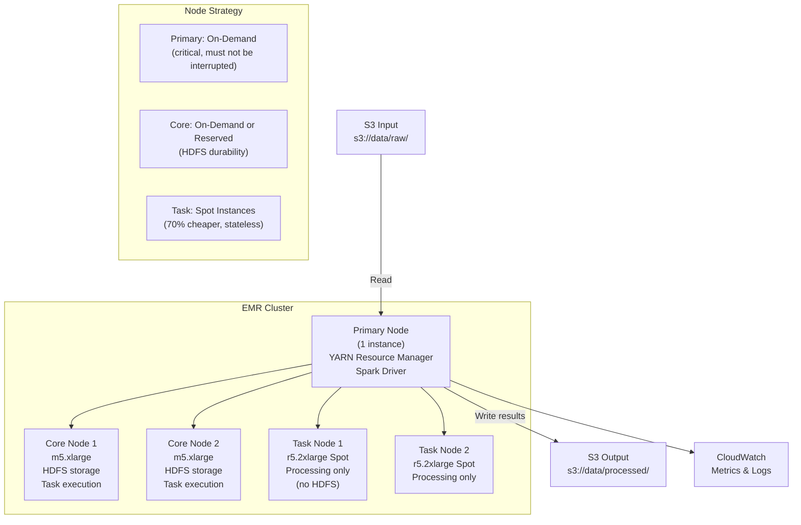
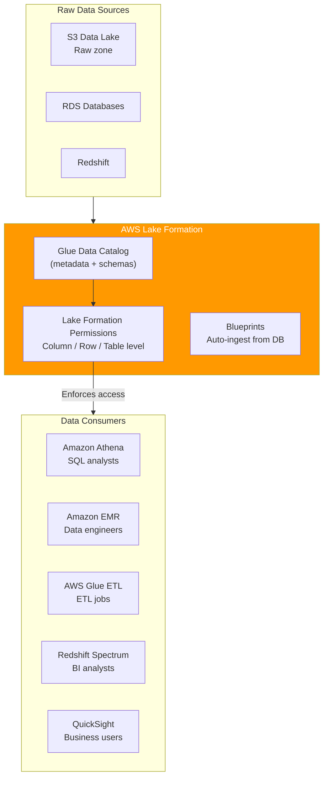
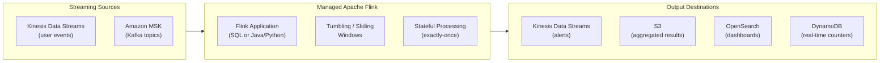
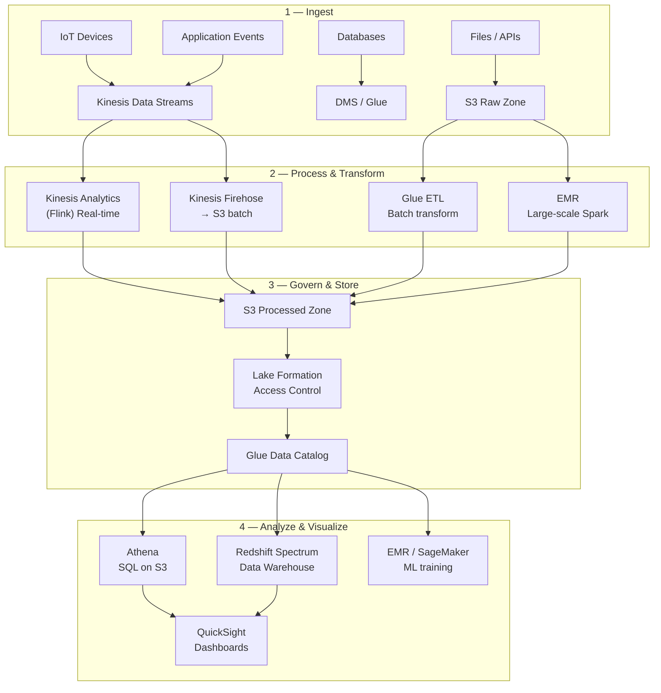

# Stage 12c — EMR, Lake Formation & Kinesis Analytics

> Process petabyte-scale datasets with managed Spark/Hadoop, govern your entire data lake with fine-grained access control, and run real-time SQL on streaming data.

---

## 1. Amazon EMR — Managed Big Data Processing

### Core Intuition

Your data science team needs to process 50TB of raw clickstream logs — join them with customer data, run machine learning feature engineering, and output results to S3. A single machine can't handle 50TB. You need a cluster of 50 machines working in parallel.

**Amazon EMR (Elastic MapReduce)** = AWS spins up a cluster of EC2 instances, installs Apache Spark (or Hadoop, Hive, Presto, Flink) for you, you submit your job, it runs, the cluster shuts down. You pay only for the compute time.

```
Without EMR:  Provision 50 EC2s → install Java → install Spark → configure networking
              → manage Hadoop cluster → patch OS → deal with node failures → $10K+/month idle

With EMR:     emr.create_cluster(instances=50, software=["Spark", "Hive"])
              → submit Spark job → wait → cluster auto-terminates
              → pay only for job runtime (maybe $50 for a 2-hour run)
```

---

## 2. EMR Architecture



---

## 3. EMR Deployment Options

```
EMR on EC2 (traditional):
  Cluster with Primary + Core + Task nodes
  HDFS distributed filesystem across core nodes
  Use for: long-running clusters, Hive metastore, iterative ML

EMR Serverless (recommended for new workloads):
  No cluster management — AWS auto-provisions workers per job
  Auto-scales: 0 workers when idle, thousands during peak
  No minimum cost — pay only per vCPU-hour/memory-hour
  Use for: ad-hoc jobs, variable workloads, simplicity

EMR on EKS:
  Run EMR jobs on your existing EKS Kubernetes cluster
  Share compute between EMR jobs and other K8s workloads
  Use for: teams already operating EKS

EMR Studio:
  Browser-based IDE for data engineers
  Jupyter notebooks connected to EMR cluster
  Collaborative, Git-integrated, built-in debugging
```

---

## 4. PySpark on EMR — Example

```python
# pyspark_job.py — Process clickstream data at scale
from pyspark.sql import SparkSession
from pyspark.sql.functions import (
    col, count, sum as spark_sum, window,
    from_json, schema_of_json, to_date
)
from pyspark.sql.types import *

spark = SparkSession.builder \
    .appName("ClickstreamAnalysis") \
    .config("spark.sql.adaptive.enabled", "true") \
    .getOrCreate()

# Read 50TB of Parquet files from S3 (parallel across all nodes)
clicks = spark.read.parquet("s3://my-data/clickstream/year=2024/")

# Read customer dimension table
customers = spark.read.parquet("s3://my-data/customers/")

# Join and aggregate — Spark distributes this across 50 nodes
result = clicks \
    .join(customers, "customer_id", "left") \
    .filter(col("event_type") == "purchase") \
    .groupBy(
        to_date(col("timestamp")).alias("date"),
        col("country"),
        col("product_category")
    ) \
    .agg(
        count("*").alias("purchase_count"),
        spark_sum("revenue").alias("total_revenue"),
        spark_sum("revenue").alias("avg_order_value")
    ) \
    .orderBy("date", "total_revenue", ascending=[True, False])

# Write partitioned Parquet back to S3
result.write \
    .mode("overwrite") \
    .partitionBy("date", "country") \
    .parquet("s3://my-data/analytics/purchase-summary/")

spark.stop()
```

```python
# Submit job to EMR Serverless via boto3
import boto3

emr_serverless = boto3.client('emr-serverless', region_name='us-east-1')

# Create application (one-time setup)
app = emr_serverless.create_application(
    name='clickstream-processor',
    type='SPARK',
    releaseLabel='emr-7.0.0',
    autoStopConfiguration={'enabled': True, 'idleTimeoutMinutes': 15}
)

# Submit job
job = emr_serverless.start_job_run(
    applicationId=app['applicationId'],
    executionRoleArn='arn:aws:iam::123456789:role/EMRServerlessRole',
    jobDriver={
        'sparkSubmit': {
            'entryPoint': 's3://my-bucket/scripts/pyspark_job.py',
            'sparkSubmitParameters': '--conf spark.executor.cores=4 '
                                     '--conf spark.executor.memory=16g '
                                     '--conf spark.executor.instances=20'
        }
    }
)
print(f"Job started: {job['jobRunId']}")
```

---

## 5. EMR vs Glue vs Athena

```
                EMR                     Glue ETL            Athena
Engine:         Spark/Hadoop/Hive       Spark (managed)     Presto/Trino
Setup:          Medium (cluster/app)    None (serverless)   None (serverless)
Code:           PySpark, Scala, SQL     Python (GlueContext) SQL only
Complex logic:  ✅ Full ML, streaming   ✅ ETL pipelines    ❌ SQL only
SQL analytics:  ✅ (SparkSQL, Hive)     ❌ Not primary      ✅ Native
Cost model:     Per EC2/vCPU-hour       Per DPU-hour        Per TB scanned
Best for:       ML feature engineering, Simple ETL          Ad-hoc SQL on S3
                large-scale Spark jobs, transforms,
                iterative workloads     cataloging

Rule of thumb:
  Need ML + complex transformations → EMR
  Need ETL pipelines + data catalog → Glue
  Need SQL queries on S3 → Athena
```

---

## 6. AWS Lake Formation — Data Lake Governance

### Core Intuition

Your company has 50 data scientists and analysts all accessing your S3 data lake. The compliance team says: EU customer data must only be visible to EU analysts. Finance data is restricted to the finance team. PII columns must be masked for junior analysts.

Without Lake Formation, you'd need to manage dozens of S3 bucket policies, IAM policies, and hope no one misconfigures anything. **Lake Formation** is the data lake access control layer — one place to define who can see which databases, tables, columns, and rows.

```
Without Lake Formation:
  Analyst A → needs 3 tables → 3 IAM policies + 3 S3 bucket policies
  New table → update all policies
  Audit: who accessed what? Scattered across IAM + S3 logs

With Lake Formation:
  GRANT SELECT ON TABLE customers TO analyst_group
  GRANT SELECT(name, email) ON TABLE customers TO junior_analysts
     (column-level security — PII masked)
  Audit: Lake Formation logs every table access in CloudTrail
```

---

## 7. Lake Formation Architecture



---

## 8. Lake Formation Permissions

```python
import boto3

lf = boto3.client('lakeformation', region_name='us-east-1')

# Grant table access to a data analyst role
lf.grant_permissions(
    Principal={'DataLakePrincipalIdentifier': 'arn:aws:iam::123456789:role/DataAnalystRole'},
    Resource={
        'Table': {
            'DatabaseName': 'analytics_db',
            'Name': 'customer_orders'
        }
    },
    Permissions=['SELECT'],
    PermissionsWithGrantOption=[]
)

# Column-level security — hide PII from junior analysts
lf.grant_permissions(
    Principal={'DataLakePrincipalIdentifier': 'arn:aws:iam::123456789:role/JuniorAnalystRole'},
    Resource={
        'TableWithColumns': {
            'DatabaseName': 'analytics_db',
            'Name': 'customers',
            'ColumnWildcard': {
                'ExcludedColumnNames': ['ssn', 'credit_card', 'full_address']
            }
        }
    },
    Permissions=['SELECT']
)

# Row-level security — EU analysts only see EU data
lf.create_data_cells_filter(
    TableData={
        'DatabaseName': 'analytics_db',
        'TableName': 'customers',
        'Name': 'eu_customers_only',
        'RowFilter': {
            'FilterExpression': "region = 'EU'"
        },
        'ColumnWildcard': {}
    }
)
```

---

## 9. Amazon Kinesis Data Analytics (Managed Apache Flink)

### Core Intuition

You have a Kinesis Data Stream of 100,000 events per second — user clicks, IoT sensor readings, financial transactions. You need to:
- Detect fraud patterns in real time (within 2 seconds)
- Calculate rolling averages over the last 5 minutes
- Alert when anomalies occur

**Kinesis Data Analytics (Managed Apache Flink)** = Run Apache Flink streaming SQL/Java/Python jobs without managing servers. Process millions of events per second with sub-second latency.

---

## 10. Kinesis Analytics — Streaming SQL



```sql
-- Streaming SQL: Detect fraud in real time
-- Count transactions per user per 5-minute window
-- Alert if > 10 transactions in 5 minutes

CREATE TABLE transactions (
  user_id     VARCHAR,
  amount      DOUBLE,
  merchant    VARCHAR,
  event_time  TIMESTAMP(3),
  WATERMARK FOR event_time AS event_time - INTERVAL '5' SECOND
) WITH (
  'connector' = 'kinesis',
  'stream' = 'transactions-stream',
  'aws.region' = 'us-east-1',
  'format' = 'json'
);

CREATE TABLE fraud_alerts (
  user_id         VARCHAR,
  window_start    TIMESTAMP(3),
  window_end      TIMESTAMP(3),
  tx_count        BIGINT,
  total_amount    DOUBLE
) WITH (
  'connector' = 'kinesis',
  'stream' = 'fraud-alerts-stream',
  'aws.region' = 'us-east-1',
  'format' = 'json'
);

-- Tumbling 5-minute window fraud detection
INSERT INTO fraud_alerts
SELECT
  user_id,
  TUMBLE_START(event_time, INTERVAL '5' MINUTE) AS window_start,
  TUMBLE_END(event_time, INTERVAL '5' MINUTE) AS window_end,
  COUNT(*) AS tx_count,
  SUM(amount) AS total_amount
FROM transactions
GROUP BY
  user_id,
  TUMBLE(event_time, INTERVAL '5' MINUTE)
HAVING COUNT(*) > 10 OR SUM(amount) > 5000;
```

---

## 11. Window Types in Streaming

```
Tumbling Window:
  Fixed, non-overlapping time buckets
  "Every 5 minutes, calculate total sales"
  |--5min--|--5min--|--5min--|
  Window 1: [0-5min], Window 2: [5-10min], Window 3: [10-15min]

Sliding Window:
  Overlapping windows — "in the last 5 minutes" recalculated every 1 minute
  "Alert if fraud in last 5 minutes"
  |1min|←  5min window  →|
        |1min|← 5min window →|
  Higher compute, more up-to-date

Session Window:
  Groups events by activity gap
  "All clicks within 30 minutes of each other = one session"
  Ends when user is inactive for 30 minutes
  Variable-length windows
  Use for: user sessions, IoT burst activity
```

---

## 12. Complete Data Lake Reference Architecture



---

## 13. Interview Perspective

**Q: When would you use EMR vs Glue for data processing?**
Glue is better for standard ETL — straightforward transformations, format conversion (JSON → Parquet), loading data warehouse tables. It's fully managed with no cluster setup. EMR is better for complex Spark jobs requiring full control: ML feature engineering, graph processing, iterative algorithms, custom Spark configurations, or jobs that need to run for hours on hundreds of nodes. If Glue can do it, use Glue. If you need raw Spark power, use EMR Serverless.

**Q: What is Lake Formation and why do you need it if you already have IAM?**
IAM policies secure AWS service access. Lake Formation secures data access at the table, column, and row level in the data catalog — independent of which service (Athena, EMR, Glue, Redshift) queries the data. Without Lake Formation, granting analyst access to a table means multiple IAM policies + S3 bucket policies that must stay in sync. Lake Formation centralizes this: one GRANT statement applies to all query engines. It also enables column masking (hide PII) and row-level security (EU analysts only see EU data).

**Q: What is the difference between a tumbling window and a sliding window in Flink?**
Tumbling windows are non-overlapping fixed buckets — events belong to exactly one window. "Count sales per 5-minute period" produces one result every 5 minutes. Sliding windows overlap — a 5-minute window that slides every 1 minute produces a new result every minute, each covering the last 5 minutes. Sliding windows are more responsive (detect fraud sooner) but use more compute (each event participates in multiple windows). Use tumbling for reporting/aggregation; sliding for real-time monitoring and anomaly detection.

---

**[🏠 Back to README](../README.md)**

**Prev:** [← Athena, Glue & Redshift](../12_data_analytics/athena_glue_redshift.md) &nbsp;|&nbsp; **Next:** [CI/CD Pipeline →](../13_devops_cicd/cicd_pipeline.md)

**Related Topics:** [Kinesis Streaming](../12_data_analytics/kinesis.md) · [Athena, Glue & Redshift](../12_data_analytics/athena_glue_redshift.md) · [S3 Object Storage](../04_storage/s3.md) · [IAM](../06_security/iam.md)
