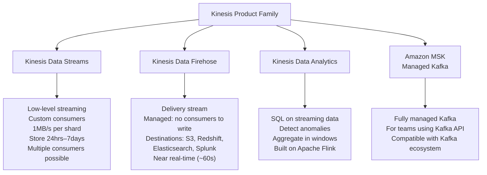

# Stage 12a — Kinesis: Real-Time Data Streaming

> Ingest, process, and analyze streaming data in real time — from IoT sensors to clickstreams to financial transactions.

## 1. Core Intuition

Traditional data processing: collect data all day → store in database → run batch job at midnight → results available next morning. That's 24+ hours of lag.

**Kinesis** = Process data AS IT ARRIVES. An IoT sensor reads data every second → Kinesis receives it → Lambda processes it → Dashboard updates in 2 seconds. Real-time.

## 2. The Four Kinesis Services



## 3. Kinesis Data Streams Deep Dive

```
Architecture:
━━━━━━━━━━━━━
Producers → Kinesis Data Stream → Consumers

Stream = 1 to many shards
Shard = The unit of capacity:
  Write: 1MB/s OR 1,000 records/s
  Read:  2MB/s (up to 5 reads/s)

Sequence: Each record gets a sequence number (ordered within shard)
Partition Key: Used to determine which shard a record goes to
  Hash(partition key) → shard assignment

Retention:
  Default: 24 hours
  Extended: up to 7 days
  Long-term: up to 365 days

Consumer types:
  Standard:     2MB/s per SHARD (shared among all consumers)
  Enhanced Fan-out: 2MB/s per SHARD per CONSUMER (dedicated throughput)
  Use Enhanced Fan-out when you have multiple consumers that each need 2MB/s

Scaling shards:
  Split shard:   2 shards → doubles write/read capacity
  Merge shards:  2 shards → 1 shard (reduce capacity, save cost)
  Or use On-Demand mode: AWS auto-scales shards
```

### Producer Example

```python
import boto3
import json
import uuid

kinesis = boto3.client('kinesis', region_name='us-east-1')

# Put a single record
response = kinesis.put_record(
    StreamName='user-events',
    Data=json.dumps({
        'userId': 'user-123',
        'event': 'page_view',
        'page': '/products/laptop-pro',
        'timestamp': '2024-01-15T10:23:45Z'
    }),
    PartitionKey='user-123'  # Same user → same shard (ordered events per user)
)

# Batch records (more efficient, up to 500 records per call)
records = [
    {
        'Data': json.dumps({'userId': f'user-{i}', 'event': 'click'}),
        'PartitionKey': f'user-{i}'
    }
    for i in range(100)
]
response = kinesis.put_records(
    StreamName='user-events',
    Records=records
)
```

## 4. Kinesis Data Firehose

```
Firehose = Simplest way to get streaming data into S3/Redshift/etc.

You don't write a consumer! Firehose IS the consumer.

Flow:
  Producers → Firehose Delivery Stream → S3/Redshift/Elasticsearch

Features:
  ✅ Automatic batching (buffer by size 1-128MB or time 60-900s)
  ✅ Compression (gzip, snappy, zip) before writing to S3
  ✅ Format conversion (JSON → Parquet using Glue schema)
  ✅ Optional Lambda transformation before delivery
  ✅ Near real-time (not real-time — ~60s minimum buffer)
  ✅ Fully managed (no shards, no consumers to write)

S3 output format (partitioned by date automatically):
  s3://my-data-lake/
    year=2024/
      month=01/
        day=15/
          hour=10/
            clickstream-delivery-stream-2024-01-15-10-23-45-abc123.gz

Use Firehose when:
  ✅ Just need to land streaming data in S3/Redshift
  ✅ Don't need real-time processing (can tolerate ~60s delay)
  ✅ Want zero consumer code

Use Data Streams + Lambda when:
  ✅ Need < 1 second processing
  ✅ Custom business logic per record
  ✅ Multiple independent consumers of same stream
```

## 5. Kinesis vs SQS vs SNS

```
SQS (Simple Queue Service):
  Purpose: Decoupling — producer puts tasks, consumer processes them
  Message order: FIFO queue maintains order; Standard = best-effort
  Consumers: One message processed by ONE consumer (then deleted)
  Use for: Task queues, job processing, reliable async messaging

SNS (Simple Notification Service):
  Purpose: Fan-out notification — one message → many subscribers
  Consumers: ALL subscribers receive EVERY message
  Use for: Email/SMS notifications, fan-out to multiple SQS queues/Lambda

Kinesis Data Streams:
  Purpose: Real-time data streaming and replay
  Message order: Ordered within a shard (by partition key)
  Consumers: MULTIPLE consumers read the SAME data independently
  Retention: 24hrs–7 days (replay old data!)
  Use for: Event streaming, real-time analytics, log aggregation

Comparison:
              SQS           SNS           Kinesis
Retention:    4-14 days     No storage    24hrs-7days
Consumers:    One           All (fan-out) Many (independent)
Order:        FIFO option   No            Per-shard
Replay:       No            No            Yes!
Throughput:   Unlimited     Unlimited     Per-shard (scale manually)
Use case:     Task queue    Notifications Streaming/replay
```

## 6. Interview Perspective

**Q: What is the difference between Kinesis Data Streams and Kinesis Firehose?**
Data Streams: low-level, you write producers and consumers, real-time (< 1s), ordered within shard, multiple independent consumers, data replay. Firehose: managed delivery to S3/Redshift/etc., no consumer code needed, near-real-time (~60s buffer), no replay, single destination. Use Firehose for simple data lake ingestion; Data Streams for custom real-time processing.

**Q: What is a Kinesis shard?**
A shard is the unit of capacity in Kinesis Data Streams. Each shard provides 1MB/s write and 2MB/s read throughput. You scale by adding/removing shards (splitting/merging). Records with the same partition key always go to the same shard (ensures ordering). Or use On-Demand mode and AWS handles shard scaling automatically.

---

**[🏠 Back to README](../README.md)**

**Prev:** [← Step Functions](../11_serverless/step_functions.md) &nbsp;|&nbsp; **Next:** [Athena, Glue & Redshift →](../12_data_analytics/athena_glue_redshift.md)

**Related Topics:** [SQS, SNS & EventBridge](../11_serverless/sqs_sns_eventbridge.md) · [Athena, Glue & Redshift](../12_data_analytics/athena_glue_redshift.md) · [EMR, Lake Formation & Flink](../12_data_analytics/emr_lake_formation_flink.md) · [DynamoDB](../07_databases/dynamodb.md)

---

## 📝 Practice Questions

- 📝 [Q66 · kinesis-streams](../aws_practice_questions_100.md#q66--normal--kinesis-streams)

