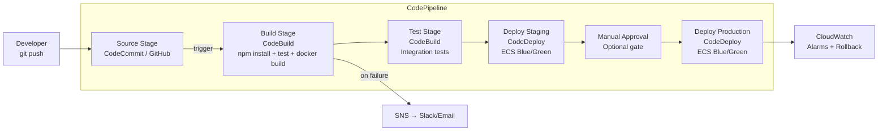
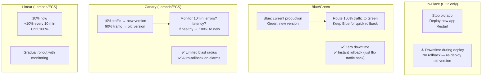

# Stage 13 — CI/CD: CodePipeline, CodeBuild & CodeDeploy

> Automate your path from code commit to production deployment. Ship faster, with confidence, and without 2am manual deployments.

---

## 1. Core Intuition

```
Without CI/CD:
  Developer → commits code → manually builds → SSH into server → copy files
  Takes: 2-4 hours per deployment
  Risk: human error every step
  Frequency: once a week (scary to deploy)

With CI/CD:
  Developer → commits code → automated pipeline:
    Test → Build → Package → Deploy to staging → Deploy to production
  Takes: 10-15 minutes
  Risk: automated, consistent
  Frequency: dozens of times per day (safe to deploy often)
```

**AWS CI/CD Toolchain:**
```
CodeCommit  → Git repository (or use GitHub/GitLab)
CodeBuild   → Build + test runner (compile, test, create artifacts)
CodeDeploy  → Deploy artifacts to EC2 / ECS / Lambda
CodePipeline→ Orchestrate the above into a pipeline
```

---

## 2. Pipeline Architecture



---

## 3. AWS CodeBuild

### Core Intuition

CodeBuild = a serverless build server. You define what to run in `buildspec.yml`. AWS spins up a container, runs your commands, outputs artifacts, shuts down. You pay only for build minutes.

```
No Jenkins servers to maintain!
No EC2 build agents to patch!
Scales automatically — 50 simultaneous builds = 50 containers
```

### buildspec.yml

```yaml
version: 0.2

env:
  variables:
    NODE_ENV: production
  parameter-store:
    DB_PASSWORD: /myapp/prod/db-password   # fetch from SSM

phases:
  install:
    runtime-versions:
      nodejs: 20
    commands:
      - npm ci                               # install dependencies

  pre_build:
    commands:
      - echo "Running tests..."
      - npm test
      - echo "Logging into ECR..."
      - aws ecr get-login-password --region us-east-1 |
          docker login --username AWS --password-stdin
          123456789.dkr.ecr.us-east-1.amazonaws.com

  build:
    commands:
      - echo "Building Docker image..."
      - docker build -t myapp:$CODEBUILD_RESOLVED_SOURCE_VERSION .
      - docker tag myapp:$CODEBUILD_RESOLVED_SOURCE_VERSION
          123456789.dkr.ecr.us-east-1.amazonaws.com/myapp:latest

  post_build:
    commands:
      - echo "Pushing to ECR..."
      - docker push 123456789.dkr.ecr.us-east-1.amazonaws.com/myapp:latest
      - echo "Writing image definitions..."
      - printf '[{"name":"myapp","imageUri":"%s"}]'
          123456789.dkr.ecr.us-east-1.amazonaws.com/myapp:latest
          > imagedefinitions.json

artifacts:
  files:
    - imagedefinitions.json           # passed to CodeDeploy
  discard-paths: yes

cache:
  paths:
    - node_modules/**/*               # cache node_modules between builds
```

---

## 4. AWS CodeDeploy

### Deployment Strategies



---

## 5. CodeDeploy AppSpec

```yaml
# appspec.yml for ECS deployment
version: 0.0
Resources:
  - TargetService:
      Type: AWS::ECS::Service
      Properties:
        TaskDefinition: <TASK_DEFINITION>
        LoadBalancerInfo:
          ContainerName: myapp
          ContainerPort: 8080
        PlatformVersion: LATEST

# appspec.yml for EC2 deployment
version: 0.0
os: linux
files:
  - source: /
    destination: /var/www/myapp

hooks:
  BeforeInstall:
    - location: scripts/stop_server.sh
      timeout: 30
  AfterInstall:
    - location: scripts/install_dependencies.sh
      timeout: 120
  ApplicationStart:
    - location: scripts/start_server.sh
      timeout: 30
  ValidateService:
    - location: scripts/validate.sh   # health check
      timeout: 60
```

---

## 6. AWS CodePipeline

CodePipeline is the **orchestrator** — it connects Source → Build → Test → Deploy into a workflow.

```
Pipeline structure:
  Stage 1: Source
    Action: GitHub (or CodeCommit, S3, ECR)
    Trigger: on push to main branch

  Stage 2: Build
    Action: CodeBuild
    Input: source code
    Output: artifacts (compiled code, Docker image, etc.)

  Stage 3: Test (optional)
    Action: CodeBuild (different buildspec for integration tests)
    OR: Invoke Lambda (custom test logic)

  Stage 4: Deploy to Staging
    Action: CodeDeploy / CloudFormation / ECS Deploy
    Input: artifacts from Build stage

  Stage 5: Approval (optional)
    Action: Manual approval
    SNS notification → someone reviews → approve/reject in console

  Stage 6: Deploy to Production
    Action: CodeDeploy / CloudFormation / ECS Deploy
    Same artifacts as staging (what was tested = what goes to prod)

Pipeline YAML (CloudFormation):
  Pipelines are best defined as code in CloudFormation or CDK
  This ensures the pipeline itself is version-controlled and reproducible
```

---

## 7. GitHub Actions + AWS (Modern Approach)

Many teams use GitHub Actions instead of CodeBuild/CodePipeline:

```yaml
# .github/workflows/deploy.yml
name: Deploy to AWS ECS

on:
  push:
    branches: [main]

env:
  AWS_REGION: us-east-1
  ECR_REPOSITORY: myapp
  ECS_SERVICE: myapp-service
  ECS_CLUSTER: production

jobs:
  deploy:
    runs-on: ubuntu-latest

    steps:
    - name: Checkout code
      uses: actions/checkout@v4

    - name: Configure AWS credentials
      uses: aws-actions/configure-aws-credentials@v4
      with:
        role-to-assume: arn:aws:iam::123456789:role/GitHubActionsRole
        aws-region: ${{ env.AWS_REGION }}

    - name: Login to Amazon ECR
      id: login-ecr
      uses: aws-actions/amazon-ecr-login@v2

    - name: Build and push Docker image
      env:
        ECR_REGISTRY: ${{ steps.login-ecr.outputs.registry }}
        IMAGE_TAG: ${{ github.sha }}
      run: |
        docker build -t $ECR_REGISTRY/$ECR_REPOSITORY:$IMAGE_TAG .
        docker push $ECR_REGISTRY/$ECR_REPOSITORY:$IMAGE_TAG
        echo "image=$ECR_REGISTRY/$ECR_REPOSITORY:$IMAGE_TAG" >> $GITHUB_OUTPUT

    - name: Deploy to ECS
      uses: aws-actions/amazon-ecs-deploy-task-definition@v1
      with:
        task-definition: task-definition.json
        service: ${{ env.ECS_SERVICE }}
        cluster: ${{ env.ECS_CLUSTER }}
        wait-for-service-stability: true
```

---

## 8. Rollback Strategy

```
Automatic rollback triggers:
  CodeDeploy: if deployment fails (health check fails) → auto rollback
  CodeDeploy: if CloudWatch alarm triggers during deployment → auto rollback
  ECS Blue/Green: keep old task definition running → instant cutback

Setup auto-rollback on alarm:
  1. Create CloudWatch alarm: "5xx error rate > 5% for 2 minutes"
  2. In CodeDeploy deployment group:
     Rollback → Enable rollback when a deployment fails
     Rollback → Enable rollback when alarm thresholds are met
     Alarm: select the 5xx alarm
  3. If error rate spikes after deploy → CodeDeploy automatically rolls back

Manual rollback:
  CodeDeploy: Deployments → select deployment → Stop and rollback
  ECS Blue/Green: update service → point back to old task definition
  Lambda: update function → point alias to previous version
```

---

## 9. Console Walkthrough

```
Create CodePipeline:
━━━━━━━━━━━━━━━━━━━
CodePipeline → Create pipeline
  Pipeline name: myapp-pipeline
  Service role: Create new role
  Artifact store: S3 bucket (auto-created)

Step 1: Source stage
  Source provider: GitHub (Version 2)
  Connect to GitHub → authorize
  Repository: my-org/my-app
  Branch: main
  Detection options: GitHub webhooks (trigger on push)

Step 2: Build stage
  Build provider: AWS CodeBuild
  Create project:
    Environment: Managed image, Ubuntu, Standard runtime
    Service role: Create new (needs ECR, S3, SSM access)
    Buildspec: Use buildspec.yml in source

Step 3: Deploy stage
  Deploy provider: Amazon ECS
  Cluster: production
  Service: myapp-service
  Image definitions file: imagedefinitions.json

Create pipeline → it runs immediately on first setup
```

---

## 10. Interview Perspective

**Q: What is the difference between CodeDeploy in-place and blue/green?**
In-place deployment stops the old application version and deploys the new one on the same instances — there's downtime during deployment, and rollback requires re-deploying the old version. Blue/green keeps the old version (blue) running while deploying the new version to separate instances (green), then switches traffic. Zero downtime, instant rollback by switching traffic back to blue. Use blue/green for production; in-place only for dev/staging where downtime is acceptable.

**Q: What is a canary deployment?**
A canary deployment gradually shifts traffic to the new version. Example: 10% of traffic goes to v2 for 10 minutes — you monitor error rates and latency. If metrics are healthy, shift 100% to v2. If something is wrong, only 10% of users were affected, and you roll back automatically. AWS supports canary and linear deployments for Lambda and ECS through CodeDeploy.

**Q: How would you set up a CI/CD pipeline that deploys to staging automatically but requires approval for production?**
CodePipeline with 4 stages: (1) Source — GitHub webhook triggers on push to main. (2) Build — CodeBuild runs tests, builds Docker image, pushes to ECR. (3) Deploy Staging — CodeDeploy deploys to staging ECS service automatically. (4) Manual Approval — SNS notifies the team; someone reviews staging and approves/rejects in the console. (5) Deploy Production — CodeDeploy deploys same artifact to production ECS with blue/green and CloudWatch alarm-based rollback.

---

**[🏠 Back to README](../README.md)**

**Prev:** [← EMR, Lake Formation & Flink](../12_data_analytics/emr_lake_formation_flink.md) &nbsp;|&nbsp; **Next:** [High Availability →](../14_architecture/high_availability.md)

**Related Topics:** [CloudFormation](../09_iac/cloudformation.md) · [CDK & Terraform](../09_iac/cdk_terraform.md) · [ECS](../10_containers/ecs.md) · [Lambda](../11_serverless/lambda.md)
