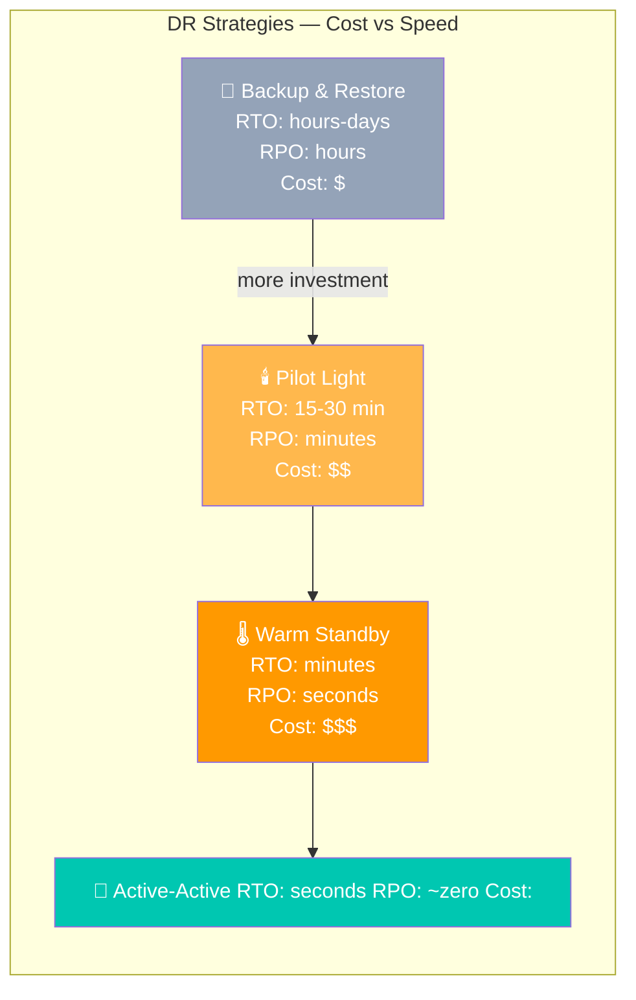
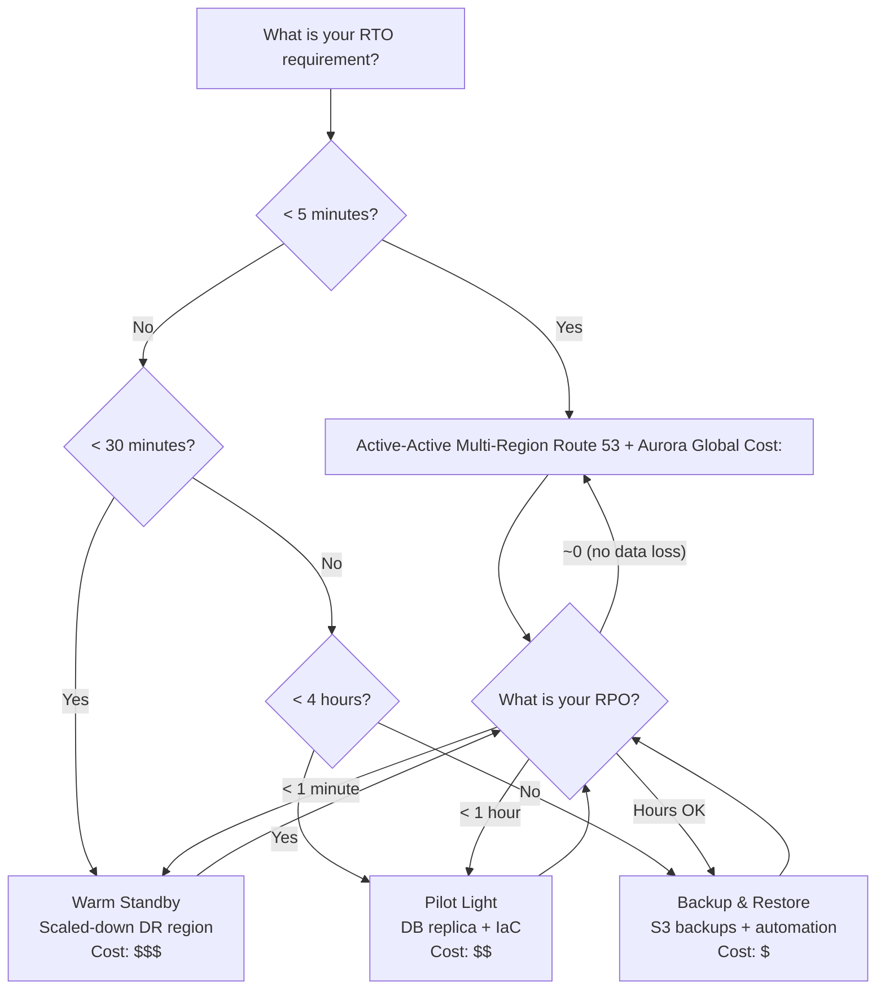

# Stage 14c — Disaster Recovery & Business Continuity

> When things go wrong — and they will — your DR strategy is the difference between minutes and days of downtime.

---

## 1. Core Intuition

A bank's entire `us-east-1` region becomes unreachable due to a major AWS incident. It happens. Your CEO calls. "How long until we're back online?"

If your answer depends on how long it takes to:
- SSH into something
- Manually spin up infrastructure
- Restore from a backup you haven't tested in 6 months

...you don't have a disaster recovery plan. You have a hope.

**Disaster Recovery (DR)** = A documented, tested, automated set of procedures that restore your system to operation after a catastrophic failure. The key word is *automated* and *tested* — not "we have backups somewhere."

```
Two metrics define your DR posture:

RTO (Recovery Time Objective):
  How LONG can the business tolerate being down?
  "We can tolerate 4 hours of downtime per year"
  Drives: how quickly your system must be back online

RPO (Recovery Point Objective):
  How much DATA can the business afford to lose?
  "We can afford to lose up to 5 minutes of transactions"
  Drives: how frequently you must back up / replicate

Lower RTO + RPO = more expensive infrastructure
Higher RTO + RPO = cheaper but more business risk

Rule: RPO and RTO must be business decisions, not technical ones.
      Finance says "zero data loss" → Active-Active multi-region
      Startup says "4 hours downtime is fine" → Backup & Restore
```

---

## 2. DR Strategy Spectrum



---

## 3. Strategy 1 — Backup & Restore

```
The story: Your house burns down. You have photos in a safe deposit box.
           You lose the house but not the memories.
           Rebuilding takes time (weeks), but nothing is permanently lost.

AWS Implementation:
  RDS: automated daily backups → S3 (7-35 day retention)
  EBS: snapshots → lifecycle to Glacier after 30 days
  DynamoDB: on-demand backups → AWS Backup
  S3: versioning + cross-region replication
  Application config: SSM Parameter Store + Git

Recovery process:
  Disaster detected → provision new VPC/EC2/RDS from IaC
  Restore latest backup → re-deploy application
  Update DNS (Route 53) → point to new region

RTO: hours to a day (depends on data volume + infrastructure provisioning speed)
RPO: hours (time since last backup)

Best for: dev/test environments, cost-sensitive workloads with high RTO tolerance
Cost: just the backup storage (S3: $0.023/GB-month, Glacier: $0.004/GB-month)
```

---

## 4. Strategy 2 — Pilot Light

```
The story: A gas pilot light — always burning tiny,
           ready to ignite the full furnace in seconds.

AWS Implementation:
  Keep running in DR region:
    ✅ RDS replica (data always current)
    ✅ Route 53 health checks (monitors primary)
    ❌ App servers NOT running (saves cost)
    ❌ Load balancer NOT running

  On disaster:
    1. Route 53 health check fails → trigger EventBridge rule
    2. Lambda starts: provision EC2 fleet from AMI (2-5 min)
    3. Lambda starts: promote RDS read replica to primary (5-10 min)
    4. Route 53 failover: DNS flips to DR region (TTL propagation: 5 min)
    Total: ~15-30 min

Cost: only pay for RDS replica + snapshot storage in DR region
      ~20-30% of prod cost idle
```

---

## 5. Strategy 3 — Warm Standby

```
The story: A backup generator — always running at low power,
           scales up to full power in minutes, not hours.

AWS Implementation:
  DR region always running at 25-50% of production capacity:
    ✅ RDS replica → promote on disaster
    ✅ EC2 ASG with min=2 instances (scales to full on disaster)
    ✅ ALB running and healthy
    ✅ Route 53 weighted routing: 0% traffic normally

  On disaster:
    1. Route 53 detects primary health check failure
    2. Auto-switch: 100% traffic to DR region
    3. DR ASG scales to full capacity (3-5 min)
    4. RDS replica promoted to primary (3-5 min)
    Total: ~5-10 min

Cost: 25-50% of production cost (running scaled-down infra)
```

---

## 6. Strategy 4 — Active-Active Multi-Region

```
The story: Two fully staffed offices — Tokyo and New York.
           If one office burns down, the other keeps working.
           No "disaster recovery" — just traffic routing.

AWS Implementation:

  Both regions fully operational simultaneously:
    Route 53 latency routing: US users → us-east-1, Asia → ap-northeast-1
    Aurora Global Database: us-east-1 primary, 1-second replication to ap-northeast-1
    DynamoDB Global Tables: active reads/writes in both regions
    S3 Cross-Region Replication: objects replicated in seconds
    CloudFront: global CDN serves from nearest edge

  On disaster (us-east-1 fails):
    Route 53 detects health check failure (<30s)
    All traffic routes to ap-northeast-1 (<1 min)
    Aurora Global: promote ap-northeast-1 to primary (<1 min)
    DynamoDB: auto-routes to ap-northeast-1 replica
    Total: ~1-2 min (mostly DNS propagation)

RTO: seconds to minutes (no provisioning needed — already running)
RPO: ~1 second (Aurora replication lag)
Cost: 2x production cost (running full capacity in both regions)
```

---

## 7. AWS Backup — Centralized Backup Service

```
Without AWS Backup:
  RDS backup: configured separately in RDS console
  EBS snapshots: configured in EC2 console
  DynamoDB backups: configured in DynamoDB console
  EFS backups: configured in EFS console
  Different schedules, different retention, no central audit

With AWS Backup:
  One backup plan rules them all:
    - Resources: select by tag (env=production) or by resource type
    - Schedule: daily at 2 AM UTC
    - Retention: 30 days warm → 90 days cold (Glacier)
    - Cross-region copy: auto-copy to DR region
    - Cross-account copy: auto-copy to separate "backup" AWS account
                         (protects against ransomware or account compromise)
```

```python
import boto3

backup = boto3.client('backup', region_name='us-east-1')

# Create a backup plan
plan = backup.create_backup_plan(
    BackupPlan={
        'BackupPlanName': 'production-backup-plan',
        'Rules': [
            {
                'RuleName': 'daily-backup',
                'TargetBackupVaultName': 'production-vault',
                'ScheduleExpression': 'cron(0 2 * * ? *)',   # 2 AM UTC daily
                'StartWindowMinutes': 60,
                'CompletionWindowMinutes': 180,
                'Lifecycle': {
                    'MoveToColdStorageAfterDays': 30,     # → Glacier after 30d
                    'DeleteAfterDays': 365                # → delete after 1 year
                },
                'CopyActions': [{
                    'DestinationBackupVaultArn':
                        'arn:aws:backup:us-west-2:123456789:backup-vault:dr-vault',
                    'Lifecycle': {'DeleteAfterDays': 90}
                }]
            }
        ]
    }
)

# Assign resources by tag — everything tagged env=production
backup.create_backup_selection(
    BackupPlanId=plan['BackupPlanId'],
    BackupSelection={
        'SelectionName': 'production-resources',
        'IamRoleArn': 'arn:aws:iam::123456789:role/AWSBackupRole',
        'ListOfTags': [{
            'ConditionType': 'STRINGEQUALS',
            'ConditionKey': 'env',
            'ConditionValue': 'production'
        }]
    }
)
```

---

## 8. AWS Fault Injection Simulator (FIS) — Chaos Engineering

```
The problem: You test code. You test deployments. But do you test failure?
             Does your RDS Multi-AZ actually fail over? Do health checks
             actually catch unhealthy instances? Does your circuit breaker
             actually open when the downstream service is slow?

Chaos engineering: intentionally inject failures to verify resilience.

AWS FIS: controlled blast-radius experiments
  - Terminate EC2 instances (test ASG replacement)
  - Inject CPU/memory stress (test auto-scaling triggers)
  - Inject network latency (test circuit breakers)
  - Fail a specific AZ (test Multi-AZ failover)
  - Throttle DynamoDB (test retry/backoff logic)
  - Kill ECS tasks (test service recovery)

Stop conditions:
  Define: "if error rate > 5%, stop experiment automatically"
  FIS monitors CloudWatch alarms → auto-abort if too much damage

Experiment template example:
  Name: Terminate random EC2 in ASG
  Target: 25% of instances tagged env=production
  Action: aws:ec2:terminate-instances
  Stop condition: CloudWatch alarm (5xx errors > 100/min)
  Duration: 10 minutes
```

```python
import boto3

fis = boto3.client('fis', region_name='us-east-1')

# Create FIS experiment template
template = fis.create_experiment_template(
    description='Test ASG self-healing by terminating 25% of EC2 instances',
    targets={
        'ec2-instances': {
            'resourceType': 'aws:ec2:instance',
            'resourceTags': {'env': 'staging'},  # target staging first!
            'selectionMode': 'PERCENT(25)',
            'filters': [{
                'path': 'State.Name',
                'values': ['running']
            }]
        }
    },
    actions={
        'terminate-instances': {
            'actionId': 'aws:ec2:terminate-instances',
            'targets': {'Instances': 'ec2-instances'}
        }
    },
    stopConditions=[{
        'source': 'aws:cloudwatch:alarm',
        'value': 'arn:aws:cloudwatch:us-east-1:123456789:alarm:high-error-rate'
    }],
    roleArn='arn:aws:iam::123456789:role/FISRole',
    tags={'Purpose': 'chaos-engineering', 'SafeToRun': 'staging-only'}
)

# Run the experiment
experiment = fis.start_experiment(
    experimentTemplateId=template['experimentTemplate']['id']
)
print(f"Experiment started: {experiment['experiment']['id']}")
# Monitor: FIS console shows real-time experiment progress
```

---

## 9. DR Strategy Decision Framework



---

## 10. DR Checklist

```
Before a disaster (preparation):
  ✅ Document RTO and RPO (agreed with business stakeholders)
  ✅ DR strategy chosen and implemented
  ✅ AWS Backup plan covering all production resources
  ✅ Cross-region backup copies configured
  ✅ IaC (CloudFormation/CDK/Terraform) for all infrastructure
  ✅ Runbooks documented: step-by-step recovery procedures
  ✅ Route 53 failover health checks configured
  ✅ FIS chaos experiments scheduled monthly

During a disaster:
  ✅ Activate incident response → assign incident commander
  ✅ Execute runbook (not improvise)
  ✅ Communicate status every 15 minutes (status page, Slack)
  ✅ Document actions taken with timestamps
  ✅ Monitor: is traffic shifting? Is the DR region healthy?

After recovery:
  ✅ Blameless post-mortem: what happened, why, how to prevent
  ✅ Update runbooks with lessons learned
  ✅ Test recovery again within 30 days
  ✅ Review RPO/RTO: was it met? Do targets need updating?
```

---

## 11. Interview Perspective

**Q: What is the difference between RTO and RPO?**
RTO (Recovery Time Objective) is the maximum acceptable time the system can be down — it answers "how quickly must we be back online?" RPO (Recovery Point Objective) is the maximum acceptable amount of data loss — it answers "how much data can we afford to lose?" An e-commerce site might say: RTO = 1 hour (users can't order for max 1 hour), RPO = 5 minutes (can lose at most 5 minutes of orders). These business decisions then drive the technical architecture: RTO of 1 hour allows Pilot Light; RPO of 5 minutes requires continuous replication, not daily backups.

**Q: What is chaos engineering and how would you implement it on AWS?**
Chaos engineering intentionally injects failures into production (or staging) systems to verify they're actually resilient. The insight: you don't know your system handles failure until you've tested it failing. AWS Fault Injection Simulator (FIS) lets you run controlled experiments: terminate a percentage of EC2 instances, inject network latency, fail an AZ. You set stop conditions (CloudWatch alarms) to abort automatically if impact is too high. Start in staging, graduate to production during low-traffic periods. Monthly chaos experiments build confidence that your DR, auto-healing, and alerting actually work.

---

**[🏠 Back to README](../README.md)**

**Prev:** [← Well-Architected Framework](../14_architecture/well_architected.md) &nbsp;|&nbsp; **Next:** [Cost Optimization →](../15_cost_optimization/theory.md)

**Related Topics:** [High Availability](../14_architecture/high_availability.md) · [Well-Architected Framework](../14_architecture/well_architected.md) · [RDS & Aurora](../07_databases/rds_aurora.md) · [CloudWatch & Observability](../08_monitoring/cloudwatch.md)
