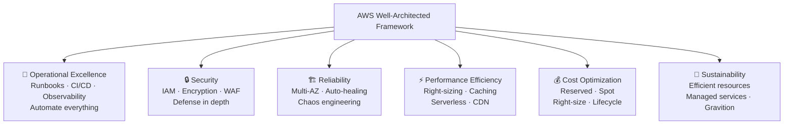
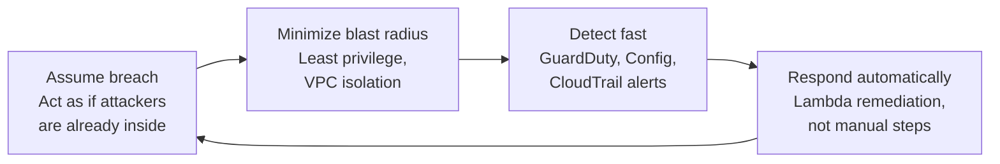
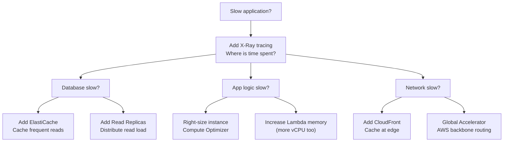

# Stage 14b — The 6 Pillars of Well-Architected Framework

> The difference between "it works" and "it works well" — the framework every senior AWS architect designs against.

---

## 1. Core Intuition

Imagine two engineers both build a to-do app on AWS. Both apps work. Both handle requests. But one architect asks:

- "What happens when the database fails at 3am?"
- "Can we prove no unauthorized person accessed customer data?"
- "What happens when traffic spikes 100x during a launch?"
- "Are we paying for resources we're not using?"
- "How do we know the app is broken before users call us?"

The second architect is thinking about the **6 pillars of the AWS Well-Architected Framework** — the mental checklist that separates production-grade systems from fragile ones.

```
The 6 Pillars:
  1. Operational Excellence    → Can you run and improve the system?
  2. Security                  → Are you protected at every layer?
  3. Reliability               → Does it recover automatically from failure?
  4. Performance Efficiency    → Are you using resources optimally?
  5. Cost Optimization         → Are you paying only for what you need?
  6. Sustainability            → Are you minimizing environmental impact?
```

---

## 2. The Framework at a Glance



---

## 3. Pillar 1 — Operational Excellence

> "Can you run the system, understand what's happening, and continuously improve it?"

### The Story
Your app deployed successfully at 9 AM. At 2 PM, a user emails saying orders are failing. You have no dashboards, no alerts, and no runbooks. Your team spends 4 hours figuring out the root cause — a misconfigured Lambda environment variable deployed by someone manually editing the console.

Operational excellence prevents this.

```
Key Practices:

1. Treat Operations as Code
   Infrastructure as Code (CloudFormation, CDK, Terraform)
   No manual console changes — everything in Git
   "Drift" = gap between deployed state and code → detect with CloudFormation drift

2. Make Frequent, Small, Reversible Changes
   Small deployments → smaller blast radius
   Feature flags → enable/disable without deploy
   Blue/green deployments → instant rollback

3. Anticipate Failure
   Runbooks: documented step-by-step procedures for known failures
   Playbooks: decision trees for unknown failures
   Pre-mortem: "Imagine this failed. What went wrong?"
   Game days: intentionally break things in a controlled environment

4. Learn from Operations
   Every incident → blameless post-mortem → action items
   Track: MTTR (Mean Time to Recovery), change failure rate
   Weekly operational review: which alarms fired? Which runbooks used?

5. Observability Stack
   Metrics (CloudWatch): what is the system doing?
   Logs (CloudWatch Logs): what happened exactly?
   Traces (X-Ray): where is the latency / error?
   Dashboards: single pane of glass
```

**AWS Services for Operational Excellence:**
```
CloudWatch          → Metrics, logs, alarms, dashboards
X-Ray               → Distributed tracing
CloudTrail          → Audit log of every AWS API call
AWS Config          → Track configuration changes over time
AWS Systems Manager → Run commands, patch instances, Parameter Store
CodePipeline        → Automated CI/CD (no manual deployments)
EventBridge         → Automate responses to events
CloudFormation      → Infrastructure as code, drift detection
```

---

## 4. Pillar 2 — Security

> "Are you protecting information and systems at every layer?"

### The Story
A junior developer accidentally commits an AWS access key to GitHub. A bot finds it within 30 seconds, spins up 200 GPU instances for crypto mining. Your AWS bill goes from $500 to $80,000 in one night.

Security is not a checkbox — it's a continuous practice.

```
Key Practices:

1. Defense in Depth (multiple security layers)

   Internet → CloudFront (WAF) → ALB (SG) → EC2 (SG) → VPC (NACL)
           → RDS (SG, no public access) → KMS (encryption at rest)

   If one layer fails → others still protect

2. Implement a Strong Identity Foundation
   Root account → only for billing, never day-to-day
   IAM users + MFA for humans
   IAM roles (not users) for applications
   Least privilege: grant only what's needed, nothing more
   AWS Organizations + SCPs: prevent dangerous actions account-wide

3. Enable Traceability
   CloudTrail in every region + organization trail
   Config rules to detect policy violations
   GuardDuty: ML-based threat detection
   Security Hub: centralized findings dashboard

4. Automate Security Best Practices
   Infrastructure as Code → security in code, not console
   Config rules with auto-remediation
   Lambda → auto-respond to GuardDuty findings
   Trusted Advisor → 60+ security checks

5. Protect Data Everywhere
   In transit: HTTPS everywhere (enforce with S3 bucket policy)
   At rest: KMS encryption for S3, EBS, RDS, DynamoDB
   Sensitive data: Secrets Manager (not environment variables!)
   PII: Macie to discover, Guardrails to redact

6. Prepare for Security Events
   Incident response runbook: GuardDuty alert → isolate → investigate
   Pre-built Lambda: isolate compromised EC2 (apply quarantine SG)
   Enable AWS Backup for ransomware recovery
```

**The Security Mindset:**


---

## 5. Pillar 3 — Reliability

> "Does the system recover automatically from failures, and can it meet demand?"

### The Story
Your RDS database in `us-east-1a` has a hardware failure Friday night. With Multi-AZ disabled, the on-call engineer gets paged, manually starts a new instance from the last snapshot, restores data — 4 hours of downtime. With Multi-AZ enabled, AWS detects the failure and automatically fails over to the standby in `us-east-1b` — 60 seconds, no page, no panic.

```
Key Practices:

1. Test Recovery Procedures (don't assume, verify)
   Monthly: manually fail over RDS → confirm app recovers
   Quarterly: restore from backup → confirm it actually works
   AWS Fault Injection Simulator (FIS):
     Inject: CPU stress, network latency, EC2 termination
     Watch: does the system heal itself?

2. Automatically Recover from Failure
   RDS Multi-AZ: automatic failover
   ASG health checks: replace unhealthy instances
   ECS: restart failed containers
   DynamoDB: fully managed, no manual intervention
   Route 53: health checks → stop routing to unhealthy endpoints

3. Scale Horizontally (not vertically)
   Many small instances > one giant instance
   Vertical scaling (bigger instance) = single point of failure
   Horizontal scaling (more instances) = resilient, one failure = minimal impact

4. Stop Guessing Capacity
   Auto Scaling: demand drives capacity
   Lambda: scales to zero and back to thousands automatically
   Never pre-provision for estimated peak — let it scale

5. Manage Change in Automation
   No manual production changes
   Blue/green deployments: easy rollback
   Canary releases: test with 5% traffic before 100%

RTO and RPO Targets:
  Gold: RTO < 1min, RPO = 0   → Active-Active multi-region
  Silver: RTO < 15min, RPO < 1min → Multi-AZ + read replicas
  Bronze: RTO < 4hrs, RPO < 1hr  → Single AZ + backups
```

---

## 6. Pillar 4 — Performance Efficiency

> "Are you using resources efficiently to meet requirements, and maintaining that efficiency as demand changes?"

### The Story
Your API has a 2-second response time. Users complain. You upgrade the EC2 from t3.medium to m5.4xlarge — it helps a bit but costs 8x more. A senior architect looks at the traces: 1.8 seconds is spent waiting for a DynamoDB query that returns the same data on 90% of requests. Adding ElastiCache drops response time to 50ms. The problem wasn't the server — it was the architecture.

```
Key Practices:

1. Choose the Right Resource Type
   Don't use EC2 if Lambda works
   Don't use RDS if DynamoDB fits your access patterns
   Don't use HDD EBS (st1) when SSD (gp3) is needed
   Don't use c5 (compute) when r5 (memory) is needed for your workload

2. Go Global in Minutes
   CloudFront: cache at 450+ edge locations
   Global Accelerator: route to nearest AWS region
   DynamoDB Global Tables: local reads in every region
   Aurora Global Database: <1s replication globally

3. Use Serverless Architecture
   No idle servers paying while doing nothing
   Lambda scales to 0 when no traffic
   DynamoDB on-demand: pay per request
   Fargate: no EC2 nodes to right-size

4. Experiment More Often
   A/B test instance types (m5 vs c5 vs r5)
   Load test before production
   AWS Compute Optimizer: "you're paying for m5.4xlarge but only use 15% CPU"

5. Mechanical Sympathy (know your bottleneck)
   CPU-bound → compute-optimized (c5, c6g)
   Memory-bound → memory-optimized (r5, r6g)
   I/O-bound → storage-optimized (i3, io2 EBS)
   Network-bound → enhanced networking (ENA), placement groups
   Database-bound → caching (ElastiCache), read replicas, connection pooling
```

**Performance Decision Tree:**


---

## 7. Pillar 5 — Cost Optimization

> "Are you delivering business value at the lowest price point?"

### The Story
A startup gets their AWS bill: $45,000 for the month. The CTO is shocked — the app has 1,000 users. A FinOps review finds: 30 m5.xlarge EC2 instances running 24/7 (average CPU: 8%), 5TB RDS with 2TB used, NAT Gateway data transfer at $800/month, and 3 forgotten load balancers from old experiments. After right-sizing and cleanup: $12,000/month. Same workload.

```
Key Practices:

1. Implement Cloud Financial Management
   Cost Explorer: visualize spending by service, region, tag
   Cost Allocation Tags: tag every resource (team, project, env)
   AWS Budgets: alert when spending exceeds thresholds
   FinOps culture: developers see their service costs

2. Adopt a Consumption Model
   Pay only for what you use
   Stop idle resources: schedule non-prod shutdown (evenings/weekends)
   Serverless: zero cost when no traffic
   Auto Scaling: scale down during quiet hours

3. Measure Overall Efficiency
   Cost per transaction / cost per user / cost per GB processed
   Not just "how much?" but "how much per unit of value?"

4. Stop Spending on Undifferentiated Heavy Lifting
   Don't manage your own database → use RDS
   Don't manage your own container orchestration → ECS/EKS
   Don't manage your own email server → SES

5. Analyze and Attribute Expenditure
   Per-resource tagging: team=payments, env=production
   AWS Cost Categories: group by business unit
   Chargeback / Showback: show teams their own costs
```

**Savings Strategies:**
```
EC2 savings:
  On-Demand:      Full price (no commitment)
  Savings Plans:  Save up to 66% (commit $/hour for 1-3 years)
  Reserved:       Save up to 72% (commit to specific instance)
  Spot:           Save up to 90% (interruptible — use for batch/ML)

Storage savings:
  S3 Intelligent-Tiering: automatic tiering for unknown patterns
  S3 lifecycle: archive to Glacier after 90 days
  EBS: delete unattached volumes, snapshots > 1 year

Database savings:
  RDS Reserved: 40% off 1-year, 60% off 3-year
  Aurora Serverless v2: scales to 0 ACUs (no idle cost)
  DynamoDB on-demand → reserved capacity at scale

Data transfer savings:
  CloudFront reduces S3 egress (free S3 → CloudFront)
  VPC Endpoints: internal traffic doesn't hit NAT Gateway
  Same-AZ communication: free (cross-AZ: $0.01/GB)
```

---

## 8. Pillar 6 — Sustainability

> "Are you minimizing the environmental impact of your cloud workloads?"

```
Key Practices:

1. Understand Your Impact
   AWS Customer Carbon Footprint Tool
   Track: power consumption, carbon equivalent emissions
   Baseline → reduce → report

2. Establish Sustainability Goals
   "50% reduction in carbon footprint by 2025"
   Tie to business metrics: carbon per transaction

3. Maximize Utilization
   Idle resources = wasted energy
   Right-size: don't run m5.4xlarge at 8% CPU
   Serverless: zero consumption when idle
   Shared infrastructure: multi-tenant is more efficient

4. Use Managed Services
   AWS manages hardware efficiency (better PUE than most on-prem)
   AWS Graviton (ARM processors): 60% less energy for same workload
   Graviton3: best performance-per-watt in AWS

5. Reduce Data Movement
   Process data close to where it's stored
   Avoid unnecessary cross-region data transfer
   Compress data before transfer

AWS Graviton = the sustainability and performance win:
  Graviton3 EC2: 40% better price-performance vs x86
  60% less energy consumption
  Same instance types: c7g, m7g, r7g
  Works with: Lambda, ECS, EKS, RDS, ElastiCache
```

---

## 9. AWS Well-Architected Tool

```
The Well-Architected Tool reviews your actual workload
against all 6 pillars and identifies risks.

Console: Well-Architected Tool → Define workload → Start review

Review process:
  ~60 questions across all 6 pillars
  Example questions:
    "How do you design your workload to adapt to changes in demand?"
    "How do you detect and investigate security events?"
    "How do you manage the lifecycle of your workloads?"

  Each question: choose the practices you've implemented
  Tool flags: HIGH RISK / MEDIUM RISK items

Output:
  Risk dashboard: # of high/medium risks per pillar
  Improvement plan: prioritized list of actions
  Milestone tracking: review again in 3 months, measure progress

Lenses:
  Core Well-Architected Framework (default)
  Serverless Lens: specific to Lambda/API GW workloads
  SaaS Lens: multi-tenant SaaS architectures
  Financial Services Lens: compliance-heavy workloads
  Custom Lenses: define your own organizational standards
```

---

## 10. Pillar Summary Cheatsheet

```
┌─────────────────────┬───────────────────────────┬─────────────────────────┐
│ Pillar              │ Key Question              │ Top AWS Services        │
├─────────────────────┼───────────────────────────┼─────────────────────────┤
│ Operational         │ Can you run and improve   │ CloudWatch, X-Ray,      │
│ Excellence          │ the system?               │ CodePipeline, SSM       │
├─────────────────────┼───────────────────────────┼─────────────────────────┤
│ Security            │ Is data + access          │ IAM, KMS, GuardDuty,    │
│                     │ protected?                │ WAF, Macie, Config      │
├─────────────────────┼───────────────────────────┼─────────────────────────┤
│ Reliability         │ Does it heal itself?      │ Multi-AZ, ASG, Route53, │
│                     │                           │ Backup, FIS             │
├─────────────────────┼───────────────────────────┼─────────────────────────┤
│ Performance         │ Right resources for       │ CloudFront, ElastiCache,│
│ Efficiency          │ the job?                  │ Lambda, Graviton        │
├─────────────────────┼───────────────────────────┼─────────────────────────┤
│ Cost Optimization   │ Are you paying only for   │ Cost Explorer, Budgets, │
│                     │ what you use?             │ Savings Plans, Spot     │
├─────────────────────┼───────────────────────────┼─────────────────────────┤
│ Sustainability      │ Minimal environmental     │ Graviton, Serverless,   │
│                     │ impact?                   │ Right-sizing            │
└─────────────────────┴───────────────────────────┴─────────────────────────┘
```

---

## 11. Interview Perspective

**Q: Walk me through the 6 pillars of the Well-Architected Framework and give a real example for each.**
Operational Excellence — use CI/CD pipelines with CodePipeline so there are no manual deployments; every change is auditable. Security — IAM least privilege + KMS encryption at rest + GuardDuty for threat detection; no hardcoded credentials. Reliability — RDS Multi-AZ for automatic failover + Auto Scaling for self-healing + monthly FIS chaos experiments to verify recovery works. Performance Efficiency — CloudFront for global caching + ElastiCache for database query caching + AWS Compute Optimizer for right-sizing. Cost Optimization — Savings Plans for baseline EC2 workloads + Spot Instances for batch processing + lifecycle policies moving old S3 data to Glacier. Sustainability — migrate to Graviton3 instances for 40% better perf/watt + use serverless (Lambda, Fargate) to eliminate idle compute.

**Q: How would you use the AWS Well-Architected Tool in a real project?**
After deploying an MVP, run a WAF Tool review against the workload. Answer ~60 questions across all 6 pillars — the tool flags high and medium risks. For a typical startup MVP, common findings: no Multi-AZ (reliability risk), CloudTrail not enabled (security risk), no S3 lifecycle policies (cost risk). Create improvement milestones: address all HIGH risks in Sprint 1, MEDIUM risks in Sprint 2. Re-run the review quarterly. This gives an auditable trail of architectural improvements — critical for enterprise sales and SOC 2 compliance.

---

**[🏠 Back to README](../README.md)**

**Prev:** [← High Availability](../14_architecture/high_availability.md) &nbsp;|&nbsp; **Next:** [Disaster Recovery →](../14_architecture/disaster_recovery.md)

**Related Topics:** [High Availability](../14_architecture/high_availability.md) · [Disaster Recovery](../14_architecture/disaster_recovery.md) · [Cost Optimization](../15_cost_optimization/theory.md) · [CloudWatch & Observability](../08_monitoring/cloudwatch.md)

---

## 📝 Practice Questions

- 📝 [Q59 · well-architected-pillars](../aws_practice_questions_100.md#q59--normal--well-architected-pillars)

