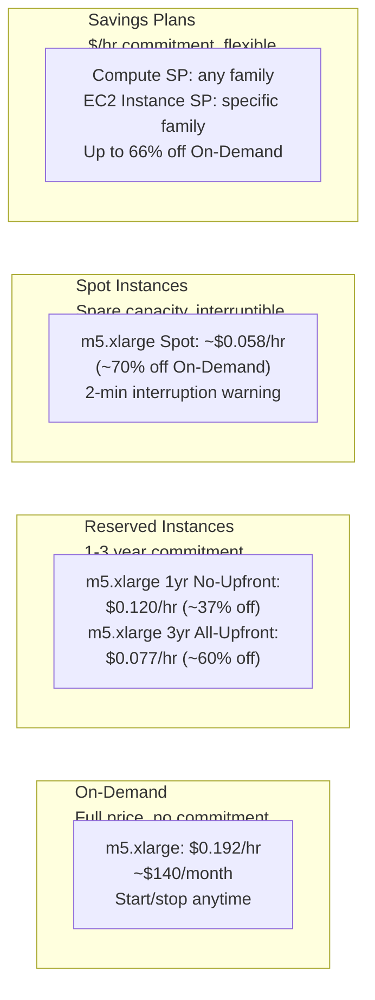

# Stage 15 — Cost Optimization

> Avoid paying for what you don't use. Understand every dollar you spend on AWS.

## 1. Core Intuition

The cloud's promise is that you pay only for what you use. In reality, without discipline, costs spiral — forgotten instances, oversized databases, expensive data transfer, missing lifecycle policies.

**Cost optimization** is about matching your spend to your actual needs. AWS provides all the tools — Reserved Instances, Spot, rightsizing recommendations, lifecycle policies. Your job is to use them.

## 2. The Cost Optimization Mindset

```
Four principles:
━━━━━━━━━━━━━━━━━━━━━━━━━━━━━━━━━━━━━━━━━━━━
1. Right-size:      Match resource to actual need, not predicted peak
2. Save on compute: Commit where predictable, spot where fault-tolerant
3. Eliminate waste: Delete unused resources, use lifecycle policies
4. Architect well:  Serverless, managed services, caching = less compute

Common waste patterns:
  🔴 Dev/test instances running 24/7 (60% waste)
  🔴 Oversized RDS instances with <10% CPU
  🔴 Unattached EBS volumes (forgot to delete after terminating EC2)
  🔴 Data transfer costs (downloading from S3 to EC2 in same region)
  🔴 NAT Gateway data charges (use VPC Endpoints for S3/DynamoDB)
  🔴 Old EBS snapshots never cleaned up
```

## 3. EC2 Pricing Models



### When to Use Each

```
Scenario → Best pricing model:

Dev environment, 9am-6pm weekdays:
  → On-Demand + Instance Scheduler (stop nights/weekends)
  → Save 65% vs always-on

Production web servers, always running:
  → Reserved Instances (1-year, no upfront)
  → Save 37-60%

ML training jobs, batch processing:
  → Spot Instances
  → Save 70-90% with fault-tolerant design

Mixed production workloads:
  → Compute Savings Plan
  → Flexibility across instance families

Short-lived experiments:
  → On-Demand, terminate when done
```

## 4. Cost Optimization by Service

### EC2

```
✅ Right-size using AWS Compute Optimizer
   Console: Compute Optimizer → EC2 instances → View recommendations
   Shows: current CPU/memory utilization vs instance size
   Recommendation: downsize from m5.4xlarge to m5.xlarge → 75% cost reduction

✅ Use Graviton (ARM) instances
   c7g vs c5: same performance, 20% cheaper
   All modern languages/runtimes support ARM

✅ Stop non-production instances
   AWS Instance Scheduler:
   Dev instances: run 8am-6pm weekdays only
   Saves: ~70% on dev compute costs

✅ Use Auto Scaling (don't over-provision for peak)
   Min 2, scale to 50 on demand, scale back → pay only for usage
```

### S3

```
✅ Set lifecycle policies
   Console: S3 → Bucket → Management → Lifecycle rules

   Example: log files
   Day 0: Upload → Standard ($0.023/GB)
   Day 30: Transition to Standard-IA ($0.0125/GB)
   Day 90: Transition to Glacier Instant ($0.004/GB)
   Day 365: Delete

✅ Use S3 Intelligent-Tiering for uncertain access patterns
   AWS auto-moves objects between tiers based on access
   Small monitoring fee: $0.0025 per 1,000 objects

✅ Enable S3 Storage Class Analysis
   Console: S3 → Bucket → Metrics → Storage Class Analysis
   Shows which objects can be moved to cheaper tiers

✅ Check for and delete incomplete multipart uploads
   S3 → Bucket → Management → Lifecycle rules
   Add rule: Abort incomplete multipart uploads after 7 days
```

### RDS

```
✅ Right-size instances (most RDS instances are over-provisioned)
   Check CPU, connections, IOPS in RDS Performance Insights
   Downsize if CPU < 10% average

✅ Stop dev/test RDS instances when not in use
   RDS stop/start (can stop for up to 7 days, auto-starts after)

✅ Aurora Serverless v2 for variable workloads
   Scales down to 0.5 ACU when idle (~$0.06/hour minimum)
   vs db.r5.large at $0.24/hour (4x cost when idle)

✅ Reserved DB Instances for production
   1-year commitment: 40% off, 3-year: 60% off
```

### Lambda

```
✅ Optimize memory settings
   More memory = proportionally more cost
   Use AWS Lambda Power Tuning tool (open source):
   Test at different memory configs, find cost-optimal point

✅ Reduce cold starts (improves latency AND cost)
   Less dead code → faster init → less billed duration

✅ Share dependencies via Layers
   Smaller deployment packages → faster init → less cost

Lambda pricing reality check:
   Most Lambda workloads are FREE or near-free:
   1 million invocations/month: FREE
   400,000 GB-seconds: FREE
   Only pay beyond this
```

### Data Transfer

```
⚠️ Data transfer is a hidden cost trap!

Charges:
  Outbound to internet: $0.09/GB (first 10TB/month)
  Between AZs in same region: $0.01/GB per direction
  Between regions: $0.02-$0.09/GB

Optimizations:
  ✅ Use CloudFront in front of S3/EC2
     CloudFront → S3: FREE data transfer
     CloudFront → users: $0.0085/GB (cheaper than S3 direct)

  ✅ Use VPC Endpoints for S3 and DynamoDB
     Avoids NAT Gateway data processing fees
     Also avoids internet routing = faster + cheaper

  ✅ Keep frequently accessed data in same AZ as compute
     EC2 reads from EBS in same AZ: FREE
     EC2 reads from RDS in same AZ: FREE
     EC2 reads from RDS in different AZ: $0.01/GB each direction

  ✅ Compress data before sending across regions
```

## 5. Cost Management Tools

### AWS Cost Explorer

```
Console: Billing → Cost Explorer

What it shows:
  • Daily/monthly spend by service
  • Cost trends over time
  • Top services by cost
  • Regional cost breakdown
  • Tagged resource costs

Key features:
  Forecasting: predicts next month's bill based on trends
  Anomaly Detection: alerts when spend unexpectedly increases
  Reserved Instance recommendations: based on your usage patterns
  Savings Plans recommendations
```

### AWS Budgets

```
Set spending limits and get alerts:

Console: Billing → Budgets → Create budget

Budget types:
  Cost budget: alert when spending exceeds $X
  Usage budget: alert when you use > X compute hours
  RI utilization: alert if reserved instances < 80% used
  Savings Plans coverage: alert if coverage drops below 80%

Example budget for learning:
  Monthly cost budget: $50
  Alert at: 80% of budget ($40)
  Alert at: 100% of budget ($50)
  Action: Send email to my@email.com

Example for production:
  Monthly budget: $5,000
  Alert at 80% ($4,000) → email DevOps team
  Alert at 100% ($5,000) → email + Slack + consider auto-action
```

### AWS Trusted Advisor

```
Free tier: 5 basic checks
Business/Enterprise support: all checks

Key cost optimization checks:
  • EC2 low utilization instances (< 10% CPU)
  • Idle Load Balancers (< 5 requests/day)
  • Underutilized EBS volumes (< 1% read/write)
  • Unassociated Elastic IPs ($0.005/hr when not in use!)
  • Reserved Instance recommendations
  • S3 large objects without lifecycle policies

Console: Trusted Advisor → Cost Optimization
Review monthly and act on recommendations.
```

### AWS Compute Optimizer

```
Free ML-powered rightsizing recommendations for:
  • EC2 instances
  • EC2 Auto Scaling Groups
  • Lambda functions
  • EBS volumes
  • ECS services on Fargate

Console: Compute Optimizer → Enable in your account

Shows:
  Current: m5.4xlarge, CPU avg 8%, Memory avg 12%
  Recommended: m5.large or m5.xlarge (93% less expensive)
  Risk: Low (based on 14 days of CloudWatch data)
```

## 6. Cost Allocation Tags

```
Tags help you understand WHICH team/project/environment is spending what.

Tag everything:
  Environment: production | staging | development
  Team: platform | product | data
  Project: ecommerce | mobile-app | analytics
  Owner: alice@company.com

Activate tags for billing:
  Billing → Cost allocation tags → User-defined → Activate

Now in Cost Explorer:
  Filter by: Environment = production → see only prod costs
  Group by: Team → see which team spends what

Cost Center Example:
  Engineering (production): $12,400/month
    - EC2: $4,200
    - RDS: $2,800
    - Lambda: $180
    - Data Transfer: $3,100  ← unusually high, investigate!
  Engineering (staging): $1,200/month
  Data Science: $5,600/month
    - SageMaker: $4,200
    - S3: $1,400
```

## 7. Cost Optimization Checklist

```
Monthly Tasks:
━━━━━━━━━━━━━
□ Check Trusted Advisor for cost recommendations
□ Review EC2 instances with < 10% CPU (downsize or terminate)
□ Check for unattached EBS volumes (filter "Available" in Volumes)
□ Check for unused Elastic IP addresses
□ Review idle Load Balancers (< 100 requests/day)
□ Check S3 bucket sizes vs storage class (anything Standard should be IA?)
□ Look for old EBS snapshots (delete ones older than 90 days if no policy)

Quarterly Tasks:
━━━━━━━━━━━━━━━
□ Review Reserved Instance utilization (< 70% = consider selling)
□ Review Savings Plans coverage
□ Run Compute Optimizer and implement recommendations
□ Audit data transfer costs in Cost Explorer
□ Review Lambda function memory settings (Power Tuning)

Annual Tasks:
━━━━━━━━━━━━━
□ Re-evaluate Reserved Instance commitments (expiring soon?)
□ Review architecture for serverless opportunities
□ Consider Graviton migration for suitable workloads
□ Negotiate Enterprise Discount Program (EDP) if spending $1M+/year
```

## 8. Real-World Cost Optimization Examples

```
Case 1: Startup spending $8,000/month
━━━━━━━━━━━━━━━━━━━━━━━━━━━━━━━━━━━━━
Audit revealed:
  • Dev environment EC2 running 24/7: $1,200/month
  • RDS db.r5.2xlarge at 5% CPU: $2,100/month
  • S3: no lifecycle policies, all Standard: $800/month
  • No VPC Endpoints: $400/month in NAT Gateway fees

Actions:
  • Instance Scheduler: stop dev EC2 nights/weekends → saves $840/month
  • Downsize RDS to db.t4g.medium → saves $1,900/month
  • S3 lifecycle to Standard-IA at 30 days → saves $400/month
  • VPC Endpoint for S3 → saves $400/month
  • Total savings: $3,540/month (44% reduction)

Case 2: Batch processing jobs
━━━━━━━━━━━━━━━━━━━━━━━━━━━━━
Before: 50x On-Demand m5.4xlarge for 8 hours/day
Cost: 50 × $0.768 × 8 = $307/day = $9,210/month

After: Spot fleet + some On-Demand (80/20 mix)
Spot m5.4xlarge: ~$0.15/hr (vs $0.768 On-Demand)
Cost: 40 × $0.15 × 8 + 10 × $0.768 × 8 = $109/day = $3,270/month

Savings: $5,940/month (65% reduction)
Tradeoff: Jobs designed to checkpoint → tolerate interruption
```

## 9. Interview Perspective

**Q: How would you reduce AWS costs for a development environment?**
(1) Schedule instances to run only during working hours (Instance Scheduler or Lambda cron). (2) Downsize instances — dev doesn't need production-grade compute. (3) Use Spot Instances where possible for batch dev jobs. (4) Use smaller RDS instances (db.t3.micro), or switch to Aurora Serverless v2 that scales to near-zero. (5) S3 lifecycle policies to archive old build artifacts.

**Q: What is the difference between Reserved Instances and Savings Plans?**
Reserved Instances: commit to a specific instance type in a specific region. More restrictive. Standard RI: locked to exact instance type (highest discount). Convertible RI: can change instance family (slightly less discount). Savings Plans: commit to $/hour of compute spend, flexible across instance types, regions, and even Lambda. Compute Savings Plans work across EC2, Lambda, Fargate. More flexible, slightly lower discount than Standard RI.

**Q: A team's AWS bill jumped 300% last month. How do you investigate?**
(1) AWS Cost Explorer: compare last month vs current month, breakdown by service. (2) Look for the biggest increase — which service? (3) Cost Explorer: filter by that service, group by Region/AZ/usage type. (4) Check CloudTrail: was there a configuration change (new instance type, new service launched)? (5) Enable AWS Cost Anomaly Detection to alert on future spikes immediately.

---

**[🏠 Back to README](../README.md)**

**Prev:** [← Disaster Recovery](../14_architecture/disaster_recovery.md) &nbsp;|&nbsp; **Next:** [Amazon Bedrock →](../16_ai_ml/bedrock.md)

**Related Topics:** [Well-Architected Framework](../14_architecture/well_architected.md) · [EC2](../03_compute/ec2.md) · [RDS & Aurora](../07_databases/rds_aurora.md) · [S3 Object Storage](../04_storage/s3.md)

---

## 📝 Practice Questions

- 📝 [Q60 · cost-optimization](../aws_practice_questions_100.md#q60--normal--cost-optimization)
- 📝 [Q85 · scenario-cost-spike](../aws_practice_questions_100.md#q85--design--scenario-cost-spike)

