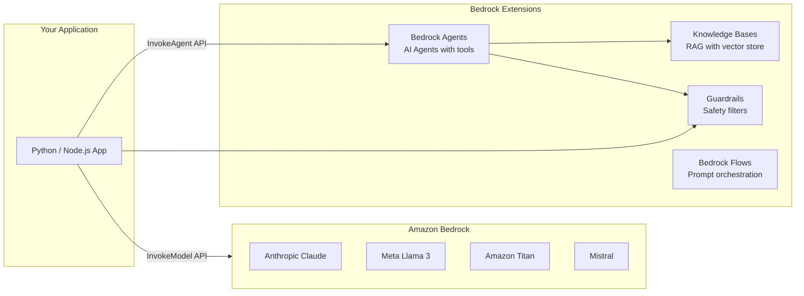

# Stage 16a — Amazon Bedrock: Foundation Models & Generative AI

> Access the world's best foundation models — Claude, Llama, Mistral, Titan — with a single API, no GPU management, no model hosting.

---

## 1. Core Intuition

Training a large language model costs tens of millions of dollars and months of GPU time. Most companies don't need to train models — they need to **use** them.

**Amazon Bedrock** = A fully managed service that gives you API access to dozens of foundation models (FMs) from Anthropic, Meta, Mistral, Cohere, Amazon, and others. Pay per token. No servers. No model management.

```
Without Bedrock:
  Rent 100s of GPUs → download model weights → serve with vLLM/TGI
  Cost: $10,000+/month, 2 weeks to set up, constant ops burden

With Bedrock:
  boto3.client('bedrock-runtime') → call model → get response
  Cost: ~$0.003 per 1,000 tokens, live in 10 minutes
```

---

## 2. Available Models

```
Anthropic Claude (most capable):
  claude-3-5-sonnet-20241022  → Best balance of speed + intelligence
  claude-3-5-haiku-20241022   → Fastest, cheapest
  claude-3-opus-20240229      → Most powerful, complex reasoning

Meta Llama:
  meta.llama3-2-90b-instruct  → Open-source, large
  meta.llama3-2-11b-instruct  → Smaller, fast, vision capable

Amazon Titan:
  amazon.titan-text-express-v1     → General text
  amazon.titan-embed-text-v2:0     → Text embeddings for RAG
  amazon.titan-image-generator-v2  → Image generation

Mistral AI:
  mistral.mistral-large-2402       → Strong reasoning
  mistral.mixtral-8x7b-instruct    → Fast, efficient

Stability AI:
  stability.stable-diffusion-xl    → Image generation

Cohere:
  cohere.command-r-plus            → Enterprise RAG, long context
  cohere.embed-english-v3          → High-quality embeddings
```

---

## 3. Bedrock Architecture



---

## 4. Basic Model Invocation

```python
import boto3
import json

bedrock = boto3.client('bedrock-runtime', region_name='us-east-1')

# Call Claude via Converse API (works with all models!)
response = bedrock.converse(
    modelId='anthropic.claude-3-5-sonnet-20241022-v2:0',
    messages=[
        {
            "role": "user",
            "content": [{"text": "Explain AWS VPC in simple terms"}]
        }
    ],
    system=[{"text": "You are an AWS expert. Explain clearly and concisely."}],
    inferenceConfig={
        "maxTokens": 1000,
        "temperature": 0.7,
        "topP": 0.9,
    }
)

answer = response['output']['message']['content'][0]['text']
print(answer)

# Streaming response (better UX — tokens appear as generated)
response = bedrock.converse_stream(
    modelId='anthropic.claude-3-5-sonnet-20241022-v2:0',
    messages=[{"role": "user", "content": [{"text": "Write a Python Lambda function"}]}]
)

for event in response['stream']:
    if 'contentBlockDelta' in event:
        print(event['contentBlockDelta']['delta']['text'], end='', flush=True)
```

---

## 5. Multi-Modal: Vision

```python
import base64

# Read image
with open('architecture_diagram.png', 'rb') as f:
    image_data = base64.b64encode(f.read()).decode('utf-8')

# Ask Claude to analyze it
response = bedrock.converse(
    modelId='anthropic.claude-3-5-sonnet-20241022-v2:0',
    messages=[{
        "role": "user",
        "content": [
            {
                "image": {
                    "format": "png",
                    "source": {"bytes": base64.b64decode(image_data)}
                }
            },
            {"text": "What AWS services are shown? Identify any architecture anti-patterns."}
        ]
    }]
)
print(response['output']['message']['content'][0]['text'])
```

---

## 6. Text Embeddings for RAG

```python
# Generate embeddings using Amazon Titan Embeddings
response = bedrock.invoke_model(
    modelId='amazon.titan-embed-text-v2:0',
    body=json.dumps({
        "inputText": "How do I configure VPC security groups?",
        "dimensions": 1024,
        "normalize": True
    })
)

body = json.loads(response['body'].read())
embedding = body['embedding']  # 1024-dimensional vector
print(f"Embedding dimensions: {len(embedding)}")
# Store this vector in a vector database (OpenSearch, Pinecone, etc.)
# to enable semantic search
```

---

## 7. Bedrock Model Evaluation & Pricing

```
Pricing (approximate — check AWS console for latest):
  Claude 3.5 Sonnet:  $3.00 / 1M input tokens
                      $15.00 / 1M output tokens
  Claude 3.5 Haiku:   $0.80 / 1M input tokens
                      $4.00 / 1M output tokens
  Llama 3.2 90B:      $2.00 / 1M input tokens
                      $2.00 / 1M output tokens
  Titan Embeddings v2: $0.02 / 1M tokens

Throughput options:
  On-demand:     Pay per token (default, no commitment)
  Provisioned:   Reserve model units for guaranteed throughput
                 Use for: production apps with consistent high load
  Batch inference: Async processing of large datasets
                   50% cheaper than on-demand!
                   Use for: offline processing, bulk document analysis

Model access:
  Some models require access request (Bedrock → Model access → Request)
  Claude models: usually 1-2 days approval
  Amazon/Meta models: instant
```

---

## 8. Console Walkthrough

```
Enable Model Access:
━━━━━━━━━━━━━━━━━━━
Bedrock → Model access (left sidebar)
  → Modify model access
  ✅ Anthropic: Claude 3.5 Sonnet, Haiku
  ✅ Meta: Llama 3.2
  ✅ Amazon: Titan Text, Titan Embeddings
  → Save changes (some models are instant, Claude needs review)

Test in Playground:
━━━━━━━━━━━━━━━━━━
Bedrock → Playgrounds → Chat
  Model: Claude 3.5 Sonnet
  System prompt: "You are an AWS Solutions Architect"
  User: "Design a highly available 3-tier web architecture"
  → Run → see response

Compare models:
  Bedrock → Playgrounds → Chat → Compare mode
  Run same prompt against Claude, Llama, Mistral simultaneously
  Compare quality, speed, cost

View usage:
  Bedrock → Usage → by model, by day
  Bedrock → Settings → Logging → enable CloudWatch logging
```

---

## 9. Interview Perspective

**Q: What is Amazon Bedrock and how does it differ from calling OpenAI's API?**
Both provide API access to foundation models. Bedrock is AWS-native: your requests stay within your AWS account (no data sent to third-party APIs), integrates with IAM for access control, CloudTrail for audit, VPC endpoints for private connectivity, and enables building on top with Agents, Knowledge Bases, and Guardrails. Bedrock supports multiple model providers (Anthropic, Meta, Mistral, Amazon) through a unified API. OpenAI API is a single provider. For enterprises with data residency or compliance requirements, Bedrock is typically preferred.

**Q: When would you use provisioned throughput vs on-demand for Bedrock?**
On-demand is pay-per-token with no guarantees — good for development, testing, and variable workloads. Provisioned throughput reserves model units for guaranteed throughput (tokens per minute) — use it when you have consistent high-volume production traffic, need predictable latency (no throttling), or want cost predictability. For batch processing large datasets offline, use Batch Inference at 50% discount.

---

**[🏠 Back to README](../README.md)**

**Prev:** [← Cost Optimization](../15_cost_optimization/theory.md) &nbsp;|&nbsp; **Next:** [Bedrock Agents →](../16_ai_ml/bedrock_agents.md)

**Related Topics:** [Bedrock Agents](../16_ai_ml/bedrock_agents.md) · [Knowledge Bases (RAG)](../16_ai_ml/bedrock_knowledge_bases.md) · [Guardrails & Amazon Q](../16_ai_ml/guardrails_amazon_q.md) · [SageMaker](../16_ai_ml/sagemaker.md)

---

## 📝 Practice Questions

- 📝 [Q67 · bedrock-basics](../aws_practice_questions_100.md#q67--thinking--bedrock-basics)

