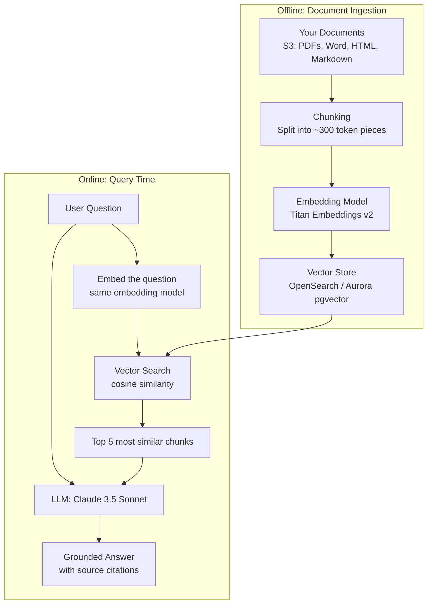

# Stage 16c — Bedrock Knowledge Bases: RAG on AWS

> Give your AI agent a memory of your company's documents — product manuals, SOPs, FAQs — and let it answer questions from that knowledge.

---

## 1. Core Intuition

Imagine hiring a brilliant new employee — PhD-level intelligence, knows everything in the world. But on day one you ask: "What's our refund policy for enterprise customers?" They stare at you blankly. All that intelligence, and they can't answer a basic internal question because they've never read your company handbook.

That's the foundation model problem. Claude knows how to reason beautifully, but knows nothing about *your* products, *your* policies, or *your* customers.

**Bedrock Knowledge Bases** give the model a searchable memory of your company's documents. Before answering, the model looks up the 5 most relevant passages from your docs, then answers based on *that* context. Suddenly your AI sounds like a 10-year company veteran who's read every document.

```
Without Knowledge Base:
  You: "What's our SLA for P1 incidents?"
  AI:  "Typically, enterprise SLAs cover..." ← generic hallucination

With Knowledge Base:
  You: "What's our SLA for P1 incidents?"
  AI searches your docs → finds SLA agreement PDF, page 4
  AI:  "Per your Enterprise Agreement v2.1, P1 incidents are
        acknowledged within 15 minutes and resolved within 4 hours."
        Source: contracts/enterprise-sla-2024.pdf
```

---

## 2. The Problem RAG Solves

```
Foundation models know everything up to their training cutoff.
They know nothing about:
  ❌ Your company's internal policies
  ❌ Your product documentation
  ❌ Customer data from last week
  ❌ Your private codebase

Naive solution: Put everything in the context window
  Problem: 1,000 documents × 10 pages = millions of tokens
  Cost: $50+ per query. Slow. Context limits hit.

Better solution: RAG (Retrieval Augmented Generation)
  Store documents as vectors in a database
  At query time: find the 5 most relevant chunks
  Only send those 5 chunks to the LLM
  Cost: $0.01 per query. Fast. Accurate.
```

---

## 2. How RAG Works



---

## 3. Why Vector Search Works

```
Traditional search: find documents containing the word "VPC"
  → Returns docs with the exact word "VPC"
  → Misses: "virtual private cloud", "network isolation", "private subnet"

Vector (semantic) search:
  Convert text → 1024-dimensional vector (a list of numbers)
  Similar meaning → similar vectors (close in vector space)
  "How do I isolate my network?" → vector close to "VPC configuration guide"
  Finds conceptually similar content, not just keyword matches

Cosine similarity:
  Two vectors pointing in the same direction → similar meaning
  Angle between vectors = 0° → identical meaning (similarity = 1.0)
  Angle = 90° → unrelated (similarity = 0)
```

---

## 4. Create a Knowledge Base

### Step 1: Prepare Documents in S3

```
Supported formats:
  ✅ PDF, Word (.docx), HTML, Markdown, CSV, JSON, text
  ✅ Max file size: 50MB per file

Best practices:
  Organize by topic in S3 prefixes
  s3://my-kb-bucket/
    products/product-manual-v3.pdf
    policies/refund-policy.md
    faqs/shipping-faq.html
    release-notes/v2.1-changelog.md

  Clean your documents:
    Remove headers/footers (they add noise to every chunk)
    Split very long documents by section before uploading
```

### Step 2: Create Knowledge Base (Boto3)

```python
import boto3

bedrock_agent = boto3.client('bedrock-agent', region_name='us-east-1')

# Create Knowledge Base
kb = bedrock_agent.create_knowledge_base(
    name='company-knowledge-base',
    description='Product docs, policies, and FAQs',
    roleArn='arn:aws:iam::123456789:role/BedrockKBRole',
    knowledgeBaseConfiguration={
        'type': 'VECTOR',
        'vectorKnowledgeBaseConfiguration': {
            'embeddingModelArn': 'arn:aws:bedrock:us-east-1::foundation-model/amazon.titan-embed-text-v2:0'
        }
    },
    storageConfiguration={
        'type': 'OPENSEARCH_SERVERLESS',
        'opensearchServerlessConfiguration': {
            'collectionArn': 'arn:aws:aoss:us-east-1:123456789:collection/my-kb-collection',
            'vectorIndexName': 'bedrock-knowledge-base-index',
            'fieldMapping': {
                'vectorField': 'bedrock-knowledge-base-default-vector',
                'textField': 'AMAZON_BEDROCK_TEXT_CHUNK',
                'metadataField': 'AMAZON_BEDROCK_METADATA'
            }
        }
    }
)

kb_id = kb['knowledgeBase']['knowledgeBaseId']

# Add S3 data source
data_source = bedrock_agent.create_data_source(
    knowledgeBaseId=kb_id,
    name='company-docs-s3',
    dataSourceConfiguration={
        'type': 'S3',
        's3Configuration': {
            'bucketArn': 'arn:aws:s3:::my-kb-bucket',
            'inclusionPrefixes': ['products/', 'policies/', 'faqs/']
        }
    },
    vectorIngestionConfiguration={
        'chunkingConfiguration': {
            'chunkingStrategy': 'SEMANTIC',   # smart chunking by meaning
            'semanticChunkingConfiguration': {
                'maxTokens': 300,
                'bufferSize': 1,
                'breakpointPercentileThreshold': 95
            }
        }
    }
)

# Start ingestion (sync documents)
bedrock_agent.start_ingestion_job(
    knowledgeBaseId=kb_id,
    dataSourceId=data_source['dataSource']['dataSourceId']
)
print(f"Ingestion started for KB: {kb_id}")
```

---

## 5. Query the Knowledge Base

```python
import boto3

bedrock_runtime = boto3.client('bedrock-agent-runtime', region_name='us-east-1')

# Direct KB retrieval (search only, no LLM)
def search_kb(query, kb_id, top_k=5):
    response = bedrock_runtime.retrieve(
        knowledgeBaseId=kb_id,
        retrievalQuery={'text': query},
        retrievalConfiguration={
            'vectorSearchConfiguration': {
                'numberOfResults': top_k,
                'overrideSearchType': 'HYBRID'  # vector + keyword search
            }
        }
    )

    results = []
    for r in response['retrievalResults']:
        results.append({
            'content': r['content']['text'],
            'score': r['score'],
            'source': r['location']['s3Location']['uri']
        })
    return results

# RAG: retrieve + generate (KB + LLM combined)
def ask_kb(question, kb_id):
    response = bedrock_runtime.retrieve_and_generate(
        input={'text': question},
        retrieveAndGenerateConfiguration={
            'type': 'KNOWLEDGE_BASE',
            'knowledgeBaseConfiguration': {
                'knowledgeBaseId': kb_id,
                'modelArn': 'arn:aws:bedrock:us-east-1::foundation-model/anthropic.claude-3-5-sonnet-20241022-v2:0',
                'retrievalConfiguration': {
                    'vectorSearchConfiguration': {
                        'numberOfResults': 5,
                        'overrideSearchType': 'HYBRID'
                    }
                },
                'generationConfiguration': {
                    'promptTemplate': {
                        'textPromptTemplate': """You are a helpful assistant. Answer based ONLY on the provided context.
If the answer isn't in the context, say "I don't have that information."

Context:
$search_results$

Question: $query$

Answer:"""
                    }
                }
            }
        }
    )

    answer = response['output']['text']
    citations = response.get('citations', [])

    # Show sources
    sources = []
    for citation in citations:
        for ref in citation.get('retrievedReferences', []):
            sources.append(ref['location']['s3Location']['uri'])

    return answer, list(set(sources))

# Usage
answer, sources = ask_kb(
    "What is our refund policy for digital products?",
    kb_id="KB123456"
)
print(f"Answer: {answer}")
print(f"Sources: {sources}")
```

---

## 6. Chunking Strategies

```
Fixed-size chunking (default):
  Split every N tokens regardless of content
  Fast but may split sentences/paragraphs mid-thought
  Good for: uniform documents

Semantic chunking (recommended):
  Split at natural boundaries (paragraph, section breaks)
  Keeps related content together
  Good for: varied documents, better retrieval quality

Hierarchical chunking:
  Large parent chunks + small child chunks
  Search with small chunks (precise) but retrieve parent (more context)
  Good for: long documents where context matters

Custom Lambda chunking:
  Your own chunking logic via Lambda function
  Good for: specialized formats (legal docs, code, tables)

Metadata filtering:
  Tag chunks with metadata: {department: "HR", year: 2024, type: "policy"}
  Filter at query time: only search HR policies from 2024
  Prevents cross-contamination between document types
```

---

## 7. Knowledge Base + Agent Together

```python
# Attach Knowledge Base to an Agent
bedrock_agent.associate_agent_knowledge_base(
    agentId=agent_id,
    agentVersion='DRAFT',
    knowledgeBaseId=kb_id,
    description='Use this to answer questions about company policies, products, and FAQs.',
    knowledgeBaseState='ENABLED'
)

# Now the agent automatically:
# 1. Decides when to query the KB (vs. use a tool)
# 2. Searches relevant chunks
# 3. Generates answer grounded in your documents
# 4. Cites the source documents

# Example conversation:
# User: "What's the return window for electronics?"
# Agent thinks: "I need policy info → query KB"
# Agent searches KB → finds return policy doc
# Agent: "Electronics have a 30-day return window per our return policy (source: policies/returns.pdf)"
```

---

## 8. Vector Store Options

```
Amazon OpenSearch Serverless (recommended):
  Fully managed, auto-scales
  Supports both vector + keyword (hybrid) search
  No cluster management
  Cost: ~$700/month minimum (OCU pricing)

Amazon Aurora PostgreSQL with pgvector:
  SQL-native vector storage
  Good if you already use Aurora
  Combine vector search with regular SQL queries

Amazon Neptune Analytics:
  Graph + vector combined
  Good for: knowledge graphs with semantic search

Pinecone / MongoDB Atlas (external):
  Third-party vector databases integrated via Bedrock KB
  Use if you already have these

Redis:
  Low-latency vector search
  Good for: real-time recommendation systems
```

---

## 9. Console Walkthrough

```
Create Knowledge Base:
━━━━━━━━━━━━━━━━━━━━━
Bedrock → Knowledge bases → Create knowledge base

Step 1: Knowledge base details
  Name: company-docs-kb
  IAM role: create new (needs S3 + Bedrock access)

Step 2: Set up data source
  Data source type: Amazon S3
  S3 URI: s3://my-kb-bucket/
  Chunking: Semantic chunking (recommended)
  Embedding model: Titan Embeddings V2

Step 3: Select vector store
  Quick create new vector store:
    Creates OpenSearch Serverless collection automatically
  OR: Use existing OpenSearch/Aurora

Step 4: Review → Create

Sync data source:
  Knowledge bases → your KB → Data source → Sync
  Wait for status: Complete
  Check: Ingestion jobs → see files processed

Test:
  Knowledge base → Test → ask a question
  See: answer + retrieved chunks + scores
  Adjust chunking or prompts if needed
```

---

## 10. Interview Perspective

**Q: What is RAG and why is it better than fine-tuning for company knowledge?**
RAG (Retrieval Augmented Generation) retrieves relevant document chunks at query time and includes them in the LLM prompt. Fine-tuning bakes knowledge into model weights. RAG is better for company knowledge because: (1) Knowledge stays current — update your S3 documents, re-sync, done. Fine-tuning requires re-training. (2) Source citations — you can show which document was used. (3) Lower cost — no GPU training needed. (4) Hallucination reduction — model is constrained to retrieved context. Fine-tuning is better for teaching the model a new task style, format, or domain-specific language patterns.

**Q: What is hybrid search in Knowledge Bases?**
Hybrid search combines vector search (semantic similarity) with traditional keyword search (BM25). Vector search finds conceptually similar content even without exact keywords. Keyword search finds exact term matches. Hybrid search merges both results, giving better coverage: vector search handles paraphrasing and synonyms; keyword search handles specific product codes, names, and acronyms. Always prefer hybrid search in production Knowledge Bases.

---

**[🏠 Back to README](../README.md)**

**Prev:** [← Bedrock Agents](../16_ai_ml/bedrock_agents.md) &nbsp;|&nbsp; **Next:** [Guardrails & Amazon Q →](../16_ai_ml/guardrails_amazon_q.md)

**Related Topics:** [Amazon Bedrock](../16_ai_ml/bedrock.md) · [Bedrock Agents](../16_ai_ml/bedrock_agents.md) · [Guardrails & Amazon Q](../16_ai_ml/guardrails_amazon_q.md) · [S3 Object Storage](../04_storage/s3.md)
