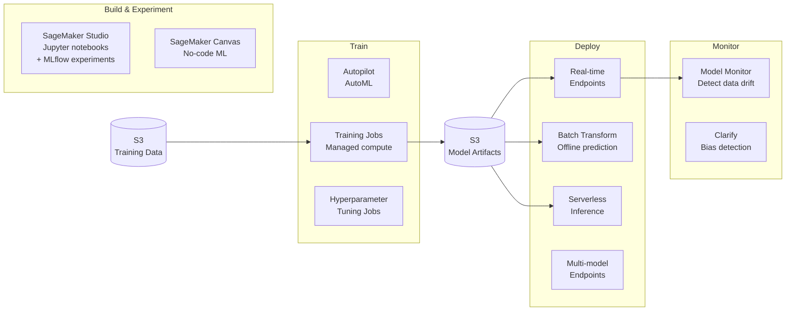

# Stage 16e — SageMaker: Custom ML Model Training & Deployment

> When foundation models aren't enough — train, fine-tune, and deploy your own machine learning models at scale.

---

## 1. Core Intuition

A bank's fraud detection team has a problem. They tried Claude and GPT — both gave generic answers like "unusual transaction patterns may indicate fraud." But their model needs to know that *their* customers, in *their* geography, with *their* product types, have very specific fraud fingerprints. A generic model trained on the internet knows nothing about that.

**Amazon SageMaker** is the platform for building, training, and deploying machine learning models on your own data. Think of it as a full ML factory:

```
Raw data in S3
    ↓
SageMaker Data Wrangler   → Clean and transform data (no-code)
    ↓
SageMaker Training Job    → Rent 10 GPUs for 2 hours, train, shut down
    ↓
SageMaker Model Registry  → Version, review, approve for production
    ↓
SageMaker Endpoint        → Live HTTP API: send transaction → get fraud score
    ↓
SageMaker Model Monitor   → Alert if data distribution drifts (model goes stale)
```

You pay only when compute runs. No idle servers. No ML infrastructure team needed.

---

## 2. When to Use SageMaker vs Bedrock

```
Use Bedrock (Foundation Models) when:
  ✅ Text generation, summarization, Q&A, chat
  ✅ You want a pre-trained model ready to use
  ✅ No labeled training data available
  ✅ Quick to deploy, no ML expertise needed

Use SageMaker when:
  ✅ Custom tabular data (fraud detection, churn prediction, pricing)
  ✅ Fine-tuning a model on your specific domain data
  ✅ Computer vision with your own image dataset
  ✅ You have labeled training data and want maximum accuracy
  ✅ Need full control over model architecture and training

Real examples where SageMaker wins:
  Credit card fraud: train on your transaction patterns
  Medical imaging: detect tumors specific to your scanner type
  Recommendation engine: personalized to your product catalog
  Predictive maintenance: anomaly detection for your machines
```

---

## 2. SageMaker Architecture Overview



---

## 3. SageMaker Training Job

```python
import sagemaker
from sagemaker.sklearn.estimator import SKLearn
from sagemaker import get_execution_role

role = get_execution_role()
session = sagemaker.Session()

# Training script (train.py) will run inside a managed container
# SageMaker injects data via environment variables:
#   SM_CHANNEL_TRAIN=/opt/ml/input/data/train
#   SM_MODEL_DIR=/opt/ml/model  (save model here!)

sklearn_estimator = SKLearn(
    entry_point='train.py',        # your training script
    framework_version='1.2-1',
    instance_type='ml.m5.xlarge',  # compute for training
    instance_count=1,
    role=role,
    hyperparameters={              # passed as args to your script
        'n-estimators': 200,
        'max-depth': 10,
        'learning-rate': 0.05,
    },
    output_path='s3://my-bucket/model-output/'
)

# Start training job
sklearn_estimator.fit({
    'train': 's3://my-bucket/data/train/',
    'validation': 's3://my-bucket/data/validation/'
})

# Training job ran on managed EC2 → stopped when done (no idle cost!)
print(f"Training job: {sklearn_estimator.latest_training_job.name}")
```

```python
# train.py — runs inside SageMaker managed container
import argparse, os, joblib
import pandas as pd
from sklearn.ensemble import GradientBoostingClassifier
from sklearn.metrics import accuracy_score

def main():
    parser = argparse.ArgumentParser()
    parser.add_argument('--n-estimators', type=int, default=100)
    parser.add_argument('--max-depth', type=int, default=5)
    parser.add_argument('--learning-rate', type=float, default=0.1)
    # SageMaker injects these
    parser.add_argument('--model-dir', type=str, default=os.environ['SM_MODEL_DIR'])
    parser.add_argument('--train', type=str, default=os.environ['SM_CHANNEL_TRAIN'])
    parser.add_argument('--validation', type=str, default=os.environ['SM_CHANNEL_VALIDATION'])
    args = parser.parse_args()

    # Load data
    train_df = pd.read_csv(f"{args.train}/train.csv")
    val_df = pd.read_csv(f"{args.validation}/validation.csv")

    X_train, y_train = train_df.drop('label', axis=1), train_df['label']
    X_val, y_val = val_df.drop('label', axis=1), val_df['label']

    # Train
    model = GradientBoostingClassifier(
        n_estimators=args.n_estimators,
        max_depth=args.max_depth,
        learning_rate=args.learning_rate
    )
    model.fit(X_train, y_train)

    # Evaluate
    val_acc = accuracy_score(y_val, model.predict(X_val))
    print(f"Validation accuracy: {val_acc:.4f}")

    # Save model — SageMaker picks it up from SM_MODEL_DIR
    joblib.dump(model, os.path.join(args.model_dir, 'model.joblib'))

if __name__ == '__main__':
    main()
```

---

## 4. Deploy a Real-Time Endpoint

```python
# Deploy model to a persistent endpoint (HTTP API)
predictor = sklearn_estimator.deploy(
    initial_instance_count=1,
    instance_type='ml.m5.large',
    endpoint_name='fraud-detection-v1'
)

# Invoke endpoint
import json
sample = [[0.5, 1200.0, 3, 0, 1, 23.5]]   # feature values
prediction = predictor.predict(sample)
print(f"Fraud probability: {prediction[0]}")

# Auto-scaling the endpoint
import boto3
autoscaling = boto3.client('application-autoscaling')

autoscaling.register_scalable_target(
    ServiceNamespace='sagemaker',
    ResourceId='endpoint/fraud-detection-v1/variant/AllTraffic',
    ScalableDimension='sagemaker:variant:DesiredInstanceCount',
    MinCapacity=1,
    MaxCapacity=10
)

autoscaling.put_scaling_policy(
    PolicyName='fraud-endpoint-scaling',
    ServiceNamespace='sagemaker',
    ResourceId='endpoint/fraud-detection-v1/variant/AllTraffic',
    ScalableDimension='sagemaker:variant:DesiredInstanceCount',
    PolicyType='TargetTrackingScaling',
    TargetTrackingScalingPolicyConfiguration={
        'TargetValue': 70.0,   # scale when CPU > 70%
        'PredefinedMetricSpecification': {
            'PredefinedMetricType': 'SageMakerVariantInvocationsPerInstance'
        }
    }
)
```

---

## 5. Fine-Tuning Foundation Models

```python
from sagemaker.jumpstart.estimator import JumpStartEstimator

# Fine-tune Llama 3.2 on your own data with JumpStart
estimator = JumpStartEstimator(
    model_id='meta-textgeneration-llama-3-2-3b-instruct',
    environment={'accept_eula': 'true'},
    instance_type='ml.g5.12xlarge',  # GPU instance
)

# Your fine-tuning dataset format (instruction tuning):
# s3://my-bucket/finetune-data/train.jsonl
# Each line: {"prompt": "...", "completion": "..."}

estimator.fit({
    'train': 's3://my-bucket/finetune-data/train.jsonl',
    'validation': 's3://my-bucket/finetune-data/validation.jsonl'
})

# Deploy fine-tuned model
predictor = estimator.deploy(
    initial_instance_count=1,
    instance_type='ml.g5.4xlarge'
)
```

---

## 6. SageMaker Autopilot (AutoML)

```python
from sagemaker.automl.automl import AutoML

# AutoML: give it data + target column → it tries everything
automl = AutoML(
    role=role,
    target_attribute_name='churn',      # column to predict
    max_candidates=50,                   # try up to 50 model configs
    max_runtime_per_training_job_in_seconds=600,
    total_job_runtime_in_seconds=3600,
    mode='ENSEMBLING',                   # or 'HYPERPARAMETER_TUNING'
)

automl.fit(
    'churn-train',
    's3://my-bucket/data/churn.csv',
    job_name='churn-automl-job'
)

# Get best model
best_candidate = automl.describe_auto_ml_job()['BestCandidate']
print(f"Best model: {best_candidate['CandidateName']}")
print(f"Best metric: {best_candidate['FinalAutoMLJobObjectiveMetric']}")

# Deploy best model
predictor = automl.deploy(
    initial_instance_count=1,
    instance_type='ml.m5.large',
    candidate=best_candidate
)
```

---

## 7. SageMaker Studio

```
SageMaker Studio = The ML IDE (browser-based)

Features:
  Jupyter notebooks:   Run experiments, explore data
  MLflow integration:  Track experiments (parameters, metrics, artifacts)
  Pipelines:           Define ML workflows (preprocess → train → evaluate → deploy)
  Model Registry:      Version and approve models before production deployment
  Experiments:         Compare 20 training runs side by side
  Feature Store:       Centralized feature repository (reuse features across models)
  Data Wrangler:       Visual data cleaning and transformation (no-code)

MLflow tracking in Studio:
import mlflow

mlflow.set_experiment("fraud-detection")

with mlflow.start_run():
    mlflow.log_param("n_estimators", 200)
    mlflow.log_param("max_depth", 10)
    mlflow.log_metric("accuracy", 0.9456)
    mlflow.log_metric("auc", 0.9823)
    mlflow.sklearn.log_model(model, "model")
```

---

## 8. Common ML Instance Types

```
Training (CPU):
  ml.m5.xlarge   (4 vCPU, 16 GB)   → small datasets, sklearn
  ml.m5.4xlarge  (16 vCPU, 64 GB)  → medium datasets
  ml.c5.18xlarge (72 vCPU, 144 GB) → CPU-intensive, large datasets

Training (GPU) — for deep learning / LLM fine-tuning:
  ml.g5.xlarge   (1× A10G GPU, 24GB VRAM)  → small models
  ml.g5.12xlarge (4× A10G GPU, 96GB VRAM)  → LLM fine-tuning
  ml.p4d.24xlarge(8× A100 GPU, 320GB VRAM) → large model training

Inference (real-time endpoint):
  ml.m5.large    → low-traffic, CPU models
  ml.g4dn.xlarge → GPU inference (transformer models)
  ml.inf2.xlarge → AWS Inferentia chip (cheapest GPU inference)

Cost tip:
  Training: use Spot instances (70% cheaper, SageMaker handles interruption)
  estimator = SKLearn(..., use_spot_instances=True, max_wait=7200)
```

---

## 9. Interview Perspective

**Q: When would you choose SageMaker over Amazon Bedrock?**
Use Bedrock for general-purpose LLM tasks (text generation, summarization, chat) where pre-trained foundation models work well. Use SageMaker when: you have proprietary labeled tabular data (fraud detection, churn prediction), you need to fine-tune a model on domain-specific data for better accuracy, you're building computer vision pipelines with custom image datasets, or you need full control over model architecture and the training pipeline. SageMaker requires more ML expertise but enables maximum customization.

**Q: What is the difference between a SageMaker training job and a SageMaker endpoint?**
A training job is ephemeral — it spins up compute, runs your training script, saves the model to S3, and shuts down (you pay only for training time). An endpoint is persistent — it keeps compute running to serve real-time predictions via HTTP (you pay per hour). For offline bulk predictions, use Batch Transform instead of an endpoint (process all records, no persistent server).

---

**[🏠 Back to README](../README.md)**

**Prev:** [← Guardrails & Amazon Q](../16_ai_ml/guardrails_amazon_q.md) &nbsp;|&nbsp; **Next:** [Pre-Built AI Services →](../16_ai_ml/ai_services.md)

**Related Topics:** [Amazon Bedrock](../16_ai_ml/bedrock.md) · [Pre-Built AI Services](../16_ai_ml/ai_services.md) · [S3 Object Storage](../04_storage/s3.md) · [ECS](../10_containers/ecs.md)

---

## 📝 Practice Questions

- 📝 [Q68 · sagemaker-overview](../aws_practice_questions_100.md#q68--thinking--sagemaker-overview)

