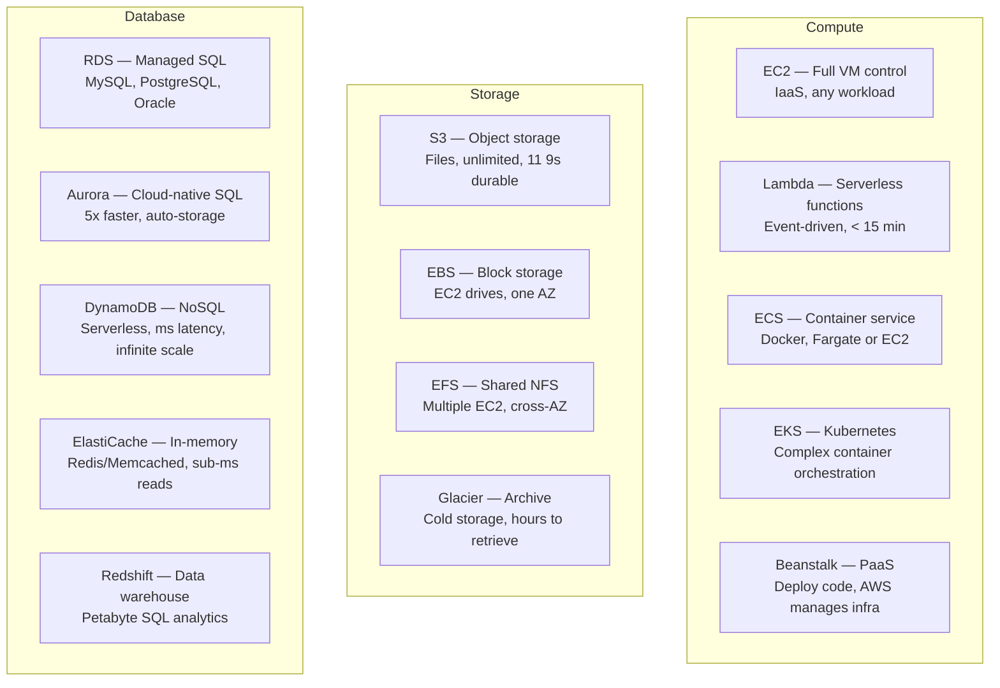
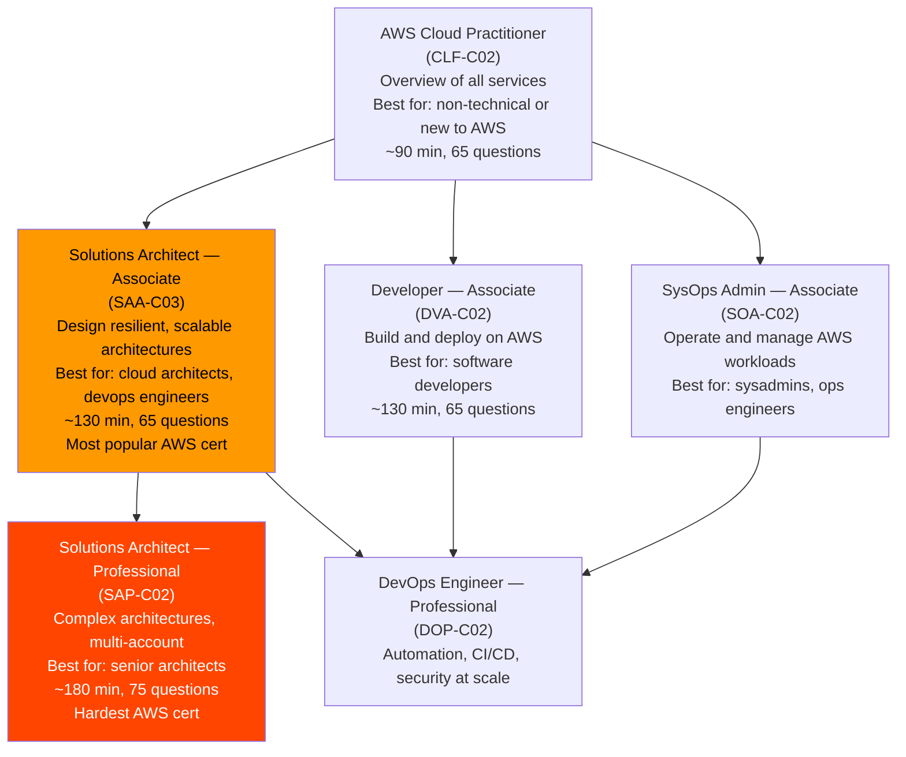

# Stage 99 — Interview Master: SAA-C03, DVA-C02, SAP-C02

> 100 most important AWS interview questions, architectural scenarios, and rapid-fire answers.

**Also see:** [Scenario & Architecture Q&A](./scenarios.md) — 25 deep-dive real interview scenarios with full solutions.

---

## The Interview Scenario

You're in a 45-minute technical interview at a company using AWS at scale. The interviewer asks: *"Walk me through how you'd design a highly available, cost-efficient backend for a global e-commerce platform."*

This is where months of learning either click — or fall apart. Not because you forgot facts, but because you haven't practiced connecting them. This guide is your final prep: rapid-fire Q&As, architectural scenarios you can draw on a whiteboard, and the "aha" comparisons interviewers love to probe.

**How to use this guide:**
- Treat each Q&A as a flashcard — cover the answer, say it out loud first
- For architecture scenarios, sketch the diagram before reading the solution
- The comparisons section is gold — most "trick" questions are really "when would you use X vs Y?"

---

## Service Comparison Cheatsheet



## Rapid-Fire Q&A — Section 1: Core Services

**Q: What is the maximum size of an S3 object?**
5 TB. Use multipart upload for objects > 100 MB.

**Q: What is the minimum memory for a Lambda function?**
128 MB. Maximum is 10,240 MB (10 GB).

**Q: What is the maximum Lambda timeout?**
15 minutes (900 seconds). Default is 3 seconds.

**Q: What is the difference between S3 Standard and S3 Standard-IA?**
Standard: frequent access, $0.023/GB-month, no retrieval fee. Standard-IA: infrequent access, $0.0125/GB-month, but charges retrieval fee per GB. Use IA for data accessed < once per month.

**Q: What is the maximum DynamoDB item size?**
400 KB. Store large payloads in S3 and save the S3 URL in DynamoDB.

**Q: How many Availability Zones does each AWS Region have?**
Typically 3–6 AZs per region. Minimum is 2 for most regions.

**Q: What port does HTTPS use?**
443. HTTP is port 80.

**Q: What is the default security group behavior?**
All inbound DENIED, all outbound ALLOWED.

**Q: Can you decrease the size of an EBS volume?**
No. EBS volumes can only be increased in size, not decreased. You'd need to create a smaller volume and copy data manually.

**Q: What is an EBS Snapshot?**
A point-in-time backup of an EBS volume stored in S3. Incremental — only changed blocks are saved after the first snapshot.

## Rapid-Fire Q&A — Section 2: Networking

**Q: What is the difference between a Security Group and a NACL?**
SG: stateful, instance-level, allow-only, multiple per instance. NACL: stateless, subnet-level, allow AND deny, one per subnet, rules evaluated by number order.

**Q: Where does a NAT Gateway go — public or private subnet?**
PUBLIC subnet. It needs a path to the Internet Gateway.

**Q: What is a VPC Endpoint?**
A private connection from your VPC to AWS services (S3, DynamoDB, etc.) that doesn't go through the internet. Gateway endpoints (S3, DynamoDB) are free. Interface endpoints cost ~$0.01/hr per AZ.

**Q: What is the difference between VPC Peering and Transit Gateway?**
Peering: direct private connection between 2 VPCs. Not transitive (A→B, B→C doesn't give A→C). Transit Gateway: hub-and-spoke router connecting many VPCs and on-premise networks. Supports transitive routing. Better for 3+ VPCs.

**Q: What is a Bastion Host?**
An EC2 instance in a public subnet used to SSH into instances in private subnets. The bastion's security group allows SSH from your IP; private instance security groups allow SSH from the bastion's security group.

**Q: What is Direct Connect?**
A dedicated private network connection from your data center to AWS. Not over the internet. Up to 100 Gbps, consistent latency. Takes weeks to set up.

**Q: What is Route 53?**
AWS's DNS service. Provides domain registration, DNS routing (including health checks, geo routing, weighted routing), and DNSSEC.

## Rapid-Fire Q&A — Section 3: IAM & Security

**Q: What is the root account?**
The original AWS account email/password with UNLIMITED access. Lock it immediately. Enable MFA. Never use for daily operations.

**Q: What is the difference between an IAM User and Role?**
User: permanent credentials (access key + password). Role: temporary credentials via STS, no static credentials. Use roles for applications, services, EC2, Lambda, cross-account access.

**Q: What does an SCP do?**
Service Control Policy limits the MAXIMUM permissions that accounts in an AWS Organization OU can have. It doesn't grant permissions — only restricts them. Even AdministratorAccess can't override an SCP denial.

**Q: What is the Principle of Least Privilege?**
Grant only the minimum permissions required. A Lambda reading from one SQS queue should only have `sqs:ReceiveMessage` and `sqs:DeleteMessage` on THAT queue's ARN — not `sqs:*` on `*`.

**Q: What is AWS KMS?**
Key Management Service. Create, manage, and rotate encryption keys (CMKs). Integrated with S3, EBS, RDS, DynamoDB. Envelope encryption: data encrypted with a data key, data key encrypted with KMS master key. Audit key usage in CloudTrail.

**Q: What is AWS Secrets Manager?**
Stores and rotates secrets (database passwords, API keys). Lambda/EC2 fetch secrets at runtime via API. Automatic rotation (e.g., RDS password every 90 days). Charges ~$0.40/secret/month.

## Rapid-Fire Q&A — Section 4: High Availability & Scaling

**Q: What is the difference between High Availability and Fault Tolerance?**
HA: system stays up despite component failures — brief failover may occur. Fault Tolerance: zero interruption even as components fail — requires full redundancy. HA is cheaper; FT is the gold standard.

**Q: What is the difference between RDS Multi-AZ and Read Replicas?**
Multi-AZ: synchronous replication for HA failover. Standby doesn't serve reads. ~60s failover. Protects against AZ failure. Read Replicas: asynchronous replication for read scaling. Serve read traffic. Have their own endpoint. Can be in different regions.

**Q: What is Auto Scaling target tracking?**
You set a target metric value (e.g., CPU = 70%). ASG automatically adds/removes instances to maintain that target. Simplest scaling policy — AWS does the math.

**Q: What is connection draining (deregistration delay)?**
When an instance is being removed from an ALB target group, the ALB stops sending NEW requests but waits for in-flight requests to complete. Default: 300 seconds. Prevents mid-request errors during scale-in.

**Q: What are placement groups?**
Cluster: all instances on same rack for maximum network throughput (HPC). Spread: each instance on different rack for max fault isolation (7 per AZ). Partition: groups of instances in separate partitions for Kafka/Hadoop rack-aware apps.

## Rapid-Fire Q&A — Section 5: Serverless & Containers

**Q: What is a Lambda cold start?**
When Lambda starts a new container, it must initialize the runtime and run init code. This adds 100ms–3s latency on the first invocation. Subsequent requests to warm containers have near-zero overhead. Minimize with Provisioned Concurrency, Python/Node.js runtimes, and small packages.

**Q: What is the difference between ECS and EKS?**
ECS: AWS-native container orchestration using Task Definitions. Simpler, tightly integrated with AWS. EKS: Managed Kubernetes on AWS. Full Kubernetes compatibility. More complex, more portable, better for teams already using K8s.

**Q: What is Fargate?**
Serverless compute for containers. You don't manage EC2 instances for ECS/EKS. Specify CPU/memory per task. AWS provisions and scales the underlying compute. Pay per task second.

**Q: What is ECR?**
Elastic Container Registry. AWS's Docker container registry. Private, integrated with IAM, integrated with ECS/EKS. Supports image vulnerability scanning.

**Q: How does Lambda handle SQS failures?**
If Lambda fails processing a batch, messages return to the queue after the visibility timeout. After max retries (configurable), messages go to the Dead Letter Queue (DLQ). Configure DLQ on the SQS queue or the Lambda Event Source Mapping.

## Architecture Scenario Questions

### Scenario 1: High-Traffic E-Commerce Website

```
Question: Design a highly available e-commerce website on AWS.
          It must handle Black Friday traffic spikes (100x normal).

Answer:

Frontend:
  CloudFront CDN → S3 static assets (React/Next.js build)
  CloudFront → ALB origin for API requests

Application Layer:
  Route 53 → CloudFront → ALB
  ALB distributes across EC2 in Auto Scaling Group
  ASG: min 2, max 100, target tracking CPU 70%
  Spans 3 AZs for high availability

Caching Layer:
  ElastiCache Redis:
    Session storage
    Product catalog cache (low TTL)
    Cart data cache

Database Layer:
  Aurora MySQL Multi-AZ for orders/users (write primary)
  Aurora Read Replicas (2-3) for product catalog reads
  DynamoDB for shopping cart (serverless, infinite scale)

Async Processing:
  SQS queue for order processing
  Lambda workers consuming from SQS
  SNS for order confirmation emails

Pre-Black Friday:
  Update ASG desired capacity to 50 (pre-warm)
  Increase Aurora RCUs/WCUs
  Warm CloudFront cache with product images

Cost optimization:
  Reserved Instances for baseline (2 instances always on)
  Spot Instances in ASG for burst capacity (70-90% off)
  S3 Intelligent Tiering for old product images
```

### Scenario 2: Data Pipeline

```
Question: You receive 100K IoT sensor readings per second.
          Store raw data, aggregate hourly, enable SQL queries.

Answer:

Ingestion:
  Kinesis Data Streams (1MB/s per shard, 10 shards = 10MB/s)
  Kinesis Firehose → S3 (raw data in Parquet format, partitioned by date)

Processing:
  Kinesis Data Analytics (or AWS Glue Streaming ETL):
    Real-time aggregation (average per device per minute)
    Anomaly detection (>3 std deviations)
    Write aggregates to DynamoDB (live dashboard)

Storage:
  S3 Data Lake:
    /raw/year=2024/month=01/day=15/  ← Parquet, partitioned
    /aggregated/hourly/

Querying:
  AWS Glue Data Catalog: Schema discovery on S3 files
  Amazon Athena: SQL queries on S3 (pay per scan)
  Amazon Redshift (optional): For complex analytics + BI tools
  QuickSight: Business intelligence dashboards

ETL:
  AWS Glue Jobs: Daily ETL from raw → clean aggregates
  Step Functions: Orchestrate multi-step pipeline
```

### Scenario 3: Serverless API

```
Question: Design a serverless REST API for a mobile app.
          Expects: 1,000 requests/day normally, spikes to 1M/day occasionally.

Answer:

API Layer:
  Amazon API Gateway (HTTP API):
    Routes: GET /users, POST /users, GET /posts, etc.
    Authorization: Cognito JWT authorizer
    Throttling: 1,000 req/s per endpoint
    Caching: 300s TTL for GET endpoints

Compute:
  AWS Lambda (Python 3.12):
    One Lambda per route group (or one monolithic Lambda with routing)
    Memory: 512MB (test and optimize)
    Timeout: 30s
    VPC: yes (to access RDS/ElastiCache)

Database:
  DynamoDB (primary) — user profiles, posts, likes (NoSQL patterns)
  Aurora Serverless v2 — complex relational queries if needed

Auth:
  Amazon Cognito User Pool:
    Sign up, sign in, MFA
    OAuth 2.0 / JWT tokens
    Social login (Google, Facebook)
  API Gateway validates JWT on every request

Media Storage:
  S3 for profile pictures, post images
  CloudFront CDN for fast delivery
  Pre-signed URLs for uploads (frontend uploads directly to S3)

Monitoring:
  CloudWatch: Lambda errors, API latency, 4xx/5xx rates
  X-Ray: Trace slow requests end-to-end
  Custom metric: Failed logins per minute (security alarm)
```

## The Well-Architected Framework — 6 Pillars

```
1. Operational Excellence
   Design for operations:
   • Infrastructure as Code (CloudFormation/CDK)
   • CI/CD pipelines (CodePipeline)
   • Monitoring and alerting (CloudWatch)
   • Runbooks and playbooks
   Key questions: Can you deploy and operate without manual steps?

2. Security
   Implement security at every layer:
   • IAM least privilege
   • Encryption at rest + in transit
   • Network segmentation (VPC, SGs)
   • Threat detection (GuardDuty)
   • Logging and auditing (CloudTrail)
   Key questions: Who can access what? Is data encrypted?

3. Reliability
   Design for failure:
   • Multi-AZ deployments
   • Auto Scaling
   • Backups and testing restores
   • Circuit breakers
   Key questions: What fails? How does system recover?

4. Performance Efficiency
   Right resource for the job:
   • Choose right instance type
   • Caching (ElastiCache, CloudFront)
   • Serverless where possible
   • Database selection (SQL vs NoSQL vs warehouse)
   Key questions: Is each service the right tool?

5. Cost Optimization
   Avoid unnecessary spend:
   • Right-sizing
   • Reserved/Spot instances
   • Lifecycle policies
   • Cost allocation tags
   Key questions: Are you paying for what you use?

6. Sustainability (newest pillar, 2021)
   Minimize environmental impact:
   • Graviton ARM instances (20% more energy efficient)
   • Serverless (no idle compute)
   • Right-sizing
   • Managed services
   Key questions: Are you using only what you need?
```

## AWS Certification Paths



**Recommended study path:**
1. CLF-C02 (optional but useful for big picture)
2. SAA-C03 ← Start here for most engineers
3. DVA-C02 (if building apps on AWS)
4. SAP-C02 (advanced architecture)

## Final Checklist Before Your Interview

```
Core Services:
  ✅ EC2: instance types, pricing models, ASG, ALB
  ✅ S3: storage classes, security, lifecycle, event notifications
  ✅ VPC: subnets, route tables, SGs vs NACLs, NAT GW, VPC endpoints
  ✅ IAM: users vs roles, policies, SCP, least privilege
  ✅ RDS: Multi-AZ vs Read Replicas, Aurora, RDS Proxy
  ✅ DynamoDB: partition key design, GSI/LSI, capacity modes
  ✅ Lambda: cold starts, concurrency, layers, DLQ
  ✅ CloudWatch: metrics, alarms, logs, X-Ray

Architecture Patterns:
  ✅ Three-tier architecture (web/app/db)
  ✅ Serverless API (API GW + Lambda + DynamoDB)
  ✅ Event-driven (SQS/SNS/EventBridge)
  ✅ Data lake (S3 + Glue + Athena)
  ✅ Multi-AZ high availability
  ✅ Disaster recovery strategies (backup/restore, pilot light, warm standby, active-active)

Trade-off Analysis:
  ✅ SQL vs NoSQL
  ✅ EC2 vs Lambda vs Container
  ✅ ALB vs NLB
  ✅ CloudFront vs no CDN
  ✅ Reserved vs Spot vs On-Demand
```

---

**[🏠 Back to README](../README.md)**

**Prev:** [← Pre-Built AI Services](../16_ai_ml/ai_services.md) &nbsp;|&nbsp; **Next:** [Scenario & Architecture Q&A →](../99_interview_master/scenarios.md)

**Related Topics:** [Scenario & Architecture Q&A](../99_interview_master/scenarios.md) · [Well-Architected Framework](../14_architecture/well_architected.md) · [High Availability](../14_architecture/high_availability.md) · [Disaster Recovery](../14_architecture/disaster_recovery.md)
