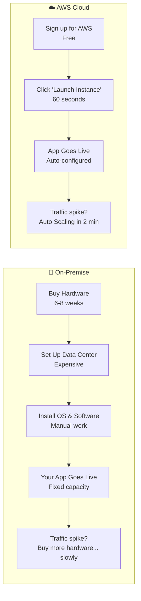
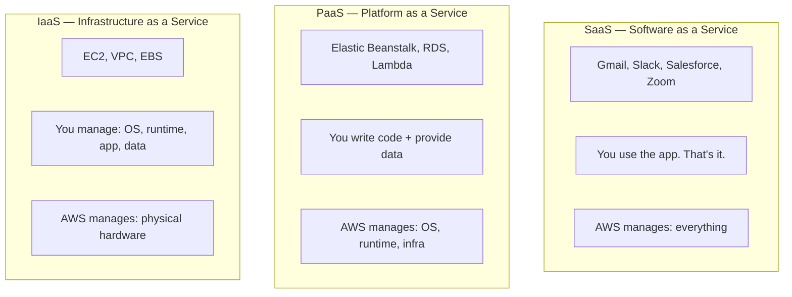
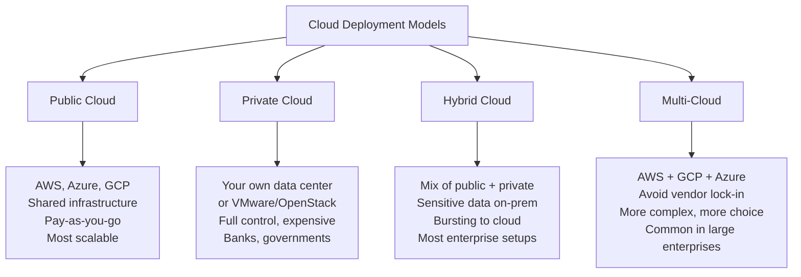
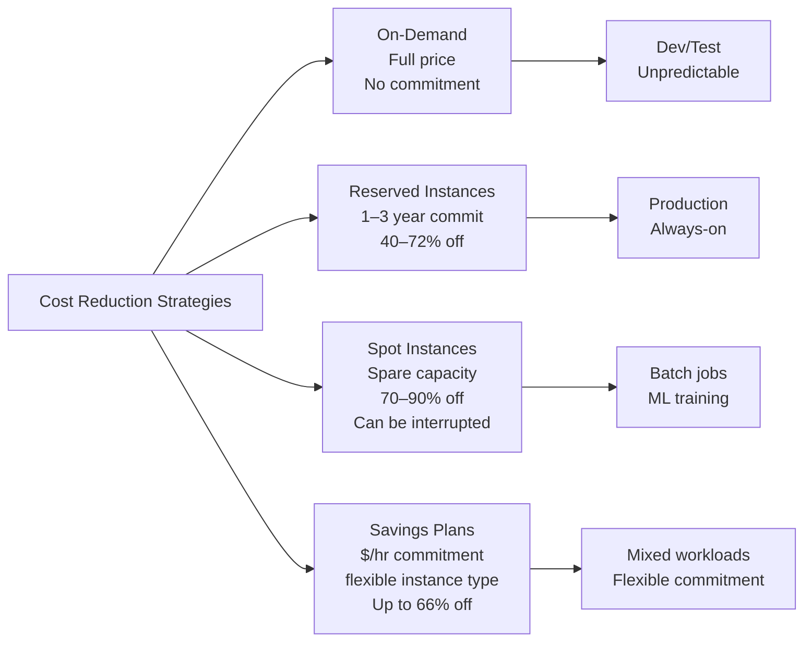
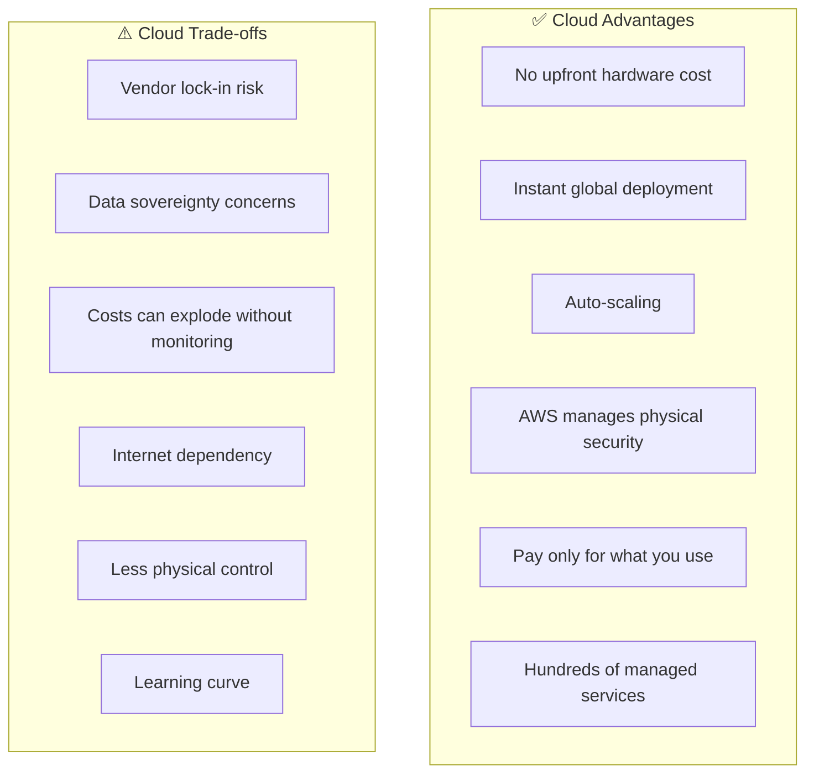

# Stage 01 — Cloud Computing Foundations

> Before you touch a single AWS service, you need to understand WHY the cloud exists and WHAT problem it solves. This is the most important stage.

## 1. Core Intuition — What Is Cloud Computing?

Imagine you want to open a restaurant. You have two options:

**Option A — Build your own kitchen from scratch:**
Buy the building. Buy all the equipment. Hire plumbers and electricians. Build refrigerators, ovens, everything from scratch. This takes 6 months and millions of dollars — before you serve a single meal.

**Option B — Rent a commercial kitchen:**
Walk in on Day 1. Everything is already there. Pay only for the hours you use. If business booms, book more kitchen time. If it's quiet, book less.

**Cloud computing = Option B for software infrastructure.**

Instead of buying physical servers, networking equipment, and data center space — you rent them from AWS. You pay only for what you use, and you can scale up or down in minutes.

## 2. The Problem Cloud Solves

### Life Before Cloud (2000s)

```
┌─────────────────────────────────────────────────────────────┐
│  Startup wants to launch a website                         │
│                                                             │
│  Week 1:  "We need servers"                               │
│  Week 2:  Order servers, wait for delivery               │
│  Week 3:  Servers arrive                                 │
│  Week 4:  Set up data center, cooling, power             │
│  Week 5:  Network configuration                          │
│  Week 6:  OS install, software setup                     │
│  Week 7:  Finally live! But only 100 users showed up    │
│                                                             │
│  Month 6: Viral moment — 10,000 users try to visit      │
│  CRASH. Can't handle load. Company loses customers.      │
│                                                             │
│  Month 7: Buy more servers for the peak                  │
│  Month 8: Peak is over. Expensive servers sit idle.      │
└─────────────────────────────────────────────────────────────┘
```

### Life With Cloud (Today)

```
┌─────────────────────────────────────────────────────────────┐
│  Startup wants to launch a website                         │
│                                                             │
│  Day 1:   Sign up for AWS. Launch EC2 instance.          │
│           Website live in 30 minutes. Total cost: $0.01  │
│                                                             │
│  Month 6: Viral moment — 10,000 users try to visit      │
│           Auto Scaling launches 50 more servers in       │
│           2 minutes automatically.                       │
│           All users served. Cost scales with usage.     │
│                                                             │
│  Month 7: Viral moment passes.                           │
│           Auto Scaling terminates extra servers.        │
│           Back to 1 server. Pay only for what was used. │
└─────────────────────────────────────────────────────────────┘
```

## 3. Cloud vs On-Premise Comparison



| Dimension | On-Premise | Cloud (AWS) |
|-----------|-----------|------------|
| **Setup time** | Weeks to months | Minutes |
| **Upfront cost** | Huge (buy hardware) | $0 (pay as you go) |
| **Scaling** | Slow (buy hardware) | Instant (Auto Scaling) |
| **Global reach** | Hard (open offices worldwide) | Click a region |
| **Maintenance** | You do it | AWS does it |
| **Idle cost** | Full cost even at 0% usage | $0 when off |
| **Failure handling** | Your problem | Multi-AZ, auto-recovery |

## 4. Cloud Service Models

### The Three Levels of Cloud



### Visual: What YOU manage vs What AWS manages

```
                 SaaS          PaaS          IaaS        On-Prem
               ─────────    ─────────    ─────────    ─────────
Application       AWS          YOU          YOU          YOU
Data              YOU          YOU          YOU          YOU
Runtime           AWS          AWS          YOU          YOU
OS                AWS          AWS          YOU          YOU
Virtualization    AWS          AWS          AWS          YOU
Hardware          AWS          AWS          AWS          YOU
Data Center       AWS          AWS          AWS          YOU
─────────────────────────────────────────────────────────────
Managed By:      Most ←────────────────────────────→ Least
Control:         Least ←───────────────────────────→ Most
```

**Real AWS Examples:**

| SaaS | PaaS | IaaS |
|------|------|------|
| WorkMail | Elastic Beanstalk | EC2 |
| Amazon Chime | RDS | VPC |
| Amazon Connect | Lambda | EBS |
| AWS Console itself | DynamoDB | Direct Connect |

## 5. Cloud Computing Characteristics

AWS delivers these 5 core characteristics defined by NIST (the gold standard definition of cloud):

```
┌──────────────────────────────────────────────────────────────┐
│  1. On-Demand Self-Service                                   │
│     You provision compute, storage yourself — no            │
│     phone calls, no waiting for a human to help.           │
│     → AWS Console or CLI: launch server in 60 seconds      │
│                                                              │
│  2. Broad Network Access                                     │
│     Access from anywhere — laptop, phone, API call.         │
│     → AWS accessible from anywhere with internet.          │
│                                                              │
│  3. Resource Pooling (Multi-tenancy)                        │
│     Multiple customers share the same physical hardware.    │
│     Isolated by virtualization. You share, but securely.   │
│     → This is why cloud is cheaper than dedicated servers   │
│                                                              │
│  4. Rapid Elasticity                                         │
│     Scale up or down in seconds based on demand.           │
│     → Auto Scaling: 2 servers at 2am, 50 servers at noon  │
│                                                              │
│  5. Measured Service (Pay-per-use)                          │
│     You pay for exactly what you use.                      │
│     → EC2: per second. S3: per GB. Lambda: per invocation  │
└──────────────────────────────────────────────────────────────┘
```

## 6. Cloud Deployment Models



## 7. AWS Pricing Fundamentals

### How AWS Charges You

```
┌──────────────────────────────────────────────────────────────┐
│  AWS Pricing = Pay for what you actually use                 │
│                                                              │
│  Compute     → EC2: per second (Linux), per hour (Windows)  │
│                Lambda: per 1ms of execution time            │
│                                                              │
│  Storage     → S3: per GB per month                        │
│                EBS: per GB provisioned per month            │
│                                                              │
│  Data Transfer → Inbound:  FREE (data coming INTO AWS)      │
│                  Outbound: Charged per GB (data leaving AWS) │
│                  Within AZ: FREE                            │
│                  Between AZs: $0.01/GB                      │
│                  Between Regions: $0.02–$0.09/GB            │
│                                                              │
│  API Calls   → S3: $0.0004 per 1,000 PUT requests          │
│                DynamoDB: per read/write unit                │
└──────────────────────────────────────────────────────────────┘
```

### 4 Ways to Pay Less



### The Free Tier — Your Learning Sandbox

```
📦 Always Free (no expiry):
   Lambda    1M invocations/month + 400,000 GB-seconds
   DynamoDB  25 GB storage + 25 WCU + 25 RCU
   SNS       1M mobile push notifications
   SQS       1M requests per month
   CloudWatch 10 custom metrics + 10 alarms

📅 12-Month Free (new accounts only):
   EC2       750 hours/month t2.micro or t3.micro
   S3        5 GB standard storage + 20K GET + 2K PUT
   RDS       750 hours/month db.t2.micro (MySQL/PostgreSQL)
   CloudFront 1 TB data transfer + 10M HTTPS requests

⚠️  Set up a billing alarm IMMEDIATELY after creating your account!
    AWS Console → CloudWatch → Alarms → Billing
    Alert at $5 or $10 to avoid surprise bills.
```

## 8. Creating Your AWS Account (Console Walkthrough)

```
Step-by-Step: AWS Account Setup

1. Go to: https://aws.amazon.com → Click "Create an AWS Account"

2. Enter:
   • Root email address (use a real email you check)
   • Account name (e.g., "My AWS Learning")
   • Password

3. Contact information:
   • Account type: Personal
   • Fill in your details

4. Payment information:
   • Credit/debit card required (won't be charged within free tier)
   • AWS charges $1 temporarily to verify card, then refunds

5. Identity verification:
   • Phone number verification via OTP

6. Support plan:
   • Choose: Basic (FREE) — perfectly fine for learning

7. Sign in to Console:
   • Sign in as Root user
   • Use your email + password

IMMEDIATELY DO THESE AFTER FIRST LOGIN:
━━━━━━━━━━━━━━━━━━━━━━━━━━━━━━━━━━━━━
✅ Enable MFA on root account
   IAM → My Security Credentials → Multi-factor authentication

✅ Create a billing alarm
   CloudWatch → Alarms → Billing → $10 threshold

✅ Create an IAM user for daily use
   Never use root account for daily work
```

## 9. Trade-offs of Cloud vs On-Premise



## 10. Common Mistakes Beginners Make

```
❌ Not setting up a billing alarm
   → Forgot to turn off a test instance = surprise $200 bill
   ✅ Set CloudWatch billing alarm at $10 immediately

❌ Using the root account for everything
   → Root has unlimited power. Never use it daily.
   ✅ Create an IAM admin user. Use that.

❌ Thinking "AWS is secure so my app is secure"
   → AWS secures the hardware. YOU secure your code and data.
   ✅ Understand the Shared Responsibility Model.

❌ Launching resources in a random region
   → Data may end up far from users, or violate regulations.
   ✅ Choose a region close to your users.

❌ Forgetting to turn off resources after learning
   → EC2 running 24/7 costs $8–$20/month even for small instances.
   ✅ Always stop/terminate test resources when done.
```

## 11. Interview Perspective

**Q: What is the difference between IaaS, PaaS, and SaaS? Give AWS examples.**
IaaS (Infrastructure as a Service) — you manage OS and above: EC2, VPC, EBS. PaaS (Platform as a Service) — you manage code and data, AWS manages runtime and OS: Elastic Beanstalk, RDS, Lambda. SaaS — fully managed software: AWS WorkMail, Amazon Connect.

**Q: What are the main benefits of cloud computing vs on-premise?**
Five key benefits: (1) Elasticity — scale up/down instantly, (2) Cost model — pay only for what you use, no upfront capital, (3) Speed — launch resources in minutes not months, (4) Global reach — deploy worldwide instantly, (5) Managed services — AWS handles hardware, networking, and some software maintenance.

**Q: When would you NOT move to the cloud?**
Reasons to stay on-premise or hybrid: regulatory requirements mandating data stays in specific locations with no AWS region, extremely latency-sensitive real-time workloads that require sub-millisecond local processing, organizations with existing hardware investments not yet amortized, or highly specialized hardware (e.g., mainframes) with no cloud equivalent.

## 12. Mini Exercise

```
✍️ Exercise 1: Account Setup
   1. Create a free AWS account at aws.amazon.com
   2. Enable MFA on the root account
   3. Set a billing alarm at $10
   4. Create an IAM user named "admin-user" with AdministratorAccess
   5. Log in with the IAM user (not root) from now on

✍️ Exercise 2: Pricing Exploration
   1. Go to: https://calculator.aws/
   2. Calculate the monthly cost of:
      - 1x EC2 t3.medium running 24/7
      - 100 GB of S3 storage
      - A MySQL RDS db.t3.micro running 24/7
   3. Now compare: On-Demand vs 1-year Reserved for EC2

✍️ Exercise 3: Cloud vs On-Premise Analysis
   Think of an application you use daily (Instagram, Gmail, Spotify).
   If you were to build it from scratch:
   - How many servers would you need?
   - How would you handle a 10x traffic spike?
   - How would you deploy in multiple countries?
   Answer these questions for both On-Premise and Cloud approaches.
```

**Next:** [Stage 02 → AWS Global Infrastructure](../stage-02_global_infrastructure/theory.md)

**Back to root** → [../README.md](../README.md)
