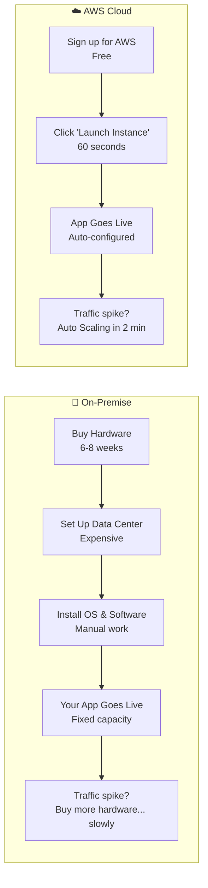
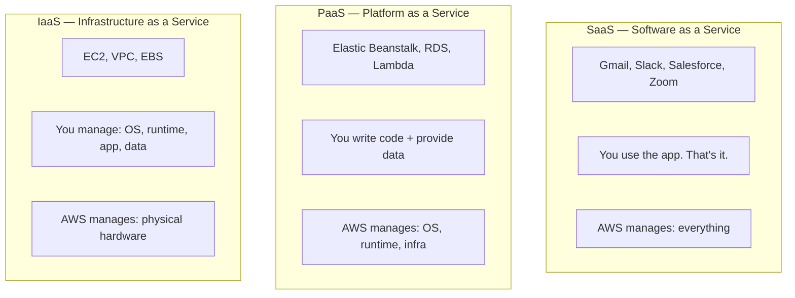
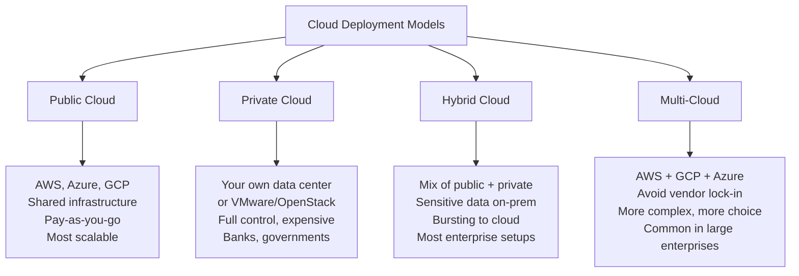
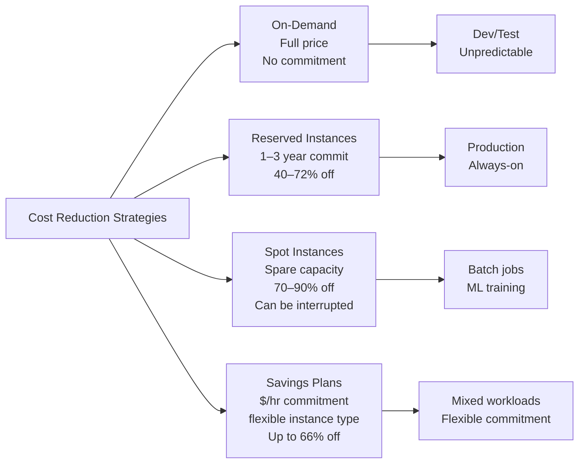
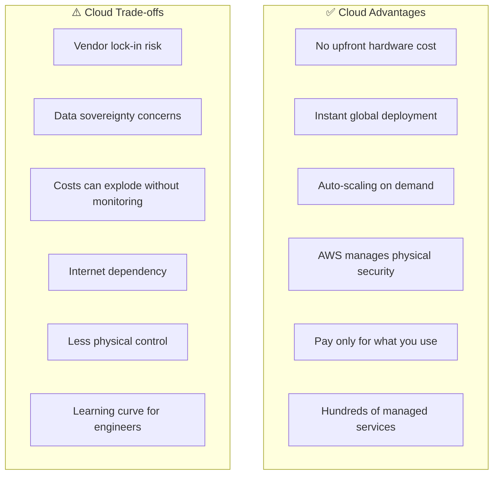

# Stage 01 — Cloud Computing Foundations

> Before you touch a single AWS service, you need to understand WHY the cloud exists and WHAT problem it solves. This is the most important stage.

---

## 1. Core Intuition — What Is Cloud Computing?

Imagine you want to open a restaurant. You have two options:

**Option A — Build your own kitchen from scratch:**
Buy the building. Buy all the equipment. Hire plumbers and electricians. Build refrigerators, ovens, everything from scratch. This takes 6 months and millions of dollars — before you serve a single meal.

**Option B — Rent a commercial kitchen:**
Walk in on Day 1. Everything is already there. Pay only for the hours you use. If business booms, book more kitchen time. If it's quiet, book less.

**Cloud computing = Option B for software infrastructure.**

Instead of buying physical servers, networking equipment, and data center space — you rent them from AWS. You pay only for what you use, and you can scale up or down in minutes.

---

## 2. The Problem Cloud Solves

### Life Before Cloud (2000s)

```
┌─────────────────────────────────────────────────────────────┐
│  Startup wants to launch a website                          │
│                                                             │
│  Week 1:  "We need servers"                                 │
│  Week 2:  Order servers, wait for delivery                  │
│  Week 3:  Servers arrive                                    │
│  Week 4:  Set up data center, cooling, power                │
│  Week 5:  Network configuration                             │
│  Week 6:  OS install, software setup                        │
│  Week 7:  Finally live! But only 100 users showed up        │
│                                                             │
│  Month 6: Viral moment — 10,000 users try to visit         │
│  CRASH. Can't handle load. Company loses customers.         │
│                                                             │
│  Month 7: Buy more servers for the peak                     │
│  Month 8: Peak is over. Expensive servers sit idle.         │
└─────────────────────────────────────────────────────────────┘
```

### Life With Cloud (Today)

```
┌─────────────────────────────────────────────────────────────┐
│  Startup wants to launch a website                          │
│                                                             │
│  Day 1:   Sign up for AWS. Launch EC2 instance.             │
│           Website live in 30 minutes. Total cost: $0.01     │
│                                                             │
│  Month 6: Viral moment — 10,000 users try to visit         │
│           Auto Scaling launches 50 more servers in          │
│           2 minutes automatically.                          │
│           All users served. Cost scales with usage.         │
│                                                             │
│  Month 7: Viral moment passes.                              │
│           Auto Scaling terminates extra servers.            │
│           Back to 1 server. Pay only for what was used.     │
└─────────────────────────────────────────────────────────────┘
```

### Traditional Data Center Problems vs Cloud Benefits

```
On-Premise:                          Cloud:
┌────────────────────────────┐       ┌────────────────────────────┐
│ 💸 Huge upfront cost       │       │ 💰 Pay-as-you-go           │
│    Buy servers before       │  →   │    Only pay for what you   │
│    you have any users       │       │    actually use            │
│                             │       │                            │
│ ⏳ Slow provisioning        │       │ ⚡ Instant scale           │
│    6-8 weeks to get         │  →   │    Launch 1,000 servers    │
│    new hardware             │       │    in 5 minutes            │
│                             │       │                            │
│ 📦 Over-provisioning        │       │ 🌍 Global reach            │
│    Buy for peak load,       │  →   │    Deploy in 30 regions    │
│    idle 90% of time         │       │    worldwide instantly     │
│                             │       │                            │
│ 🔧 Maintenance burden       │       │ 🛡️ Managed security        │
│    Updates, failures,       │  →   │    AWS secures the         │
│    hardware replacements    │       │    physical layer          │
└────────────────────────────┘       └────────────────────────────┘
```

---

## 3. Cloud vs On-Premise Comparison



| Dimension | On-Premise | Cloud (AWS) |
|-----------|-----------|------------|
| **Setup time** | Weeks to months | Minutes |
| **Upfront cost** | Huge (buy hardware) | $0 (pay as you go) |
| **Scaling** | Slow (buy hardware) | Instant (Auto Scaling) |
| **Global reach** | Hard (open offices worldwide) | Click a region |
| **Maintenance** | You do it | AWS does it |
| **Idle cost** | Full cost even at 0% usage | $0 when off |
| **Failure handling** | Your problem | Multi-AZ, auto-recovery |

---

## 4. The City of AWS — Master Analogy

Think of AWS like a **modern city** built for digital businesses:

```
🏙️ AWS = A City

🌍 Regions          = Different cities worldwide (New York, London, Tokyo)
                      Each city is independent — a power outage in NY
                      doesn't affect London

🏢 Availability     = Neighborhoods in a city
   Zones              Each neighborhood has its own power grid
                      If one neighborhood floods, others still work

🏭 Data Centers     = The actual buildings in each neighborhood

🛣️ AWS Network      = The highways connecting everything
                      Fiber-optic, low-latency, private roads

🏪 AWS Services     = Specialized shops in the city
                      S3 = warehouse
                      EC2 = factory (rents you machines)
                      RDS = bank vault (keeps your data safe)
                      IAM = security office (controls who enters)
                      CloudFront = delivery trucks (near users)

⚡ Your App         = A business renting space in the city
                      You focus on your business — the city handles
                      electricity, water, roads, and security
```

---

## 5. Cloud Service Models

### The Three Levels of Cloud



### What YOU manage vs What AWS manages

```
                 SaaS          PaaS          IaaS        On-Prem
               ─────────    ─────────    ─────────    ─────────
Application       AWS          YOU          YOU          YOU
Data              YOU          YOU          YOU          YOU
Runtime           AWS          AWS          YOU          YOU
OS                AWS          AWS          YOU          YOU
Virtualization    AWS          AWS          AWS          YOU
Hardware          AWS          AWS          AWS          YOU
Data Center       AWS          AWS          AWS          YOU
─────────────────────────────────────────────────────────────
Managed By:      Most ←────────────────────────────→ Least
Control:         Least ←───────────────────────────→ Most
```

| | EC2 (IaaS) | RDS (PaaS) | Lambda (FaaS) | S3 |
|--|------------|------------|---------------|-----|
| OS patches | You | AWS | AWS | AWS |
| Runtime | You | AWS | AWS | AWS |
| App code | You | You | You | N/A |
| Data | You | You | You | You |
| Access control | You | You | You | You |

**Real AWS Examples:**

| SaaS | PaaS | IaaS |
|------|------|------|
| WorkMail | Elastic Beanstalk | EC2 |
| Amazon Chime | RDS | VPC |
| Amazon Connect | Lambda | EBS |
| AWS Console | DynamoDB | Direct Connect |

---

## 6. The 5 Characteristics of Cloud Computing (NIST)

```
┌──────────────────────────────────────────────────────────────┐
│  1. On-Demand Self-Service                                   │
│     You provision compute, storage yourself — no            │
│     phone calls, no waiting for a human to help.            │
│     → AWS Console or CLI: launch server in 60 seconds       │
│                                                              │
│  2. Broad Network Access                                     │
│     Access from anywhere — laptop, phone, API call.          │
│     → AWS accessible from anywhere with internet.           │
│                                                              │
│  3. Resource Pooling (Multi-tenancy)                         │
│     Multiple customers share the same physical hardware.     │
│     Isolated by virtualization. You share, but securely.    │
│     → This is why cloud is cheaper than dedicated servers    │
│                                                              │
│  4. Rapid Elasticity                                         │
│     Scale up or down in seconds based on demand.            │
│     → Auto Scaling: 2 servers at 2am, 50 servers at noon   │
│                                                              │
│  5. Measured Service (Pay-per-use)                           │
│     You pay for exactly what you use.                       │
│     → EC2: per second. S3: per GB. Lambda: per invocation   │
└──────────────────────────────────────────────────────────────┘
```

---

## 7. Cloud Deployment Models



---

## 8. AWS Global Infrastructure

### Regions

A **Region** is a physical location in the world where AWS has clustered data centers. Each region is completely independent — a failure in `us-east-1` does not affect `eu-west-1`.

```
🌍 AWS Regions (selected, 33+ total):

United States:
  us-east-1      (N. Virginia)   ← Oldest, cheapest, most services
  us-east-2      (Ohio)
  us-west-1      (N. California)
  us-west-2      (Oregon)

Europe:
  eu-west-1      (Ireland)
  eu-central-1   (Frankfurt)
  eu-west-3      (Paris)
  eu-north-1     (Stockholm)

Asia Pacific:
  ap-southeast-1 (Singapore)
  ap-northeast-1 (Tokyo)
  ap-south-1     (Mumbai)
  ap-southeast-2 (Sydney)

Others:
  sa-east-1      (São Paulo)
  me-south-1     (Bahrain)
  af-south-1     (Cape Town)
  ca-central-1   (Canada)
```

**How to choose a region:**

```
1. Latency        → Where are your users? Pick closest.
2. Data Laws      → GDPR? Use eu-west-1. India data? Use ap-south-1.
3. Services       → Not all services in all regions. Check availability.
4. Cost           → us-east-1 is typically cheapest.
```

### Availability Zones (AZs)

Each Region has **3–6 Availability Zones**. Each AZ is one or more data centers with separate power, cooling, and networking:

```
Region: us-east-1 (N. Virginia)
┌─────────────────────────────────────────────┐
│                                             │
│  AZ: us-east-1a        AZ: us-east-1b       │
│  ┌─────────────────┐   ┌─────────────────┐  │
│  │ Data Centers A  │   │ Data Centers B  │  │
│  │  • Power Grid 1 │   │  • Power Grid 2 │  │
│  │  • Network 1    │   │  • Network 2    │  │
│  └────────┬────────┘   └────────┬────────┘  │
│           │  Low-latency fiber  │            │
│           └────────┬────────────┘            │
│                    │                         │
│           AZ: us-east-1c                     │
│           ┌─────────────────┐                │
│           │ Data Centers C  │                │
│           │  • Power Grid 3 │                │
│           └─────────────────┘                │
└─────────────────────────────────────────────┘

Why multiple AZs?
→ If AZ-1a has a power failure, AZ-1b and AZ-1c still serve traffic
→ High Availability REQUIRES spreading across AZs
```

### Edge Locations

```
Edge Locations = AWS outposts in 450+ cities globally
Purpose: Cache content CLOSE to users (CloudFront CDN)

Without Edge Location:
  User in Chennai → Requests image → Server in us-east-1 (Virginia)
  Latency: ~200ms (ocean cables)

With CloudFront + Edge Location:
  User in Chennai → Requests image → Edge Location in Chennai
  Latency: ~5ms (same city)
```

---

## 9. High Availability vs Fault Tolerance vs Disaster Recovery

```
High Availability (HA):
  System is UP and accessible even when components fail.
  Achieved by: Multi-AZ deployment, load balancing, auto scaling
  RTO: seconds to minutes
  Example: ALB routes to 3 instances across 3 AZs.
            One AZ fails → traffic goes to other 2. Brief disruption only.

Fault Tolerance:
  System continues operating with ZERO disruption even when components fail.
  More expensive than HA — requires redundant active systems.
  RTO: zero (no interruption)
  Example: Active-Active Multi-AZ RDS, where both nodes serve traffic.

Disaster Recovery (DR):
  Recovering from a catastrophic event (entire region failure).
  Strategies:
    Backup & Restore     → Cheapest, slowest (RTO: hours)
    Pilot Light          → Minimal replica running, scale when needed (RTO: 10-30 min)
    Warm Standby         → Scaled-down version always running (RTO: minutes)
    Multi-Site Active    → Full capacity in 2 regions (RTO: seconds, most expensive)
```

---

## 10. Shared Responsibility Model

AWS and you split security responsibilities. Understanding this is critical.

```
┌─────────────────────────────────────────────────────────────┐
│                   WHAT YOU SECURE                           │
│                                                             │
│   • Your application code                                   │
│   • Your data (encrypted? backed up?)                       │
│   • IAM users, roles, and permissions                       │
│   • OS patches (on EC2)                                     │
│   • Network config (security groups, NACLs)                 │
│   • Client-side data encryption                             │
│                                                             │
├─────────────────────────────────────────────────────────────┤
│                   WHAT AWS SECURES                          │
│                                                             │
│   • Physical data center access                             │
│   • Hardware (servers, networking, storage)                 │
│   • Hypervisor (virtualization layer)                       │
│   • Global infrastructure                                   │
│   • Managed service software (RDS database engine, etc.)   │
│   • AWS network infrastructure                              │
└─────────────────────────────────────────────────────────────┘
```

**The rule of thumb:** As you move from IaaS → PaaS → SaaS, you own less and AWS owns more.

---

## 11. AWS Pricing Fundamentals

### How AWS Charges You

```
┌──────────────────────────────────────────────────────────────┐
│  AWS Pricing = Pay for what you actually use                 │
│                                                              │
│  Compute     → EC2: per second (Linux), per hour (Windows)  │
│                Lambda: per 1ms of execution time             │
│                                                              │
│  Storage     → S3: per GB per month                         │
│                EBS: per GB provisioned per month             │
│                                                              │
│  Data Transfer → Inbound:  FREE (data coming INTO AWS)       │
│                  Outbound: Charged per GB (data leaving AWS)  │
│                  Within AZ: FREE                             │
│                  Between AZs: $0.01/GB                       │
│                  Between Regions: $0.02–$0.09/GB             │
│                                                              │
│  API Calls   → S3: $0.0004 per 1,000 PUT requests           │
│                DynamoDB: per read/write unit                 │
└──────────────────────────────────────────────────────────────┘
```

### 4 Ways to Pay Less



```
🏪 Pricing Analogy: Renting vs Buying a Car

On-Demand   = Taxi (pay per ride)
              Most expensive per hour, no commitment
              Best: dev/test, unpredictable load

Reserved    = Annual lease (commit 1–3 years, pay upfront)
              Up to 72% cheaper than On-Demand
              Best: steady-state production workloads

Spot        = Standby car (70–90% off, can be taken away anytime)
              AWS gives you 2-min warning before interruption
              Best: batch jobs, ML training, stateless workers

Savings Plans = Flexible subscription ($X/hour commitment)
              Works across instance families and regions
              Best: mix of instance types with cost commitment
```

### The Free Tier — Your Learning Sandbox

```
📦 Always Free (no expiry):
   Lambda    1M invocations/month + 400,000 GB-seconds
   DynamoDB  25 GB storage + 25 WCU + 25 RCU
   SNS       1M mobile push notifications
   SQS       1M requests per month
   CloudWatch 10 custom metrics + 10 alarms

📅 12-Month Free (new accounts only):
   EC2       750 hours/month t2.micro or t3.micro
   S3        5 GB standard storage + 20K GET + 2K PUT
   RDS       750 hours/month db.t2.micro (MySQL/PostgreSQL)
   CloudFront 1 TB data transfer + 10M HTTPS requests

⚠️  Set up a billing alarm IMMEDIATELY after creating your account!
    AWS Console → CloudWatch → Alarms → Billing
    Alert at $5 or $10 to avoid surprise bills.
```

---

## 12. Creating Your AWS Account (Console Walkthrough)

```
Step-by-Step: AWS Account Setup

1. Go to: https://aws.amazon.com → Click "Create an AWS Account"

2. Enter:
   • Root email address (use a real email you check)
   • Account name (e.g., "My AWS Learning")
   • Password

3. Contact information:
   • Account type: Personal
   • Fill in your details

4. Payment information:
   • Credit/debit card required (won't be charged within free tier)
   • AWS charges $1 temporarily to verify card, then refunds

5. Identity verification:
   • Phone number verification via OTP

6. Support plan:
   • Choose: Basic (FREE) — perfectly fine for learning

7. Sign in to Console:
   • Sign in as Root user
   • Use your email + password

IMMEDIATELY DO THESE AFTER FIRST LOGIN:
━━━━━━━━━━━━━━━━━━━━━━━━━━━━━━━━━━━━━
✅ Enable MFA on root account
   IAM → My Security Credentials → Multi-factor authentication

✅ Create a billing alarm
   CloudWatch → Alarms → Billing → $10 threshold

✅ Create an IAM user for daily use
   IAM → Users → Create user → AdministratorAccess
   Never use root account for daily work
```

---

## 13. Trade-offs



| Advantage | Trade-off |
|-----------|-----------|
| Instant scalability | Vendor lock-in risk |
| Global reach | Data sovereignty concerns in some regions |
| Managed services reduce ops burden | Less control over underlying infrastructure |
| Pay-as-you-go | Costs can explode without monitoring/alerts |
| Hundreds of services | Complexity — easy to over-architect |

---

## 14. Common Mistakes Beginners Make

```
❌ Not setting up a billing alarm
   → Forgot to turn off a test instance = surprise $200 bill
   ✅ Set CloudWatch billing alarm at $10 immediately

❌ Using the root account for everything
   → Root has unlimited power. Never use it daily.
   ✅ Create an IAM admin user. Use that.

❌ Deploying everything in ONE AZ
   → Single point of failure. Use Multi-AZ for all production workloads.
   ✅ Always spread across at least 2 AZs.

❌ Thinking "AWS is secure so my app is secure"
   → AWS secures the hardware. YOU secure your code and data.
   ✅ Understand the Shared Responsibility Model.

❌ Launching resources in a random region
   → Data may end up far from users, or violate regulations.
   ✅ Choose a region close to your users. Check data laws.

❌ Forgetting to turn off resources after learning
   → EC2 running 24/7 costs $8–$20/month even for small instances.
   ✅ Always stop/terminate test resources when done.

❌ Choosing a region without checking latency or data residency laws
   → Test latency from your users' location. GDPR requires EU data stay in EU.
```

---

## 15. Interview Perspective

**Q: What is the difference between IaaS, PaaS, and SaaS? Give AWS examples.**
IaaS — you manage OS and above: EC2, VPC, EBS. PaaS — you manage code and data, AWS manages runtime and OS: Elastic Beanstalk, RDS, Lambda. SaaS — fully managed software: AWS WorkMail, Amazon Connect.

**Q: What are the main benefits of cloud computing vs on-premise?**
Five key benefits: (1) Elasticity — scale up/down instantly, (2) Cost model — pay only for what you use, no upfront capital, (3) Speed — launch resources in minutes not months, (4) Global reach — deploy worldwide instantly, (5) Managed services — AWS handles hardware, networking, and some software maintenance.

**Q: What is the difference between a Region and an Availability Zone?**
A Region is a geographic area (e.g., `us-east-1` = N. Virginia). An AZ is a physically isolated data center cluster within a region (e.g., `us-east-1a`). Each region has 3–6 AZs. AZs are connected with low-latency private fiber. You use multiple AZs for high availability within a region.

**Q: What is the Shared Responsibility Model?**
AWS secures the infrastructure (hardware, global network, hypervisor, physical access). You secure what runs on the infrastructure: your code, data, OS patches, IAM permissions, security group rules, and encryption. The boundary shifts based on service type — more managed services = AWS owns more.

**Q: What happens to your app if an entire AWS Region goes down?**
Single-region apps go down. Multi-region architectures (Route 53 health checks + failover, or active-active with latency routing) continue serving traffic. This is disaster recovery — requires a separate strategy from High Availability (which is AZ-level only).

**Q: When would you NOT move to the cloud?**
Reasons to stay on-premise or hybrid: regulatory requirements mandating data stays in specific locations with no AWS region, extremely latency-sensitive real-time workloads requiring sub-millisecond local processing, organizations with existing hardware investments not yet amortized, or highly specialized hardware (e.g., mainframes) with no cloud equivalent.

---

## 16. Mini Exercises

```
✍️ Exercise 1: Account Setup
   1. Create a free AWS account at aws.amazon.com
   2. Enable MFA on the root account
   3. Set a billing alarm at $10
   4. Create an IAM user named "admin-user" with AdministratorAccess
   5. Log in with the IAM user (not root) from now on

✍️ Exercise 2: Region & Latency Check
   1. Go to https://cloudpingtest.com
      Find the AWS region with lowest latency to your location.
   2. Log into AWS Console → switch regions (top-right dropdown)
      Notice which services are available in each region.

✍️ Exercise 3: Pricing Exploration
   1. Go to: https://calculator.aws/
   2. Calculate the monthly cost of:
      - 1x EC2 t3.medium running 24/7
      - 100 GB of S3 storage
      - A MySQL RDS db.t3.micro running 24/7
   3. Compare: On-Demand vs 1-year Reserved for EC2
      How much would you save with Reserved?

✍️ Exercise 4: Cloud vs On-Premise Analysis
   Think of an application you use daily (Instagram, Gmail, Spotify).
   If you were to build it from scratch:
   - How many servers would you need?
   - How would you handle a 10x traffic spike?
   - How would you deploy in multiple countries?
   Answer for both On-Premise and Cloud approaches.
```

---

**[🏠 Back to README](../README.md)**

**Prev:** — &nbsp;|&nbsp; **Next:** [Global Infrastructure →](../stage-02_global_infrastructure/theory.md)

**Related Topics:** [Global Infrastructure](../stage-02_global_infrastructure/theory.md) · [EC2](../stage-03_compute/ec2.md) · [IAM](../stage-06_security/iam.md) · [Cost Optimization](../stage-15_cost_optimization/theory.md)
