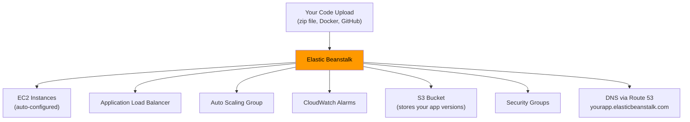
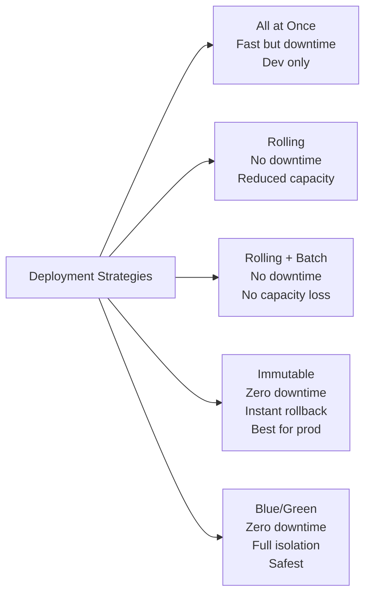

# Stage 03c — Elastic Beanstalk

> The easiest way to deploy web applications on AWS — you bring the code, AWS handles the infrastructure.

## 1. Core Intuition

You've built a Node.js or Python web app. You know nothing about EC2, load balancers, or Auto Scaling Groups. You just want to deploy and have it work.

**Elastic Beanstalk** = The magic "just deploy it" button on AWS.

You upload your code (or connect your GitHub). Beanstalk automatically:
- Provisions EC2 instances
- Sets up an ALB
- Configures Auto Scaling
- Sets up monitoring with CloudWatch
- Handles capacity provisioning

It's AWS's PaaS (Platform as a Service) offering — you own your code and data, AWS manages the platform.

## 2. Story-Based Analogy

```
Think of Elastic Beanstalk as a fully-managed office building:

You: "I need to run my company (app). Here are our requirements."
Beanstalk: "I'll set up the office, power, internet, security,
            reception desk (load balancer), and hire staff as needed."

You still own your company (code + data).
The building (infrastructure) is managed for you.

VS regular EC2 approach:
You: "I'll build the building myself."
AWS: "Here are the raw bricks and tools."
You: *builds everything from scratch*
```

## 3. What Beanstalk Creates for You



## 4. Supported Platforms

```
Elastic Beanstalk supports:
━━━━━━━━━━━━━━━━━━━━━━━━━━
• Python (3.8, 3.9, 3.10, 3.11)
• Node.js (18, 20)
• Java (Corretto 8, 11, 17, 21)
• PHP (8.0, 8.1, 8.2)
• Ruby (3.1, 3.2)
• .NET Core (Linux) + .NET on Windows
• Go (1.21)
• Docker (single container)
• Multi-container Docker (via ECS)
• Tomcat (Java web apps)

Platform versions are maintained by AWS (security patches)
You can also bring custom platforms.
```

## 5. Environment Tiers

```
Elastic Beanstalk has two environment types:

Web Server Environment:
━━━━━━━━━━━━━━━━━━━━━━
• Handles HTTP/HTTPS requests
• Comes with ALB + Auto Scaling
• For: web apps, REST APIs, frontends
• Accessible via URL (yourapp.elasticbeanstalk.com)

Worker Environment:
━━━━━━━━━━━━━━━━━━
• Processes background jobs from SQS queue
• No web interface (no ALB)
• For: email sending, image processing, data jobs
• Integrates with SQS automatically
```

## 6. Deployment Strategies

```
All at once:
  Deploys to ALL instances simultaneously
  • Fastest deployment
  • Causes downtime during deploy
  • Use for: dev/test only

Rolling:
  Deploys to a batch of instances at a time
  • No full downtime (some instances serve old, some new)
  • Reduced capacity during deployment
  • Free (no extra instances)

Rolling with additional batch:
  Launches NEW instances for the batch, deploys to them,
  then removes old ones
  • No capacity reduction during deployment
  • Small extra cost (temporary extra instances)

Immutable:
  Launches a completely NEW set of instances with new version
  Runs health checks. If pass: swap. If fail: delete new ones.
  • Zero downtime
  • Rollback is instant (new instances are deleted)
  • Best for production
  • Costs more temporarily (2x capacity during deploy)

Blue/Green:
  Create a separate ENVIRONMENT (Green) with new version
  Run tests on Green
  Swap URLs: Green becomes Production, Blue becomes old
  • Zero downtime
  • Easy rollback (swap URLs back)
  • Completely isolated environments
  • Highest cost (two full environments running)
```



## 7. .ebextensions — Customization

You can customize your Beanstalk environment with configuration files:

```yaml
# .ebextensions/nginx.config
# Place this file in your code package

option_settings:
  aws:elasticbeanstalk:container:python:
    WSGIPath: application.py

commands:
  install_nginx_extra:
    command: "yum install -y nginx-mod-http-headers-more"

files:
  "/etc/nginx/conf.d/proxy.conf":
    mode: "000644"
    owner: root
    group: root
    content: |
      client_max_body_size 20M;
```

## 8. Console Walkthrough

```
Deploy a Python Flask App in 5 Minutes:

1. Go to: AWS Console → Elastic Beanstalk → Create Application

2. Application name: my-flask-app

3. Environment:
   Tier: Web server environment
   Platform: Python 3.11
   Application code:
     → Upload your code (zip file)
     OR → Use Sample Application to explore first

4. Service role: Let Beanstalk create one
   EC2 key pair: Select your key pair
   EC2 instance profile: Create a new instance profile

5. VPC: Default VPC, enable public IP

6. Capacity:
   Environment type: Load balanced (for production)
     OR Single instance (for dev/test — no ALB charge)
   Instance type: t3.micro (free tier)

7. Scaling:
   Min: 1, Max: 3
   Scaling trigger: CPUUtilization > 70%

8. Click: Submit

Wait ~5 minutes. Beanstalk creates everything.
Your app URL will be: http://my-flask-app.EB_REGION.elasticbeanstalk.com
```

## 9. When to Use Elastic Beanstalk vs Raw EC2

```
Use Elastic Beanstalk when:
  ✅ You want to deploy fast without infrastructure expertise
  ✅ Standard web app or API (Python/Node/Java/PHP/Ruby)
  ✅ You want managed platform updates and patches
  ✅ Small to medium team, don't want to manage infra
  ✅ Prototyping, MVP, startups

Use Raw EC2 + ALB when:
  ✅ Full control over instance configuration
  ✅ Complex multi-tier architectures
  ✅ Custom networking requirements
  ✅ DevOps team comfortable with infrastructure
  ✅ Need to configure things EB doesn't expose

Use ECS/EKS when:
  ✅ Container-based deployments
  ✅ Microservices
  ✅ Need Kubernetes or Docker Compose workflows

Use Lambda when:
  ✅ Event-driven, short-duration functions
  ✅ Serverless, pay-per-invocation
```

## 10. Interview Perspective

**Q: What is Elastic Beanstalk and what does it manage for you?**
Elastic Beanstalk is AWS's PaaS offering. You upload application code and it automatically provisions EC2 instances, an ALB, Auto Scaling Group, CloudWatch alarms, S3 storage for versions, and security groups. You manage code and configuration; AWS manages the runtime infrastructure. You still have full access to all underlying resources.

**Q: What is the difference between Blue/Green and Immutable deployments in Beanstalk?**
Immutable creates a new set of instances within the same environment, runs health checks, then swaps traffic. Rollback means deleting the new instances. Blue/Green creates a completely separate Beanstalk environment with the new version, tests it independently, then swaps the environment URLs. Blue/Green provides complete isolation and easier rollback (just swap URLs back).

**Back to root** → [../README.md](../README.md)
