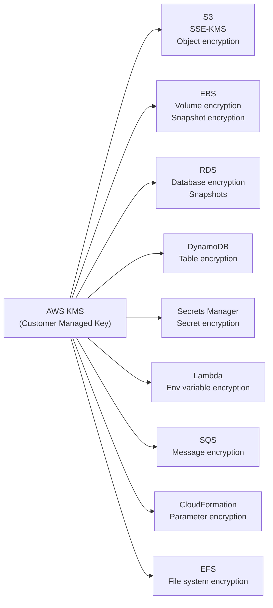

# Stage 06b — KMS & Encryption: Protect Your Data

> Encryption is non-negotiable in production. KMS manages your keys so you don't have to.

## 1. Core Intuition

Encryption converts your data from readable form into unreadable ciphertext. Only someone with the key can decrypt it. This protects data if:
- A hard drive is physically stolen
- An S3 bucket is accidentally made public
- An employee downloads a database backup
- A developer accesses the wrong environment

**AWS KMS (Key Management Service)** = A highly secure, centralized place to create and manage encryption keys. Integrated with nearly every AWS service.

## 2. Encryption Basics

```
Symmetric Encryption (AES-256):
  One key to encrypt AND decrypt
  Fast, used for bulk data
  Example: encrypt your S3 files, EBS volumes, RDS databases

Asymmetric Encryption (RSA, ECC):
  Public key + Private key pair
  Encrypt with public key, decrypt with private key
  OR: sign with private key, verify with public key
  Slower, used for: SSL/TLS, digital signatures, key exchange
  Example: HTTPS, code signing, JWT signatures

Envelope Encryption (what AWS uses):
  Problem: encrypting 1TB of data directly with KMS is slow/expensive
  Solution:
    1. Generate a Data Key (fast AES-256 key)
    2. Encrypt your data with the Data Key
    3. Encrypt the Data Key with your KMS CMK
    4. Store encrypted data + encrypted Data Key together
    5. To decrypt: KMS decrypts Data Key → Data Key decrypts data
    6. KMS only handles the small key, not all your data
```

## 3. KMS Key Types

```
AWS Owned Keys (free):
  Created and managed by AWS
  Used by services transparently (S3 SSE-S3, DynamoDB default)
  You have no direct control or visibility
  Cannot use in IAM policies

AWS Managed Keys (free per service):
  Created by AWS in YOUR account for a specific service
  Name pattern: aws/s3, aws/ebs, aws/rds
  You can see them in KMS console
  Automatic annual key rotation
  You cannot control rotation schedule or delete them

Customer Managed Keys (CMK) ($1/key/month):
  You create and fully control
  Can rotate manually or enable annual auto-rotation
  IAM policies control who can use them
  CloudTrail logs every key usage
  Can disable or delete (with 7-30 day waiting period)
  Cross-region sharing possible
  Best for: compliance, audit requirements, data sovereignty

External Key Material:
  You provide your own key material (BYOK)
  Key material lives in your HSM/KMS hybrid
  Maximum control, maximum operational burden
```

## 4. KMS Integration with AWS Services



## 5. Key Policies

KMS keys are controlled by Key Policies (not IAM alone):

```json
// KMS Key Policy — who can use and manage this key
{
  "Statement": [
    {
      "Sid": "Enable IAM User Permissions",
      "Effect": "Allow",
      "Principal": {
        "AWS": "arn:aws:iam::123456789012:root"
      },
      "Action": "kms:*",
      "Resource": "*"
    },
    {
      "Sid": "Allow EC2 service to use key",
      "Effect": "Allow",
      "Principal": {
        "Service": "ec2.amazonaws.com"
      },
      "Action": [
        "kms:Decrypt",
        "kms:GenerateDataKey"
      ],
      "Resource": "*"
    },
    {
      "Sid": "Allow specific role for application",
      "Effect": "Allow",
      "Principal": {
        "AWS": "arn:aws:iam::123456789012:role/AppServerRole"
      },
      "Action": [
        "kms:Decrypt",
        "kms:DescribeKey"
      ],
      "Resource": "*"
    }
  ]
}
```

## 6. AWS Secrets Manager

```
Problem: Your Lambda/EC2 needs a database password.
         Hardcoding it in code = security disaster.
         Storing in environment variable = still risky (visible in console).

Solution: AWS Secrets Manager
  Store secrets securely.
  Applications fetch secrets at runtime via API.
  Secrets never appear in code or logs.
  Rotate automatically.

Features:
  ✅ Encrypted with KMS CMK of your choice
  ✅ Automatic rotation (RDS, Redshift, DocumentDB built-in)
  ✅ Cross-account access
  ✅ Versioning (rotate without breaking existing app)
  ✅ CloudTrail audit: who accessed which secret when

Price: ~$0.40/secret/month + $0.05/10,000 API calls

Rotation flow:
  Lambda rotation function (built-in templates for RDS):
    1. Generate new password
    2. Update RDS user password
    3. Update secret in Secrets Manager
    4. Test new credentials work
    5. Mark old version as deprecated
  Applications always call GetSecretValue → get current version

Usage in Python (Lambda):
import boto3
import json

def get_db_credentials():
    client = boto3.client('secretsmanager', region_name='us-east-1')
    response = client.get_secret_value(SecretId='prod/myapp/db')
    secret = json.loads(response['SecretString'])
    return secret['username'], secret['password']

# Best practice: cache in memory for 15min (don't call every request)
_cached_secret = None
_cache_time = None
```

## 7. Data Encryption in Transit

```
All AWS API calls use HTTPS (TLS 1.2+) by default.

Force HTTPS-only on S3:
  Bucket policy:
  {
    "Effect": "Deny",
    "Principal": "*",
    "Action": "s3:*",
    "Resource": ["arn:aws:s3:::my-bucket", "arn:aws:s3:::my-bucket/*"],
    "Condition": {
      "Bool": { "aws:SecureTransport": "false" }
    }
  }

RDS in-transit encryption:
  Enable SSL/TLS when connecting:
  mysql -h endpoint --ssl-ca=rds-combined-ca-bundle.pem

ALB HTTPS:
  Import certificate via ACM (free for ALB)
  ALB terminates HTTPS, forwards HTTP to EC2 internally
  (Internal traffic stays within VPC — generally safe)
  OR: end-to-end encryption: ALB HTTPS → EC2 HTTPS
```

## 8. Interview Perspective

**Q: What is envelope encryption?**
Envelope encryption uses two layers: a data key (generated per object, used to encrypt the actual data) and a master key in KMS (used to encrypt the data key). The encrypted data and encrypted data key are stored together. Decryption: send encrypted data key to KMS → get back plaintext data key → use it to decrypt data. KMS only handles small key operations, not bulk data. This is more efficient and KMS never sees your plaintext data.

**Q: What is the difference between SSE-S3 and SSE-KMS for S3 encryption?**
SSE-S3: AWS manages keys automatically (AES-256). Free, no audit trail, no IAM policy integration. SSE-KMS: Uses a KMS key (AWS-managed or customer-managed). Provides CloudTrail audit trail of key usage, IAM policy integration, cross-account access, key rotation control. Use SSE-KMS for compliance-sensitive data.

**Q: What is AWS Secrets Manager and when would you use it vs environment variables?**
Secrets Manager stores secrets encrypted with KMS, provides automatic rotation, CloudTrail audit, and versioning. Environment variables in Lambda/ECS are less secure (visible in console, logged in CloudTrail config changes), not encrypted at field level, and don't support rotation. Use Secrets Manager for: database passwords, API keys, OAuth tokens. Use environment variables for: non-sensitive configuration (feature flags, API URLs).

**Back to root** → [../README.md](../README.md)
