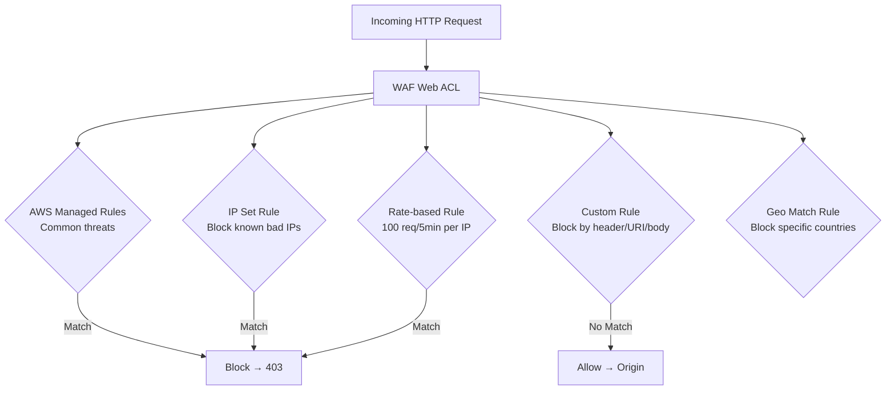
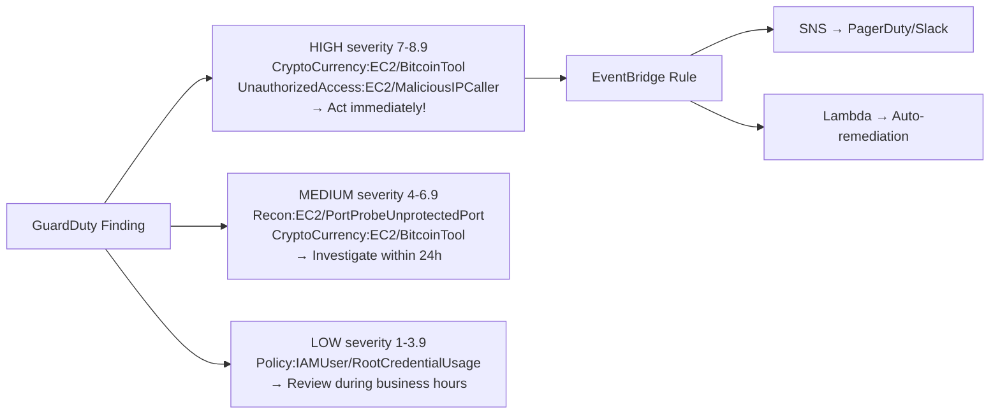

# Stage 06c — WAF, Shield, GuardDuty & Security Hub

> Defend your applications at every layer — from DDoS floods to insider threats to misconfigured resources.

---

## 1. The Security Layers

```
Layer 1 — Network edge:     AWS Shield (DDoS protection)
Layer 2 — Application edge: AWS WAF (filter malicious HTTP requests)
Layer 3 — Account threats:  GuardDuty (detect suspicious activity)
Layer 4 — Compliance:       Security Hub (centralized security posture)
Layer 5 — Data protection:  Macie (find sensitive data in S3)
Layer 6 — Infra threats:    Inspector (vulnerability scanning)
```

---

## 2. AWS WAF — Web Application Firewall

### Core Intuition

WAF is a bouncer at the door of your web application. Every HTTP request must pass the bouncer's checklist before reaching your servers.

```
Without WAF:
  Attacker sends: GET /users?id=1 OR 1=1 --   (SQL injection)
  → Hits your server
  → May execute on your database

With WAF:
  Request → WAF → checks rules:
    - SQL injection pattern detected!
    - Block. Return 403 Forbidden.
  → Attacker never reaches your server
```

---

## 3. WAF Web ACL Rules



---

## 4. WAF Rule Types

```
AWS Managed Rule Groups (free with WAF subscription):
  AWSManagedRulesCommonRuleSet     → OWASP Top 10 (SQLi, XSS, etc.)
  AWSManagedRulesKnownBadInputs    → Log4j, Spring4Shell exploits
  AWSManagedRulesSQLiRuleSet       → SQL injection specifically
  AWSManagedRulesLinuxRuleSet      → Linux-specific attacks
  AWSManagedRulesAmazonIpReputation→ Known malicious IPs (botnets, TOR)

Custom Rules:
  IP Set:      Block/allow specific CIDR ranges
               Use for: block competitors, allow only your offices
  Rate-based:  Block IP making > N requests in 5 minutes
               Use for: brute force protection, DDoS mitigation
  Geo match:   Block/allow by country
               Use for: content licensing, compliance
  String match: Block requests with specific URI, header, body content
  Regex:       Match complex patterns in request

WAF Capacity Units (WCU):
  Each rule costs WCU. Default limit: 1,500 WCU per Web ACL.
  Managed rule group: ~700 WCU
  Simple string match: 1 WCU
  Regex: 10 WCU
```

---

## 5. WAF Attach Points

```
WAF can protect:
  ✅ CloudFront distribution (global — best for most apps)
  ✅ Application Load Balancer (regional)
  ✅ API Gateway (REST API)
  ✅ AppSync (GraphQL APIs)
  ✅ Cognito User Pool

Best practice: attach WAF to CloudFront
  → Blocks malicious traffic at the edge (450+ PoPs globally)
  → Traffic never reaches your ALB/origin
  → Saves compute costs
```

---

## 6. AWS Shield — DDoS Protection

```
DDoS Attack = Distributed Denial of Service
  Attacker controls thousands of compromised machines (botnet)
  All simultaneously flood your server with requests
  Your server runs out of bandwidth/CPU → legitimate users can't reach it

Shield Standard (FREE — always on):
  Protects against:
    - SYN/UDP floods (L3/L4)
    - Reflection attacks
  Available automatically for all AWS customers
  Protects: EC2, ELB, CloudFront, Route 53, Global Accelerator

Shield Advanced ($3,000/month per org):
  Additional protections:
    - Sophisticated L7 (application layer) DDoS
    - Real-time attack visibility in console
    - DDoS cost protection (no bill spike if attacked)
    - Access to AWS DDoS Response Team (DRT)
    - Integration with WAF (auto-create WAF rules during attack)
  Use for: financial services, gaming, media streaming

Shield vs WAF:
  Shield: protects against volumetric DDoS (flooding)
  WAF:    protects against application-layer attacks (SQLi, XSS)
  Together: Shield + WAF + CloudFront = comprehensive protection
```

---

## 7. Amazon GuardDuty — Threat Detection

### Core Intuition

GuardDuty is a **security analyst** that watches your AWS account 24/7, analyzing billions of events for suspicious patterns. You don't configure rules — it uses machine learning and threat intelligence.

```
GuardDuty analyzes:
  CloudTrail logs    → API calls (who did what, from where)
  VPC Flow Logs      → network traffic patterns
  DNS logs           → DNS queries from EC2 instances
  EKS audit logs     → Kubernetes API activity
  S3 access logs     → data access patterns
  RDS login activity → database access

What GuardDuty detects:
  ☠️  CryptoCurrency mining (EC2 calling known mining pools)
  ☠️  Credential theft (API calls from unusual IPs/TOR)
  ☠️  Backdoor communication (EC2 talking to known C2 servers)
  ☠️  Port scanning within VPC
  ☠️  Brute force SSH/RDP attacks
  ☠️  Exfiltration (large data downloads to unusual destinations)
  ☠️  Privilege escalation attempts
  ☠️  Compromised IAM credentials (unusual API calls)
```

---

## 8. GuardDuty Finding Severity



```python
# Auto-remediation: GuardDuty finding → Lambda → isolate EC2
# EventBridge rule: source=aws.guardduty, detail-type=GuardDuty Finding

import boto3

def handler(event, context):
    detail = event['detail']
    finding_type = detail['type']
    severity = detail['severity']

    # Act on high severity EC2 compromise
    if severity >= 7 and 'EC2' in finding_type:
        instance_id = detail['resource']['instanceDetails']['instanceId']
        ec2 = boto3.client('ec2')

        # Isolate: apply quarantine security group (no inbound/outbound)
        ec2.modify_instance_attribute(
            InstanceId=instance_id,
            Groups=['sg-quarantine-id']  # pre-created empty SG
        )
        print(f"Isolated instance {instance_id} due to {finding_type}")

        # Notify security team
        sns = boto3.client('sns')
        sns.publish(
            TopicArn='arn:aws:sns:us-east-1:123456789:security-alerts',
            Subject=f'HIGH severity GuardDuty finding: {finding_type}',
            Message=f'Instance {instance_id} isolated. Review immediately.'
        )
```

---

## 9. AWS Security Hub — Central Security Dashboard

```
Problem: You have GuardDuty findings, Config rules, Macie alerts,
         Inspector vulnerabilities, WAF logs — all in different places.
         No single view of your security posture.

Solution: Security Hub
  Aggregates findings from:
    ✅ GuardDuty
    ✅ Amazon Inspector
    ✅ Amazon Macie
    ✅ AWS Config
    ✅ IAM Access Analyzer
    ✅ Firewall Manager
    ✅ Third-party: CrowdStrike, Splunk, Palo Alto, etc.

  Provides:
    ✅ Security Score (0-100, measures compliance)
    ✅ AWS Foundational Security Best Practices (FSBP) checks
    ✅ CIS AWS Foundations Benchmark
    ✅ PCI DSS compliance checks
    ✅ Cross-account aggregation (all accounts in one view)
    ✅ EventBridge integration for automated response

Security Hub Controls (examples):
  [CRITICAL] root account has no MFA
  [HIGH]     S3 bucket is publicly accessible
  [MEDIUM]   Security group allows unrestricted SSH (0.0.0.0/0:22)
  [LOW]      CloudTrail log file validation disabled
```

---

## 10. Amazon Macie — S3 Data Discovery

```
Problem: You have 10,000 S3 buckets. Which ones contain
         credit card numbers? SSN? Medical records? PII?
         Manual review is impossible.

Solution: Amazon Macie
  Uses machine learning to:
  ✅ Discover sensitive data in S3 (PII, financial data, credentials)
  ✅ Identify publicly accessible buckets
  ✅ Detect unencrypted sensitive data
  ✅ Monitor for unusual data access patterns

  Sensitive data types detected:
    - Credit card numbers
    - Social security numbers
    - Passport numbers
    - Driver's license numbers
    - AWS access keys
    - Private keys (RSA, PGP)
    - Medical record numbers
    - Email addresses / phone numbers

  Use for: GDPR compliance, HIPAA, PCI DSS, SOC 2
```

---

## 11. Amazon Inspector — Vulnerability Scanner

```
Inspector continuously scans for vulnerabilities:

EC2 instances:
  Scans OS packages for CVEs (Common Vulnerabilities and Exposures)
  No agent needed — uses SSM Agent
  Example: OpenSSL 3.0.4 has CVE-2022-3786 (critical) → Inspector flags it

Lambda functions:
  Scans function code and dependencies for known vulnerabilities
  Package: log4j 2.14.1 → Log4Shell vulnerability → Inspector flags it

Container images in ECR:
  Scans on push and continuously
  Finds CVEs in base OS and application packages

Inspector → Security Hub → EventBridge → notification/remediation
```

---

## 12. Console Walkthrough

```
Enable GuardDuty (30-day free trial):
━━━━━━━━━━━━━━━━━━━━━━━━━━━━━━━━━━━
GuardDuty → Get started → Enable GuardDuty
  Takes effect immediately — no configuration needed
  View findings: Findings tab (initially empty, builds over time)

Enable Security Hub:
━━━━━━━━━━━━━━━━━━━
Security Hub → Go to Security Hub → Enable Security Hub
  Select standards:
    ✅ AWS Foundational Security Best Practices
    ✅ CIS AWS Foundations Benchmark
  Click Enable Security Hub

Create WAF Web ACL:
━━━━━━━━━━━━━━━━━━
WAF & Shield → Web ACLs → Create web ACL
  Resource type: CloudFront or Regional (ALB/API GW)
  Name: production-waf
  Add rules:
    → Add managed rule groups:
      ✅ AWSManagedRulesCommonRuleSet (700 WCU)
      ✅ AWSManagedRulesAmazonIpReputationList (25 WCU)
    → Add custom rule:
      Rule type: Rate-based rule
      Rate limit: 1000 requests per 5 minutes
      Action: Block
  Default action: Allow
  Associate with CloudFront distribution
```

---

## 13. Interview Perspective

**Q: What is the difference between WAF and Shield?**
Shield protects against DDoS attacks — volumetric flooding at L3/L4 (network layer). Shield Standard is free and automatic. Shield Advanced ($3K/month) adds L7 protection, attack visibility, cost protection, and access to the DDoS Response Team. WAF protects against application-layer attacks — SQL injection, XSS, bot traffic, malicious IPs. Both can work together: Shield handles floods, WAF filters malicious requests.

**Q: How would you respond to a GuardDuty finding that an EC2 instance is mining cryptocurrency?**
Automated response with EventBridge + Lambda: (1) Immediately isolate the instance by replacing its security group with an empty "quarantine" SG that blocks all traffic. (2) Create an EBS snapshot of the instance for forensic analysis. (3) Notify the security team via SNS/PagerDuty. (4) Start a new clean instance from a known-good AMI. Then investigate: check CloudTrail for how the instance was compromised, rotate any credentials it had access to, patch the vulnerability.

**Q: What is Amazon Macie used for?**
Macie uses ML to automatically discover and protect sensitive data in S3 buckets. It detects PII (SSNs, credit cards, medical records), AWS credentials, and identifies publicly accessible or unencrypted buckets containing sensitive data. Essential for GDPR, HIPAA, and PCI DSS compliance — you need to know where your sensitive data lives before you can protect it.

**Back to root** → [../README.md](../README.md)
