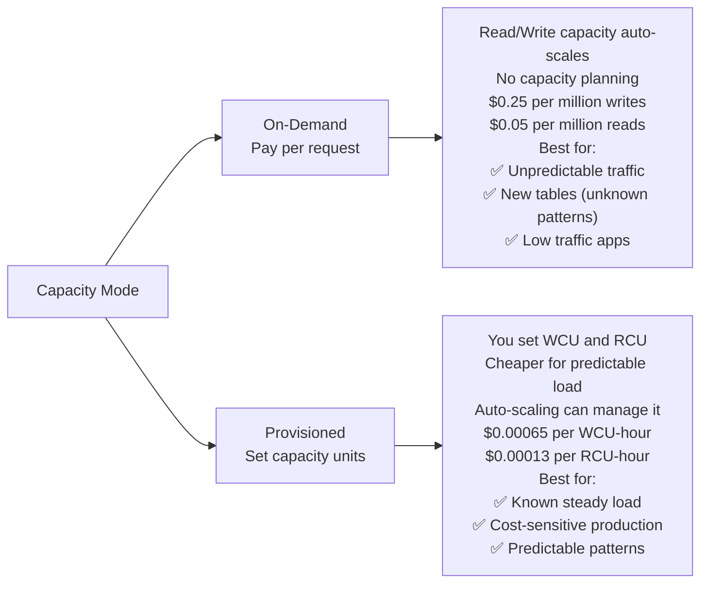
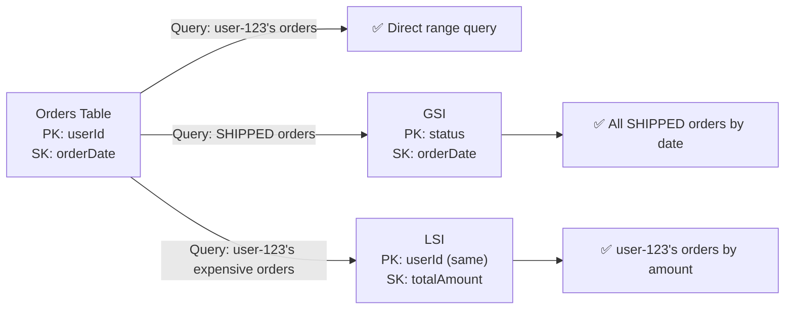
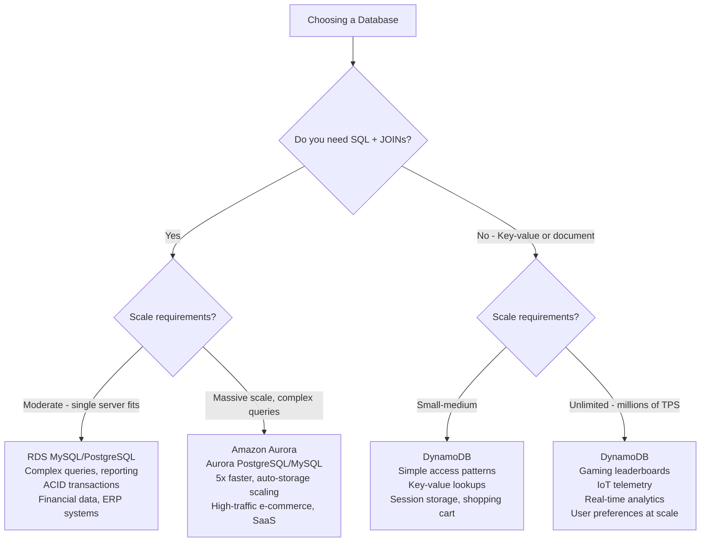

# Stage 07b — DynamoDB: Serverless NoSQL at Any Scale

> Millisecond latency at any scale. No servers to manage. The database powering Amazon.com's shopping cart.

## 1. Core Intuition

You have an app that needs to store millions of records and respond in under 10 milliseconds — regardless of whether you have 100 users or 100 million. You don't want to manage database servers, tune indexes, or worry about connection pools.

**DynamoDB** = A fully managed NoSQL key-value database that:
- Scales automatically from 0 to unlimited capacity
- Delivers single-digit millisecond latency at any scale
- Requires zero infrastructure management
- Charges based on what you read and write

It's what powers Amazon.com's shopping cart, Netflix's metadata, and Instagram's timeline.

## 2. Story-Based Analogy — The Library Index System

```
Traditional RDBMS = A library with books in aisles
  To find a book: walk every aisle, scan every title.
  Works great for small libraries.
  With 1 billion books: takes too long.

DynamoDB = A library with a perfect index card system
  Every book has a unique index card (partition key)
  Index cards sorted by number → instant lookup
  No matter how many books: same speed to find one

The index card system:
  Partition Key = The book's unique ID (or author's name)
  Sort Key      = Optional sub-ordering (publication date)
  Item          = The full book record
  Table         = All index cards

"Get me book #12345" →
  Hash the key → jump directly to the slot → 1ms ✅

"Give me all books by Stephen King published in 2010-2020" →
  Partition Key = "Stephen King", Sort Key between 2010 and 2020 →
  Direct range scan ✅

"Find all books where price < $20" (without an index) →
  Full table scan → very slow ❌
  Solution: Create a Global Secondary Index on "price" ✅
```

## 3. DynamoDB Data Model

### Core Structure

```
Table
  └── Items (rows)
       └── Attributes (columns, can vary per item)

Example: E-commerce orders table

Item 1:
  { "orderId": "ORD-001",          ← Partition Key
    "userId": "user-123",          ← Sort Key
    "status": "SHIPPED",
    "total": 49.99,
    "items": ["item-1", "item-2"], ← Lists supported!
    "address": {                   ← Nested objects supported!
      "street": "123 Main St",
      "city": "New York"
    }
  }

Item 2 (different attributes OK in same table!):
  { "orderId": "ORD-002",
    "userId": "user-456",
    "status": "DELIVERED",
    "deliveryDate": "2024-01-15",  ← Attribute only on this item
    "promoCode": "SAVE10"         ← DynamoDB is schemaless!
  }
```

### Primary Keys

```
Option 1: Partition Key ONLY (Simple Primary Key)
  orderId = "ORD-001" → unique identifier
  Use when: Each item has a unique ID you'll always know

Option 2: Partition Key + Sort Key (Composite Primary Key)
  userId = "user-123" + orderDate = "2024-01-15"
  Use when: Items share a partition (same user, multiple orders)
  Enables: range queries within a partition

Data distribution:
━━━━━━━━━━━━━━━━━━
DynamoDB hashes the partition key to decide which storage node
Partition key must have HIGH CARDINALITY to distribute evenly

Good partition keys:
  ✅ userId (millions of different users)
  ✅ orderId (UUID - always unique)
  ✅ deviceId (millions of IoT sensors)

Bad partition keys (HOT PARTITION problem):
  ❌ status ("ACTIVE" / "INACTIVE") — all data on 2 nodes
  ❌ date ("2024-01-15") — all today's data on 1 node
  ❌ country ("US") — 80% of users → 80% on one node
```

## 4. Read & Write Capacity Modes



### Capacity Units Explained

```
WCU (Write Capacity Unit):
  1 WCU = 1 write per second for items up to 1KB
  5KB item write = 5 WCU consumed
  Transactional write = 2× WCUs

RCU (Read Capacity Unit):
  1 RCU = 1 strongly consistent read per second for items up to 4KB
  OR 2 eventually consistent reads per second (0.5 RCU each)
  8KB item read = 2 RCU
  Transactional read = 2× RCUs

Auto Scaling:
  Set min/max/target utilization
  DynamoDB scales WCU/RCU automatically based on load
  Enable in Console: Table → Additional settings → Auto scaling
```

## 5. Indexes — Query Beyond the Primary Key

```
Problem:
  Table has: userId (PK) + orderDate (SK)
  You can query: "All orders for user-123 in 2024"
  But can you query: "All orders with status=SHIPPED"?

  Without an index: Full Table Scan (expensive, slow)
  With an index: Direct, fast, cheap

Two Types of Secondary Indexes:

Global Secondary Index (GSI):
━━━━━━━━━━━━━━━━━━━━━━━━━━━━
  Completely different partition key and sort key
  Own read/write capacity (separate from table)
  Eventual consistency (slight lag from table)
  Up to 20 GSIs per table

  Example: Query by status
    GSI Partition Key: status
    GSI Sort Key: orderDate
    → "All SHIPPED orders, sorted by date" ✅

Local Secondary Index (LSI):
━━━━━━━━━━━━━━━━━━━━━━━━━━━━
  SAME partition key as table, DIFFERENT sort key
  Shares table's capacity
  Strong consistency available
  Must be created when table is created (can't add later)
  Up to 5 LSIs per table

  Example: userId (same PK) + totalAmount as sort key
    → "All orders by user-123, sorted by amount" ✅
```



## 6. DynamoDB API Operations

```python
import boto3
from boto3.dynamodb.conditions import Key, Attr

dynamodb = boto3.resource('dynamodb')
table = dynamodb.Table('Orders')

# ── PUT ITEM (create or replace) ──────────────────────────────
table.put_item(
    Item={
        'orderId': 'ORD-001',
        'userId': 'user-123',
        'status': 'PENDING',
        'total': 49.99,
        'items': ['ITEM-A', 'ITEM-B']
    }
)

# ── GET ITEM (by exact primary key) ────────────────────────────
response = table.get_item(
    Key={'orderId': 'ORD-001', 'userId': 'user-123'}
)
order = response['Item']

# ── QUERY (efficient — uses partition key) ─────────────────────
response = table.query(
    KeyConditionExpression=Key('userId').eq('user-123') &
                           Key('orderDate').begins_with('2024')
)
orders = response['Items']

# ── QUERY GSI ──────────────────────────────────────────────────
response = table.query(
    IndexName='StatusIndex',
    KeyConditionExpression=Key('status').eq('SHIPPED'),
    ScanIndexForward=False  # Newest first
)

# ── UPDATE ITEM (atomic) ────────────────────────────────────────
table.update_item(
    Key={'orderId': 'ORD-001', 'userId': 'user-123'},
    UpdateExpression='SET #s = :status, updatedAt = :now',
    ExpressionAttributeNames={'#s': 'status'},
    ExpressionAttributeValues={
        ':status': 'SHIPPED',
        ':now': '2024-01-15T12:00:00Z'
    }
)

# ── CONDITIONAL UPDATE (optimistic locking) ────────────────────
table.update_item(
    Key={'orderId': 'ORD-001', 'userId': 'user-123'},
    UpdateExpression='SET #s = :shipped',
    ConditionExpression='#s = :pending',  # Only update if still PENDING
    ExpressionAttributeNames={'#s': 'status'},
    ExpressionAttributeValues={':shipped': 'SHIPPED', ':pending': 'PENDING'}
)

# ── SCAN (expensive — reads entire table) ─────────────────────
# Avoid scan in production — use GSI for filtering
response = table.scan(
    FilterExpression=Attr('total').gt(100)
)

# ── DELETE ITEM ─────────────────────────────────────────────────
table.delete_item(
    Key={'orderId': 'ORD-001', 'userId': 'user-123'}
)
```

## 7. DynamoDB Streams + DAX

### DynamoDB Streams

```
Every change (insert/update/delete) is written to a stream.
Stream records available for 24 hours.
Ordered per partition key.

Use cases:
  ✅ Trigger Lambda on data changes (Change Data Capture)
  ✅ Replicate changes to another DynamoDB table
  ✅ Sync to Elasticsearch/OpenSearch for full-text search
  ✅ Analytics pipeline: stream changes to S3/Redshift

Enable: Table → Additional settings → DynamoDB Streams → Enable
Stream view type:
  KEYS_ONLY       → Only partition/sort key
  NEW_IMAGE       → New item state
  OLD_IMAGE       → Old item state before change
  NEW_AND_OLD_IMAGES → Both (most useful for diff/audit)
```

### DAX — DynamoDB Accelerator

```
Problem: Even DynamoDB's 1-10ms can be too slow for hot data.
  Gaming leaderboards: need sub-millisecond reads
  Session cache: thousands of reads per second

Solution: DAX (DynamoDB Accelerator)
  In-memory cache that sits in front of DynamoDB
  Read latency: 10ms → 100 MICROSECONDS (100x faster!)

  Your App → DAX (cache) → DynamoDB (if cache miss)

  DAX is compatible with DynamoDB SDK — just change endpoint URL.
  No code changes needed in most cases.

Cost: Starts at $0.269/hour for dax.r5.large
Best for: Read-heavy, latency-sensitive workloads
Not needed for: Write-heavy workloads (DAX caches reads only)
```

## 8. Global Tables — Multi-Region Active-Active

```
DynamoDB Global Tables = Same table in multiple regions, fully writable

                    US (us-east-1)
                    ┌─────────────┐
         ┌──────────│  DynamoDB   │──────────┐
         │          │  Table      │          │
         │          └─────────────┘          │
         │         ↑ async replication ↓     │
         ▼                                   ▼
EU (eu-west-1)                    Asia (ap-northeast-1)
┌─────────────┐                   ┌─────────────┐
│  DynamoDB   │                   │  DynamoDB   │
│  Table      │◄──── sync ───────►│  Table      │
└─────────────┘                   └─────────────┘

Characteristics:
  ✅ All regions are fully writable (active-active)
  ✅ Replication lag: typically < 1 second
  ✅ Conflict resolution: last-writer-wins
  ✅ Local reads: users read from closest region (~5ms)
  ✅ Disaster recovery: region failure → route to another
  ✅ Pricing: double the WCUs for replication

Use cases:
  ✅ Global apps serving users worldwide
  ✅ Multi-region disaster recovery
  ✅ Zero-downtime region maintenance
```

## 9. Console Walkthrough — Create a DynamoDB Table

```
Console: AWS → DynamoDB → Create table

━━━━━━━━━━━━━━━━━━━━━━━━━━━━━━━━━━━━━━━━━━━━━━━━━━━━━━━━━━━━━━

Step 1: Table details
  Table name: Orders
  Partition key: orderId (String)
  Sort key (optional): userId (String)
  ← For simpler tables, start with just a partition key

━━━━━━━━━━━━━━━━━━━━━━━━━━━━━━━━━━━━━━━━━━━━━━━━━━━━━━━━━━━━━━

Step 2: Table settings
  Choose: Customize settings

  Capacity mode:
    On-demand (for learning — no capacity planning needed)
    Provisioned (for production with known patterns)

  Encryption: AWS owned key (default, free)
    OR Customer managed key (KMS — for compliance)

━━━━━━━━━━━━━━━━━━━━━━━━━━━━━━━━━━━━━━━━━━━━━━━━━━━━━━━━━━━━━━

Step 3: Create Table

After creation, explore:
  Items tab → Create item → Add attributes visually
  GSI tab → Create a Global Secondary Index
  Streams tab → Enable DynamoDB Streams
  Monitor tab → CloudWatch metrics for your table

━━━━━━━━━━━━━━━━━━━━━━━━━━━━━━━━━━━━━━━━━━━━━━━━━━━━━━━━━━━━━━

Query from console:
  Table → Explore table items
  Filter by partition key OR run a query with Key conditions
  See "Table scan" vs "Query" options (query = efficient!)
```

## 10. DynamoDB vs RDS — When to Use Each



## 11. Common Mistakes

```
❌ Using a low-cardinality partition key (HOT PARTITION)
   → All traffic to one storage node → throttling
   ✅ Use high-cardinality keys (userId, orderId/UUID, deviceId)
      Or add a random suffix to distribute writes

❌ Running table scans in production
   → Scans read every item in the table → expensive + slow
   ✅ Design access patterns FIRST, create GSIs for each pattern

❌ Storing large items (> 400KB limit)
   → DynamoDB item limit is 400KB
   ✅ Store binary data/large content in S3, store the S3 key in DynamoDB

❌ Putting all data in one table with complex patterns
   → Makes GSI design complex, access patterns unclear
   ✅ One-table design IS a pattern, but requires careful upfront planning
      For beginners: one table per entity type is easier

❌ Not planning access patterns before table creation
   → LSIs can't be added after creation!
   ✅ List ALL queries your app will make BEFORE creating the table
```

## 12. Interview Perspective

**Q: What is the difference between a GSI and an LSI in DynamoDB?**
LSI (Local Secondary Index): same partition key as the table, different sort key. Must be created at table creation time. Can serve strongly consistent reads. Shares the table's capacity. GSI (Global Secondary Index): completely different partition key and sort key. Can be added after table creation. Uses eventual consistency. Has its own separate read/write capacity.

**Q: How does DynamoDB achieve single-digit millisecond latency at any scale?**
DynamoDB automatically partitions data based on a hash of the partition key, distributing it across many storage nodes. Reads and writes are routed directly to the specific partition holding that item — no joins, no full-table scans. The SSD-backed storage nodes respond in single-digit milliseconds. With DAX, in-memory caching brings this to microseconds.

**Q: When would you use DynamoDB over RDS?**
DynamoDB: when you need massive scale (millions of operations/second), serverless capacity, global replication (Global Tables), single-digit millisecond latency, and simple access patterns (key-based lookups). RDS: when you need complex SQL joins, ad-hoc queries, strong ACID transactions across tables, or complex reporting.

**Back to root** → [../README.md](../README.md)
