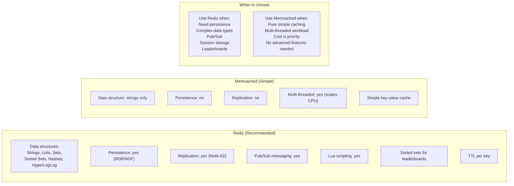

# Stage 07c — ElastiCache: In-Memory Caching

> Sub-millisecond reads. The layer between your app and database that makes everything feel instant.

## 1. Core Intuition

Your database handles 1,000 requests/second. The most popular product page is queried 500 times/second. That's 500 identical SELECT queries hitting the database, getting the same result.

**ElastiCache** = Put the result in memory. The first query hits the database (10ms). The next 499 queries get the result from memory (< 1ms). Database load drops 99%.

## 2. Story-Based Analogy

```
Database = The main library with millions of books
           Every search takes 10 minutes (10ms in software terms)

ElastiCache = The librarian's desk with the most-requested books
              Books already out on the desk: instant access (< 1ms)
              Book not on desk: fetch from library (10ms), put on desk
              Desk has limited space: when full, oldest/least-used book
              gets put back (eviction policy)
```

## 3. Redis vs Memcached



**In practice: Use Redis 99% of the time.** Memcached has very limited use cases.

## 4. Common Use Cases

### Session Storage

```python
import redis
import json
import uuid

r = redis.Redis(host='my-cluster.xxxxx.cache.amazonaws.com', port=6379)

# Store session (expires in 1 hour)
session_id = str(uuid.uuid4())
session_data = {'userId': 'user-123', 'role': 'admin', 'loginTime': '2024-01-15T10:00:00'}
r.setex(session_id, 3600, json.dumps(session_data))

# Read session
data = r.get(session_id)
if data:
    session = json.loads(data)
    user_id = session['userId']
```

### Database Query Cache (Cache-Aside Pattern)

```python
def get_product(product_id: str):
    # Try cache first
    cache_key = f"product:{product_id}"
    cached = r.get(cache_key)

    if cached:
        return json.loads(cached)  # Cache HIT: <1ms

    # Cache MISS: query database
    product = db.query("SELECT * FROM products WHERE id = ?", product_id)

    if product:
        # Store in cache for 5 minutes
        r.setex(cache_key, 300, json.dumps(product))

    return product  # Cache MISS: 10ms, but subsequent calls are fast
```

### Rate Limiting (Token Bucket with Redis)

```python
def is_rate_limited(user_id: str, max_requests: int = 100, window: int = 60) -> bool:
    key = f"rate_limit:{user_id}"
    current = r.incr(key)

    if current == 1:
        r.expire(key, window)  # Set expiry on first increment

    return current > max_requests  # True = rate limited

# Usage:
if is_rate_limited(user_id):
    return {"error": "Rate limit exceeded"}, 429
```

### Leaderboard (Sorted Sets)

```python
# Add/update player score
r.zadd("game-leaderboard", {"user-123": 15000})
r.zadd("game-leaderboard", {"user-456": 22000})
r.zadd("game-leaderboard", {"user-789": 8000})

# Get top 10 players (highest score first)
top10 = r.zrevrange("game-leaderboard", 0, 9, withscores=True)
# Output: [('user-456', 22000.0), ('user-123', 15000.0), ('user-789', 8000.0)]

# Get player's rank
rank = r.zrevrank("game-leaderboard", "user-123")  # 0-indexed: rank 1 = 0
```

## 5. ElastiCache for Redis — Cluster Modes

```
Cluster Mode Disabled (Replication Group):
━━━━━━━━━━━━━━━━━━━━━━━━━━━━━━━━━━━━━━━━━━
  One Primary + up to 5 Read Replicas
  All data on all nodes
  Primary: reads + writes
  Replicas: reads only (offload read traffic)
  Failover: replica auto-promoted if primary fails (Multi-AZ)

  Max data: limited by single node memory
  Scaling: vertical only (change node type)
  Use for: small-medium datasets, read-heavy

Cluster Mode Enabled:
━━━━━━━━━━━━━━━━━━━━━
  Data sharded across 1-500 shards
  Each shard = 1 Primary + up to 5 Replicas
  Each shard holds a portion of the keyspace (16,384 slots)

  Max data: effectively unlimited (add shards)
  Scaling: horizontal (add shards for writes too)
  Use for: very large datasets, write-heavy
```

## 6. Eviction Policies

```
When cache is full, which key gets evicted?

allkeys-lru    → Evict LEAST recently used key (any key)
volatile-lru   → Evict LRU key, but only from keys with TTL set
allkeys-lfu    → Evict LEAST frequently used (newer Redis 4.0+)
allkeys-random → Evict random key
volatile-ttl   → Evict key with nearest expiration
noeviction     → Return error when memory full (don't evict)

Best practices:
  ✅ allkeys-lru: default for pure cache use case
  ✅ volatile-lru: when some keys must not be evicted
  ✅ Set TTL on all cache entries (avoids stale data)
  ✅ Set max-memory appropriately (CloudWatch → FreeableMemory alarm)
```

## 7. Interview Perspective

**Q: What is the difference between ElastiCache Redis and Memcached?**
Redis: supports complex data structures (sorted sets, lists, hashes), persistence, Multi-AZ replication, pub/sub, and more. Memcached: simple string key-value only, no persistence, no replication. Choose Redis for almost everything. Memcached only for extremely simple cache with multi-threading requirements.

**Q: What is the cache-aside (lazy loading) pattern?**
Application checks cache first. If cache hit, return data. If cache miss, query database, store result in cache with TTL, return data. This is the most common caching pattern. Advantage: only caches what's actually requested. Disadvantage: first request after cache miss is slow. TTL helps prevent stale data.

**Q: Why would you use Redis instead of just increasing your database size?**
Redis serves data in < 1ms (from memory). Databases serve queries in 5-50ms (from disk, with network). For high-traffic hot data, caching reduces database load by orders of magnitude, enables horizontal scale without expensive database scaling, and provides data structures (leaderboards, counters) that databases handle inefficiently.

**Back to root** → [../README.md](../README.md)
