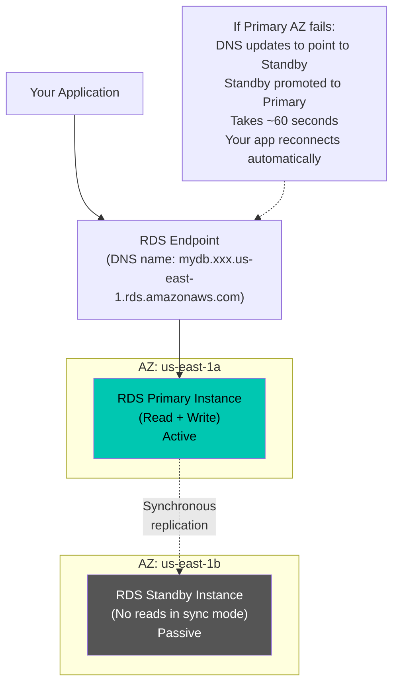
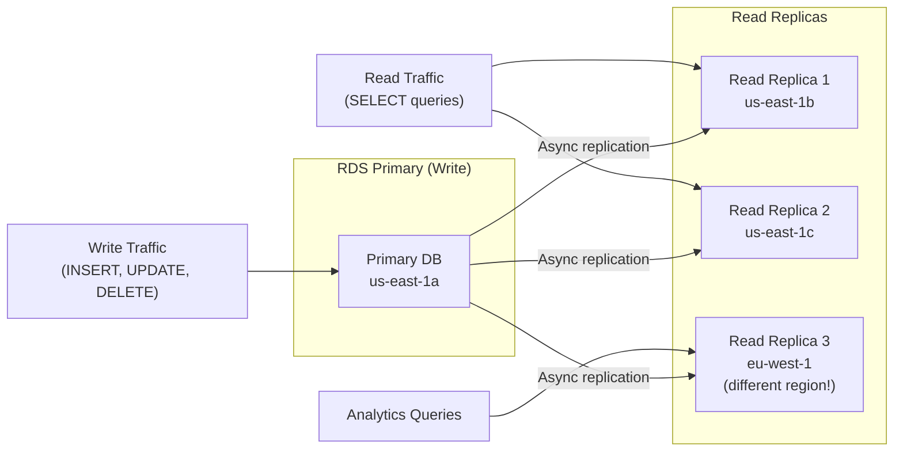

# Stage 07a — RDS & Aurora: Managed Relational Databases

> AWS-managed SQL databases — you focus on queries and schema, AWS handles backups, patching, failover, and replication.

## 1. Core Intuition

Running a database in production is hard. You need to:
- Handle hardware failures and automatic failover
- Set up replication for high availability
- Patch the database engine regularly
- Create and manage backups
- Monitor performance and tune queries

**Amazon RDS** takes all of that operational burden off your team. You provision a database instance, connect your application, and AWS handles the rest.

**Amazon Aurora** is AWS's own cloud-native database engine — compatible with MySQL and PostgreSQL but up to 5x faster, with automatic storage scaling.

## 2. Story-Based Analogy — The Managed Data Bank

```
Running your own database = Building your own bank vault
  You pour concrete, install locks, manage guards, handle repairs.
  If something breaks at 3am, you fix it.

Amazon RDS = Renting a managed safety deposit box service
  The bank (AWS) handles security, maintenance, and repairs.
  You just put your valuables (data) in and use the interface.

Your responsibilities:
  • What data to store (schema design)
  • Access control (who can query what)
  • Performance tuning (query optimization)
  • Enabling backups (configuration)

AWS responsibilities:
  • Hardware maintenance
  • OS and database engine patching
  • Automated backups (if you enable)
  • Failover in Multi-AZ
  • Storage scaling (Aurora)
```

## 3. Supported Database Engines

```
Amazon RDS Engines:
━━━━━━━━━━━━━━━━━━
• MySQL 8.0       → most popular open-source relational DB
• PostgreSQL 15   → advanced SQL, better for complex queries
• MariaDB         → MySQL-compatible, community fork
• Oracle          → enterprise license required (BYOL or license-included)
• SQL Server      → Microsoft SQL (BYOL or license-included)
• Db2             → IBM enterprise database

Amazon Aurora:
━━━━━━━━━━━━━━
• Aurora MySQL    → MySQL 8.0 compatible, 5x faster
• Aurora PostgreSQL → PostgreSQL 15 compatible, 3x faster
• Aurora Serverless v2 → auto-scales capacity up/down per second
```

## 4. RDS Multi-AZ — High Availability



```
Key Multi-AZ Facts:
━━━━━━━━━━━━━━━━━━
✅ Synchronous replication: every write confirmed on both instances
✅ Automatic failover: ~60 seconds, DNS update
✅ Your app uses the same endpoint — no code changes for failover
✅ Standby is in DIFFERENT AZ (protects against AZ failure)
❌ Standby does NOT serve read traffic (only for failover)
   → Use Read Replicas for read scaling

Cost: ~2x the single instance cost (you're running 2 instances)
Enable: Console → Database → Modify → Multi-AZ → Yes
```

## 5. Read Replicas — Read Scaling



```
Key Read Replica Facts:
━━━━━━━━━━━━━━━━━━━━━━
✅ Up to 15 read replicas (Aurora), 5 (RDS)
✅ ASYNCHRONOUS replication (slight lag, called "replication lag")
✅ Can be in different AZ or different Region
✅ Read replicas have their OWN endpoint (different DNS name)
✅ Your app must use the correct endpoint for reads vs writes
✅ Can be promoted to standalone database (for DR or migration)

Use cases:
  📊 Reporting queries (don't want to slow down production writes)
  🌍 Geo-distribution (replica in Asia for Asian users)
  💻 Dev/test (read replica as dev database without impacting prod)
```

## 6. Amazon Aurora

Aurora is AWS's own database engine, designed from scratch for the cloud:

```
Aurora vs RDS (MySQL):
━━━━━━━━━━━━━━━━━━━━━
                     RDS MySQL    Aurora MySQL
Performance:         Baseline     5x faster
Replicas:           5 max         15 max (Aurora Replicas)
Failover:           ~60 seconds   ~30 seconds (instant on Aurora Global)
Storage:            Fixed + manual auto-grow
                                  Auto-grows in 10GB increments
                                  Up to 128TB automatically
Replication:        EBS-based     Shared storage volume (faster!)
Cost:               Lower         ~20% higher, but less ops needed

Aurora Architecture:
━━━━━━━━━━━━━━━━━━━━
• 6 copies of data across 3 AZs (2 per AZ)
• Can lose 1 AZ + 1 copy and still read/write
• Shared storage volume — all replicas use same storage
• Aurora Replicas ALL share the storage
  → No data copying needed, just different pointers
```

### Aurora Serverless v2

```
Aurora Serverless v2 = Database capacity auto-scales per second

Traditional RDS:
  You provision: db.r5.2xlarge = fixed 8 vCPU, 64GB RAM
  3am traffic = 2 connections → paying for full 8 vCPU anyway

Aurora Serverless v2:
  Min: 0.5 ACUs  → $0.06/hour at minimum (very cheap idle)
  Max: 128 ACUs  → scales to handle any load

  ACU = Aurora Capacity Unit (1 ACU ≈ 2GB RAM + proportional CPU)

  Traffic spikes → scales up in seconds
  3am quiet → scales down to minimum
  Fully MySQL/PostgreSQL compatible

Use when:
  ✅ Unpredictable traffic (SaaS apps, new products)
  ✅ Dev/test (near-zero cost when idle)
  ✅ Variable workloads
```

## 7. RDS Backups

```
Automated Backups:
━━━━━━━━━━━━━━━━━
• Enabled by default when you create RDS
• Daily full backup to S3 (during your maintenance window)
• Transaction logs every 5 minutes (enables point-in-time restore)
• Retention: 1–35 days (you choose)
• Restore to any point within retention period (PITR)
• Free storage up to your database size

Manual Snapshots:
━━━━━━━━━━━━━━━━
• You trigger these (Console: Actions → Take snapshot)
• Kept FOREVER until you delete them (automated backups expire)
• Use before major changes: schema migrations, upgrades
• Copy snapshots to another region for DR

Restore Process:
━━━━━━━━━━━━━━━
• RDS cannot restore IN PLACE
• Restore creates a NEW database instance from snapshot
• Your app must update its connection string to the new endpoint

Console: RDS → Databases → Select DB → Maintenance & backups tab
```

## 8. RDS Proxy

```
Problem: Lambda functions and auto-scaling apps cause connection storms.
  100 Lambda invocations = 100 simultaneous DB connections opened
  Database has connection limit (e.g., MySQL: 200 connections)
  → Connection pool exhausted → errors

Solution: RDS Proxy
  Lambda → RDS Proxy → RDS Database

  RDS Proxy maintains a warm connection pool.
  1,000 Lambda invocations → RDS Proxy handles → 20 DB connections
  Multiplexes connections efficiently.

Benefits:
  ✅ Reduces database connections by up to 99%
  ✅ Faster failover (RDS Proxy keeps the connection alive)
  ✅ Uses IAM authentication (no database passwords in code)
  ✅ Secrets Manager integration

Cost: ~$0.015/vCPU-hour of proxied DB
Best for: Lambda + RDS, auto-scaling apps with many connections
```

## 9. Console Walkthrough — Launch RDS MySQL

```
Step 1: Navigate to RDS
━━━━━━━━━━━━━━━━━━━━━━━
Console: AWS → RDS → Create database

━━━━━━━━━━━━━━━━━━━━━━━━━━━━━━━━━━━━━━━━━━━━━━━━━━━━━━━━━━━━━━

Step 2: Choose a database creation method
  Standard Create (more options — use this to learn)

━━━━━━━━━━━━━━━━━━━━━━━━━━━━━━━━━━━━━━━━━━━━━━━━━━━━━━━━━━━━━━

Step 3: Engine options
  Engine: MySQL
  Version: 8.0.35 (latest)

━━━━━━━━━━━━━━━━━━━━━━━━━━━━━━━━━━━━━━━━━━━━━━━━━━━━━━━━━━━━━━

Step 4: Templates
  Free tier (for learning)
  OR Production (enables Multi-AZ)

━━━━━━━━━━━━━━━━━━━━━━━━━━━━━━━━━━━━━━━━━━━━━━━━━━━━━━━━━━━━━━

Step 5: Settings
  DB cluster identifier: myapp-database
  Master username: admin
  Master password: (strong password — save it!)

━━━━━━━━━━━━━━━━━━━━━━━━━━━━━━━━━━━━━━━━━━━━━━━━━━━━━━━━━━━━━━

Step 6: Instance configuration
  Free tier: db.t3.micro (1 vCPU, 1GB RAM)
  Production: db.r5.large or larger

━━━━━━━━━━━━━━━━━━━━━━━━━━━━━━━━━━━━━━━━━━━━━━━━━━━━━━━━━━━━━━

Step 7: Storage
  Type: gp3
  Storage: 20 GB
  Storage autoscaling: Enable, Maximum 100 GB

━━━━━━━━━━━━━━━━━━━━━━━━━━━━━━━━━━━━━━━━━━━━━━━━━━━━━━━━━━━━━━

Step 8: Connectivity
  VPC: your custom VPC (or default)
  Subnet group: Create new (will use your DB subnets)
  Public access: NO (keep DB private!)
  VPC security group: Create new or use existing DB SG
  AZ: No preference
  Port: 3306 (MySQL default)

━━━━━━━━━━━━━━━━━━━━━━━━━━━━━━━━━━━━━━━━━━━━━━━━━━━━━━━━━━━━━━

Step 9: Additional configuration
  Initial database name: myappdb
  Backup: Enable automated backups, 7 days retention
  Monitoring: Enable Enhanced Monitoring
  Maintenance: Enable auto minor version upgrade

Step 10: Create database
  Takes ~5-10 minutes to provision

Connect from EC2 (same VPC):
  mysql -h <RDS-endpoint> -u admin -p myappdb
  (Endpoint shown in RDS → Databases → Connectivity & security)
```

## 10. Common Mistakes

```
❌ Making RDS publicly accessible
   → Database directly exposed to internet scan attacks
   ✅ Public access: No. Put in private subnet. Access via app tier or bastion.

❌ Not enabling Multi-AZ for production
   → Single AZ = single point of failure
   ✅ Always enable Multi-AZ for production databases

❌ Using read replica for HA failover
   → Read replicas use ASYNC replication — some data loss possible
   ✅ Multi-AZ is for HA (synchronous). Read Replicas are for read scaling.

❌ Not testing failover
   → You THINK failover works but have never tested it
   ✅ RDS → Actions → Reboot with failover → Verify app reconnects

❌ Hardcoding database credentials in application code
   ✅ Store in AWS Secrets Manager, rotate automatically
```

## 11. Interview Perspective

**Q: What is the difference between RDS Multi-AZ and Read Replicas?**
Multi-AZ: synchronous replication to a standby in another AZ. Standby is for failover only (not for reads). Provides high availability. If primary fails, standby auto-promotes in ~60 seconds. Read Replicas: asynchronous replication to separate instances. Used for read scaling. Can be in different regions. Have their own endpoints. Can be promoted to standalone.

**Q: What is Aurora's storage architecture?**
Aurora uses a shared distributed storage volume that spans 3 AZs with 6 copies. All Aurora Replicas share this same storage — they don't replicate data themselves, they just have different read pointers into the same storage. This is why Aurora failover is faster (~30 seconds) and why Aurora Replicas can be promoted with minimal lag.

**Q: When would you use RDS Proxy?**
When you have many short-lived connections to the database, such as Lambda functions, auto-scaling EC2 fleets, or containerized workloads. Lambda opens a new DB connection per invocation — without RDS Proxy, you can exhaust the database connection limit. RDS Proxy pools and multiplexes connections, reducing total connections to the database by up to 99%.

## 12. Mini Exercise

```
✍️ Hands-On:

1. Launch RDS MySQL (free tier: db.t3.micro)
   - Enable Multi-AZ: Skip for free tier (not available)
   - Enable automated backups: 7 days
   - NO public access

2. Launch an EC2 in the same VPC (same AZ as RDS)
   Update security groups:
   - EC2 SG: allow all outbound
   - RDS SG: allow MySQL 3306 from EC2's security group

3. Connect from EC2:
   sudo dnf install -y mysql
   mysql -h <RDS-endpoint> -u admin -p

4. Create a test database:
   CREATE DATABASE testdb;
   USE testdb;
   CREATE TABLE users (id INT AUTO_INCREMENT PRIMARY KEY, name VARCHAR(100));
   INSERT INTO users (name) VALUES ('Alice'), ('Bob');
   SELECT * FROM users;

5. Take a manual snapshot:
   RDS → Your DB → Actions → Take snapshot
   Name: before-changes-snapshot

6. Restore from snapshot (creates NEW DB):
   RDS → Snapshots → Select snapshot → Restore
   (Note: creates entirely new endpoint)

7. Create a Read Replica:
   RDS → Your DB → Actions → Create read replica
   Test: the replica has its own endpoint and same data

Clean up: Delete replica, delete DB, delete snapshot (to avoid charges)
```

**Next:** [Stage 07b → DynamoDB](./dynamodb.md)

**Back to root** → [../README.md](../README.md)
