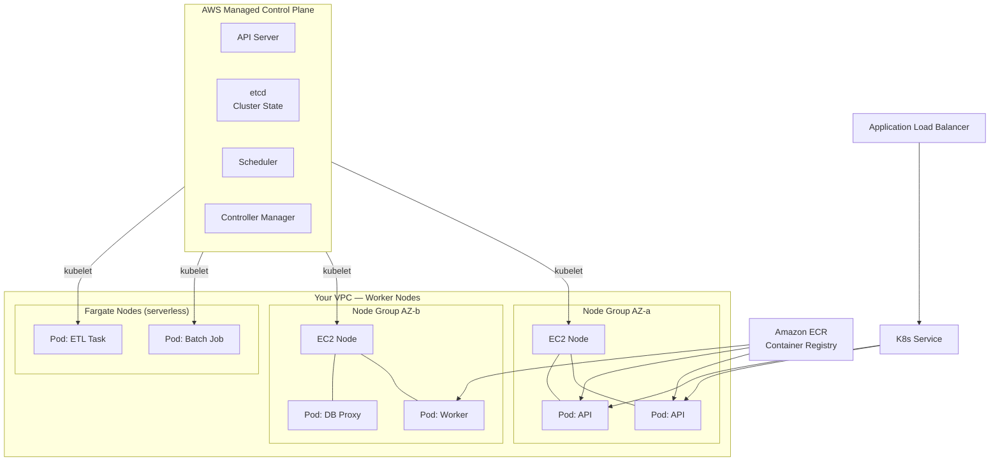
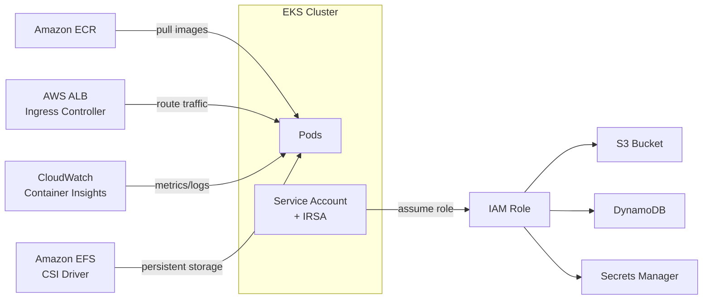

# Stage 10b — EKS: Managed Kubernetes on AWS

> Run Kubernetes without managing the control plane. AWS handles master nodes, etcd, and upgrades — you handle your workloads.

---

## 1. Core Intuition

Imagine you're running a massive city of microservices. Each service is a container. You need someone to:
- Decide which server each container runs on
- Restart containers that crash
- Scale containers when traffic spikes
- Route traffic between containers

That's **Kubernetes** — the container orchestration system. But running Kubernetes yourself means managing the "control plane" (the brain): etcd, API server, scheduler, controller manager. That's painful.

**EKS (Elastic Kubernetes Service)** = AWS manages the entire control plane for you. You just bring your worker nodes (EC2 or Fargate) and deploy your workloads.

---

## 2. Kubernetes Concepts (Plain English)

```
Cluster       = The entire Kubernetes environment (control plane + worker nodes)
Node          = A server (EC2 instance) that runs your containers
Pod           = The smallest unit — one or more containers that share network/storage
Deployment    = "I want 3 replicas of my API pod always running"
Service       = A stable IP/DNS for your pods (pods come and go, Service stays)
Ingress       = HTTP routing rules → which path goes to which Service
Namespace     = Virtual cluster inside cluster (dev, staging, prod separation)
ConfigMap     = Store config data (env vars, config files)
Secret        = Store sensitive data (passwords, tokens) encrypted
HPA           = Horizontal Pod Autoscaler — scale pods based on CPU/memory
```

---

## 3. EKS Architecture



---

## 4. EKS vs ECS

```
                    ECS                         EKS
Orchestrator:       AWS proprietary             Kubernetes (open source)
Learning curve:     Low (AWS-native)            High (K8s concepts)
Portability:        AWS only                    Any cloud / on-prem
Ecosystem:          AWS integrations            Huge K8s ecosystem (Helm, Istio)
Control plane:      Fully managed (free)        Managed ($0.10/hr per cluster)
Worker options:     EC2, Fargate                EC2, Fargate, EKS Anywhere
Config style:       Task Definitions (JSON)     YAML manifests
Autoscaling:        Service Auto Scaling        HPA + Cluster Autoscaler
Use when:           Pure AWS, simpler ops       K8s expertise, multi-cloud, complex
```

---

## 5. Node Groups: EC2 vs Fargate

```
Managed Node Groups (EC2):
  AWS provisions and manages EC2 instances
  You choose instance type (m5.large, c5.2xlarge, etc.)
  Nodes are visible in your account
  Use for: stateful workloads, GPU workloads, cost optimization

Fargate Profiles:
  No EC2 to manage — pods get their own micro-VM
  Pay per pod CPU/memory (not per node)
  No need to right-size nodes
  Use for: stateless workloads, batch jobs, simplicity
  Limitation: no DaemonSets, no privileged containers

Self-Managed Nodes:
  You provision EC2 yourself using your own AMI
  Full control but full operational burden
  Use for: custom kernel, specific hardware requirements
```

---

## 6. Core Kubernetes Objects (with YAML)

### Deployment

```yaml
# deployment.yaml — Run 3 replicas of your API
apiVersion: apps/v1
kind: Deployment
metadata:
  name: my-api
  namespace: production
spec:
  replicas: 3
  selector:
    matchLabels:
      app: my-api
  template:
    metadata:
      labels:
        app: my-api
    spec:
      containers:
      - name: api
        image: 123456789.dkr.ecr.us-east-1.amazonaws.com/my-api:v1.2.3
        ports:
        - containerPort: 8080
        resources:
          requests:
            memory: "256Mi"
            cpu: "250m"
          limits:
            memory: "512Mi"
            cpu: "500m"
        env:
        - name: DB_PASSWORD
          valueFrom:
            secretKeyRef:
              name: db-secret
              key: password
        livenessProbe:
          httpGet:
            path: /health
            port: 8080
          initialDelaySeconds: 10
          periodSeconds: 30
```

### Service + Ingress

```yaml
# service.yaml — Stable internal IP for pods
apiVersion: v1
kind: Service
metadata:
  name: my-api-service
spec:
  selector:
    app: my-api          # routes to pods with this label
  ports:
  - port: 80
    targetPort: 8080
  type: ClusterIP        # internal only

---
# ingress.yaml — Route external traffic
apiVersion: networking.k8s.io/v1
kind: Ingress
metadata:
  name: my-api-ingress
  annotations:
    kubernetes.io/ingress.class: alb         # AWS ALB Ingress Controller
    alb.ingress.kubernetes.io/scheme: internet-facing
    alb.ingress.kubernetes.io/target-type: ip
spec:
  rules:
  - host: api.myapp.com
    http:
      paths:
      - path: /v1
        pathType: Prefix
        backend:
          service:
            name: my-api-service
            port:
              number: 80
```

### Horizontal Pod Autoscaler

```yaml
# hpa.yaml — Scale based on CPU
apiVersion: autoscaling/v2
kind: HorizontalPodAutoscaler
metadata:
  name: my-api-hpa
spec:
  scaleTargetRef:
    apiVersion: apps/v1
    kind: Deployment
    name: my-api
  minReplicas: 2
  maxReplicas: 20
  metrics:
  - type: Resource
    resource:
      name: cpu
      target:
        type: Utilization
        averageUtilization: 70    # scale up when CPU > 70%
```

---

## 7. EKS with AWS Services



**IRSA (IAM Roles for Service Accounts):**
```
Instead of giving EC2 nodes broad IAM permissions,
IRSA lets individual pods assume specific IAM roles.

Pod A (payment service) → assumes role with DynamoDB access only
Pod B (report service) → assumes role with S3 read access only

Much safer than node-level IAM!
```

---

## 8. kubectl — The CLI

```bash
# Configure kubectl to use EKS cluster
aws eks update-kubeconfig --name my-cluster --region us-east-1

# View cluster nodes
kubectl get nodes

# Deploy application
kubectl apply -f deployment.yaml
kubectl apply -f service.yaml

# View pods
kubectl get pods -n production
kubectl get pods -o wide      # shows which node each pod runs on

# Describe a pod (troubleshooting)
kubectl describe pod my-api-7d9f8b-xyz -n production

# View logs
kubectl logs my-api-7d9f8b-xyz -n production
kubectl logs -f my-api-7d9f8b-xyz    # follow/tail logs

# Scale deployment
kubectl scale deployment my-api --replicas=5

# Rolling update
kubectl set image deployment/my-api api=my-api:v1.2.4

# Rollback
kubectl rollout undo deployment/my-api

# Port-forward for local testing
kubectl port-forward svc/my-api-service 8080:80

# Execute into a pod
kubectl exec -it my-api-7d9f8b-xyz -- /bin/sh
```

---

## 9. Console Walkthrough

```
Create EKS Cluster:
━━━━━━━━━━━━━━━━━━
Console: EKS → Create cluster

Step 1: Configure cluster
  Name: my-production-cluster
  Kubernetes version: 1.29 (latest)
  Cluster service role: create new (AmazonEKSClusterPolicy)

Step 2: Specify networking
  VPC: your production VPC
  Subnets: private subnets in 3 AZs
  Security groups: allow worker nodes to reach API server
  Cluster endpoint access: Public and private

Step 3: Configure logging
  Enable: API server, Audit, Authenticator logs → CloudWatch

Step 4: Select add-ons
  Enable: CoreDNS, kube-proxy, Amazon VPC CNI, AWS Load Balancer Controller

Step 5: Review and create (takes ~10 min)

Add Node Group:
━━━━━━━━━━━━━━
EKS → Clusters → my-cluster → Compute → Add Node Group
  Name: production-workers
  Node IAM role: create with AmazonEKSWorkerNodePolicy + ECR access
  Instance type: m5.xlarge
  Scaling: min=2, desired=3, max=10
  Subnets: private subnets
```

---

## 10. EKS Add-ons (Important)

```
AWS Load Balancer Controller:
  Creates ALB/NLB automatically when you create Ingress/Service objects
  Install via: EKS console → Add-ons → AWS Load Balancer Controller

Cluster Autoscaler:
  Adds/removes EC2 nodes based on pod pending state
  Pod can't be scheduled (no resources) → CA adds a node
  Nodes underutilized → CA removes a node

AWS EFS CSI Driver:
  Mount EFS volumes into pods as persistent storage
  Shared across pods, survives pod restarts

Amazon VPC CNI:
  Assigns real VPC IPs to pods (not overlay network)
  Pods get actual IPs from your subnet CIDR
  Enables direct communication with other AWS services

Karpenter (modern alternative to Cluster Autoscaler):
  Smarter node provisioning — picks the right instance type per workload
  Faster scaling (seconds vs minutes)
  Supports spot instances automatically
```

---

## 11. Interview Perspective

**Q: What is the difference between EKS and ECS?**
ECS is AWS's proprietary container orchestrator — simpler, fully managed, deeply integrated with AWS but AWS-only. EKS runs Kubernetes — more complex, portable across clouds, huge ecosystem (Helm charts, service meshes, GitOps tools). Use ECS when you're AWS-only and want simplicity; use EKS when your team knows Kubernetes, needs multi-cloud portability, or needs advanced features like custom operators and service meshes.

**Q: What is IRSA and why is it better than node-level IAM?**
IRSA (IAM Roles for Service Accounts) lets individual pods assume specific IAM roles via OIDC federation. With node-level IAM, all pods on a node share the same permissions — a compromised pod can access everything. With IRSA, each pod gets its own minimal IAM role. If the payment pod is compromised, it can only access what that role allows, not the S3 buckets or RDS databases used by other pods.

**Q: How does Kubernetes handle pod scaling vs node scaling?**
Two separate systems: HPA (Horizontal Pod Autoscaler) scales pods based on CPU/memory/custom metrics — fast, seconds to add a pod. Cluster Autoscaler (or Karpenter) scales nodes when pods can't be scheduled due to insufficient resources — slower, 1-3 minutes to provision an EC2. Both work together: HPA adds pods → CA adds nodes when pods are pending.

**Back to root** → [../README.md](../README.md)
