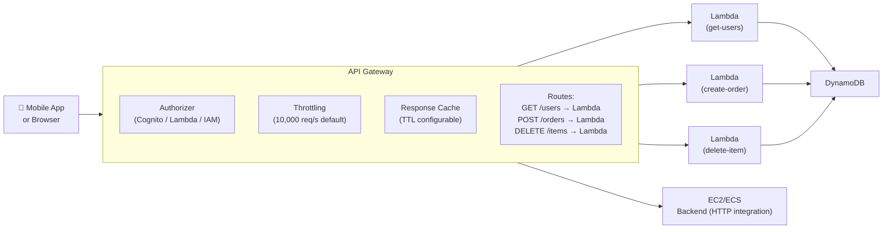

# Stage 11b — API Gateway

> Create, publish, and secure REST APIs, HTTP APIs, and WebSocket APIs without managing servers.

## 1. Core Intuition

Your Lambda functions have business logic, but they need a door to the outside world — an endpoint that users/clients can call over HTTP. API Gateway is that door.

**API Gateway** = A fully managed API front door that:
- Accepts HTTP requests from clients
- Routes to the right backend (Lambda, EC2, any HTTP endpoint)
- Handles authentication, throttling, caching, logging
- Scales automatically to handle any traffic

## 2. API Types

```
REST API (v1):
  Full-featured, more expensive
  $3.50 per million API calls + data transfer
  Supports: API keys, usage plans, caching, request validation
  Best for: public APIs with complex features

HTTP API (v2, newer):
  Simpler, ~70% cheaper ($1.00 per million)
  Faster (~60% less latency than REST API)
  Supports: JWT authorizers, CORS, Lambda integration
  Best for: backends for mobile/web apps, Lambda integrations

WebSocket API:
  Persistent connections for real-time two-way communication
  Clients stay connected, server can push data
  Best for: chat apps, live dashboards, multiplayer games, notifications
  Pricing: $3.50/million connection minutes + messages
```

## 3. Architecture Flow



## 4. Integration Types

```
Lambda (most common):
  API GW → invokes Lambda → Lambda returns response
  PROXY integration: Lambda receives full request, returns full response
  Non-proxy: API GW transforms request/response (mapping templates)

HTTP:
  API GW → forwards to HTTP endpoint (EC2, ECS, any HTTP server)
  Can transform request/response with mapping templates

AWS Service:
  API GW → directly calls AWS service (S3, SQS, DynamoDB, SNS)
  No Lambda needed!
  Example: POST /upload → API GW → S3 PutObject directly

Mock:
  API GW returns a hardcoded response without calling backend
  Use for: testing, prototyping, CORS preflight responses
```

## 5. Authorization

```
No Auth (public):
  Anyone can call the API
  Use for: public APIs, webhooks

API Keys:
  Client includes key in header: x-api-key: abc123
  Track usage per key, set throttling per key
  Use for: partner API access, rate limiting per client
  NOT for authentication — API keys are not secrets!

IAM Authorization:
  Caller signs request with AWS Signature V4
  Use for: machine-to-machine, trusted services
  Verify: IAM user/role making the request

Cognito User Pools:
  User logs in → gets JWT token
  Client includes token: Authorization: Bearer eyJxxx
  API GW validates JWT against Cognito User Pool
  No Lambda needed for auth
  Use for: mobile/web apps with user accounts

Lambda Authorizer (Custom Auth):
  API GW calls your Lambda with the token
  Your Lambda validates it (any format, any logic)
  Returns IAM policy: Allow/Deny
  Use for: legacy tokens, custom JWT, API key systems

Example: Cognito JWT flow
  1. User calls POST /auth/login → gets JWT
  2. Client stores JWT
  3. Client calls GET /api/profile
     Header: Authorization: Bearer eyJhbGciOi...
  4. API GW validates JWT with Cognito automatically
  5. If valid: forward to Lambda
  6. Lambda can access user claims from event.requestContext.authorizer
```

## 6. Throttling & Quotas

```
Default limits (can be increased):
  Account-level: 10,000 requests/second (RPS)
  Burst: 5,000 concurrent requests

Per-stage throttling:
  Stage: production → 5,000 RPS max
  Stage: staging → 500 RPS max

Per-method throttling:
  POST /payments → 100 RPS (expensive operation)
  GET /products → 5,000 RPS (cheap read)

Usage Plans + API Keys:
  Plan: Basic → 100 req/day, 10 RPS throttle
  Plan: Premium → 10,000 req/day, 1,000 RPS throttle
  Assign API keys to plans
  Use for: monetizing your API

When throttled:
  Client receives: 429 Too Many Requests
  Implement exponential backoff with jitter in your client
```

## 7. Console Walkthrough

```
Create an HTTP API (simplest):
━━━━━━━━━━━━━━━━━━━━━━━━━━━━━━
Console: API Gateway → Create API → HTTP API → Build

Step 1: Create and configure
  Name: my-rest-api
  Click: Add integration
    Integration type: Lambda
    Lambda function: my-lambda-function
    (Optional) Invoke with current account: yes

Step 2: Configure routes
  Auto-created: ANY /{proxy+} → my-lambda-function
  Or customize:
    GET /users → my-lambda-function
    POST /users → my-lambda-function
    DELETE /users/{id} → my-lambda-function

Step 3: Define stages
  Stage name: $default (auto-deploys)
  OR: name it "production" or "v1"

Step 4: Review and create

Your API URL:
  https://abc123xyz.execute-api.us-east-1.amazonaws.com/

Test with curl:
  curl https://abc123xyz.execute-api.us-east-1.amazonaws.com/users
  curl -X POST https://abc123xyz.execute-api.us-east-1.amazonaws.com/users \
    -H "Content-Type: application/json" \
    -d '{"name": "Alice"}'
```

## 8. Interview Perspective

**Q: What is the difference between REST API and HTTP API in API Gateway?**
HTTP API (v2) is newer, simpler, ~70% cheaper, and ~60% faster than REST API (v1). HTTP API supports JWT authorizers, CORS, and Lambda proxy integrations. REST API has more features: API keys + usage plans, request/response transformation templates, WAF integration, per-method caching, and direct AWS service integrations. Use HTTP API for most Lambda backends; REST API when you need advanced features.

**Q: How does API Gateway handle authentication?**
Four options: (1) IAM Auth — request signed with AWS signature, good for service-to-service. (2) Cognito User Pools — validates JWT from Cognito, good for user-facing apps. (3) Lambda Authorizer — custom Lambda validates any token format, returns IAM policy. (4) API Keys — for usage tracking and throttling, not real authentication. Most web/mobile apps use Cognito; inter-service use IAM.

**Back to root** → [../README.md](../README.md)
