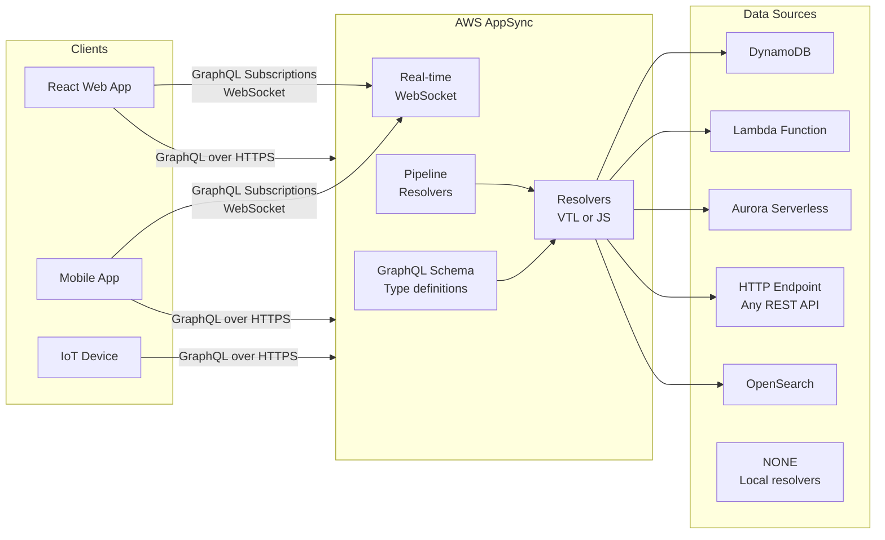
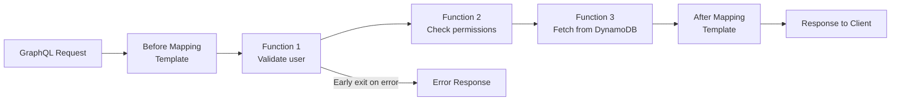

# Stage 11e — AWS AppSync: Managed GraphQL API

> Stop building 12 different REST endpoints. One GraphQL query fetches exactly what your client needs — no more, no less.

---

## 1. Core Intuition

Imagine you're building a social media mobile app. The home feed needs: user profile, last 10 posts, like counts, comment previews, and whether the current user follows the author.

**With REST:**
```
GET /users/123          → user profile
GET /users/123/posts    → posts (too much data, no filtering)
GET /posts/456/likes    → like count
GET /posts/456/comments → all comments (you only need 3)
GET /following/123      → following list

= 5 API calls, over-fetching data, slow mobile load
```

**With GraphQL (AppSync):**
```graphql
query HomeFeed {
  user(id: "123") {
    name
    avatar
    posts(limit: 10) {
      title
      likeCount
      comments(limit: 3) { text author }
      isFollowedByMe
    }
  }
}

= 1 API call, exactly the data you need, fast mobile load
```

**AWS AppSync** = A fully managed GraphQL API service. You define your schema, connect data sources (DynamoDB, Lambda, RDS, HTTP APIs), and AppSync handles the execution, real-time subscriptions, offline sync, and scaling.

---

## 2. GraphQL vs REST — The Mental Model

```
REST: Server decides the shape of the response
  GET /posts → always returns {id, title, body, author, tags, metadata, ...}
  Client gets everything whether it needs it or not

GraphQL: Client decides the shape of the response
  Client asks for exactly {id, title}
  Server returns exactly {id, title}
  Nothing more, nothing less

Three operation types:
  Query:        Read data (like GET)
  Mutation:     Write data (like POST/PUT/DELETE)
  Subscription: Real-time updates (like WebSocket)
```

---

## 3. AppSync Architecture



---

## 4. Schema Definition

```graphql
# schema.graphql — Define your data model

type Post {
  id: ID!
  title: String!
  content: String!
  author: User!
  tags: [String]
  likeCount: Int!
  comments(limit: Int, nextToken: String): CommentConnection
  createdAt: AWSDateTime!
}

type User {
  id: ID!
  username: String!
  email: AWSEmail!
  bio: String
  posts(limit: Int): [Post]
  followerCount: Int!
}

type CommentConnection {
  items: [Comment]
  nextToken: String        # pagination token
}

type Comment {
  id: ID!
  text: String!
  author: User!
  createdAt: AWSDateTime!
}

# Scalar types AppSync adds: AWSDateTime, AWSDate, AWSEmail,
#   AWSURL, AWSPhone, AWSIPAddress, AWSJSON

type Query {
  getPost(id: ID!): Post
  listPosts(limit: Int, nextToken: String): PostConnection
  searchPosts(keyword: String!): [Post]       # → OpenSearch
}

type Mutation {
  createPost(input: CreatePostInput!): Post
  likePost(postId: ID!): Post
  deletePost(id: ID!): Boolean
}

type Subscription {
  onNewPost: Post
    @aws_subscribe(mutations: ["createPost"])   # real-time trigger
  onPostLiked(postId: ID!): Post
    @aws_subscribe(mutations: ["likePost"])
}

input CreatePostInput {
  title: String!
  content: String!
  tags: [String]
}
```

---

## 5. Resolvers — Connecting Schema to Data

AppSync resolvers map each field to a data source using JavaScript (or the older VTL templates):

```javascript
// resolvers/Query.getPost.js — fetch post from DynamoDB
import { util, Context } from '@aws-appsync/utils';
import { get } from '@aws-appsync/utils/dynamodb';

export function request(ctx) {
  return get({ key: { id: ctx.args.id } });
}

export function response(ctx) {
  if (ctx.error) {
    util.error(ctx.error.message, ctx.error.type);
  }
  return ctx.result;
}
```

```javascript
// resolvers/Mutation.createPost.js — write to DynamoDB
import { util } from '@aws-appsync/utils';
import { put } from '@aws-appsync/utils/dynamodb';

export function request(ctx) {
  const { title, content, tags } = ctx.args.input;
  const id = util.autoId();
  const now = util.time.nowISO8601();

  return put({
    key: { id },
    item: {
      id,
      title,
      content,
      tags: tags || [],
      authorId: ctx.identity.sub,   // Cognito user ID
      likeCount: 0,
      createdAt: now,
    },
  });
}

export function response(ctx) {
  return ctx.result;
}
```

```javascript
// resolvers/Post.author.js — resolve nested User from authorId
import { get } from '@aws-appsync/utils/dynamodb';

export function request(ctx) {
  // ctx.source = the parent Post object
  return get({ key: { id: ctx.source.authorId } });
}

export function response(ctx) {
  return ctx.result;
}
```

---

## 6. Real-Time Subscriptions

```javascript
// React client — subscribe to new posts in real-time
import { generateClient } from 'aws-amplify/api';
import { onNewPost } from './graphql/subscriptions';

const client = generateClient();

// Subscribe — connection stays open via WebSocket
const subscription = client.graphql({
  query: onNewPost
}).subscribe({
  next: ({ data }) => {
    const newPost = data.onNewPost;
    setPosts(prev => [newPost, ...prev]);  // add to UI immediately
    console.log('New post:', newPost.title);
  },
  error: (err) => console.error(err),
});

// Unsubscribe when component unmounts
subscription.unsubscribe();
```

```
How subscriptions work under the hood:
  1. Client connects via WebSocket to AppSync endpoint
  2. Client sends subscription query
  3. When a matching mutation fires (createPost) → AppSync broadcasts to all subscribers
  4. Client receives the new data → updates UI without polling

Cost: $2.00 per million connection minutes + $1.00 per million messages
```

---

## 7. Authorization Modes

```
AppSync supports 5 authorization modes (can mix multiple):

API Key:
  x-api-key header: "da2-abc123..."
  Expires after 1-365 days
  Use for: public read APIs, unauthenticated access, prototyping

Amazon Cognito User Pools:
  JWT in Authorization header
  @aws_cognito_user_pools directive
  Use for: authenticated users (most common for apps)

IAM:
  AWS Signature V4 signing
  @aws_iam directive
  Use for: Lambda → AppSync, server-to-server, IoT

OIDC:
  Any OpenID Connect provider (Auth0, Okta, etc.)
  Use for: third-party identity providers

Lambda Authorizer:
  Custom Lambda validates any token format
  Returns isAuthorized + resolverContext
  Use for: custom auth logic

Per-field authorization:
  type Post {
    id: ID!
    title: String!
    content: String! @aws_cognito_user_pools   # authenticated only
    internalNotes: String @aws_iam              # backend only
  }
```

---

## 8. Pipeline Resolvers — Multi-Step Logic



```javascript
// Pipeline resolver — createPost with validation + write + notify
// Function 1: Check rate limit
export function request(ctx) {
  return get({ key: { userId: ctx.identity.sub } });
}
export function response(ctx) {
  const user = ctx.result;
  if (user.postCount > 100) {
    util.error('Rate limit exceeded', 'RateLimitError');
  }
  return ctx.result;
}

// Function 2: Write the post
export function request(ctx) {
  return put({ key: { id: util.autoId() }, item: ctx.args.input });
}
export function response(ctx) {
  ctx.stash.newPost = ctx.result;  // stash for next function
  return ctx.result;
}

// Function 3: Update user's post count (atomic counter)
export function request(ctx) {
  return update({
    key: { id: ctx.identity.sub },
    update: { postCount: operations.increment(1) }
  });
}
```

---

## 9. AppSync vs API Gateway

```
                API Gateway (REST/HTTP)      AppSync (GraphQL)
Protocol:       REST / HTTP                 GraphQL
Query shape:    Fixed (server-defined)      Flexible (client-defined)
Real-time:      WebSocket API (manual)      Built-in subscriptions
Offline sync:   No                          Yes (Amplify DataStore)
N+1 problem:    Not applicable              Batching via Lambda
Data sources:   Lambda only (direct)        DynamoDB, Lambda, RDS,
                                            HTTP, OpenSearch
Caching:        Stage-level cache           Per-resolver caching
Best for:       Simple CRUD, microservices  Complex data graphs,
                public REST APIs            mobile/real-time apps

When to use AppSync:
  ✅ Mobile apps needing real-time sync (chat, live updates)
  ✅ Apps fetching nested/related data in one request
  ✅ Offline-capable apps (Amplify DataStore)
  ✅ Frontend teams who want flexible queries
  ✅ Multiple data sources in one API

When to use API Gateway:
  ✅ Simple REST APIs
  ✅ Webhook receivers
  ✅ Strict RESTful contracts with external partners
  ✅ Non-GraphQL clients
```

---

## 10. Console Walkthrough

```
Create AppSync API:
━━━━━━━━━━━━━━━━━━
AppSync → Create API

Option 1: Design from scratch
  API type: GraphQL
  API name: my-social-app
  API creation method: Start with a blank schema

Option 2: Import DynamoDB table
  AppSync can auto-generate schema from existing DynamoDB table
  Great for quick prototyping

Schema editor:
  AppSync → your API → Schema
  Paste your schema.graphql
  Save schema

Attach data source:
  AppSync → your API → Data sources → Create data source
  Name: PostsTable
  Data source type: Amazon DynamoDB table
  Region: us-east-1
  Table: posts-table

Create resolver:
  AppSync → your API → Schema
  Click "Attach resolver" next to Query.getPost
  Data source: PostsTable
  Runtime: APPSYNC_JS (JavaScript)
  Paste resolver code → Save

Test in console:
  AppSync → Queries
  Run: query { getPost(id: "123") { title likeCount } }
  See result in right panel
```

---

## 11. Interview Perspective

**Q: What is the N+1 problem in GraphQL and how does AppSync solve it?**
The N+1 problem: if you fetch a list of 10 posts, and each post needs the author's name, a naive resolver makes 1 query for posts + 10 queries for authors = 11 queries. AppSync solves this with Lambda batch resolvers: instead of resolving each author individually, AppSync batches all 10 author IDs into a single Lambda invocation, which makes one DynamoDB BatchGetItem call. Result: 2 queries instead of 11.

**Q: When would you choose AppSync over API Gateway?**
AppSync shines when clients need to fetch nested/related data in a single request, need real-time subscriptions (chat, live dashboards), or need offline sync (mobile apps). API Gateway is better for simple REST APIs, public HTTP integrations, webhooks, or when clients are non-GraphQL. For a mobile social app with real-time features, AppSync is a clear win. For a simple CRUD backend with external REST consumers, API Gateway wins.

---

**[🏠 Back to README](../README.md)**

**Prev:** [← API Gateway](../stage-11_serverless/api_gateway.md) &nbsp;|&nbsp; **Next:** [SQS, SNS & EventBridge →](../stage-11_serverless/sqs_sns_eventbridge.md)

**Related Topics:** [API Gateway](../stage-11_serverless/api_gateway.md) · [DynamoDB](../stage-07_databases/dynamodb.md) · [Lambda](../stage-11_serverless/lambda.md) · [Cognito](../stage-06_security/cognito.md)
