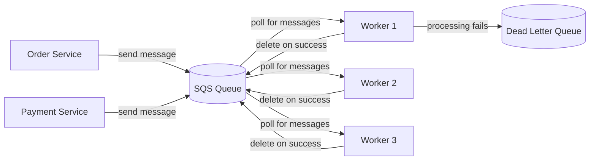
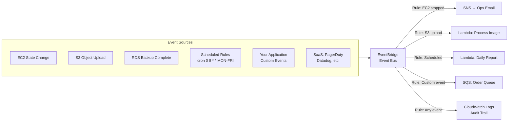

# Stage 11c — SQS, SNS & EventBridge

> Decouple your services so they don't fail together. Message queues and event buses are the glue that keeps distributed systems resilient.

---

## 1. The Problem: Tight Coupling

```
Tightly coupled (bad):
  User places order → Order service calls:
    → Payment service (if slow, order is slow)
    → Inventory service (if down, order fails)
    → Email service (if down, order fails)
    → Analytics service (if slow, order is slow)

  One slow/failed service = entire order fails

Loosely coupled (good):
  User places order → Order service publishes event → Done (fast!)
    → Payment service picks up event when ready
    → Inventory service picks up event when ready
    → Email service picks up event when ready
    → Analytics service picks up event when ready

  Each service works independently. Order service doesn't care.
```

AWS messaging services solve this: **SQS** (queues), **SNS** (pub/sub), **EventBridge** (event bus).

---

## 2. SQS — Simple Queue Service

### Core Intuition

SQS is a **mailbox**. Producer puts a message in the mailbox. Consumer picks it up when ready. If the consumer is busy, messages wait. If the consumer crashes, messages stay in the queue and get reprocessed.



---

## 3. SQS Key Concepts

```
Message:
  Up to 256KB in size
  Body: JSON, XML, text — anything
  Attributes: metadata (MessageGroupId, etc.)
  If > 256KB: store in S3, put S3 reference in message

Visibility Timeout:
  When consumer picks up message, it becomes "invisible" to others
  Default: 30s (consumer must process + delete within 30s)
  If consumer crashes → message becomes visible again → reprocessed
  Set to: expected processing time + buffer

  aws sqs change-message-visibility --receipt-handle <handle> \
    --visibility-timeout 60    # extend if processing takes longer

Message Retention:
  Default: 4 days
  Max: 14 days

Polling:
  Short Polling: returns immediately (even if empty) — wastes API calls
  Long Polling: waits up to 20s for message — cheaper, fewer empty responses
  Always use Long Polling! (WaitTimeSeconds=20)

Dead Letter Queue (DLQ):
  If message fails processing N times → moves to DLQ
  Prevents "poison pill" messages from blocking the queue
  Set: maxReceiveCount = 3-5 (retry before DLQ)
  Monitor DLQ with CloudWatch alarms
```

---

## 4. SQS Queue Types

```
Standard Queue:
  ✅ Unlimited throughput
  ✅ At-least-once delivery (may deliver duplicate messages)
  ⚠️  Best-effort ordering (not guaranteed)
  Use for: most workloads — tolerate duplicates with idempotent processing

FIFO Queue:
  ✅ Exactly-once processing (no duplicates)
  ✅ Strict ordering (first-in, first-out)
  ❌ 3,000 messages/s max (300 without batching)
  ❌ Name must end in .fifo
  Use for: financial transactions, order processing where order matters

FIFO Concepts:
  MessageGroupId: messages with same group are ordered (like partition key)
  MessageDeduplicationId: same ID within 5 min → duplicate dropped
```

---

## 5. SQS Python Example

```python
import boto3
import json

sqs = boto3.client('sqs', region_name='us-east-1')
QUEUE_URL = 'https://sqs.us-east-1.amazonaws.com/123456789/order-queue'

# Producer: Send message
def send_order(order):
    response = sqs.send_message(
        QueueUrl=QUEUE_URL,
        MessageBody=json.dumps(order),
        MessageAttributes={
            'OrderType': {
                'StringValue': order['type'],
                'DataType': 'String'
            }
        }
    )
    print(f"Sent message: {response['MessageId']}")

send_order({'orderId': '123', 'type': 'EXPRESS', 'total': 99.99})

# Consumer: Poll and process
def process_orders():
    while True:
        response = sqs.receive_message(
            QueueUrl=QUEUE_URL,
            MaxNumberOfMessages=10,    # batch up to 10
            WaitTimeSeconds=20,        # long polling
            VisibilityTimeout=60
        )

        messages = response.get('Messages', [])
        for msg in messages:
            order = json.loads(msg['Body'])
            try:
                process_order(order)
                # Delete on success
                sqs.delete_message(
                    QueueUrl=QUEUE_URL,
                    ReceiptHandle=msg['ReceiptHandle']
                )
            except Exception as e:
                print(f"Failed: {e}")
                # Don't delete → will retry after visibility timeout
```

---

## 6. SNS — Simple Notification Service

### Core Intuition

SNS is a **megaphone**. You shout one message → everyone listening hears it simultaneously. One publisher, many subscribers.

```
SQS: One message → ONE consumer processes it
SNS: One message → ALL subscribers receive it (fan-out)
```

```mermaid
graph TD
    PUB[Publisher<br/>Order Service] -->|Publish| TOPIC[SNS Topic<br/>order-placed]

    TOPIC -->|fan-out| SQS1[SQS Queue<br/>payment-queue]
    TOPIC -->|fan-out| SQS2[SQS Queue<br/>inventory-queue]
    TOPIC -->|fan-out| SQS3[SQS Queue<br/>email-queue]
    TOPIC -->|fan-out| Lambda[Lambda Function<br/>analytics]
    TOPIC -->|fan-out| HTTP[HTTP/HTTPS<br/>Webhook]
    TOPIC -->|fan-out| Email[Email<br/>admin@company.com]
    TOPIC -->|fan-out| SMS[SMS<br/>+1-555-0100]
```

---

## 7. SNS Key Concepts

```
Topic: The channel you publish to
  Standard: high throughput, best-effort ordering
  FIFO: strict ordering, deduplication (subscribers = SQS FIFO only)

Subscriber types:
  SQS queue        → durable async processing
  Lambda function  → immediate processing
  HTTP/HTTPS       → webhooks to any endpoint
  Email            → human notifications
  SMS              → text messages
  Kinesis Firehose → stream to S3/Redshift

Message Filtering:
  Subscribers can filter which messages they receive
  Payment SQS: only receive messages where type=PAYMENT
  Email SQS: only receive messages where type=CONFIRMATION

  FilterPolicy:
  {
    "type": ["PAYMENT", "REFUND"],
    "amount": [{"numeric": [">=", 100]}]
  }

SNS + SQS Fan-Out Pattern (most common):
  Never send directly from SNS to Lambda for critical work
  SNS → SQS → Lambda
  Why? SQS provides retry, DLQ, and rate control
```

---

## 8. EventBridge — The Event Bus

### Core Intuition

EventBridge is the **central nervous system** for event-driven architectures. It receives events from AWS services (EC2 state change, S3 upload, CodePipeline result) and routes them to the right target based on rules.

```
CloudWatch Events (old name) = EventBridge (new name, more powerful)

EventBridge adds:
  • Schema registry (know the shape of every event)
  • 100+ AWS service integrations as sources
  • SaaS integrations (Datadog, PagerDuty, Zendesk)
  • Custom event buses (per application domain)
  • Archive and replay events
```

---

## 9. EventBridge Architecture



---

## 10. EventBridge Rule Examples

```json
// Rule 1: EC2 instance stopped → notify ops
{
  "source": ["aws.ec2"],
  "detail-type": ["EC2 Instance State-change Notification"],
  "detail": {
    "state": ["stopped", "terminated"]
  }
}

// Rule 2: S3 object created in specific prefix
{
  "source": ["aws.s3"],
  "detail-type": ["Object Created"],
  "detail": {
    "bucket": { "name": ["my-uploads-bucket"] },
    "object": { "key": [{ "prefix": "uploads/images/" }] }
  }
}

// Rule 3: Custom event from your app
{
  "source": ["myapp.orders"],
  "detail-type": ["OrderPlaced"],
  "detail": {
    "orderTotal": [{ "numeric": [">=", 1000] }]
  }
}
```

```python
# Publishing a custom event from your app
import boto3, json

events = boto3.client('events')

events.put_events(
    Entries=[{
        'Source': 'myapp.orders',
        'DetailType': 'OrderPlaced',
        'Detail': json.dumps({
            'orderId': 'ORD-456',
            'customerId': 'CUST-789',
            'orderTotal': 1250.00,
            'items': ['laptop', 'mouse']
        }),
        'EventBusName': 'default'
    }]
)
```

---

## 11. SQS vs SNS vs EventBridge

```
                SQS             SNS             EventBridge
Type:           Queue           Pub/Sub         Event Bus
Consumers:      One             All (fan-out)   Rules → Targets
Retention:      Up to 14 days   No storage      No storage (use archive)
Sources:        Your app        Your app        AWS services + SaaS + your app
Filtering:      No              Message filter  Powerful pattern matching
Schema:         No              No              Schema registry
Use when:       Task queues     Fan-out to      Routing AWS service events,
                worker pools    multiple        scheduled tasks, SaaS events
                                subscribers     event-driven architecture

Classic pattern:
  Your app publishes order → SNS topic (fan-out to SQS queues per domain)
  Each domain service has its own SQS queue → Lambda consumer
  AWS service events (S3/EC2/RDS) → EventBridge → Lambda/SNS/SQS
```

---

## 12. Console Walkthrough

```
Create SQS Queue:
━━━━━━━━━━━━━━━━
SQS → Create queue
  Type: Standard
  Name: order-processing-queue
  Visibility timeout: 60 seconds
  Message retention: 4 days
  Receive message wait time: 20 (long polling!)
  Dead-letter queue: Enable → create DLQ first → maxReceiveCount: 3

Create SNS Topic + Subscribe:
━━━━━━━━━━━━━━━━━━━━━━━━━━━━
SNS → Topics → Create topic
  Type: Standard
  Name: order-events

Create subscription:
  SNS → Topics → order-events → Create subscription
  Protocol: Amazon SQS
  Endpoint: arn:aws:sqs:...:order-processing-queue

Create EventBridge Rule:
━━━━━━━━━━━━━━━━━━━━━━━
EventBridge → Rules → Create rule
  Name: s3-upload-trigger
  Event bus: default
  Rule type: Event pattern
  Event pattern:
    Service: S3
    Event type: Object Created
  Target: Lambda function → select function
  Create rule
```

---

## 13. Interview Perspective

**Q: When would you use SQS vs SNS?**
SQS is for point-to-point queuing — one message is processed by one consumer. Good for task queues where you want load distribution and retry logic. SNS is for fan-out — one message goes to ALL subscribers simultaneously. Good for broadcasting events to multiple services (payment + inventory + email all need to know about a new order). They're often combined: SNS fan-out → multiple SQS queues.

**Q: What is the visibility timeout in SQS and why does it matter?**
When a consumer reads a message, SQS makes it invisible to other consumers for the visibility timeout duration. This prevents two consumers from processing the same message. If the consumer processes and deletes the message before the timeout — done. If the consumer crashes — message becomes visible again and another consumer picks it up. Set the visibility timeout to slightly longer than your expected processing time.

**Q: What is the difference between SNS and EventBridge?**
SNS is a simple pub/sub service — publish a message, all subscribers get it. EventBridge is a more powerful event bus — it can receive events from 100+ AWS services, SaaS applications, and your own apps. EventBridge has pattern matching (route only events that match specific criteria), schema registry, archive/replay, and cross-account event routing. Use SNS for simple fan-out; use EventBridge for complex event routing and AWS service integration.

**Back to root** → [../README.md](../README.md)
