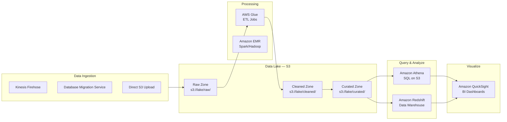

# Stage 12b — Athena, Glue & Redshift: The Data Lake Stack

> Query petabytes of S3 data with SQL. Transform raw data into analytics-ready tables. Run your data warehouse in the cloud.

---

## 1. The Modern Data Stack on AWS



---

## 2. Amazon Athena — SQL on S3

### Core Intuition

You have 10TB of JSON log files in S3. Normally, to query them you'd need to: load them into a database → provision servers → wait. Athena lets you just write SQL against S3 directly — **no servers, no loading, no ETL**.

```
Traditional:    Data → Load into DB → Query
Athena:         Data in S3 → Write SQL → Results (serverless!)

Athena is:
  ✅ Serverless (no infrastructure to manage)
  ✅ Pay per query: $5 per TB scanned
  ✅ Supports: JSON, CSV, Parquet, ORC, Avro, Iceberg
  ✅ Works with AWS Glue Data Catalog (schema management)
  ✅ Federated queries: query RDS, DynamoDB, Redshift from Athena
```

---

## 3. Athena Query Examples

```sql
-- Query JSON logs directly in S3
-- Table defined in Glue Catalog pointing to s3://my-logs/2024/

SELECT
    date_trunc('hour', from_iso8601_timestamp(timestamp)) AS hour,
    COUNT(*) AS requests,
    AVG(response_time_ms) AS avg_response_ms,
    SUM(CASE WHEN status_code >= 500 THEN 1 ELSE 0 END) AS errors
FROM application_logs
WHERE year='2024' AND month='01' AND day='15'  -- partition pruning!
GROUP BY 1
ORDER BY 1;

-- Query Parquet files (much faster, cheaper — 10x less data scanned)
SELECT user_id, SUM(order_total) AS lifetime_value
FROM orders_parquet
WHERE order_date BETWEEN DATE '2024-01-01' AND DATE '2024-12-31'
GROUP BY user_id
HAVING SUM(order_total) > 10000
ORDER BY 2 DESC
LIMIT 100;
```

---

## 4. Athena Cost Optimization

```
Cost = $5 per TB scanned

Reduce costs dramatically:
  1. Use columnar formats (Parquet/ORC):
     Query only selects 3 columns from 100 → Parquet reads only 3 columns
     JSON reads entire row: 10TB scan
     Parquet reads 3 columns: 100GB scan → 100x cheaper!

  2. Partition your data:
     /year=2024/month=01/day=15/ → query only scans relevant partitions
     WHERE year='2024' AND month='01' → only reads January data

  3. Compress data:
     gzip, Snappy compression reduces file size → less data scanned

  4. Convert to Parquet with Glue:
     Glue ETL job: raw JSON → Parquet → save 90% on Athena queries

Example cost comparison:
  100GB JSON, no partitions, full table scan:  $0.50 per query
  Same data as Parquet, partitioned:           $0.005 per query
  100x cheaper!
```

---

## 5. AWS Glue — Serverless ETL

### Core Intuition

Glue is the **transformation engine** between raw data and analytics-ready data. It has two parts:
- **Glue Data Catalog**: the metadata store (what data exists, where, in what format)
- **Glue ETL Jobs**: Python/Spark scripts that transform data

```
Raw data in S3: messy JSON, nested objects, wrong types, duplicates
Glue transforms: clean, flatten, deduplicate, convert to Parquet
Result: clean Parquet partitioned by date → Athena queries it fast
```

---

## 6. Glue Data Catalog

```
Glue Data Catalog = Centralized metadata repository
  Database → Tables → Columns (name, type, location)
  Points to where data lives (S3 path)
  Athena, Redshift Spectrum, EMR all read from the same catalog

Glue Crawler:
  Point crawler at S3 path → it scans files → auto-creates table schema
  Detects: column names, data types, partitions, file format
  Schedule: run daily to pick up new data/partitions

Example:
  s3://my-data-lake/orders/year=2024/month=01/
                           year=2024/month=02/
  Crawler → creates table "orders" with partition columns year, month
  Athena: SELECT * FROM orders WHERE year='2024' AND month='01'
  → only scans January data!
```

---

## 7. Glue ETL Job (PySpark)

```python
# Glue ETL: Convert JSON logs to Parquet with partitioning
import sys
from awsglue.transforms import *
from awsglue.utils import getResolvedOptions
from pyspark.context import SparkContext
from awsglue.context import GlueContext
from awsglue.job import Job
from pyspark.sql.functions import year, month, dayofmonth, col

args = getResolvedOptions(sys.argv, ['JOB_NAME'])
sc = SparkContext()
glueContext = GlueContext(sc)
spark = glueContext.spark_session
job = Job(glueContext)
job.init(args['JOB_NAME'], args)

# Read from Glue Catalog (raw JSON)
raw_df = glueContext.create_dynamic_frame.from_catalog(
    database="raw_db",
    table_name="application_logs"
).toDF()

# Transform: clean, add partition columns
cleaned_df = (raw_df
    .filter(col("status_code").isNotNull())
    .withColumn("year", year(col("timestamp")))
    .withColumn("month", month(col("timestamp")))
    .withColumn("day", dayofmonth(col("timestamp")))
    .drop("debug_info")   # remove noisy column
)

# Write as Parquet, partitioned
cleaned_df.write \
    .mode("overwrite") \
    .partitionBy("year", "month", "day") \
    .parquet("s3://my-data-lake/cleaned/logs/")

job.commit()
```

---

## 8. Amazon Redshift — Data Warehouse

### Core Intuition

Athena is great for ad-hoc queries on S3. But for complex analytical queries with joins across billions of rows — where millisecond response matters — you need **Redshift**.

```
Redshift = MPP (Massively Parallel Processing) data warehouse
  Stores data in columns (not rows) — fast for analytics
  Distributes data across many nodes — queries run in parallel
  For: BI dashboards, complex multi-table joins, aggregations

Athena vs Redshift:
  Athena:    serverless, ad-hoc, pay-per-query, great for exploration
  Redshift:  provisioned/serverless, consistent performance, better for
             complex joins, high-frequency dashboard queries

Redshift types:
  Provisioned: ra3.xlplus (4 nodes) to ra3.16xlarge
               You manage clusters; good for predictable workloads
  Serverless:  auto-scales, pay per second, no cluster management
               → Use Redshift Serverless for most new projects
```

---

## 9. Redshift Architecture

```mermaid
graph TB
    subgraph Cluster["Redshift Cluster"]
        LEADER[Leader Node<br/>Parses SQL, builds query plan,<br/>coordinates execution]
        C1[Compute Node 1<br/>Slice 1 | Slice 2]
        C2[Compute Node 2<br/>Slice 3 | Slice 4]
        C3[Compute Node 3<br/>Slice 5 | Slice 6]
        LEADER --> C1 & C2 & C3
    end

    S3[Amazon S3<br/>Data Lake] -->|COPY command<br/>parallel load| Cluster
    Cluster -->|UNLOAD| S3
    Cluster -->|Redshift Spectrum| S3
    BI[QuickSight / Tableau] --> LEADER
```

---

## 10. Redshift Key Features

```
Loading data (COPY is fastest):
  COPY orders FROM 's3://my-bucket/orders/'
  IAM_ROLE 'arn:aws:iam::123456789:role/RedshiftRole'
  FORMAT AS PARQUET;

  COPY loads in parallel across all compute nodes — much faster than INSERT

Distribution Styles (how rows are distributed across nodes):
  AUTO:     Redshift chooses (default, usually best)
  EVEN:     rows distributed in round-robin (good for no obvious join key)
  KEY:      rows with same key go to same node (good for joins)
  ALL:      entire table copied to every node (small dimension tables)

Sort Keys:
  Like an index — rows stored in sorted order
  Queries with WHERE on sort key column scan less data
  Example: sort by order_date → date range queries are fast

Redshift Spectrum:
  Query S3 data directly from Redshift (without loading it)
  Combine warehouse + data lake in one SQL query:

  SELECT w.customer_name, SUM(s3.revenue)
  FROM redshift_customers w
  JOIN spectrum_schema.s3_sales s3   -- this table lives in S3!
    ON w.customer_id = s3.customer_id
  GROUP BY 1;
```

---

## 11. Console Walkthrough

```
Create Athena Table (via Glue Crawler):
━━━━━━━━━━━━━━━━━━━━━━━━━━━━━━━━━━━━━━
Glue → Crawlers → Create crawler
  Name: orders-crawler
  Data source: s3://my-data-lake/orders/
  IAM role: create or select with S3 read + Glue access
  Target database: analytics_db
  Schedule: Daily at 6 AM

Run crawler → creates table in Glue Catalog

Athena → Settings → Query result location: s3://my-athena-results/
Query editor → select database: analytics_db
Run: SELECT * FROM orders LIMIT 10;

Create Redshift Serverless:
━━━━━━━━━━━━━━━━━━━━━━━━━━
Redshift → Serverless → Get started
  Namespace: my-analytics
  Admin username: admin
  Workgroup: default
  Base capacity: 8 RPUs (Redshift Processing Units)
  VPC: your VPC, private subnets
  Create

Connect: use Query editor v2 in console or any SQL client
  Endpoint: visible in Workgroup details
```

---

## 12. Interview Perspective

**Q: What is the difference between Athena and Redshift?**
Athena is serverless SQL directly on S3 — no infrastructure, pay per query ($5/TB scanned), best for ad-hoc exploration and infrequent queries. Redshift is a fully managed data warehouse — data is loaded into Redshift's storage, queries are much faster for complex joins and aggregations, better for high-frequency dashboard queries. Use Athena for exploration; Redshift when you need consistent sub-second query performance for BI tools.

**Q: How do you reduce Athena query costs?**
Three main strategies: (1) Use columnar formats (Parquet/ORC) — Athena only reads the columns you select, not entire rows, reducing data scanned by 10x+. (2) Partition your data (by date, region, etc.) and always filter on partition columns — Athena skips partitions that don't match your WHERE clause. (3) Compress data with Snappy or gzip — smaller files = less data scanned.

**Q: What is AWS Glue and when would you use it?**
Glue has two main parts: the Data Catalog (metadata store for tables across S3, RDS, Redshift — shared by Athena, EMR, Redshift Spectrum) and serverless ETL jobs (Python/PySpark scripts that transform data). Use Glue when you need to convert raw data formats (JSON → Parquet), deduplicate, join data from multiple sources, or schedule recurring data transformation pipelines. Alternative: if your team prefers SQL transformations, consider dbt (data build tool) on top of Redshift.

---

**[🏠 Back to README](../README.md)**

**Prev:** [← Kinesis Streaming](../stage-12_data_analytics/kinesis.md) &nbsp;|&nbsp; **Next:** [EMR, Lake Formation & Flink →](../stage-12_data_analytics/emr_lake_formation_flink.md)

**Related Topics:** [S3 Object Storage](../stage-04_storage/s3.md) · [Kinesis Streaming](../stage-12_data_analytics/kinesis.md) · [EMR, Lake Formation & Flink](../stage-12_data_analytics/emr_lake_formation_flink.md) · [DynamoDB](../stage-07_databases/dynamodb.md)
