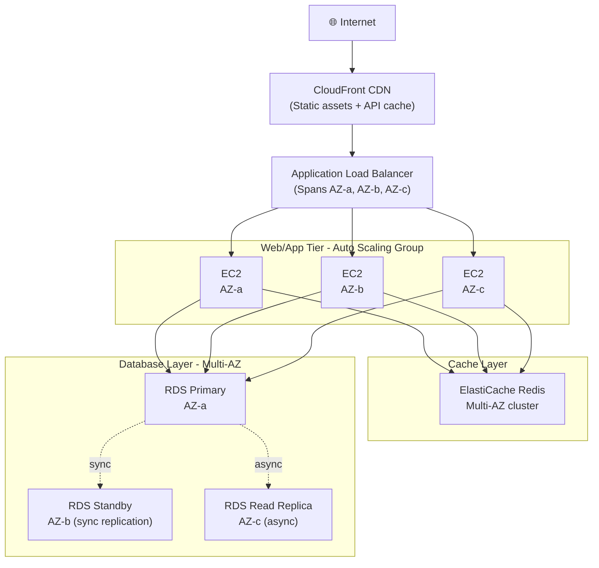
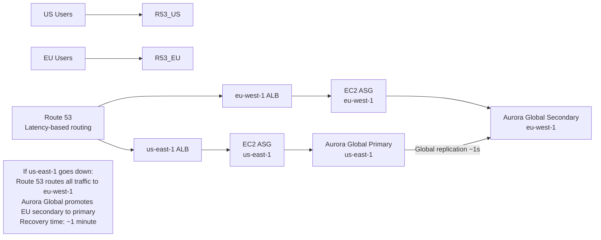

# Stage 14 — High Availability Architecture Patterns

> Design systems that stay up when things go wrong. Because things always go wrong.

---

## 1. Core Intuition

It's Black Friday. Your e-commerce site is handling 10x normal traffic. At 9 PM — the database server in `us-east-1a` has a hardware failure. The disk dies.

**Single-server setup:** site goes down. Users get errors. You lose sales. Your phone rings.

**High Availability setup:** the database automatically fails over to a standby replica in `us-east-1b` in under 60 seconds. Users experience a brief slowdown. Most don't notice. You sleep through the night.

**High Availability (HA)** = designing systems to **automatically survive failures** without human intervention. Not "will it fail?" — everything fails eventually. The real question: "when it fails, does the system heal itself?"

```
The HA mindset:
  Assume everything fails           → design FOR failure, not around it
  Eliminate single points of failure → every component has a backup
  Automate recovery                  → no human needed at 3am
  Test failure regularly             → chaos engineering, not surprises

AWS HA building blocks:
  Multi-AZ deployments   → spread across 3 data centers in a region
  Auto Scaling Groups    → replace unhealthy instances automatically
  Load Balancers         → route around failed instances
  RDS Multi-AZ           → automatic DB failover in ~60 seconds
  Route 53 health checks → stop sending traffic to unhealthy endpoints
```

---

## 2. Multi-Tier Architecture (Classic 3-Tier)



## 2. Disaster Recovery Strategies

```
┌──────────────────────────────────────────────────────────────────┐
│                    DR STRATEGY COMPARISON                        │
├──────────────┬───────────┬───────────┬──────────────────────────┤
│ Strategy     │ RTO       │ RPO       │ Cost & Complexity        │
├──────────────┼───────────┼───────────┼──────────────────────────┤
│ Backup &     │ Hours–days│ Hours     │ $  — Cheapest            │
│ Restore      │           │           │ Backup to S3+Glacier     │
│              │           │           │ Restore creates new env  │
├──────────────┼───────────┼───────────┼──────────────────────────┤
│ Pilot Light  │ 10-30 min │ Minutes   │ $$  — Low idle cost      │
│              │           │           │ Minimal replica running  │
│              │           │           │ (DB only, no app tier)   │
│              │           │           │ Scale up on disaster     │
├──────────────┼───────────┼───────────┼──────────────────────────┤
│ Warm         │ Minutes   │ Seconds   │ $$$  — Moderate cost     │
│ Standby      │           │           │ Scaled-down copy running │
│              │           │           │ (25% of prod capacity)   │
│              │           │           │ Scale up quickly         │
├──────────────┼───────────┼───────────┼──────────────────────────┤
│ Active-      │ Seconds   │ ~0        │ $$$$  — Most expensive   │
│ Active       │ (DNS flip)│           │ Full capacity in 2+      │
│ Multi-Region │           │           │ regions simultaneously   │
│              │           │           │ No failover needed —     │
│              │           │           │ already running!         │
└──────────────┴───────────┴───────────┴──────────────────────────┘
RTO = Recovery Time Objective (how long to be back online)
RPO = Recovery Point Objective (how much data can be lost)
```

### Backup & Restore Implementation

```
S3 backup schedule:
  RDS automated backups → S3 (daily, 7-day retention)
  EBS snapshots → lifecycle policy (weekly, keep 12 weeks)
  DynamoDB on-demand backups → S3 (via AWS Backup)
  Application configs → S3 + version control

Route 53 failover:
  Primary: us-east-1 ALB (health check: HTTP /health)
  Failover: us-west-2 ALB (health check: HTTP /health)
  If primary health check fails → Route 53 → point to failover
```

### Active-Active Multi-Region



## 3. Circuit Breaker Pattern

```
Problem: Service A calls Service B.
         Service B is slow (3s per call instead of 50ms).
         All of Service A's threads are now waiting.
         Service A's response time → 3 seconds.
         Service A becomes overloaded.
         Cascade failure: A fails → C fails → D fails.

Solution: Circuit Breaker

States:
  CLOSED (normal): requests flow through
  OPEN (failure): requests fail immediately (no waiting)
  HALF-OPEN (testing): let one request through
                       if passes → CLOSED
                       if fails → back to OPEN

AWS Implementation:
  AWS App Mesh (service mesh): circuit breaker in Envoy proxy
  AWS Lambda: configure with retry + max retry attempts
  Custom: use libraries (resilience4j, Hystrix, Polly)
  API Gateway + Lambda: timeout + throttling prevents cascade
```

## 4. Serverless High Availability

```
Serverless architecture is inherently highly available:

API Gateway:
  Regional service, automatically multi-AZ
  Edge-optimized endpoint: adds CloudFront for global HA

Lambda:
  Runs across multiple AZs automatically
  If one AZ fails, invocations route to others
  Scales to 1,000 concurrent automatically

DynamoDB:
  Multi-AZ by default (3 AZ replication for all tables)
  Global Tables for multi-region active-active

SQS/SNS:
  Multi-AZ by default
  FIFO queues: exactly-once processing

Total architecture availability:
  API GW (99.95%) × Lambda (99.95%) × DynamoDB (99.999%)
  ≈ 99.9% overall (three 9s)
```

## 5. Well-Architected Framework Reliability Pillar

```
Design Principles for Reliability:
━━━━━━━━━━━━━━━━━━━━━━━━━━━━━━━━━━
✅ Test recovery procedures
   Don't assume failover works — test it monthly
   Chaos engineering: randomly terminate instances
   AWS Fault Injection Simulator (FIS) for controlled chaos

✅ Automatically recover from failure
   Health checks + auto replacement
   Multi-AZ, Auto Scaling
   Self-healing systems (not on-call alerts at 3am)

✅ Scale horizontally over vertical
   Many small instances > one giant instance
   Horizontal = add more instances (resilient)
   Vertical = make one bigger (single point of failure)

✅ Stop guessing capacity
   Auto Scaling → demand drives capacity
   Don't pre-provision for peaks

✅ Manage change in automation
   Infrastructure as Code (no manual config drift)
   Tested deployments (blue/green, canary)
```

## 6. Interview Perspective

**Q: What is the difference between High Availability and Disaster Recovery?**
HA protects against component or AZ-level failures within a region. It involves Multi-AZ deployments, Auto Scaling, and load balancing. Recovery is automatic and typically takes seconds to minutes (RDS Multi-AZ failover ~60s). DR protects against complete region failure. It involves data replication to another region and failing over DNS/routing. Recovery depends on the DR strategy (Backup/Restore: hours, Active-Active: seconds).

**Q: How would you design a system that survives an entire AWS Region going down?**
Active-Active: Route 53 latency or geolocation routing to ALBs in two regions. Aurora Global Database (primary in us-east-1, secondary in eu-west-1). DynamoDB Global Tables. S3 Cross-Region Replication. If us-east-1 fails: Route 53 health checks detect failure, route 100% traffic to eu-west-1, Aurora Global promotes secondary to primary (~1 min), DynamoDB auto-routes to eu-west-1 replica.

---

**[🏠 Back to README](../README.md)**

**Prev:** [← CI/CD Pipeline](../stage-13_devops_cicd/cicd_pipeline.md) &nbsp;|&nbsp; **Next:** [Well-Architected Framework →](../stage-14_architecture/well_architected.md)

**Related Topics:** [Well-Architected Framework](../stage-14_architecture/well_architected.md) · [Disaster Recovery](../stage-14_architecture/disaster_recovery.md) · [Route 53 & CloudFront](../stage-05_networking/route53_cloudfront.md) · [RDS & Aurora](../stage-07_databases/rds_aurora.md)
