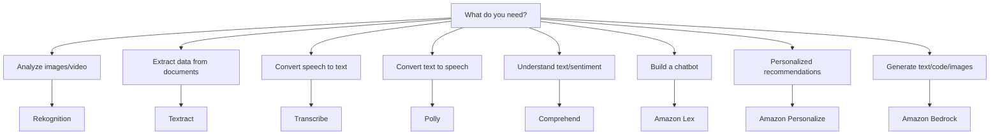

# Stage 16f — AWS AI Services: Pre-Built AI Without ML Expertise

> Add computer vision, speech, language understanding, and recommendations to your app with a single API call — no data science degree required.

---

## 1. Core Intuition

An e-commerce startup wants to:
- Automatically moderate millions of user-uploaded product photos
- Let customers search by voice on mobile
- Read scanned invoices from suppliers
- Detect whether customer reviews are positive or negative
- Send personalized product recommendations to each shopper

Traditionally, each of these would require a specialist ML team, months of data labeling, and weeks of model training. That's a $2M problem.

**AWS pre-built AI services** are trained, deployed, and maintained by AWS. You call them like any other API — send your data, get back AI-powered results in milliseconds. No training. No models. No ML expertise.

```
Your app sends: image bytes / audio / text / user ID
AWS returns:    labels / transcript / sentiment / recommendations

Time to implement: hours, not months.
Cost: pay-per-call, cents per thousand requests.
```

---

## 2. The Pre-Built AI Services Map

```
Vision:
  Rekognition    → Analyze images and videos (faces, objects, text, moderation)
  Textract       → Extract text and structured data from documents

Speech:
  Transcribe     → Speech → Text (real-time + batch)
  Polly          → Text → Speech (75+ voices, 40+ languages)

Language:
  Comprehend     → NLP: sentiment, entities, key phrases, topics
  Translate      → Real-time language translation (75+ languages)
  Lex            → Build conversational chatbots (powers Alexa)

Search:
  Kendra         → Intelligent enterprise search with ML
  OpenSearch     → Full-text + vector search (see Data Analytics stage)

Personalization:
  Personalize    → Real-time recommendations (like Netflix/Amazon)
  Forecast       → Time-series forecasting (demand, inventory, revenue)

Fraud & Risk:
  Fraud Detector → ML-based fraud detection (sign-up, payment, account)

Documents:
  Comprehend Medical → Extract medical info (conditions, medications)
  HealthLake     → FHIR-compliant health data lake
```

---

## 2. Amazon Rekognition — Computer Vision

```python
import boto3

rekognition = boto3.client('rekognition', region_name='us-east-1')

# Detect labels (objects) in an image
response = rekognition.detect_labels(
    Image={'S3Object': {'Bucket': 'my-bucket', 'Name': 'photo.jpg'}},
    MaxLabels=10,
    MinConfidence=80
)

for label in response['Labels']:
    print(f"{label['Name']}: {label['Confidence']:.1f}%")
# Output: Person: 99.8%, Car: 95.2%, Road: 91.5%

# Detect text in image (OCR)
response = rekognition.detect_text(
    Image={'S3Object': {'Bucket': 'my-bucket', 'Name': 'license-plate.jpg'}}
)
for text in response['TextDetections']:
    if text['Type'] == 'LINE':
        print(f"Detected text: {text['DetectedText']} ({text['Confidence']:.1f}%)")

# Face comparison (verify identity)
response = rekognition.compare_faces(
    SourceImage={'S3Object': {'Bucket': 'my-bucket', 'Name': 'id-photo.jpg'}},
    TargetImage={'S3Object': {'Bucket': 'my-bucket', 'Name': 'selfie.jpg'}},
    SimilarityThreshold=90
)
if response['FaceMatches']:
    similarity = response['FaceMatches'][0]['Similarity']
    print(f"Face match: {similarity:.1f}% similar")
else:
    print("Faces do not match")

# Content moderation (detect inappropriate content)
response = rekognition.detect_moderation_labels(
    Image={'S3Object': {'Bucket': 'my-bucket', 'Name': 'user-upload.jpg'}},
    MinConfidence=70
)
if response['ModerationLabels']:
    for label in response['ModerationLabels']:
        print(f"Flagged: {label['Name']} ({label['Confidence']:.1f}%)")
    # Block the upload
else:
    print("Image is safe")
```

---

## 3. Amazon Textract — Document Extraction

```python
import boto3

textract = boto3.client('textract', region_name='us-east-1')

# Extract structured data from forms (key-value pairs)
response = textract.analyze_document(
    Document={'S3Object': {'Bucket': 'my-bucket', 'Name': 'insurance-form.pdf'}},
    FeatureTypes=['FORMS', 'TABLES']
)

# Extract key-value pairs (form fields)
blocks = {b['Id']: b for b in response['Blocks']}

for block in response['Blocks']:
    if block['BlockType'] == 'KEY_VALUE_SET' and 'KEY' in block.get('EntityTypes', []):
        key_text = ' '.join([
            blocks[rel['Ids'][0]]['Text']
            for rel in block.get('Relationships', [])
            if rel['Type'] == 'CHILD'
            if 'Text' in blocks.get(rel['Ids'][0], {})
        ])
        value_block_ids = [
            rel['Ids'][0]
            for rel in block.get('Relationships', [])
            if rel['Type'] == 'VALUE'
        ]
        if value_block_ids:
            value_block = blocks[value_block_ids[0]]
            value_text = ' '.join([
                blocks[r]['Text']
                for rel in value_block.get('Relationships', [])
                if rel['Type'] == 'CHILD'
                for r in rel['Ids']
                if 'Text' in blocks.get(r, {})
            ])
            print(f"{key_text}: {value_text}")
# Output: Patient Name: John Smith
#         Date of Birth: 01/15/1985
#         Policy Number: POL-123456

# For large PDFs — async processing
response = textract.start_document_analysis(
    DocumentLocation={'S3Object': {'Bucket': 'my-bucket', 'Name': 'large-contract.pdf'}},
    FeatureTypes=['FORMS', 'TABLES'],
    NotificationChannel={
        'SNSTopicArn': 'arn:aws:sns:...',
        'RoleArn': 'arn:aws:iam::...'
    }
)
job_id = response['JobId']
# SNS notifies when complete → call get_document_analysis(JobId=job_id)
```

---

## 4. Amazon Transcribe — Speech to Text

```python
import boto3, time

transcribe = boto3.client('transcribe', region_name='us-east-1')

# Batch transcription (async — for recorded audio/video files)
transcribe.start_transcription_job(
    TranscriptionJobName='customer-call-20240115',
    Media={'MediaFileUri': 's3://my-bucket/calls/call-001.mp3'},
    MediaFormat='mp3',
    LanguageCode='en-US',
    Settings={
        'ShowSpeakerLabels': True,   # differentiate multiple speakers
        'MaxSpeakerLabels': 3,       # up to 3 speakers
        'VocabularyName': 'medical-terms',  # custom vocabulary
    },
    OutputBucketName='my-transcripts-bucket'
)

# Poll for completion
while True:
    status = transcribe.get_transcription_job(
        TranscriptionJobName='customer-call-20240115'
    )
    job_status = status['TranscriptionJob']['TranscriptionJobStatus']
    if job_status in ['COMPLETED', 'FAILED']:
        break
    print(f"Status: {job_status}")
    time.sleep(10)

if job_status == 'COMPLETED':
    transcript_uri = status['TranscriptionJob']['Transcript']['TranscriptFileUri']
    # Download and parse the JSON transcript

# Real-time streaming transcription (for live calls/microphone)
# Use: amazon-transcribe-streaming-sdk
from amazon_transcribe.client import TranscribeStreamingClient
from amazon_transcribe.handlers import TranscriptResultStreamHandler

async def stream_transcription():
    client = TranscribeStreamingClient(region='us-east-1')
    stream = await client.start_stream_transcription(
        language_code='en-US',
        media_sample_rate_hz=16000,
        media_encoding='pcm',
    )
    # Feed audio chunks → get real-time transcript
```

---

## 5. Amazon Polly — Text to Speech

```python
import boto3

polly = boto3.client('polly', region_name='us-east-1')

# Convert text to speech
response = polly.synthesize_speech(
    Text="Welcome to Acme Support. How can I help you today?",
    OutputFormat='mp3',
    VoiceId='Joanna',        # US English female
    Engine='neural',         # neural = most natural sounding
    LanguageCode='en-US'
)

# Save audio file
with open('welcome.mp3', 'wb') as f:
    f.write(response['AudioStream'].read())

# Available neural voices (sample):
# English: Joanna (F), Matthew (M), Ivy (F), Justin (M)
# Spanish: Lupe (F), Pedro (M)
# German: Vicki (F), Daniel (M)
# French: Lea (F), Remi (M)
# Japanese: Takumi (M), Kazuha (F)

# SSML for fine-grained control
ssml_text = """
<speak>
    Hello <emphasis level="strong">John</emphasis>.
    Your order will arrive <prosody rate="slow">in 3 to 5 business days</prosody>.
    <break time="500ms"/>
    Is there anything else I can help you with?
</speak>
"""
response = polly.synthesize_speech(
    Text=ssml_text,
    TextType='ssml',
    OutputFormat='mp3',
    VoiceId='Matthew',
    Engine='neural'
)
```

---

## 6. Amazon Comprehend — NLP

```python
import boto3

comprehend = boto3.client('comprehend', region_name='us-east-1')

text = "I love this product! The delivery was fast but the packaging was slightly damaged."

# Sentiment analysis
sentiment = comprehend.detect_sentiment(Text=text, LanguageCode='en')
print(f"Sentiment: {sentiment['Sentiment']}")
# Output: MIXED
print(sentiment['SentimentScore'])
# {'Positive': 0.72, 'Negative': 0.18, 'Neutral': 0.05, 'Mixed': 0.05}

# Entity recognition
entities = comprehend.detect_entities(Text=text, LanguageCode='en')
for e in entities['Entities']:
    print(f"{e['Type']}: {e['Text']} ({e['Score']:.2f})")
# QUANTITY: 1, OTHER: product, OTHER: packaging

# Key phrase extraction
phrases = comprehend.detect_key_phrases(Text=text, LanguageCode='en')
for p in phrases['KeyPhrases']:
    print(f"Key phrase: {p['Text']}")
# Key phrase: this product
# Key phrase: fast delivery
# Key phrase: packaging

# Language detection
lang = comprehend.detect_dominant_language(Text="Hola, ¿cómo estás?")
print(lang['Languages'][0])
# {'LanguageCode': 'es', 'Score': 0.99}

# Batch processing (more efficient for many documents)
response = comprehend.batch_detect_sentiment(
    TextList=["Great product!", "Terrible experience", "It was okay"],
    LanguageCode='en'
)
for result in response['ResultList']:
    print(f"[{result['Index']}] {result['Sentiment']}")
```

---

## 7. Amazon Lex — Chatbot Builder

```
Lex = Build conversational bots (voice or text)
      Same technology that powers Alexa

Concepts:
  Intent:    What the user wants to do
             "OrderPizza", "CheckOrderStatus", "CancelSubscription"

  Slot:      Info the bot needs to fulfill the intent
             Intent: OrderPizza
             Slots: size (small/medium/large), toppings, address

  Utterance: Example phrases that trigger the intent
             "I want to order a pizza"
             "Can I get a large pepperoni?"
             "Pizza please"

  Fulfillment: Lambda function that executes when all slots are filled

Flow:
  User: "I'd like to order a large pizza"
  Lex: recognized intent = OrderPizza, slot size = large
  Lex: "What toppings would you like?"
  User: "Pepperoni and mushrooms"
  Lex: all slots filled → call Lambda → "Your order is placed!"

Connect Lex to channels:
  ✅ Web chat widget (embed in website)
  ✅ Amazon Connect (call center voice bot)
  ✅ Slack, Facebook Messenger, Twilio SMS
  ✅ Your custom app via API
```

---

## 8. Amazon Personalize — Recommendations

```python
import boto3

personalize_runtime = boto3.client('personalize-runtime', region_name='us-east-1')

# Get personalized recommendations for a user
response = personalize_runtime.get_recommendations(
    campaignArn='arn:aws:personalize:...:campaign/product-recommendations',
    userId='USER-12345',
    numResults=10,
    context={
        'DEVICE_TYPE': 'mobile',
        'TIME_OF_DAY': 'evening'
    }
)

recommended_items = [r['itemId'] for r in response['itemList']]
print(f"Recommended products: {recommended_items}")

# Get similar items (for "customers also bought")
response = personalize_runtime.get_recommendations(
    campaignArn='arn:aws:personalize:...:campaign/similar-items',
    itemId='PRODUCT-789',     # currently viewed product
    userId='USER-12345',
    numResults=6
)

# Re-rank a list of items for a specific user
response = personalize_runtime.get_personalized_ranking(
    campaignArn='arn:aws:personalize:...:campaign/reranking',
    userId='USER-12345',
    inputList=['PROD-1', 'PROD-2', 'PROD-3', 'PROD-4', 'PROD-5']
)
# Returns same items reordered by relevance to this user
```

---

## 9. Choosing the Right AI Service



---

## 10. Interview Perspective

**Q: What is the difference between Amazon Rekognition and Amazon Textract?**
Rekognition analyzes the visual content of images and videos — it detects objects, people, faces, scenes, and activities. It answers "what's IN this image." Textract extracts text and structured data from documents — it understands document layout and can extract form fields (key-value pairs) and table data. It answers "what does this document SAY and how is it structured." Rekognition is for visual understanding; Textract is for document processing.

**Q: When would you use Amazon Comprehend vs a Bedrock model for NLP tasks?**
Comprehend is a specialized service for specific NLP tasks: sentiment analysis, entity recognition, key phrase extraction, language detection, and topic modeling. It's fast, cheap, predictable, and requires no prompt engineering. Use Comprehend when you have a well-defined NLP task at scale (analyze 100,000 customer reviews for sentiment). Use Bedrock when you need flexible reasoning — nuanced analysis, custom instructions, multi-step thinking, or tasks Comprehend doesn't support (e.g., "explain why the customer is unhappy and suggest a resolution").

---

**[🏠 Back to README](../README.md)**

**Prev:** [← SageMaker](../stage-16_ai_ml/sagemaker.md) &nbsp;|&nbsp; **Next:** [Interview Master →](../stage-99_interview_master/README.md)

**Related Topics:** [Amazon Bedrock](../stage-16_ai_ml/bedrock.md) · [SageMaker](../stage-16_ai_ml/sagemaker.md) · [Lambda](../stage-11_serverless/lambda.md) · [S3 Object Storage](../stage-04_storage/s3.md)
