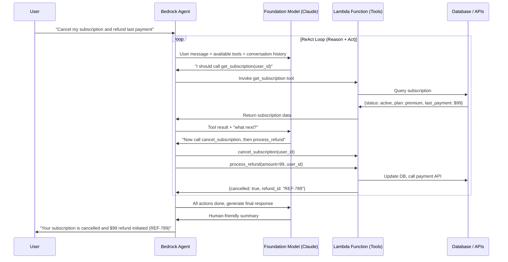

# Stage 16b — Bedrock Agents: Build AI Agents on AWS

> Give an AI model the ability to take actions — call APIs, query databases, run code — and orchestrate multi-step tasks autonomously.

---

## 1. Core Intuition

A foundation model by itself can only **talk**. It reads your message and generates text.

An **AI Agent** can **act**. It can:
- Look up your order in a database
- Check inventory in real-time
- Send you an email
- Trigger a refund in your payment system
- Write and execute code

**Bedrock Agents** = You describe what the agent can do (via tools/actions). The agent decides which tools to call, in what order, to answer the user's request.

```
User:  "What's the status of my order ORD-456 and when will it arrive?"

Agent thinks:
  Step 1: I need to look up order ORD-456 → call get_order action
  Step 2: I need shipping info → call get_shipping_status action
  Step 3: I have both answers → respond to user

User gets:  "Your order ORD-456 is shipped, arriving Thursday via FedEx #123"
```

---

## 2. How Bedrock Agents Work (ReAct Loop)



---

## 3. Agent Components

```
Foundation Model:
  The brain — decides what to do next
  Best choice: Claude 3.5 Sonnet (strong reasoning, instruction following)

Action Groups:
  The hands — what the agent CAN do
  Each action = a Lambda function + schema describing inputs/outputs
  You define: "get_order", "cancel_order", "send_email", etc.

Knowledge Base (optional):
  The memory — company documents, FAQs, product info
  Agent automatically queries KB when it needs background info
  (see Knowledge Bases doc for details)

Instructions (System Prompt):
  Defines agent personality, scope, guardrails
  "You are a customer support agent for Acme Corp.
   Only handle order-related questions.
   Always confirm before cancelling anything."

Memory (optional):
  Remember conversation context across sessions
  Agent remembers: "User prefers email, name is Alice"
```

---

## 4. Build an Agent: Step by Step

### Step 1: Create Lambda Tool Functions

```python
# lambda/order_tools.py — Tools the agent can call
import boto3
import json

dynamodb = boto3.resource('dynamodb')
orders_table = dynamodb.Table('orders')
ses = boto3.client('ses')

def handler(event, context):
    """
    Bedrock Agents calls this Lambda with:
    {
      "actionGroup": "OrderManagement",
      "apiPath": "/get-order",
      "httpMethod": "GET",
      "parameters": [{"name": "orderId", "value": "ORD-456"}]
    }
    """
    action_group = event['actionGroup']
    api_path = event['apiPath']
    params = {p['name']: p['value'] for p in event.get('parameters', [])}
    body = json.loads(event.get('requestBody', {}).get('content', {}).get(
        'application/json', {}).get('body', '{}'))

    if api_path == '/get-order':
        return get_order(params['orderId'])
    elif api_path == '/cancel-order':
        return cancel_order(params['orderId'], body.get('reason', ''))
    elif api_path == '/list-orders':
        return list_orders(params['customerId'])
    else:
        return {'statusCode': 404, 'body': json.dumps({'error': 'Unknown action'})}

def get_order(order_id):
    response = orders_table.get_item(Key={'orderId': order_id})
    order = response.get('Item')
    if not order:
        return {'statusCode': 404, 'body': json.dumps({'error': 'Order not found'})}
    return {
        'statusCode': 200,
        'body': json.dumps({
            'orderId': order['orderId'],
            'status': order['status'],
            'total': str(order['total']),
            'items': order['items'],
            'estimatedDelivery': order.get('estimatedDelivery', 'Unknown')
        })
    }

def cancel_order(order_id, reason):
    # Update order status
    orders_table.update_item(
        Key={'orderId': order_id},
        UpdateExpression='SET #s = :s, cancelReason = :r',
        ExpressionAttributeNames={'#s': 'status'},
        ExpressionAttributeValues={':s': 'CANCELLED', ':r': reason}
    )
    return {
        'statusCode': 200,
        'body': json.dumps({'message': f'Order {order_id} cancelled', 'reason': reason})
    }

def list_orders(customer_id):
    response = orders_table.query(
        IndexName='customerId-index',
        KeyConditionExpression='customerId = :cid',
        ExpressionAttributeValues={':cid': customer_id},
        Limit=10
    )
    return {'statusCode': 200, 'body': json.dumps({'orders': response['Items']})}
```

### Step 2: Define OpenAPI Schema for Actions

```yaml
# openapi_schema.yaml — describes what the Lambda can do
openapi: "3.0.0"
info:
  title: "Order Management API"
  version: "1.0.0"
paths:
  /get-order:
    get:
      summary: "Get order details by order ID"
      description: "Retrieve the current status, items, and delivery estimate for an order"
      operationId: "getOrder"
      parameters:
        - name: orderId
          in: query
          required: true
          description: "The unique order identifier (e.g. ORD-456)"
          schema:
            type: string
      responses:
        "200":
          description: "Order details"
          content:
            application/json:
              schema:
                type: object
                properties:
                  orderId: { type: string }
                  status: { type: string }
                  total: { type: string }
                  estimatedDelivery: { type: string }

  /cancel-order:
    post:
      summary: "Cancel an existing order"
      description: "Cancel an order. Only cancellable if status is PENDING or PROCESSING."
      operationId: "cancelOrder"
      parameters:
        - name: orderId
          in: query
          required: true
          schema:
            type: string
      requestBody:
        required: true
        content:
          application/json:
            schema:
              type: object
              properties:
                reason:
                  type: string
                  description: "Reason for cancellation"
```

### Step 3: Create Agent in Python (Boto3)

```python
import boto3

bedrock_agent = boto3.client('bedrock-agent', region_name='us-east-1')

# Create the agent
agent = bedrock_agent.create_agent(
    agentName='customer-support-agent',
    foundationModel='anthropic.claude-3-5-sonnet-20241022-v2:0',
    instruction="""You are a helpful customer support agent for Acme Shop.

You can help customers with:
- Checking order status
- Cancelling orders (only if PENDING or PROCESSING)
- Listing recent orders

Rules:
- Always confirm the order ID before cancelling
- Be polite and empathetic
- If you can't help, say so and offer to escalate to human support
- Never make up information — always use the tools to get real data""",
    idleSessionTTLInSeconds=1800,
)

agent_id = agent['agent']['agentId']

# Add action group (Lambda + OpenAPI schema)
bedrock_agent.create_agent_action_group(
    agentId=agent_id,
    agentVersion='DRAFT',
    actionGroupName='OrderManagement',
    actionGroupExecutor={
        'lambda': 'arn:aws:lambda:us-east-1:123456789:function:order-tools'
    },
    apiSchema={
        's3': {
            's3BucketName': 'my-schemas-bucket',
            's3ObjectKey': 'openapi_schema.yaml'
        }
    },
    description='Tools for managing customer orders'
)

# Prepare and deploy
bedrock_agent.prepare_agent(agentId=agent_id)

bedrock_agent.create_agent_alias(
    agentId=agent_id,
    agentAliasName='production',
)
```

### Step 4: Invoke the Agent

```python
import boto3
import uuid

bedrock_runtime = boto3.client('bedrock-agent-runtime', region_name='us-east-1')

def chat_with_agent(user_message, session_id=None):
    if not session_id:
        session_id = str(uuid.uuid4())

    response = bedrock_runtime.invoke_agent(
        agentId='AGENT_ID_HERE',
        agentAliasId='ALIAS_ID_HERE',
        sessionId=session_id,       # same session = agent remembers context
        inputText=user_message,
        enableTrace=True,           # see agent's reasoning steps
    )

    # Stream the response
    full_response = ""
    for event in response['completion']:
        if 'chunk' in event:
            full_response += event['chunk']['bytes'].decode('utf-8')
        if 'trace' in event:
            # Shows agent's reasoning: "I will call get_order to check status"
            trace = event['trace']['trace']
            if 'orchestrationTrace' in trace:
                step = trace['orchestrationTrace']
                if 'rationale' in step:
                    print(f"Agent thinking: {step['rationale']['text']}")

    return full_response, session_id

# Multi-turn conversation
session = None
response, session = chat_with_agent("What's the status of order ORD-456?")
print(response)

# Continue same session — agent remembers ORD-456
response, session = chat_with_agent("Cancel it please", session_id=session)
print(response)
```

---

## 5. Agent Trace (Debugging)

```
When enableTrace=True, you see the agent's full reasoning:

Step 1 — Model input:
  User: "What's the status of order ORD-456?"
  Available tools: get_order, cancel_order, list_orders

Step 2 — Model reasoning (rationale):
  "The user wants to know the status of order ORD-456.
   I should call the get_order tool with orderId=ORD-456."

Step 3 — Action invocation:
  Tool: get_order
  Input: {"orderId": "ORD-456"}

Step 4 — Observation (tool result):
  {"status": "SHIPPED", "estimatedDelivery": "2024-01-18", "total": "99.99"}

Step 5 — Final response generation:
  "Your order ORD-456 has been shipped and is estimated to arrive on January 18th.
   The total was $99.99."

This trace is gold for debugging why an agent made wrong decisions.
```

---

## 6. Agent with Code Interpreter

```python
# Enable code interpreter — agent can write and run Python!
bedrock_agent.create_agent_action_group(
    agentId=agent_id,
    agentVersion='DRAFT',
    actionGroupName='CodeInterpreter',
    parentActionGroupSignature='AMAZON.CodeInterpreter',  # built-in!
)

# Now the agent can:
# User: "Analyze this sales CSV and create a chart"
# Agent: writes Python → runs it → returns chart image

# User: "Calculate the compound interest on $10,000 at 5% for 10 years"
# Agent: writes Python → runs calculation → returns exact answer
```

---

## 7. Console Walkthrough

```
Create Bedrock Agent:
━━━━━━━━━━━━━━━━━━━━
Bedrock → Agents → Create Agent

Step 1: Agent details
  Agent name: customer-support
  Model: Claude 3.5 Sonnet
  Instructions: (paste your system prompt)

Step 2: Action groups → Add
  Action group name: OrderManagement
  Lambda function: order-tools
  API Schema: Upload YAML or point to S3

Step 3: Knowledge base (optional) → Add existing KB

Step 4: Guardrails (optional) → select guardrail

Click Prepare → agent compiles (30 seconds)

Test in console:
  Test panel (right side)
  Type: "Check order ORD-123"
  See: response + trace showing each step

Deploy:
  Agents → Aliases → Create alias → "production"
  Copy Agent ID + Alias ID → use in your app
```

---

## 8. Interview Perspective

**Q: How does a Bedrock Agent decide which tool to call?**
The agent uses a ReAct (Reason + Act) loop. The foundation model receives the user's message plus descriptions of all available tools (from the OpenAPI schema). The model reasons about what information it needs, selects the appropriate tool, calls it, receives the result, then reasons again about whether it has enough to answer or needs more data. This loop continues until the model generates a final response. The quality of your tool descriptions and agent instructions heavily influences how well the agent makes decisions.

**Q: What is the difference between a Bedrock Agent and just calling a Lambda from a Lambda?**
With a hardcoded Lambda → Lambda flow, you code every decision branch explicitly: if user asks X, call Y, then Z. Bedrock Agents let the LLM make these decisions dynamically based on the user's intent. The agent can handle novel requests you didn't explicitly program — it figures out the right sequence of tool calls from your tool descriptions. This enables much more flexible, natural-language-driven workflows vs rigid hardcoded logic.

---

**[🏠 Back to README](../README.md)**

**Prev:** [← Amazon Bedrock](../stage-16_ai_ml/bedrock.md) &nbsp;|&nbsp; **Next:** [Knowledge Bases (RAG) →](../stage-16_ai_ml/bedrock_knowledge_bases.md)

**Related Topics:** [Amazon Bedrock](../stage-16_ai_ml/bedrock.md) · [Knowledge Bases (RAG)](../stage-16_ai_ml/bedrock_knowledge_bases.md) · [Lambda](../stage-11_serverless/lambda.md) · [Step Functions](../stage-11_serverless/step_functions.md)
